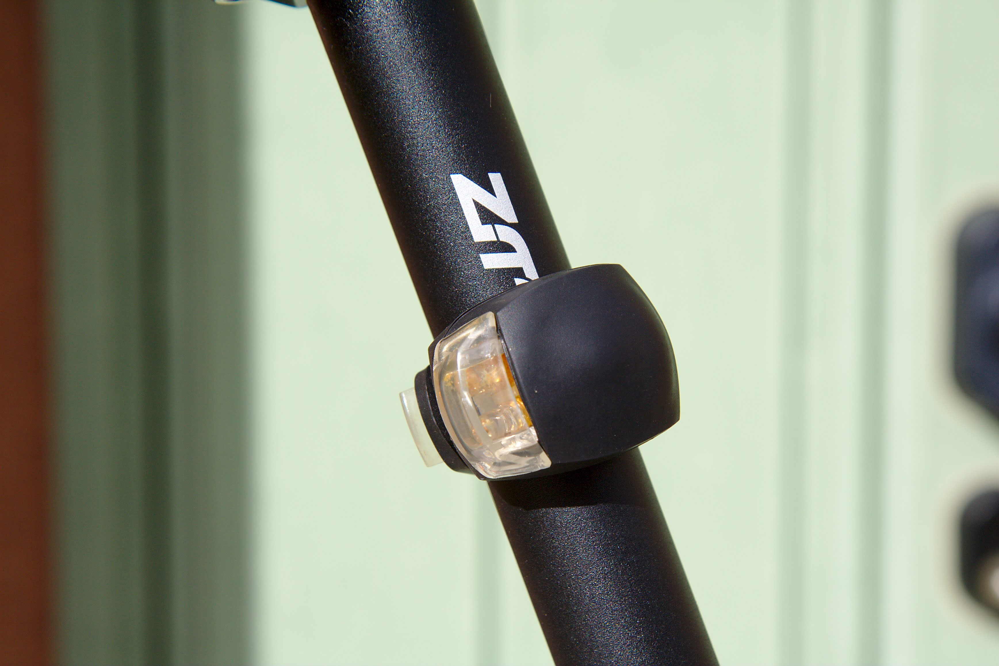
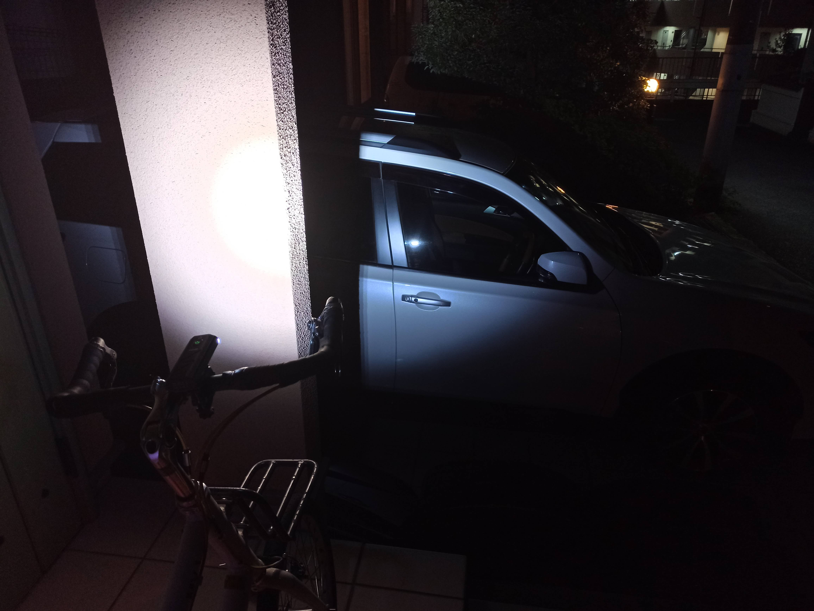

---
categories:
- 自転車
- bike
date: "2025-02-15T23:43:01+09:00"
draft: false
image: images/IMG_20201123_173042.jpg
summary: 明るくて目立つ中華ライトを面白半分で購入してみました。Giyo製ヘッドライトは明るくいい感じです。カラフルに点滅するDeemount製テールライトは自己主張が激しいです。
tags:
- ライト
- LGS-MV1
title: ルイガノ LGS-MV1 中華ライト取付
---

明るくて目立つ中華ライトを面白半分で購入してみました。

### 明るいライトが欲しい！

通勤自転車のルイガノ LGS-MV1
は毎日帰宅する夜に乗るわけですが、今までライトにはあまりこだわりが無く、フロントライトは小型の
LEZYNE、テールランプは500円くらいで買った安物を付けていました。

夜の道といっても、基本的に街灯が道を照らしているので視界はそれほど悪くなく、こちらの居場所を車や歩行者に示す意味でライトを点けていましたがロードバイクに乗るようになり、日が落ちるのも早くなってきたのでヒルクライムで人気の無いところをロードバイクで走ることも想定して明るいライトが欲しくなりました。

## 中華ライト購入！

まあ、それは言い訳で本当は AliExpress
で激安パーツを物色するようになってしまい、やたらと面白そうなライトが出てくるので上記理由付けて買ってしまいました。

写真右が Giyo のヘッドライト。Amazon
でも見かけるメーカーでそれなりにモノも良さそうに見えます。写真左が
Deemount
というメーカーのテールランプです。「ホットな新自転車テールライト 3 色で
1 ランプled cob視覚警告バイクリアランタン
100LM」とかいう謎のアピール文句で3色のライトに加え、下向きに道路に輪を作るように照らすライトが付いているファンキーなものです。

### Giyo自転車ヘッドライトT6

まず Giyo
のヘッドライトから箱を開けて中身を出します。マウント、チャージ用の USB
ケーブルが付いています。本体もアルミの黒塗装で高級感があります。800ルーメンか1,200ルーメンとの記載だった気がするのですが、今商品ページを見ると記載無く分からなくなってしまいました。まあ、中華ライトの照度なんてぜんぜんあてになりませんが。これは¥2,000程度で800ルーメンくらいでまともそうなメーカーの中ではお得感があるプライスでした。

### Deemountホットな新自転車テールライト 3 色で 1 ランプled cob視覚警告バイクリアランタン 100LM

次に Deemount のテールランプです。AliExpress
の商品はキャッチコピーだらけで名前が良くわかりません。¥1,200程度です。筐体こそアルミでいい感じですが、てっぺんのスイッチはゴムで押しにくく雨が降ったら隙間から水が入りそうで、固定もゴムバンドと写真写りは良いですが実際は値段程度の作りです。

### LGS-MV1にヘッドライトとテールランプの取付

いきなりですが取り付けた全体写真です。取り付け方は迷うことも無いので省略です。

Giyo のヘッドライトは、まあ普通にいい感じです。

Deemount
のテールランプは、なんかぶら下がってる感じですね。ゴムバンドの固定が弱く、振動でずり下がってきそうで心配です。チープでは無いのですが何か違和感のあるビジュアルになってしまいました。気付いたら取れて無くなってそうな。。。

### そして夜が来た！

今日はお休みなので夜に家の前で点灯式です。

、、、ププッ、テールランプの面白さに思わず笑ってしまいます。テールランプはスイッチON後、デフォルトで赤、白、青の3色がピカピカ交互に点滅してまるでクリスマスのようです。下向きの赤ランプで床に描かれた輪がまたさらにへんな雰囲気に輪をかけています。これは目立ちすぎて走るには勇気がいりそうです。

ちなみに、画像はレタッチとかはしていませんよ。スマホの写真撮って出しです。

ヘッドライトは普通に明るいです。

写真ではあまり分かりませんが、対向の歩行者からは眩しくて嫌がられそうなほど明るいです。

## まとめ

Giyo のヘッドライトは期待通りとても明るい！Deemount
のテールランプは思った以上に変な意味で目立ちます。ということで、日常使いにはちょっとやりすぎで周りの目が気になりそうです。車や歩行者からは嫌でも目につくので安全性は上がる気はしますが、ここまでしなくて良いかなというのが正直な感想です。明日の通勤は、、、戻すか。
