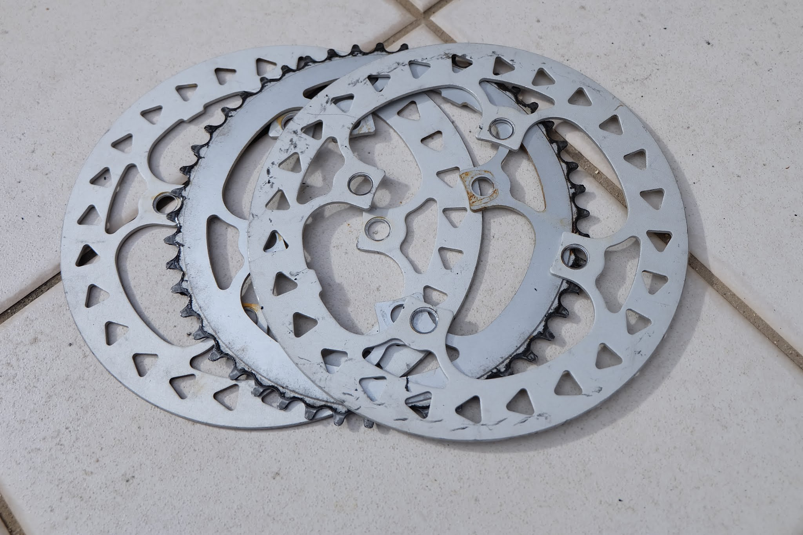

bchariの自転車、ルイガノのLGS-MV1です。最近、駅まで自転車通勤するようになって家の前の激坂が辛い。ギア比を変えて楽に坂を登れないかということでフロントチェーンリングを交換してみました。

上の画像が交換前。ちなみにブレーキ＆シフトケーブルをオレンジ色に、タイヤを20X1.5から20X1.25にしています。

チェーンを切りクランクからチェーンリングを外します。

これが新しいチェーンリング ROCKBROS 楕円形の38T、Amazonで購入。

何も説明無いので向きは？？となりましたが、楕円チェーンリングの有名どころROTOR
Qリングを検索するとどうやらクランクアームが4時の方向で最大径で引っ張るようにすると良いみたい。

いや、どう見ても3時です。180°ずらしても同じに見えます。調整代もないのでまあ、これでいいか。本当はチェーンリングをクランクの手前側に付けたいのですが、元が手前からバッシュガード→クランク→チェーンリング→奥のバッシュガードとなっていたため手前にチェーンリングを付けるとチェーンの芯が出ないので仕方なくこの状態に。

ボルトもアルミの黒に換えましたがシルバーにしておけばよかった。。。

歯数が減ったのでチェーン2コマカットしとりあえず完成！

家の前の激坂はかなり楽に登れるようになりましたよ。楕円の効果は、、、なんだかよく分かりません。
