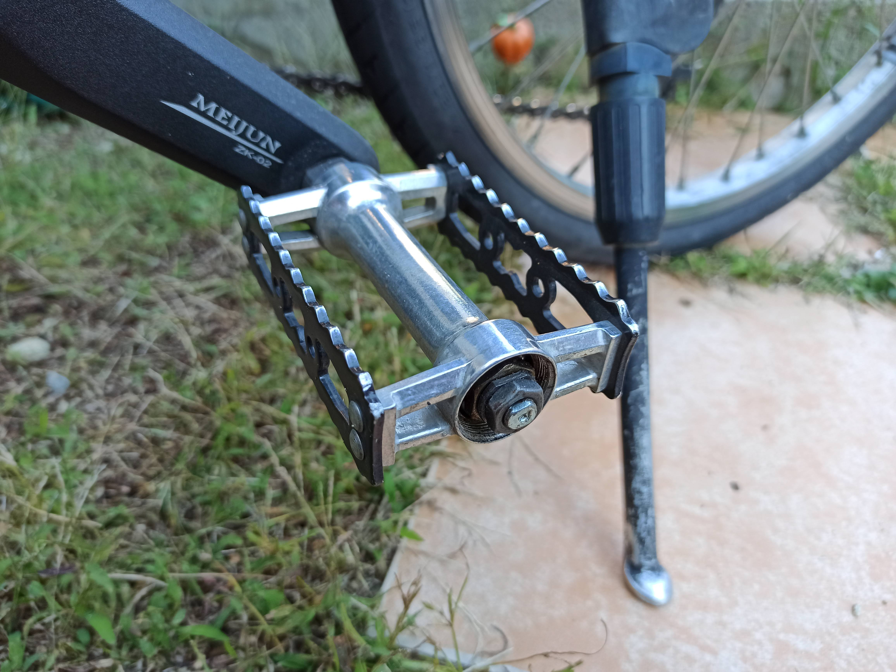
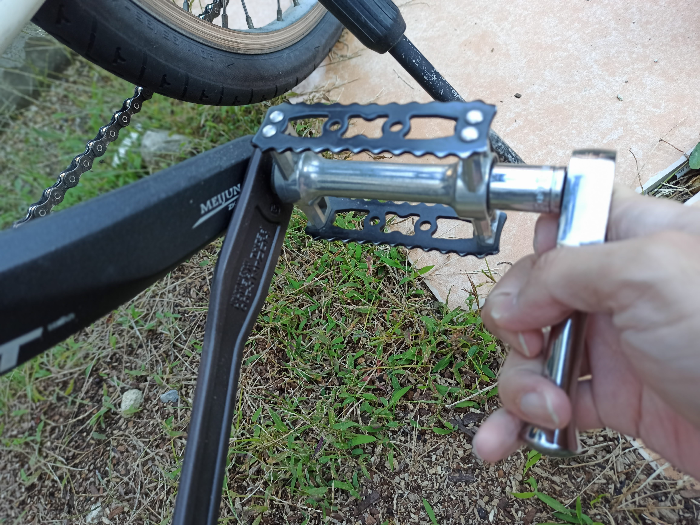
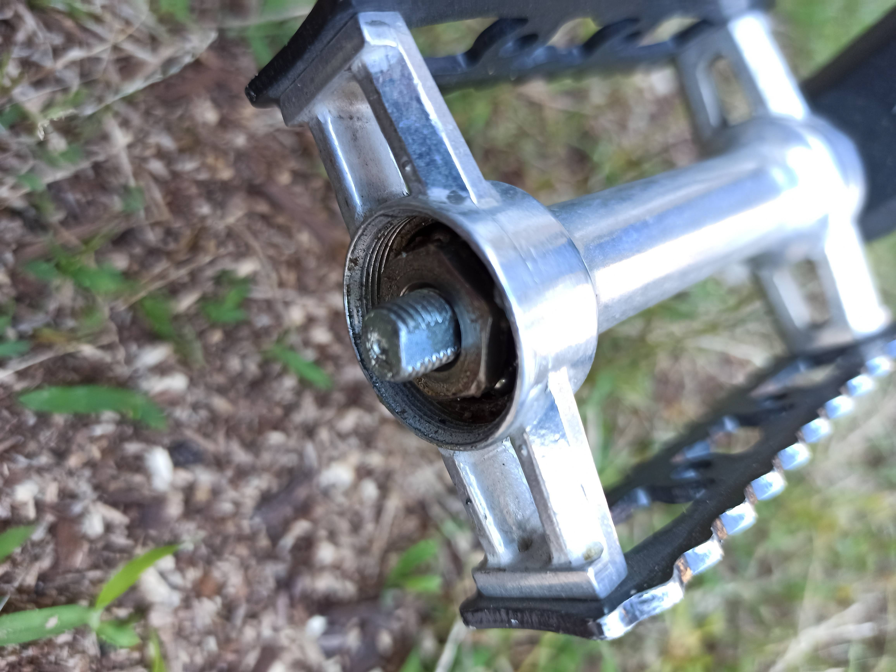
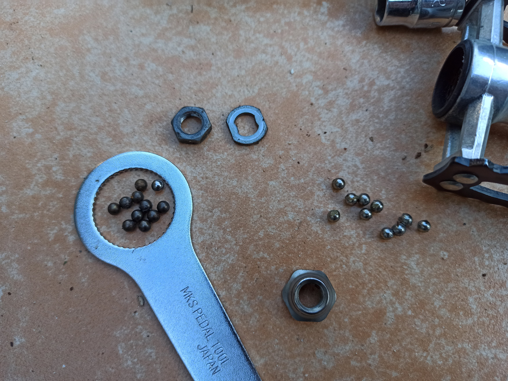
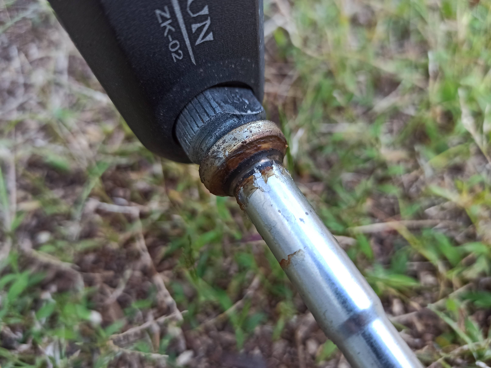
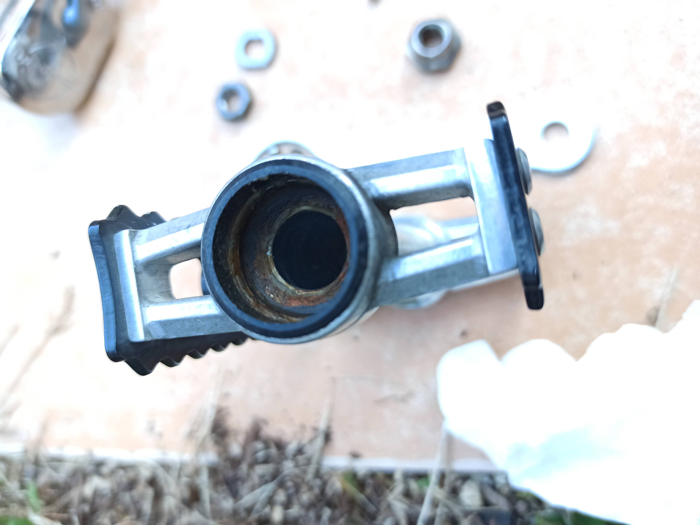
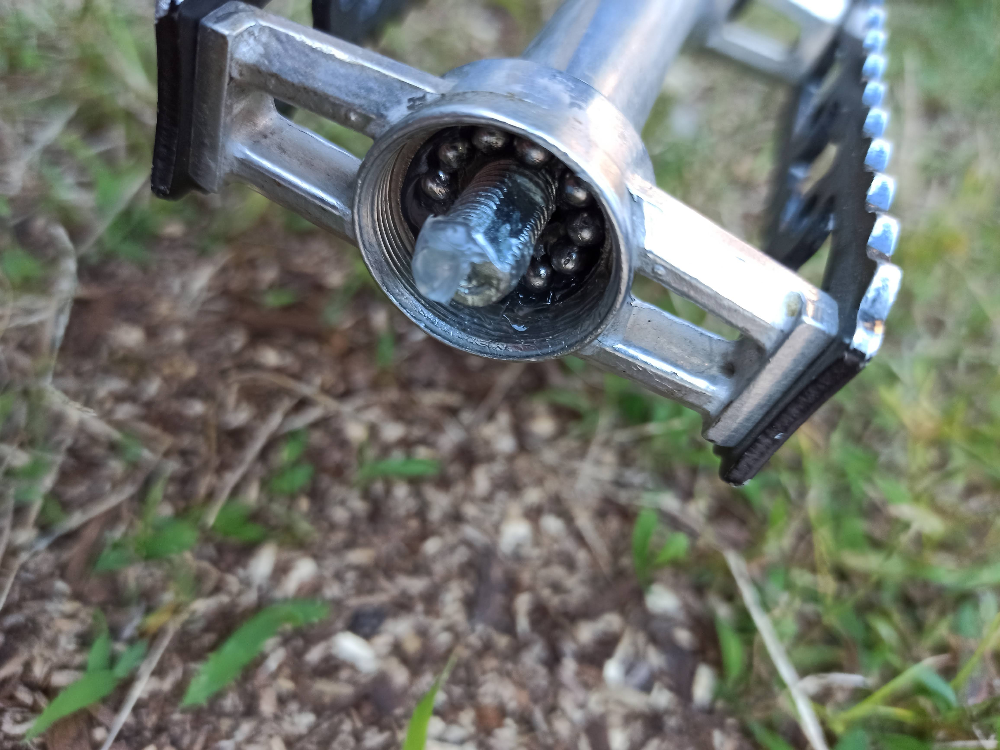
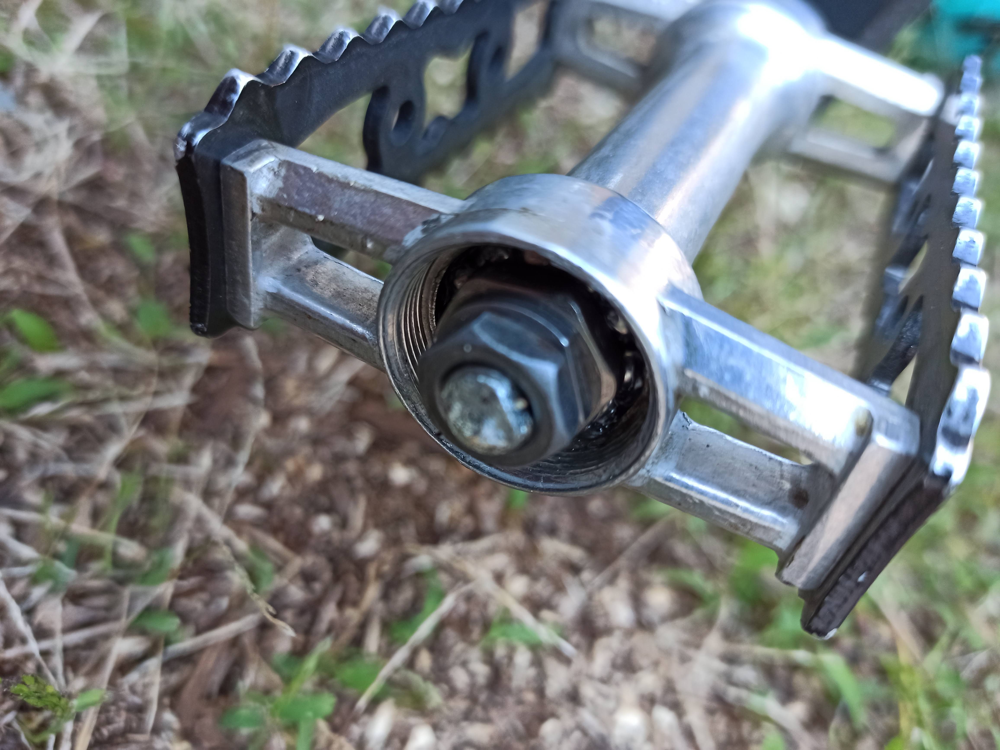
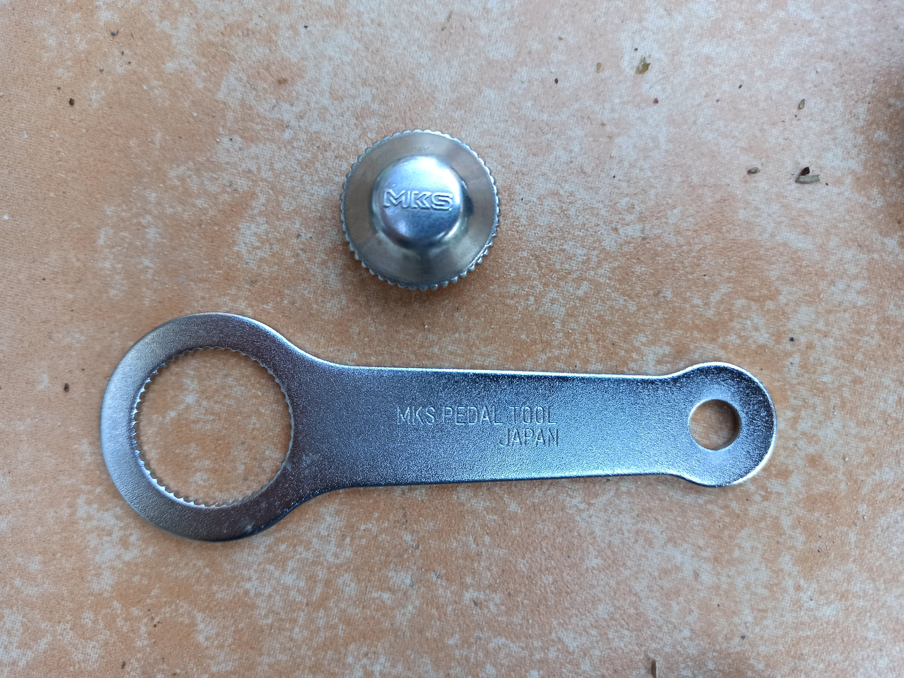
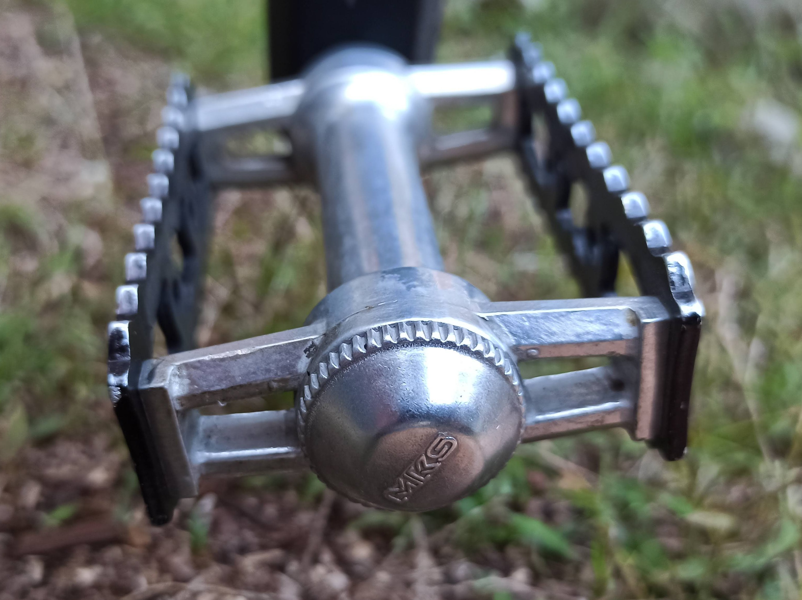

---
categories:
- 自転車
- bike
date: "2025-02-15T23:42:54+09:00"
draft: false
images: 
- images/IMG_20201024_163849.jpg
summary: ルイガノLGS-MV1のペダルを三ヶ島(MKS)のSYLVANTOURINGに交換後、ふと気がつくとペダルキャップが無くなっていました。ベアリングをグリスアップし、新品のキャップを取付けました。
tags:
- LGS-MV1
- ペダル
- MKS
title: MKS SYLVAN TOURING ペダルキャップ紛失とグリスアップ
---

ルイガノLGS-MV1のペダルを三ヶ島(MKS)のSYLVAN
TOURINGに交換してから約1年半、毎日自転車通勤で快適に使っておりました。



先日、ふと朝家を出るときにペダルを見てみると、なんと左側のペダル先端にあったキャップが無くなっているではないですか。

キャップ単品をアマゾンで¥461で売っていたので購入しました。さすが三ヶ島ペダル、この部品だけ買えてさらに送料込みでこの値段は素晴らしいです。

早速取り付けしたいですが、その前にベアリングが開放状態で雨ざらしに何度もしているため一度ペダルを抜いてグリスアップします。

ペダルレンチでペダル根元を掴んで13mmのソケットで先端のナットを弛めます。

ナットとワッシャーを抜くと玉押しがあります。下の画像の大きなナット状のものが玉押しです。

玉押しも抜いてペダルを外し、玉も一度全部とります。ベアリング玉は手前、奥とも11個ずつ入っていました。奥側が黒く変色しています。

軸も根元の玉当たり面に黒いグリスがへばりついている状態です。

ペダル根元側も真っ黒です。

先端側はきれいだったので、キャップが無くなり水が侵入したというよりも、根元側のシール隙間から水が侵入してこうなったのでしょうか。

玉、軸、ペダルともパーツクリーナーで洗浄してグリスを詰めてもとに戻します。グリスはWHITE
LIGHTNINGの透明を入れています。

玉押し調整は奥の玉押しにはスパナがかけられないため、13mmナットを締めてはゴリゴリ具合を見て少し戻しながら調整しました。確か昔アマゾンで玉押しを固定しながら上のナットを締める専用工具を見た気がしますが最近はもう売ってないのか発見できませんでした。

新しいキャップと専用レンチです。

専用レンチでキャップを締めて完了です。

キャップが外れた原因はおそらく新品取り付け時に専用レンチが嬉しくて一度キャップを開けて、戻すときに締め込みが足りなかったのだと思います。今回はしっかり締めておきました。たまに緩んでいないか増し締めしてみようと思います。
