---
categories:
- 自転車
- bike
date: "2025-02-15T23:42:53+09:00"
draft: false
image: images/IMG_5261-1.jpg
summary: ルイガノLGS-MV1にAliexpressで購入した格安軽量サドルを取付ました。
tags:
- LGS-MV1
- サドル
title: ルイガノ LGS-MV1 サドル交換 − WEST BIKING 中華軽量サドル
---

通勤自転車のルイガノLGS-MV1ですが、去年ブルホーン化、ホローテック化と大改造してから快適に乗れていてメンテ以外に改造はしばらくしていませんでした。

別に不満は無いのですがなんとなくまたいじってみようと思いAliexpressで軽量サドルをポチりました。日本語訳は西サイクリングというなんかダサいブランド名ですがサドルにはWEST
BIKINGと書いてあります。1,300円でした。安いですね。

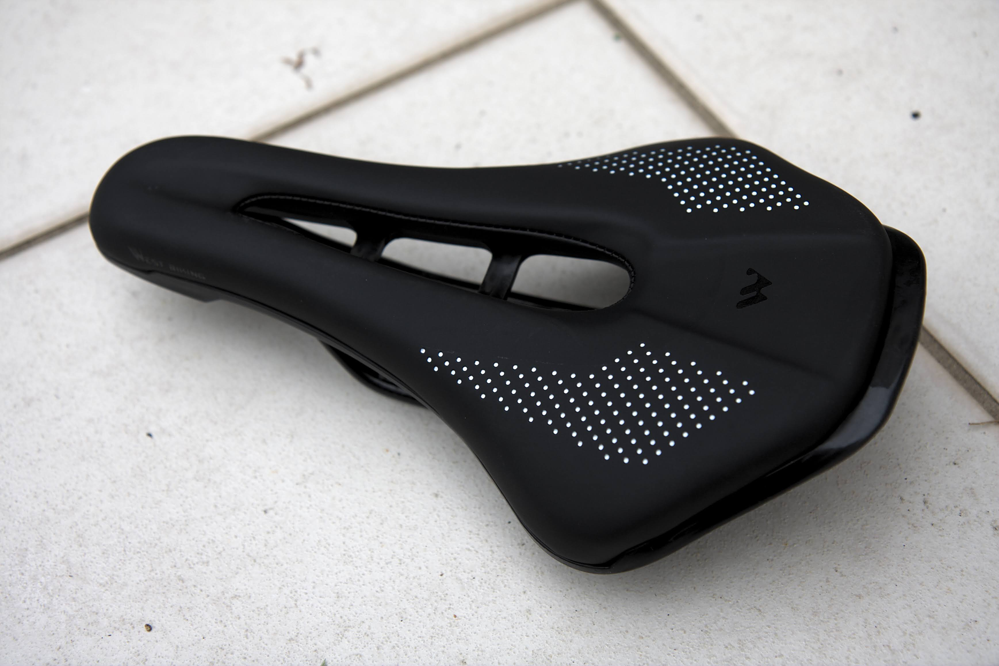 

改造前の状態です。

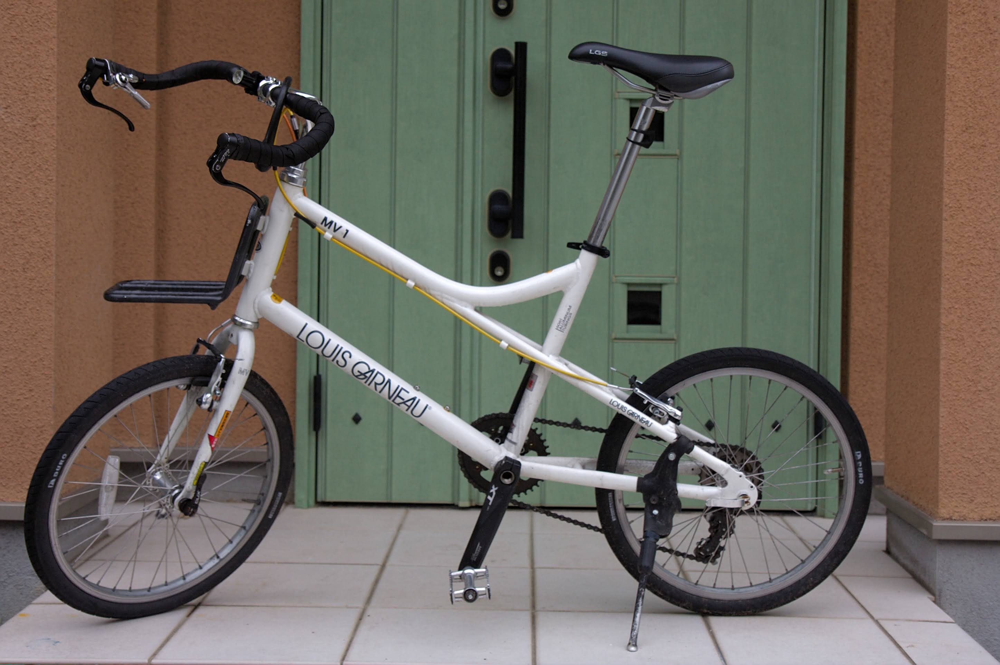

サドルは純正のものです。LGSと書いてあります。

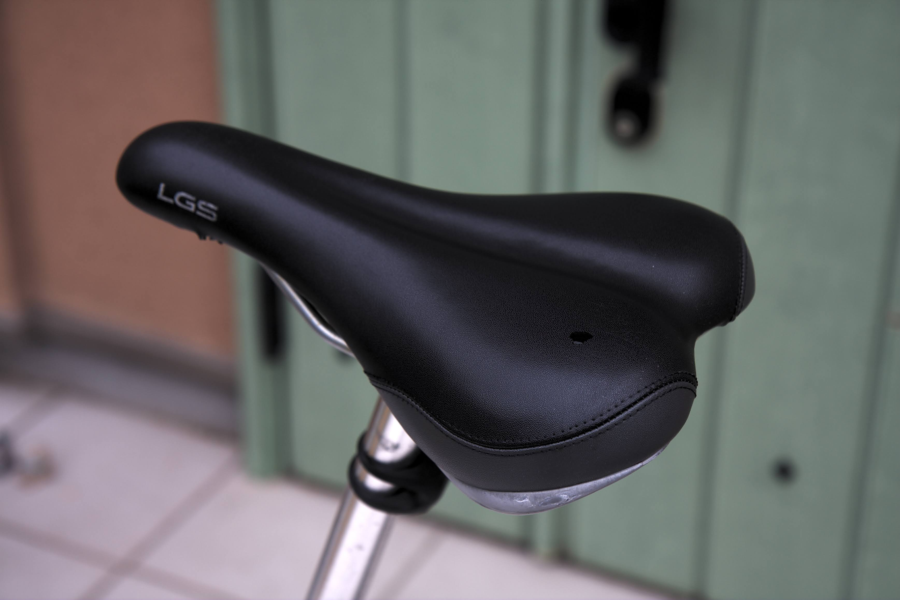

サドルを外します。この手のサドルはボルト1本でクランプされているだけなので外すのは簡単です。

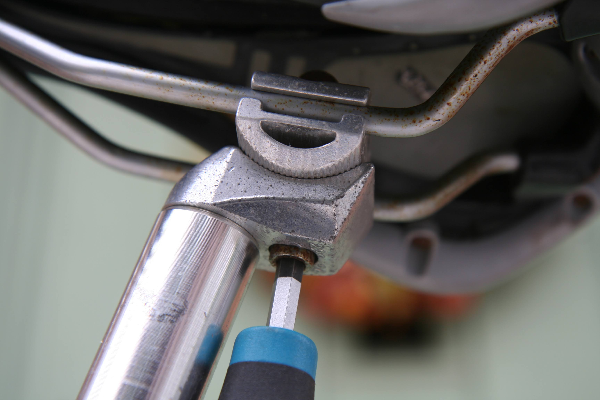

サドルを外した後のクランプ部です。

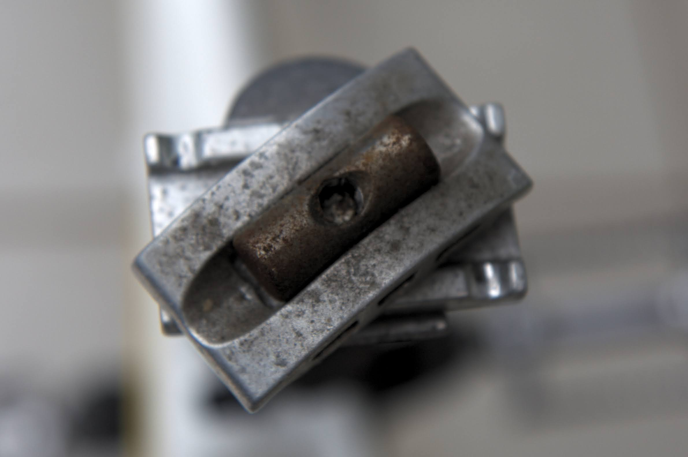

さて、新旧サドルを並べてみます。純正に比べてかなり小さいように見えます。スポンジの量も少なめでロードバイク用といった感じです。

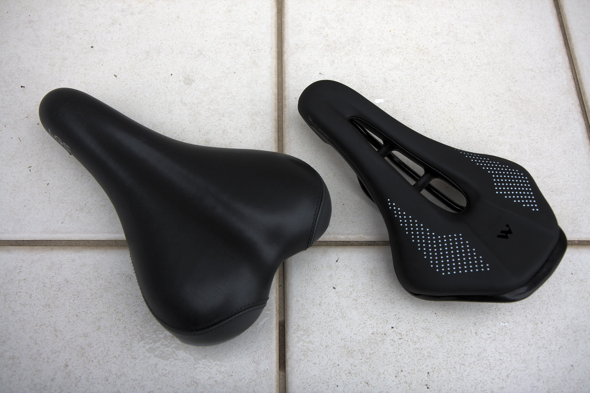

重さの比較です。純正は440gに対して、このサドルは330gで110g軽量化になります。

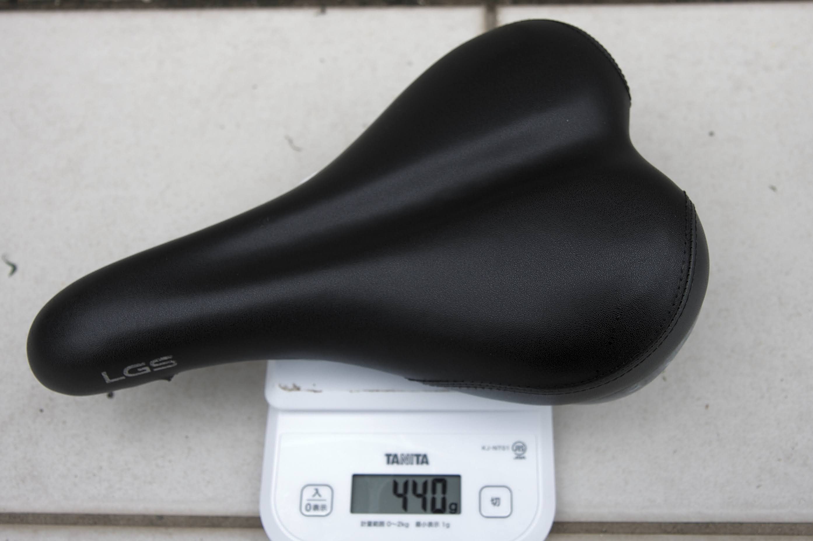 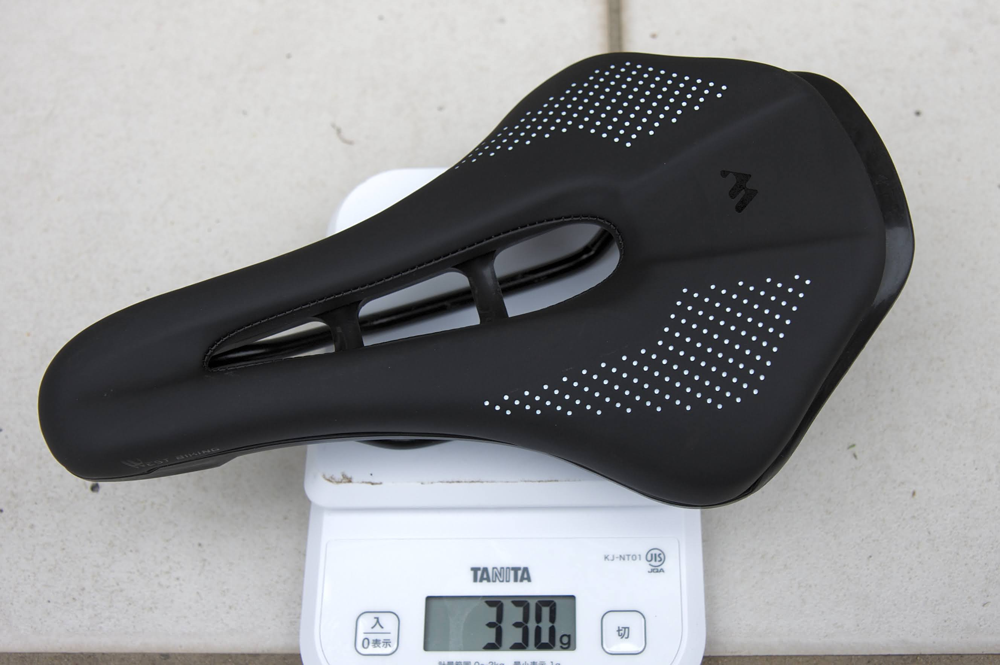

サドルを付けてみます。スポーティーでなかなかかっこいいです。

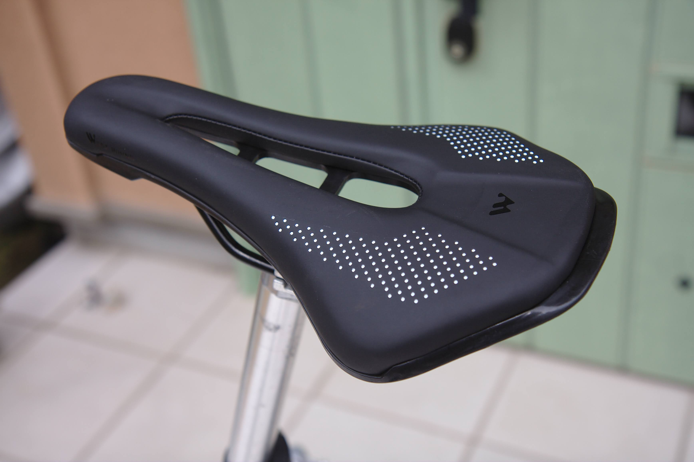

クランプ部のギザギザをずらして角度を調整したらボルトを締めてできあがりです。

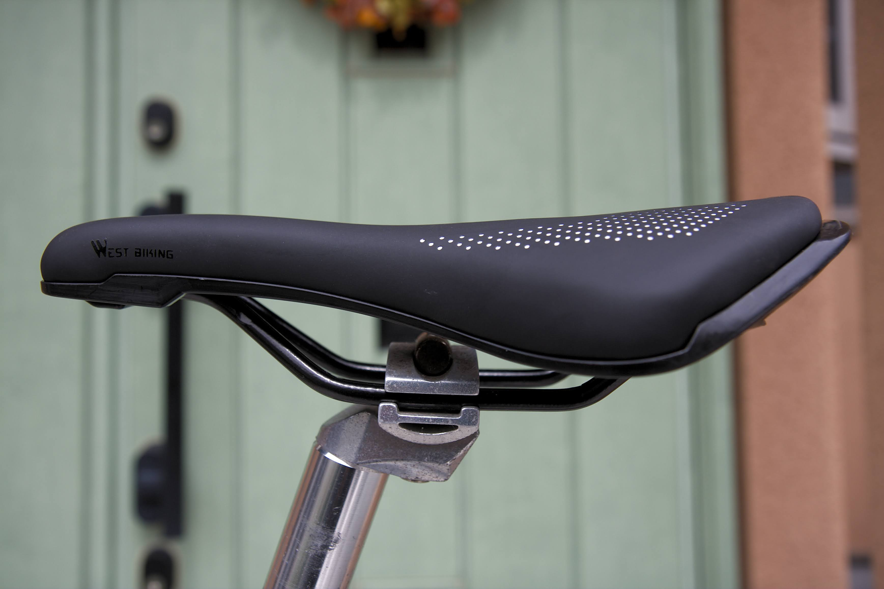

全体はこんな感じになりました。横から見るとサドルがペラペラに感じます。

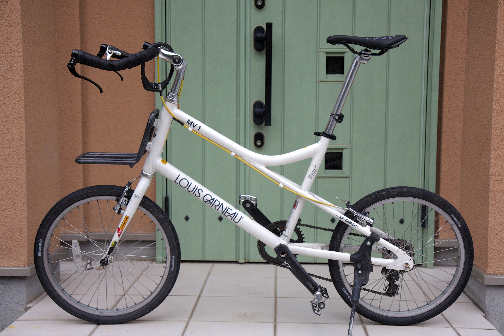

使用感ですが、スポンジが少ない分硬く、ロードバイクの座り心地です。通勤は20分も乗らないので問題なさそうです。1,300円で110g軽量化できたのでコスパ高いかなと。安物なので耐久性は？ですが、これから使っていくうちにどうなるか見ていきます。
