---
categories:
- 自転車
- bike
date: "2025-02-15T23:42:58+09:00"
draft: false
image: images/DSCF3028.jpg
summary: AliExpressで購入したZITTOというメーカーの格安アルミシートポストをルイガノLGS-MV1に取付けました。
tags:
- シートポスト
- LGS-MV1
title: ルイガノ LGS-MV1 シートポスト交換 ZITTO アルミシートポスト
---

先日サドルの軽量化をしてから一週間、AliExpressで同時に注文していたアルミシートポストが届きました。ZITTOというアマゾンとかでも安いパーツでよく見るので中国メーカーでしょうか。黒アルマイトか黒塗装で梨地です。安かったのでシートポストクランプもボルト固定のものをついでに買っています。

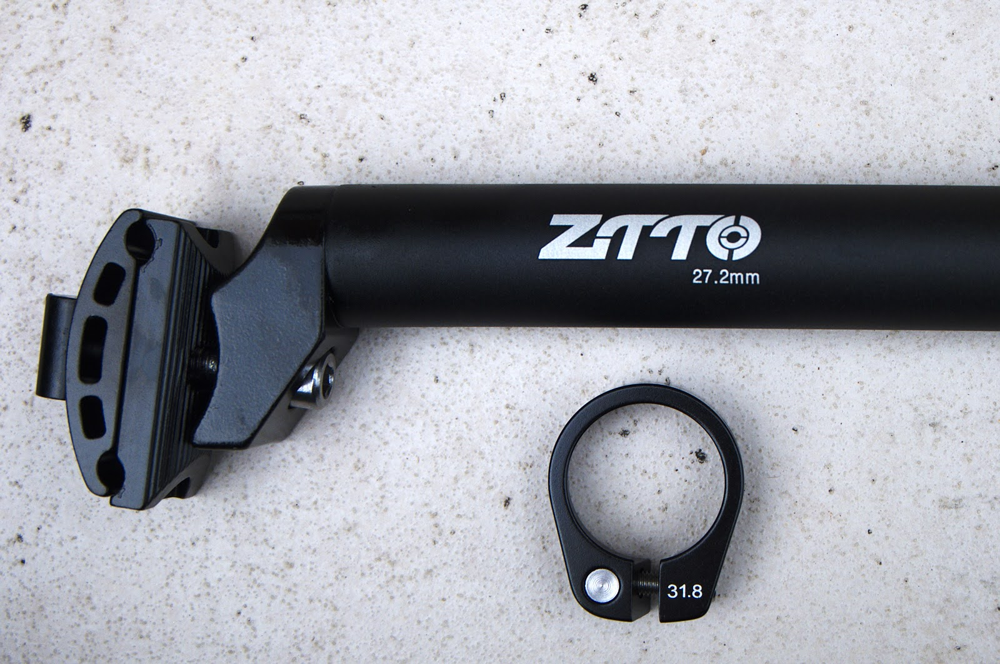 []{#more}

もとの自転車です。シートポストが銀色なのと、鉄製（だと思っていたがアルミでした）でアルミにして軽くなることを期待していました。

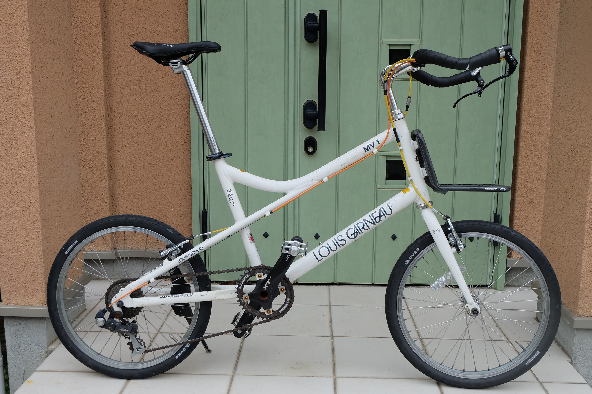

シートポストはこんな感じでロードっぽいサドルと色が合わないです。

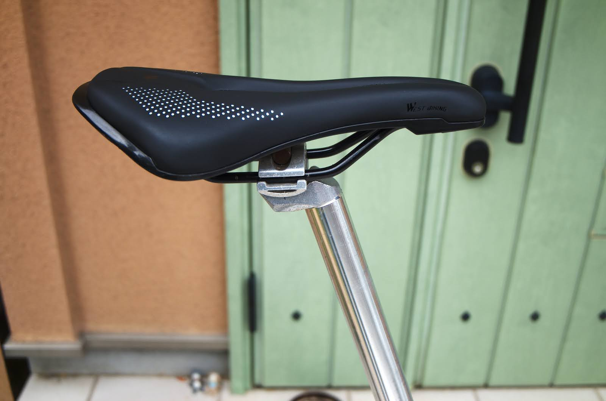

シートポストクランプはレバーが錆びてきました。

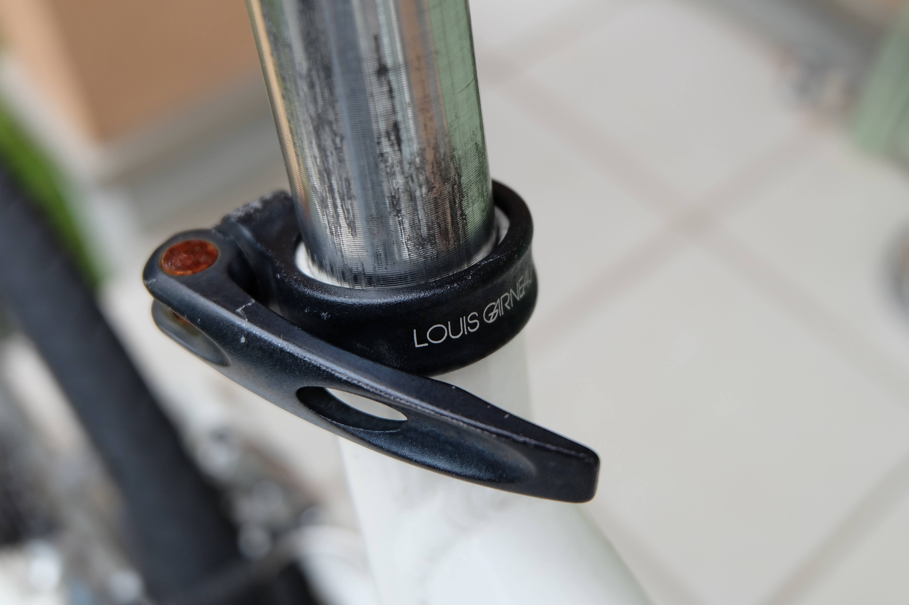

さて、前回のサドル交換時同様、シートポストを抜いてサドルを外します。外したサドルは、322g。

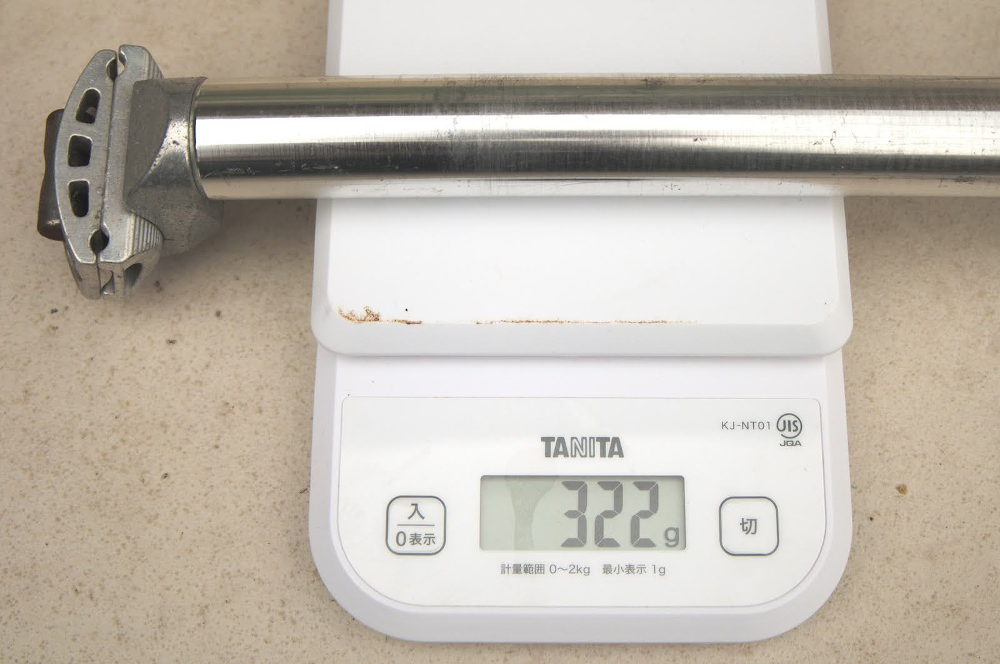

今回買ったZITTOのシートポストは、、、なんと295g！あれ、あまり重さが変わりません。外したシートポストをよく見るとこちらもアルミですね。鉄にメッキと思っていました。知っていたら買わなかった、、、か、カーボンにいってしまっていたかもしれません。

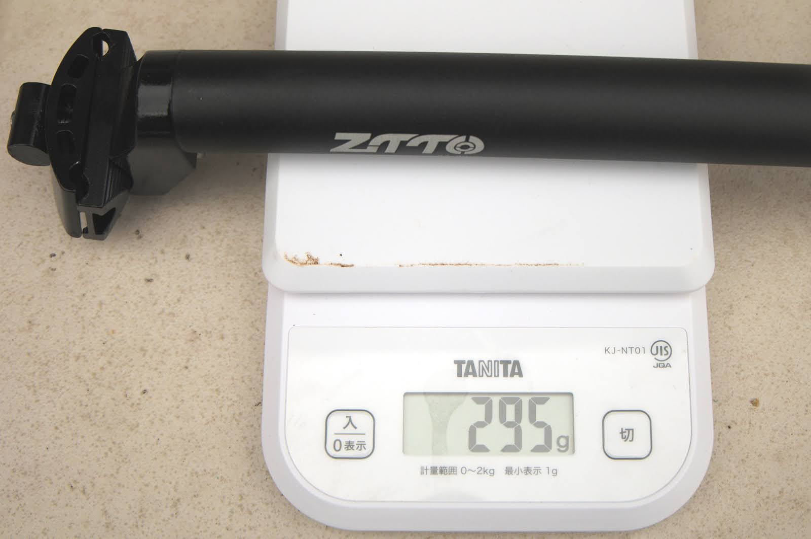

まあ、少しは軽くなるので良しとしてシートポストクランプも重さ比較してみます。

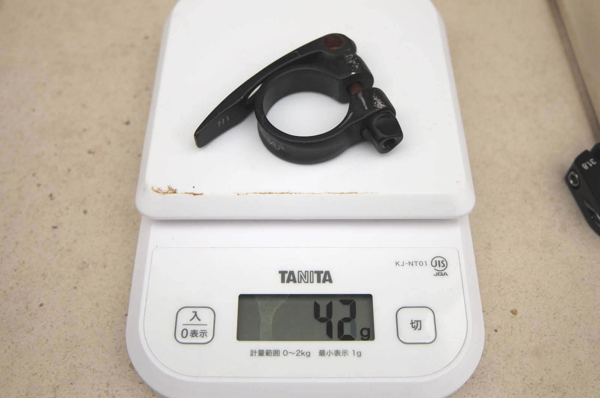

こちらは重さ半分に。クランプがない分結構軽くなります。

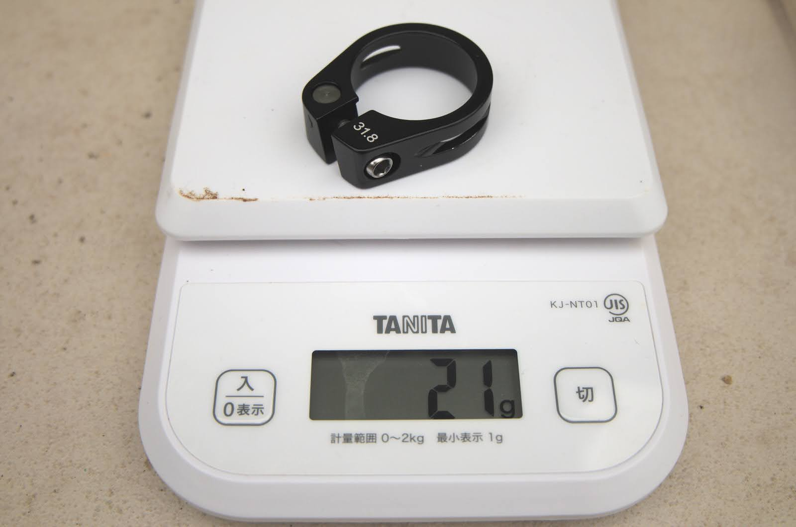

シートポストクランプをはめるとこんな感じです。Louis
Gauneauのロゴが無くなるのは寂しいですがボルト留めですっきりです。

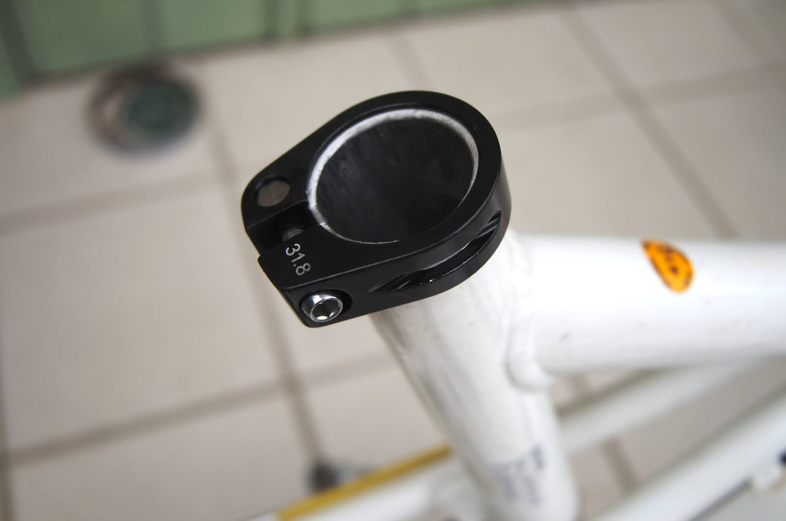

サドルを固定します。シートポストを持ってみると、サドルを固定する部分が重く、カーボンにしても多分ここは金属で重いのだろうなと。

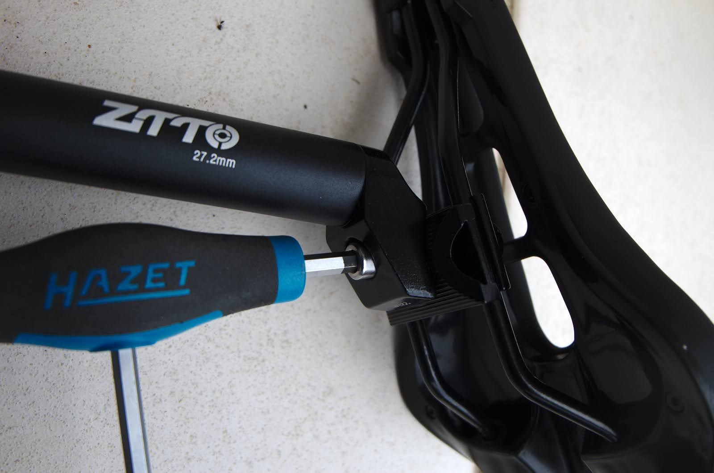

シートポストを差し込んでクランプすれば完了です。

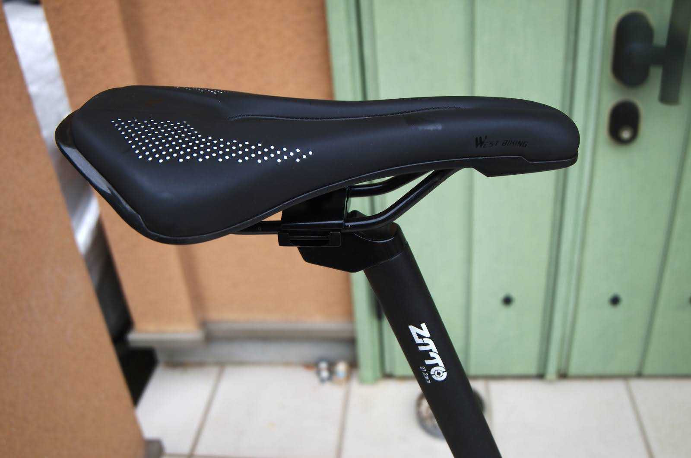

全体です。パンダカラーみたくなってきましたが銀色より見た目好みです。軽量化の効果は薄かったです。

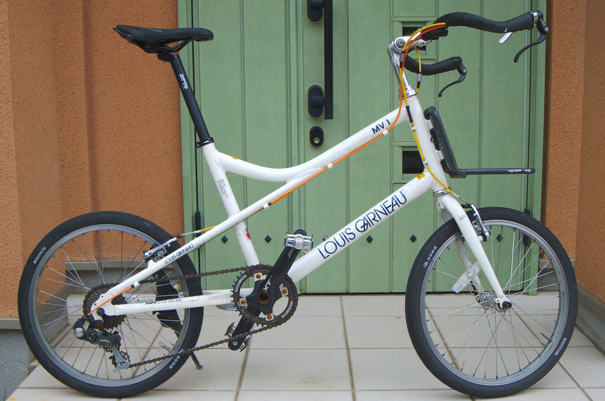
