---
categories:
- 自転車
- bike
date: "2025-02-15T22:34:09+09:00"
draft: false
images: 
- images/IMG_4401.JPG
summary: 自転車のペダルの回転が渋くなってきたので交換しました。MKS（三ヶ島）のSYLVAN TOURINGは金属製で高級感がありベアリング部のカバーを開けてメンテでき、長く付き合えそうなペダルです。
tags:
- ペダル
- MKS（三ヶ島）
- LGS-MV1
title: LGS-MV1 ペダル交換： MKS SYLVAN TOURING
---

## ペダル MKS（三ヶ島） SYLVAN TOURING 購入

LGS-MV1に始めから付いているペダルはプラスチック製の普通のペダルです。以前にベアリングにゴミが入り回転が渋くなった際にメンテナンスしようと思ったことろ、軸端のキャップがはめ込み式で取るのに一苦労し、結局細いマイナスドライバーで傷付けて取る必要がありました。
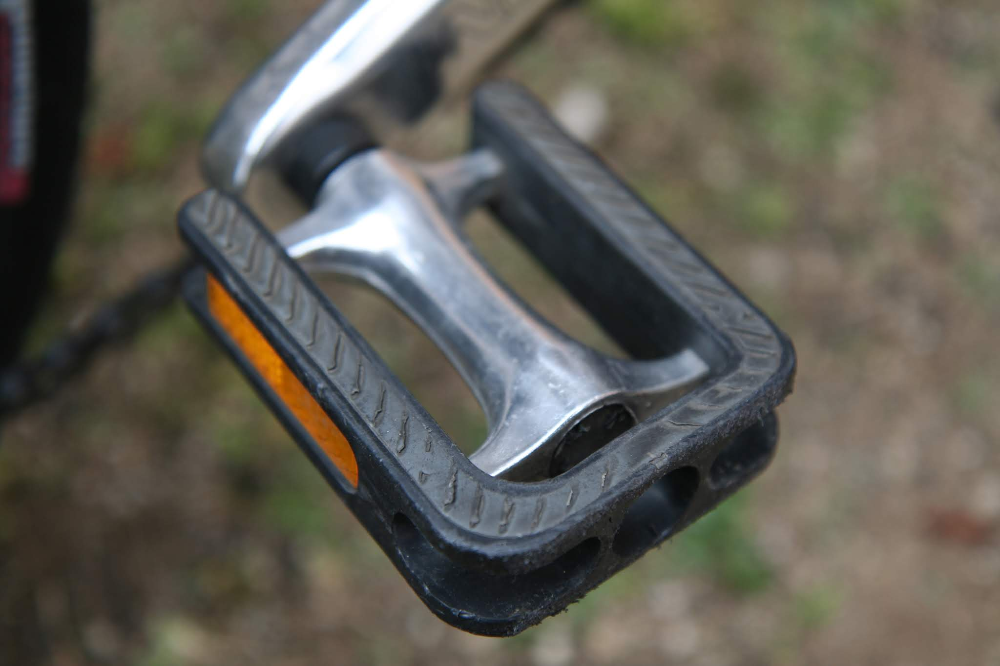

MKSのペダルでネジ式のキャップがあることを知り、アマゾンの評価も良いようなので買ってみました。
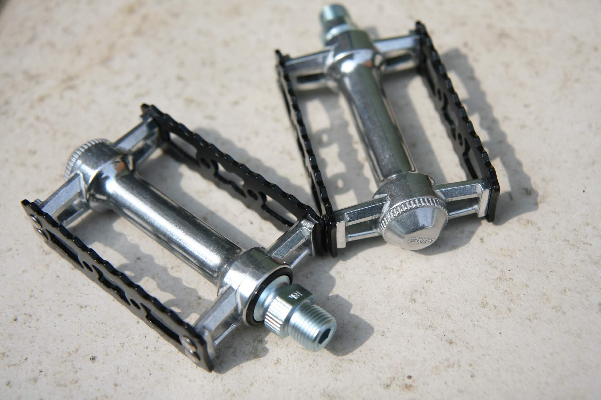

## 男心を擽るキャップレンチ

このキャップは周りにギザギザがあり、専用レンチで回します。専用レンチももちろん購入です。最小購入単位２個なので無意味に２個入手。安いので問題ないです。キャップを開けるとベアリングが見え、玉も大きいのでメンテして長期使用できそうです。
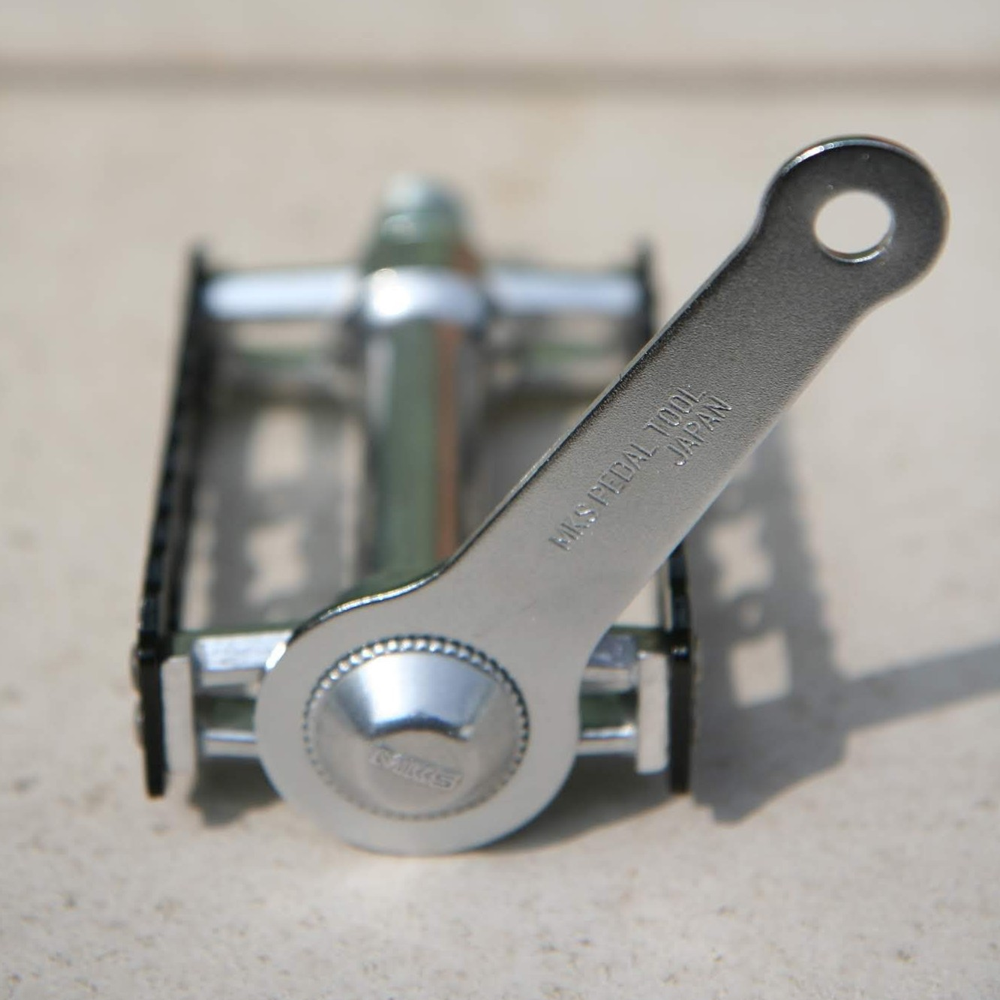 
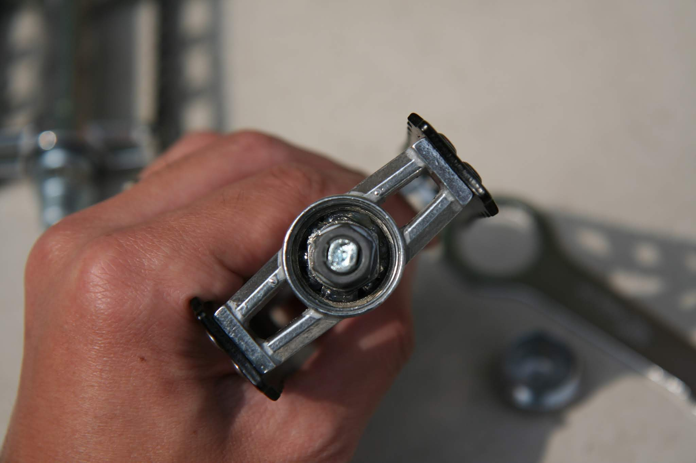

## ペダル取り外し

早速ペダルを外します。二面幅15mmのレンチが必要で、ペダルは漕ぐたびに締まっていく力がかかっているので固着している場合もあり、柄の長いペダルレンチがあると便利です。
右のペダルは右ねじで左回しで外します。 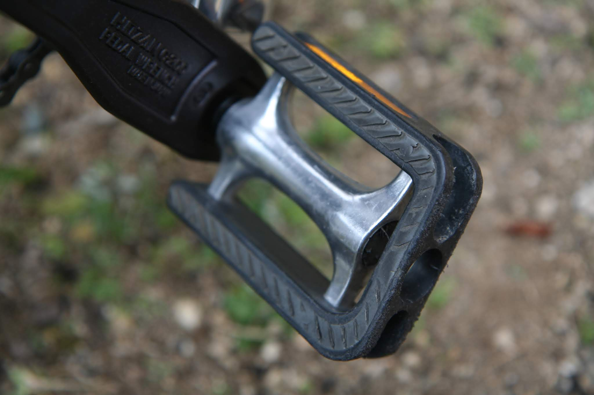
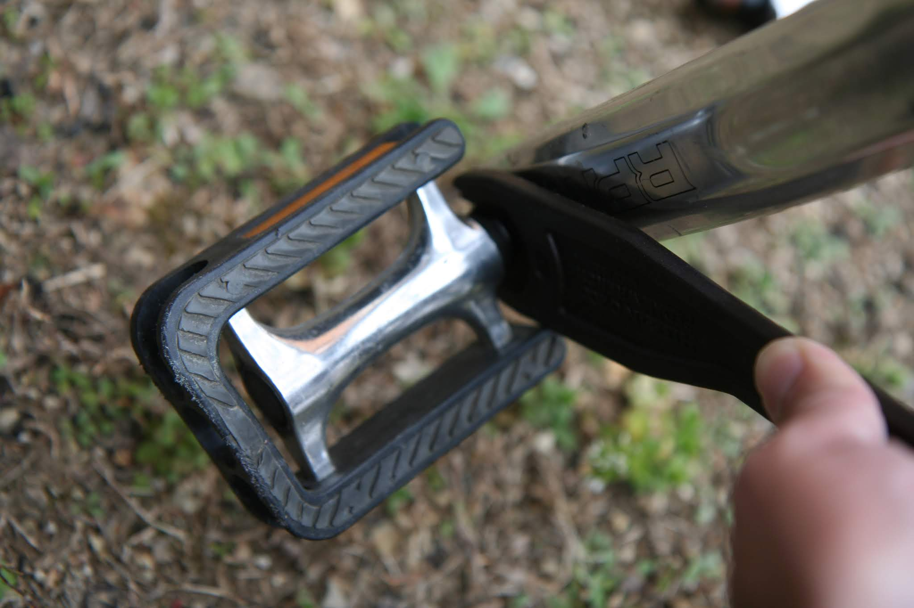 

ペダルが外れました。
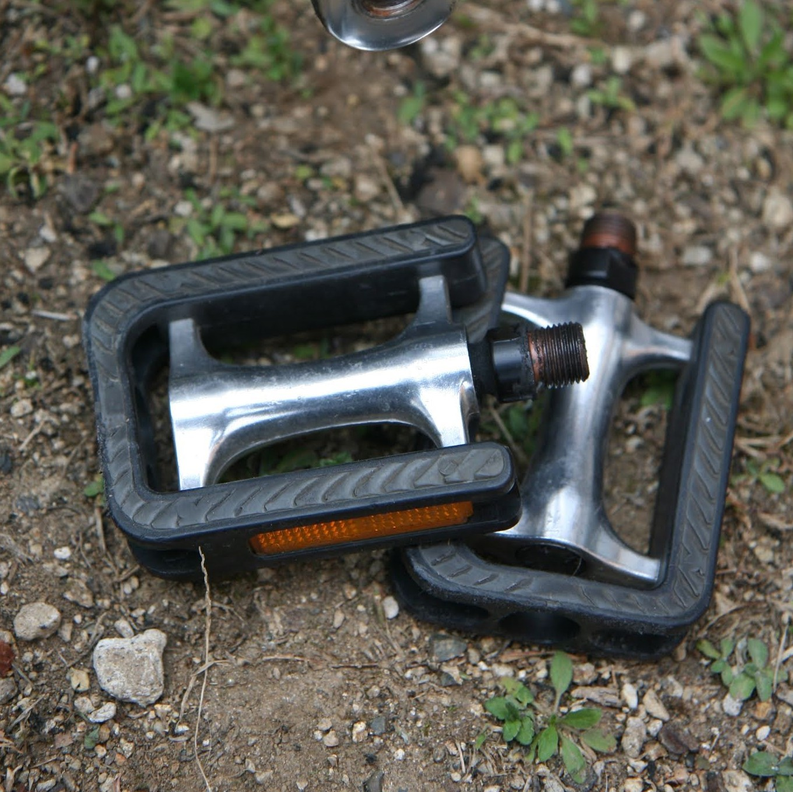

## MKS（三ヶ島） SYLVAN TOURING取付

新しいペダルには固着防止にグリスを塗っておきます。グリスはなんでも良いのでしょうが、固着防止用途で銅の色が綺麗なCOPASLIPを使いました。

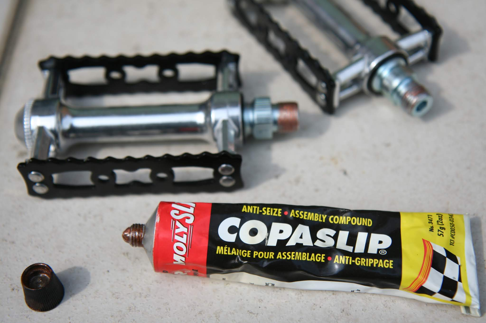
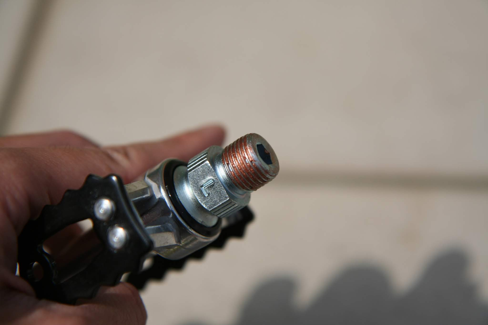

あとは取り外しと逆の手順でペダルを取付ます。
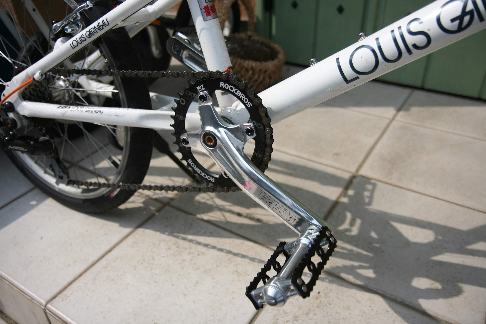

金属の質感が高級感を漂わせいい感じです。前のペダルよりは、明らかに重くなりました。アマゾンでは精度高く回転スムーズといったレビューが多かったですが、回転はそれほどクルクル回る感じでは無く、コリコリという抵抗があります。カップ＆コーン式のベアリングなので少し予圧をかけたくらいの玉当たり調整なのでしょう。
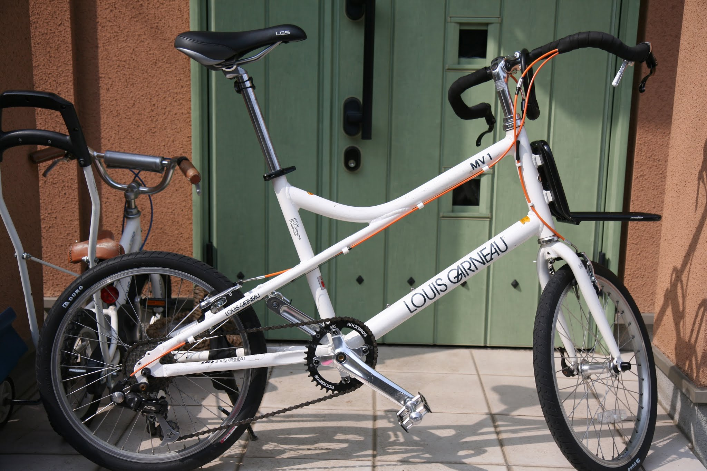

回転性能を求めるなら同価格帯で中華製のシールドベアリングを使用したペダルがあるのでそちらの選択もありかと思います。質実剛健でメンテ性を求めるならこのMKSのSYLVANはとても良いペダルです。
