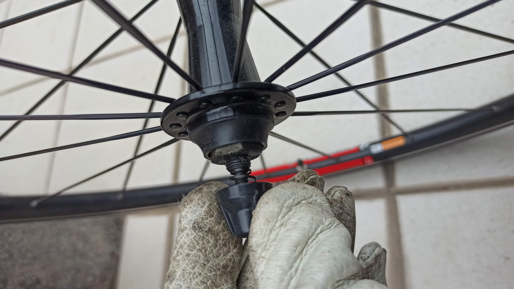
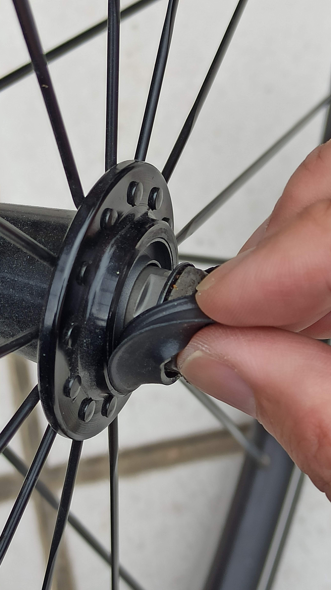
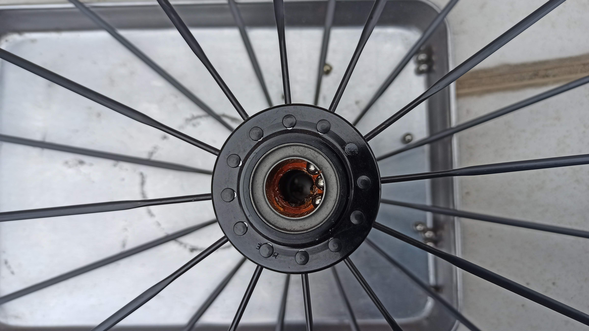

---
categories:
  - 自転車
  - bike
date: "2025-02-15T23:43:47+09:00"
description: ロードバイク、TREK MADONE 2.1のフロントハブのグリスアップ方法を解説します。
draft: false
images:
  - images/IMG_20220521_151207.jpg
summary: 愛用しているロードバイクTREK MADONE 2.1。購入してから8年も経ちました。ほとんどメンテしていません。よく乗るようになったのがここ2年くらいでそれまでは放置されていることが多かったですがさすがに給脂・油油くらいしておかないと、と思い立ちまずはフロントホイールハブのグリスアップをしました。
tags:
  - Madone2.1
  - ロードバイク
  - グリスアップ
  - ハブ
title: TREK MADONE 2.1 フロントホイールハブのグリスアップ
---

愛用しているロードバイクTREK MADONE 2.1。購入してから8年も経ちました。ほとんどメンテしていません。よく乗るようになったのがここ2年くらいでそれまでは放置されていることが多かったですがさすがに給脂・油油くらいしておかないと、と思い立ちまずはフロントホイールハブのグリスアップをしました。

## 必要なもの

-   17mmスパナ
-   13mmハブコーンレンチ
-   グリス
-   ベアリング玉を取るために先の細いもの（ピックアップツールや精密マイナス）
-   ベアリング玉受けトレー
-   ウェス（今回はティッシュ）
-   （パーツクリーナー）

## ハブの分解

TREK MADONE 2.1のフロントホイールです。

シマノかBontrager製かと思っていましたがハブには何も文字が無く、メーカー不明です。内部構造は開けてのお楽しみになりました。

まずはクイックリリースのシャフトを外します。

シャフトを抜いていきます。

シャフトが抜けました。

次にシールゴムをめくります。

シールを取ったあとの写真です。玉押しとロックナットがあり、これをシマノのハブと同じ構造になっていそうです。

ロックナットを緩めるために17mmレンチと13mmハブコーンレンチが必要です。

ハブコーンレンチで玉押しを固定しながらロックナットを弛めます。

ロックナットが外れました。

反対側のロックナットを固定しながら玉押しを弛めます。

玉押しを外します。ベアリングの玉が見えてきました。

玉押しを外したら、ベアリングの玉が落ちないように注意しながらシャフトを抜きます。シャフトを抜いた状態です。グリスは茶色く変色し固くなっていました。

## グリスを詰める

玉を外していきます。圧入されているシールを外せば作業がやりやすいのですが、マイナスドライバー等でこじると簡単に変形してしまうため、ピックアップツールを使いほじるように玉を外していきます。シマノのハブであれば、シール単品で購入できるのでシールを壊して新しいものに交換するのも手でしょう。このハブもシマノのシールが使えるかもしれませんが、素性がわからないため触らないことにします。

玉を上に抜いたり下に落としたりしていきます。すぐに落ちてしまうので下にトレーを敷いておくことをおすすめします。玉の数も数えておきましょう。

玉が全部外れました。左右各10個、計20個でした。

ティッシュを突っ込んでグリスを拭いていきます。グリスの量はそれほど多くないのでパーツクリーナーを使うほどでもありませんでした。ピックアップツールを入れてますがベアリング当たり面を傷つけないように注意です。

きれいになりました。

ベアリングの玉に付着したグリスも拭き取っていきます。

これもティッシュできれいになりました。

フィニッシュラインのテフロン強化グリスです。

指にグリスを付けてハブの中に入れます。使い捨てニトリル手袋があると便利です。

グリスが入りました。白いグリスです。

あとは玉をグリスに埋めるように戻していきます。グリスが少ないと玉が落ちてしまいます。

玉押しにもグリスを薄く塗ります。

玉を落とさないよう注意しながらシャフトを挿入します。

反対側から玉押しを入れます。

玉押しが玉に当たりました。

ここでワッシャ、ロックナットを入れます。

## 玉押し調整

ガタが無く少し与圧がかかる程度に玉押しを調整し、ロックナットを締め込みます。ロックナットを締めると玉当たりが若干変わるのでそこを考慮しながら何回か締めては弛めいいところを探します。隙間が少しでもあるとダメですこしコリコリするくらいが良いらしいです。

玉押し調整が決まったらクイックリリースを取り付けて完成です。

見た目は変わりませんがグリスアップ後のホイールです。

## まとめ

フロントハブのグリスアップは、スプロケットが無いので比較的簡単にできます。玉押しの溝が狭いため薄い特殊レンチ、ハブコーンレンチが必要で二面幅がいろいろあるので合うものを選定する必要があります。注意点は玉を無くさないことに尽きます。玉押し調整は難しいですが何度かやっているとコツがわかってきます。
