---
categories:
  - 自転車
  - bike
date: "2025-02-15T23:43:30+09:00"
description: 大阪から奈良の境界、生駒山地の暗峠を越える道は激坂で有名です。無謀にもロードバイクでヒルクライムに挑みました！がしかし、あまりにも斜度がキツく5分であっさり敗退した記録です。
draft: false
images:
  - images/hxkJA.webp
summary: 爽やかな秋晴れの日に関西で有名な激坂、暗峠に挑んみました！がしかし、あまりにも斜度がキツく5分であっさり敗退した記録です。
tags:
  - サイクリング
  - ポタリング
  - ロードバイク
  - Madone2.1
  - 暗峠
  - 大阪
  - ヒルクライム
title: 【5分で敗退】 激坂！暗峠
---

自転車の気持ち良い季節、秋になりました。爽やかな秋晴れの日に関西で有名な激坂、暗峠に挑んで5分であっさり敗退した記録です。

## 暗峠とは

暗峠は、「くらがりとうげ」と読みます。大阪府と奈良県の間に広がる生駒山地を超える国道308号上の、県境にあり、標高455mです。国道なのに車一台がやっと通れる道幅と、急勾配で知られる道です。最も急な斜面の傾斜計での簡易測定では、傾斜角度26度
(勾配48.7%) だとか。

## コース


<iframe allowfullscreen="" frameborder="0" height="300px" scrolling="no" src="//umap.openstreetmap.fr/ja/map/map_679913?scaleControl=false&amp;miniMap=false&amp;scrollWheelZoom=false&amp;zoomControl=true&amp;allowEdit=false&amp;moreControl=true&amp;searchControl=null&amp;tilelayersControl=null&amp;embedControl=null&amp;datalayersControl=true&amp;onLoadPanel=undefined&amp;captionBar=false#11/34.720337700667/135.61513043453743" style="max-width:100%" title="uMap 暗峠サイクリングマップ" width="100%">
</iframe>


今回はJR京都線岸辺駅前をスタートして北大阪サイクルラインの一部、大阪モノレール下を南下してから東へ向かい、暗峠まで自走しました。暗峠はあっさり敗退したのでほんの少ししか進んでいません。

## 岸辺駅前からスタート、生駒山へ向かう

国立循環器病研究センターができ、再開発が進む駅の北側は非常にきれいな場所でした。

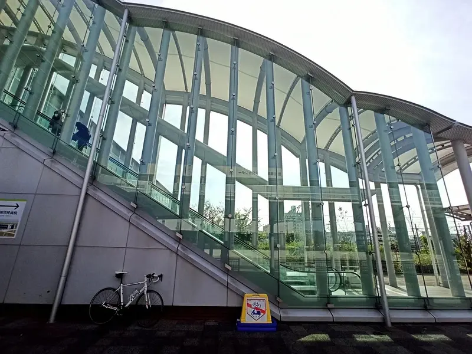
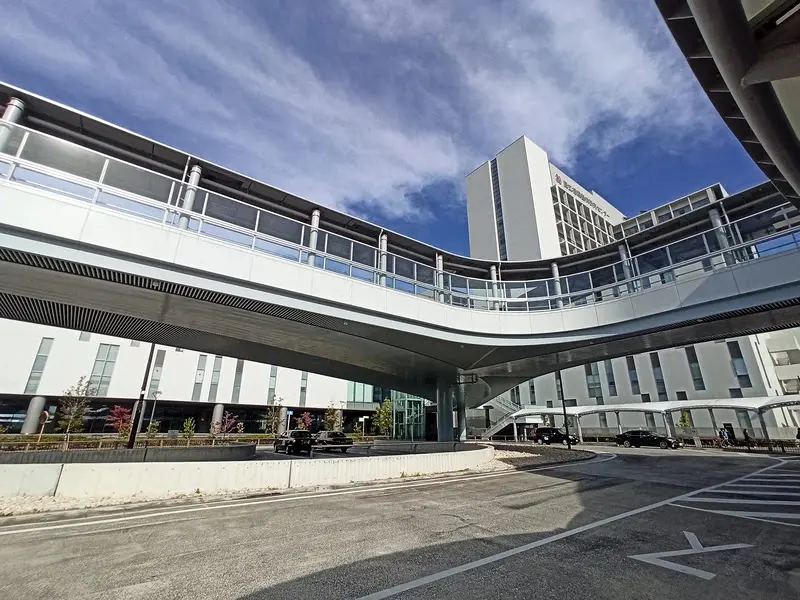

駅の南側に出て生駒山を目指して南下します。淀川に架かる鳥飼大橋から大阪モノレールの鉄橋の奥に目的地の暗峠がある生駒山が見えます。

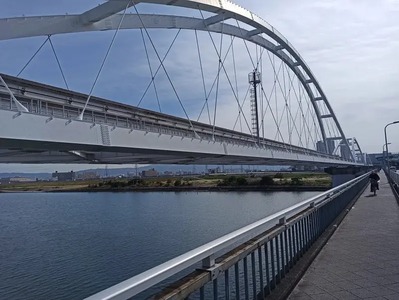

モノレール終点の門真市駅を超えてさらに南下し、高速道路の東大阪JCT下を左折して進んでいきます。特に見どころは無いので写真も撮らず通り過ぎました。

石切を過ぎて近鉄奈良線の手前までくると眺めが良くなり、大阪中心部のビルが良く見えます。

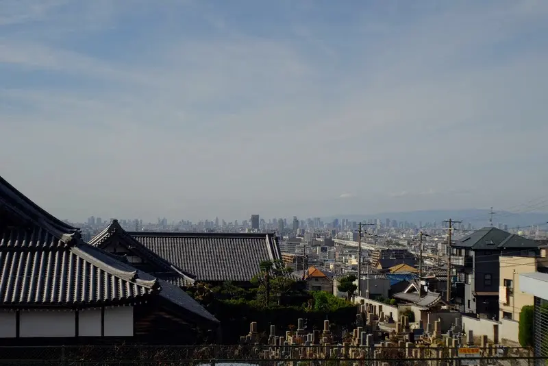

## 暗峠にチャレンジ！

近鉄奈良線額田駅で線路を渡ると暗峠の入口です。

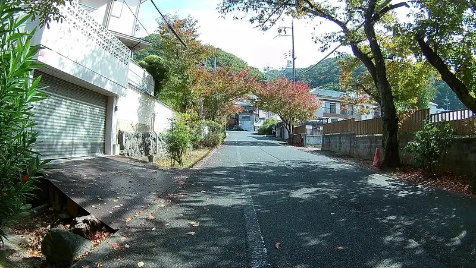

T字路で左に曲がり国道308に乗ります。

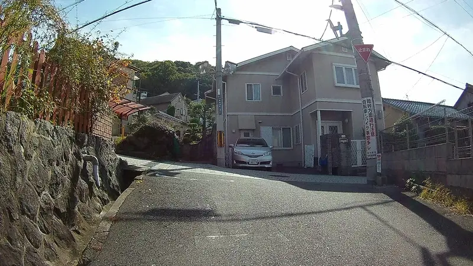

いきなり急勾配が始まります。しかも狭い道に車が度々通るので車を避けるのも大変です。

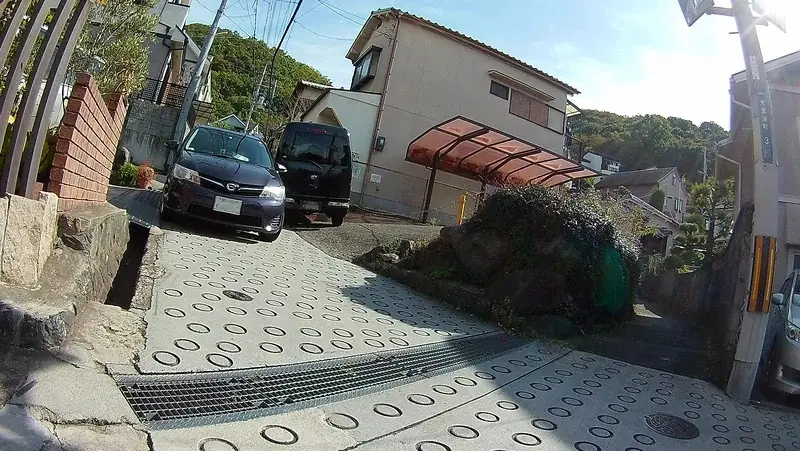

もう心が折れそうですがまだまだ勾配は緩いほうで序の口です。

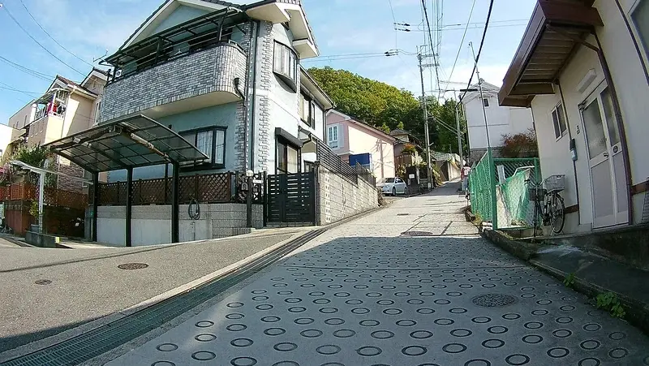

お寺とアパートの前で小休止。

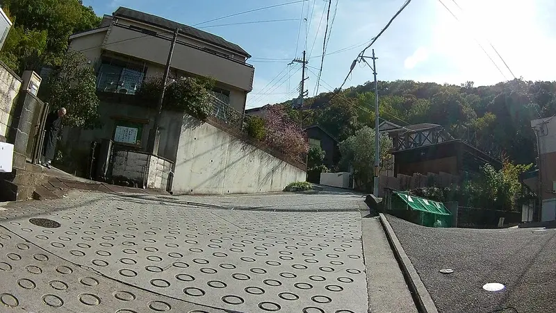

ほとんど進んでいないのにだいぶ標高が上がった感があります。

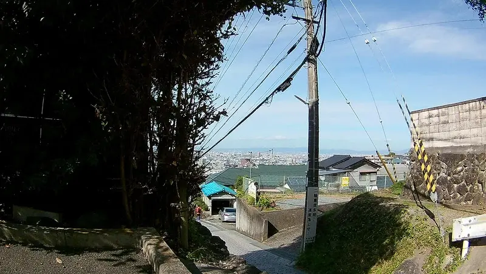

さて、気を取り直し立ち漕ぎで頑張ってすすみます。

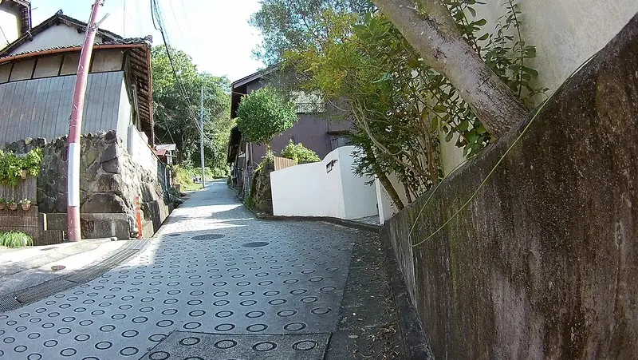

、、、、ハァハァ、、、ぐぉー！

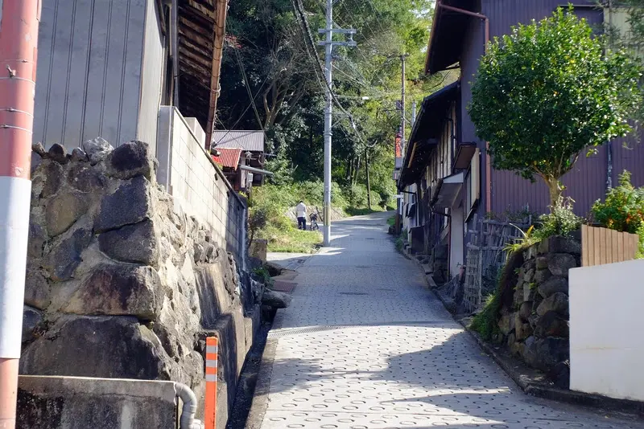

## 5分で敗退

無理です。最高点まではまだまだですが、下の位置で既に心が折れました。


<iframe allowfullscreen="" frameborder="0" height="300px" scrolling="no" src="//umap.openstreetmap.fr/ja/map/map_679913?scaleControl=false&amp;miniMap=false&amp;scrollWheelZoom=false&amp;zoomControl=true&amp;allowEdit=false&amp;moreControl=true&amp;searchControl=null&amp;tilelayersControl=null&amp;embedControl=null&amp;datalayersControl=true&amp;onLoadPanel=undefined&amp;captionBar=false" style="max-width:100%" title="uMap 暗峠サイクリングマップ" width="100%">
</iframe>


少し開けた場所を見つけ、ものの5分で敗退です。こんな感じで家が坂の斜面に建っています。車が次々と通り過ぎますがすれ違いとかどうしているのでしょうか。。。

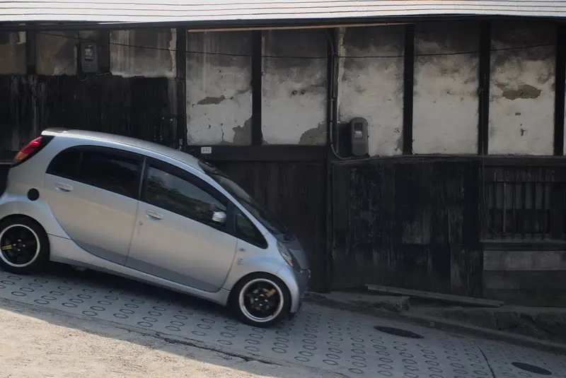

坂は続き、この先は住宅街から山の中へ入っていくように見えます。まあ、これ以上進みませんが。

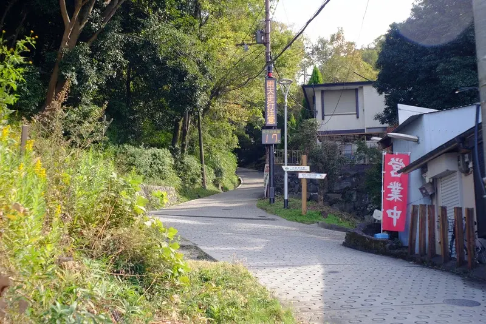

坂の下を眺めると坂に沿って建つ家々と奥には大阪の街並みのいい眺めです。さて、下りましょう。

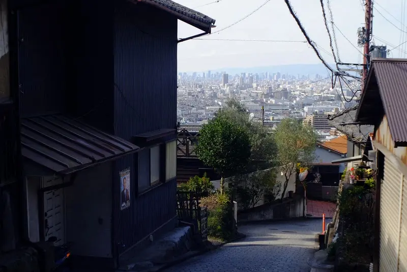

## 岸辺駅に戻る

鞍掛峠から下り、大阪の街並みが良く見える生駒山麓沿いの道を北に進みながら帰ります。

岸辺駅まで戻りました。

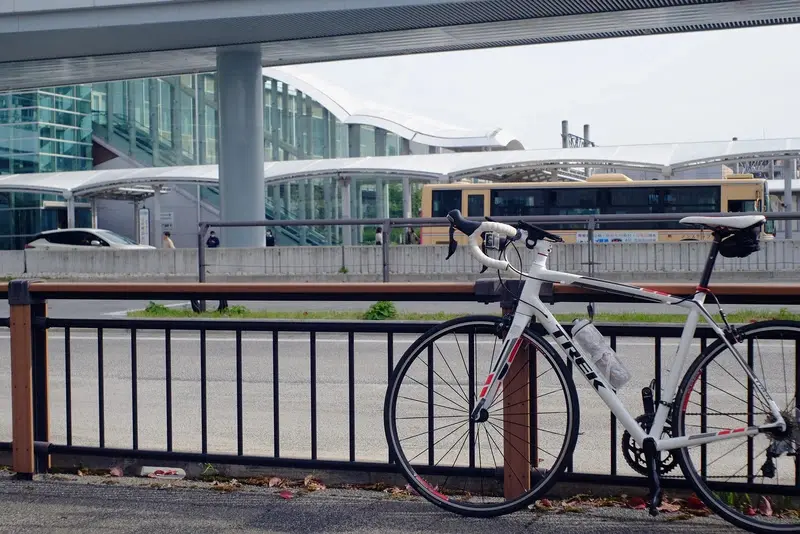

## まとめ

暗峠の坂は予想通り急勾配でほとんど登ることができず敗退しました。体力を付けられる年でも無いので時間がたっぷりあるときに歩きながらでも再度チャレンジじたいと思います。

[電動自転車で登る](https://www.yamaha-motor.co.jp/pas/recommend/gekizaka/0001.html)
こともできるみたいですね。
