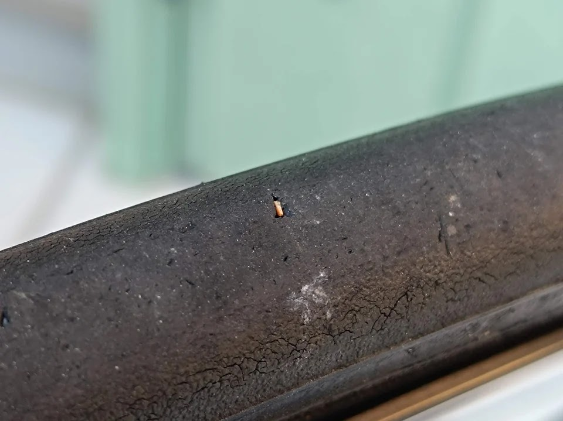
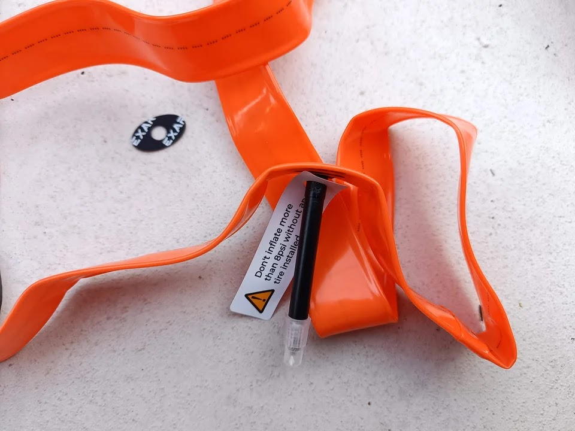

---
categories:
  - 自転車
  - bike
date: "2025-02-15T23:44:27+09:00"
description: 愛車のロードバイクTREK MADONE 2.1のタイヤ交換をしました。23cから25cへの広幅化とチューブも軽量なTPUチューブに交換。交換方法の解説と交換後の実走レビューします。
draft: false
images:
  - images/014.jpg
summary: 愛車のロードバイクTREK MADONE 2.1のタイヤ交換をしました。23cから25cへの広幅化とチューブも軽量なTPUチューブに交換。交換方法の解説と交換後の実走レビューします。
tags:
  - Madone2.1
  - ロードバイク
  - タイヤ交換
  - TPUチューブ
title: TREK MADONE 2.1 25cタイヤとTPUチューブに交換
js: js/paad.ts
---

2015年に買ったTREK MADONE 2.1ですが、いつの間にか10年が経とうとしています。当時はロードバイクのタイヤといえば23cが主流でしたが、最近は広幅化がトレンドのようで、25c、28cなどが一般的になっているようです。先日小石を踏んでパンクしたこともあり、タイヤ交換をする際にせっかくなので25cに変えてみました。ついでに軽量なTPUチューブも実用的になってきたということなのでチューブもTPUにしてみました。

TREK MADONE 2.1です。10年近く前の古いモデルですが、あまり乗っていないのでまだまだ使えそうです。

Bontragerの23cのタイヤが付いています。表面がだいぶザラザラになっています。

## 購入したもの

-   Panaracer クローザープラス 700×25c
-   Magene EXAR TPUチューブ
-   Panaracer Poly-Lite リムテープ

タイヤはそれなりに知られたメーカーの中で入門用の安いやつを選びました。色付きのタイヤはこれまで敬遠してましたが今回思い切って赤線の入ったカラーを選択。TPUチューブはそこそこ初期不良があるようなので悩ましいですがネット記事でそこそこ見かけ、かつコスパの良いMageneを買いました。



## タイヤ交換

外したホイールです。

ホイールからタイヤを外します。Tyre
Griderでビードをぐるっと一周します。使い慣れると普通のタイヤレバー使うより楽ですね。

この前パンクした際に踏んだ石の破片が突き刺さっていました。パンク修理し何回か乗っていたのですが見逃していました、あぶないあぶない。

タイヤをリムから外しました。

シュワルベの貼るタイプのリムテープを使っていたのですが、剥がす際にベタベタがリム側に残りベタベタ除去が大変でした。長巻きで売っており、直径の違う家族の自転車たちと共用できるし作り、色とも気に入っていたのですが、剥がすのが大変とは、盲点でした。



今回は輪っか状のリムテープを使います。接着剤が無いので交換の際は楽ですが、バルブ穴位置を合わせるのに苦労します。

タイヤのビード片側をリムの中にはめていきます。

ここでTPUチューブの出番です。バルブもプラスチックです。

説明書も無くシールが入っていました。おそらくバルブ根元を補強するためのものだろうと貼っておきました。

チューブをリムの中に入れていきます。ツルツルして少し入れにくかったです。オレンジ色が目立ちますですね、入れたら見えなくなりますが。

もう片側のビードをリムに入れて完成！ですが、Tyre
Griderを滑らせながら作業したら最後のぱつんぱつんのところでTyre
Griderがホイールのシールを削り取ってしまいました。😰

最後にやらかしてしまいましたが、交換作業は完了です。外周が赤いとだいぶ印象が違いますね。太さは、なんとなく太くなった感はありますが写真ではわからないレベルですね。

交換後です。23cから25cになりましたがタイヤの太さは遠目からはあまりよくわからないですね。転がり抵抗が減る、振動吸収効果を期待です。

## フレームのボルト頭とタイヤの干渉

交換後、早速乗ってみたら擦れたような音がします。よく見るとフレームにあるボルト頭とタイヤが干渉していました。

このボルトは何でしょう？フロントディレーラー固定用でしょうか。

たまたま別用途で買った低頭ボルトがありました。

ボルトを交換したら隙間ができ、ホッとしました。フレーム自体に干渉していたらこれまでの作業がすべて無駄になってしまうところでした。😮

たかがタイヤ幅が2mm太くなるだけ、と高をくくり事前にあまり良く見ていませんでしたが、当然径方向も膨らみ、ぎりぎりのところもあるものですね。たまたまうまくいって良かったです。

## 交換後の感想

交換後、少し走ってみた感じではなんか軽快に進む、気が、します。25cで転がり抵抗が減ったのか、はたまたTPUチューブで軽くなったのか、あるいは新品タイヤに交換した効果なのか、単なる気のせいかよくわかりませんが、もう少し使い込んでみたいと思います。

## まとめ

700×23c仕様であったロードバイク、2015 TREK MADONE
2.1に25cタイヤに交換しました。リヤ側フレームのボルト頭が干渉し、低頭ボルトへの交換が必要でした。TPUチューブは初期不良が多いと聞いていましたが今回は問題無く使用できました。


