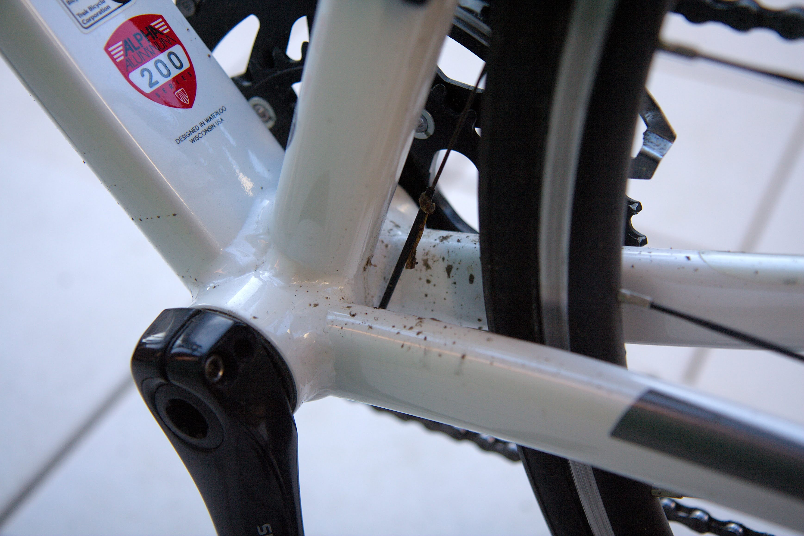
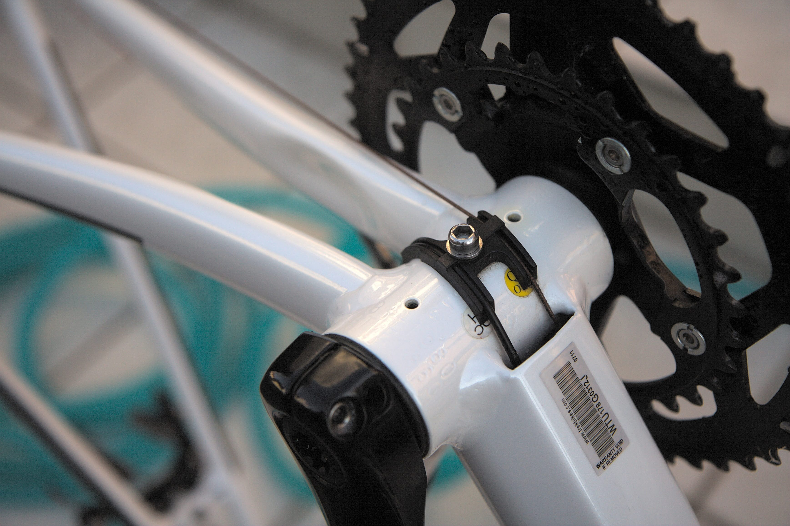

---
categories:
- 自転車
- bike
date: "2025-02-15T23:42:59+09:00"
draft: false
image: images/shine.jpg
summary: 汚れたロードバイクをカーシャンプーとカーワックスを使い丸洗い＆ワックスがけをしました。カー用品を使うと量が多くコスパが良いです。
tags:
- 洗車
- Madone2.1
- ロードバイク
title: TREK MADONE2.1 ロードバイク洗車とワックスがけ
js: "js/paad.ts"
---

この前、淀川沿いをロードバイク TREK MADONE 2.1
で走ったのですが、水たまりがたくさんありフレームにドロが跳ねて汚れてしまいました。

そのまま乗っていましたが、だんだん汚れがひどくなり洗車してみました。自転車用のシャンプ、ワックスは持っていないので車で使っているもので代用です。

## 使用したもの

1.  SONAX(ソナックス) カーシャンプー グロスシャンプー 314300
2.  3M クイックワックス 39034
3.  馬毛洗車用ブラシ
4.  ファイバークロス (Amazon Basics の大量で安いもの)

自動車用のシャンプーとワックスを使用します。シャンプーはアマゾンで安くて評価の高い
SONAX のオレンジ色のもの、ワックスは 3M
のスプレータイプです。ワックスはコンパウンド入りで、自転車への使用は嫌がる人もいるかと思いますが、仕上げ用なので気にしないで使います。



自転車用は量が少ない割に値段が高いですが、車用は量が多く、車の洗車の延長で使えるので経済的です。

## フレームが泥だらけ

水たまりのドロ跳ねがダウンチューブとBB周りにたくさん付いています。

隙間が狭くて拭くには手や指が届かなかったりするので、ホイール外して丸洗いしていきます。

## チェーンの洗浄

まずはホイールとチェーンを外します。

チェーンはせっかくなのでパーツクリーナーを吹いた後ウエスで拭いて汚れを落とします。

チェーンオイルは FINISH LINE
のワックスタイプを使っているのでそれほど汚れがひどくないので
Before/After
が写真ではよくわかりませんが、それなりにきれいになりました。汚れが粘土状になるのでパーツクリーナーでも完全にきれいにできず、若干残りますが。

## フレーム洗車とワックスがけ

さて、ホイールとチェーンを外したフレームを逆さまにして置きます。サイコンやアクションカメラ等はもちろん外しておきます。

汚れがよく見えますね。

カーシャンプーキャップ1杯をバケツに入れてシャワーで泡立てます。この
SONAX のカーシャンプーは少量でとても泡立ちが良いので気に入っています。

ブラシでドバドバ泡をかけるように汚れを落としていきます。

 

ホイール、タイヤも泡だらけにして汚れを落とします。

シャワーで水をかけてすすぎます。風呂上がりサッパリとした雰囲気です。

フレームが濡れたままワックスをスプレーしマイクロファイバーで拭き上げていきます。このワックスは濡れたまま使えるので楽ちんです。

一通り拭き上げるとフレームがピカピカになりました。

BB周りもきれいになり、これでまた気持ちよく乗ることができます。

## まとめ

ロードバイクの洗車用ケミカルは、FINISH LINE
のピンクのやつを始めとしていろいろありますが、今回のように外で丸洗いする場合はシャンプー、ワックスも車用のものがおすすめです。

チェーン、スプロケットなどのドライブ系はメタルクリーンαが最強と思っていますがまた今度記事にしてみたいと思います。


