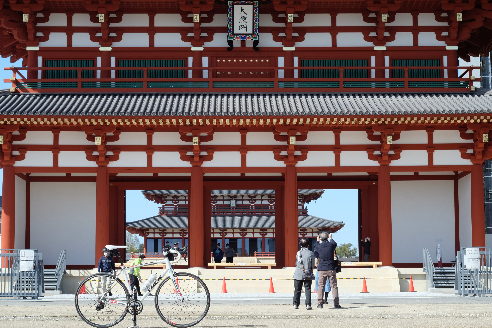

---
categories:
  - 自転車
  - bike
date: "2025-02-15T23:43:45+09:00"
description: 大阪の万博記念公園から奈良県の平城宮跡までのサイクリングコースをご紹介します。中学校の歴史で習った平城京の中心で歴史公園として整備されており、巨大な第一大極殿など建物も復元され、当時の都を感じることができます。
draft: false
images:
  - images/DSCF5958.jpg
summary: 大阪の万博記念公園から奈良県の平城宮跡までのサイクリングしました。中学校の歴史で習った平城京の中心で歴史公園として整備されており、第一大極殿など建物も復元されているということで楽しみです。
tags:
  - サイクリング
  - ポタリング
  - ロードバイク
  - Madone2.1
  - 平城京
  - 奈良
title: 万博記念公園から平城宮跡へライド
---

これまで淀川沿いや大阪北摂の山々を走ることが多かったですが、今回は趣向を変えて奈良県の平城宮跡へ向かってみます。中学校の歴史で習った平城京の中心で歴史公園として整備されており、第一大極殿など建物も復元されているということで楽しみです。

## コース

{{< mbox json="track.json" center="{ \"lng\": 135.649, \"lat\": 34.758 }" zoom="9" style="" >}}

万博記念公園から府道19号、淀川新橋を渡り国道168号を進み生駒山地を越えて奈良県に入ります。近鉄奈良線まで南下し、近鉄奈良線に沿って東へ進むと平城宮跡に着きます。

生駒山地越えが少し遠回りですが激坂の暗峠は以前敗退しているので、なるべく登りの少ない道を選びました。

## 万博記念公園

万博記念公園中央口の南側、太陽の塔がよく見えるところからスタートです。

桜が咲き始めています。春ですね。

万博記念公園を周回する道路を東へ進みます。

公園東口から右へ出てモノレール沿いに進みます。陸橋があり毎回面倒と思いながら歩いて渡ります。

左へ曲がりモノレールと別れ府道19号方面に進みます。

府道19号に入るとすぐに安威川を越えるのですが、ここも歩道の階段を登る必要があります。

汚い水の安威川の奥には山崎方面の山々が見えています。

## 淀川新橋

安威川を越えた次はすぐに淀川です。一度淀川の堤防に上がり、そこから淀川新橋を越えていきます。

淀川新橋の奥に生駒山が見えます。これを越えると奈良県です。

淀川を越えた後はごちゃごちゃした道を走り私市を目指します。

途中のローソンで休憩＆お昼ごはんにします。

## 生駒山地越え

私市で国道168号に入り生駒山地を越えていきます。それほど登りは無く走りやすい道で、この道を選んで正解でした。

新磐船トンネルという長いトンネルがあります。トンネル手前の右側に側道があり、磐船神社という観光名所があるので側道に入るのが正解でした。

トンネルを越えるとごみ焼却場があり、この前で休憩です。

磐船神社にも寄ってみたいですが時間もあまり無かったので今回はスルーします。

## 奈良県を走る

トンネルの後は下り基調で楽に走れます。ついに奈良県に入りました！自転車で来るのは初めてです。

少し南へ走ったところで国道163号、県道7号とさらに南へ向かい近鉄富雄駅の手前で左へ曲がります。

近鉄の線路沿いを東へ進んでいきます。

大和西大寺駅まで来ると車や人が多くなり街中といった感じになります。

ここから少し進むと右側に平城宮跡の入口があります。

## 平城宮跡

北西側、平城宮跡資料館側から入ります。

桜がきれいに咲いていました。

桜があると日本の古都といった雰囲気を感じますがソメイヨシノは江戸末期に作られたので平城京の時代には無いですね。

だだっ広い原っぱにひときわ大きな建物がズンと立っています。第一大極殿院
南門です。

奥に第一大極殿があります。2010年に建てられたものでピカピカの新築といった雰囲気です。それにしても大きな建物です。平城京への遷都は710年。この頃にこんな大きく立派な建物があったとは驚きです。

南門の隣にはさらに復元工事が進行中のようです。また大きな建物になりそうですね。

南門からさらに南、奥に朱雀門が見えます。

第二大極殿跡は土台だけが復元されています。

階段を上がると東の奥に春日山が見えます。

なかなか見応えのある観光地でした。

## 輪行で帰る

平城宮跡をあとにし、近鉄大和西大寺駅まで戻り輪行袋に自転車を入れ、電車で帰ります。電車で帰ると距離が半分になるのでだいぶ行動範囲が広がりますね。

## まとめ

今回のコースは生駒山越えの国道168号に入るまではそれほど走りやすい道ではありませんが、生駒山〜奈良県川は道も広くスピードが出て気持ちの良いサイクリングになりました。平城宮跡はゴールにふさわしく巨大な大極殿跡が見応えがあります。もう少し東へ進み奈良公園まで行っても良さそうです。

初めて自転車で奈良まで行きましたが藤原京、明日香村など歴史ある見どころがたくさんあるので後々訪れたいと思います。
