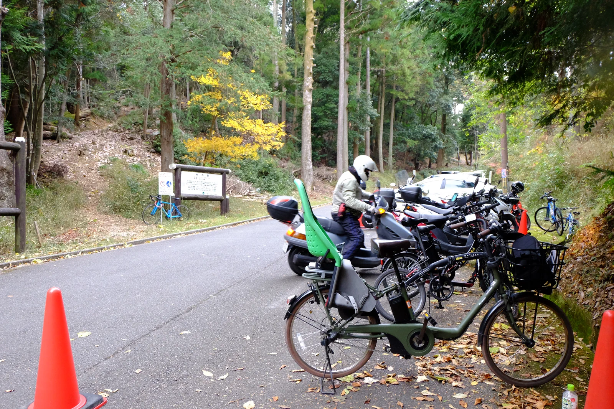
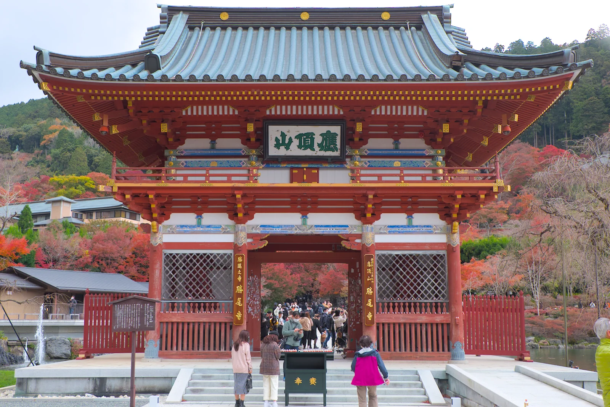
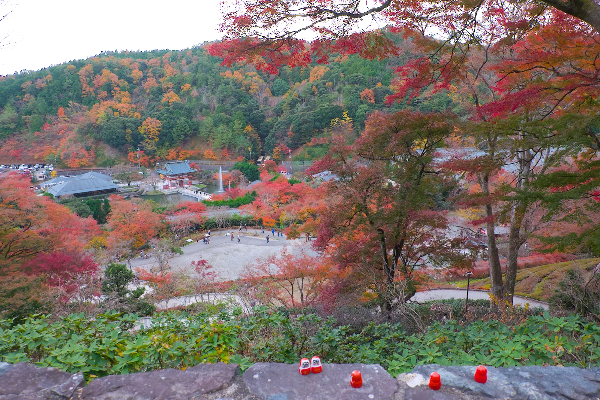
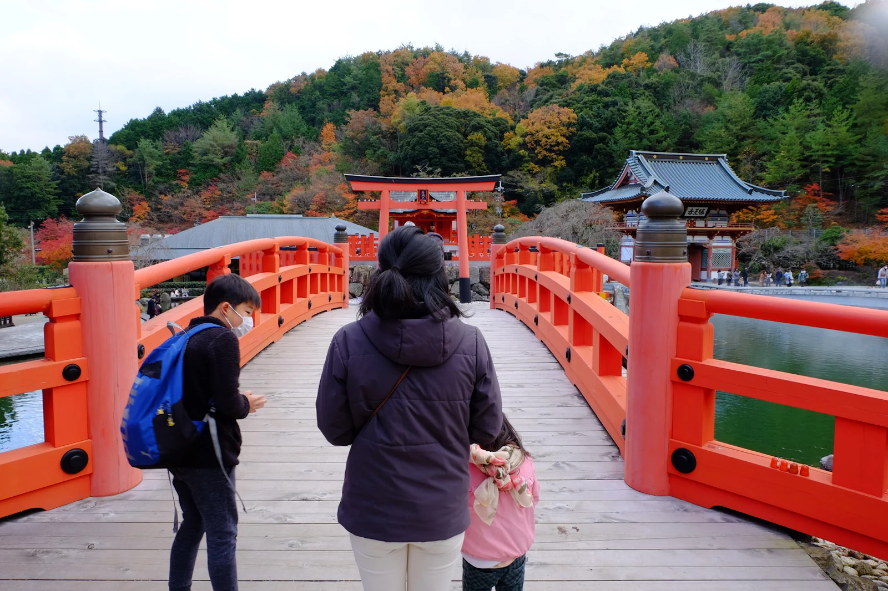

---
categories:
  - 自転車
  - bike
date: "2025-02-15T23:43:29+09:00"
description: 北摂、箕面の山へだるまさんで有名な勝尾寺の紅葉を見に自転車でヒルクライムをしました。ヒルクライムルートと勝尾寺の紅葉をご紹介します。
draft: false
images:
  - images/DSCF5316.webp
summary: すっかり寒くなった秋の休日に自転車で勝尾寺まで紅葉を見に行こうと思いました。子供のサッカーがあるので万博記念公園までママチャリ、電動自転車ギュット・ステージ・22で連れていき、そのまま電動自転車ヒルクライムです。
tags:
  - 勝尾寺
  - サイクリング
  - ポタリング
  - ロードバイク
  - Madone2.1
  - 大阪
title: 電動自転車 ギュット・ステージ・22 で紅葉の勝尾寺へ
---

すっかり寒くなった秋の休日に自転車で勝尾寺まで紅葉を見に行こうと思いました。子供のサッカーがあるので万博記念公園までママチャリ、電動自転車ギュット・ステージ・22で連れていき、そのまま電動自転車ヒルクライムです。

## コース

万博記念公園東口からモノレール沿いに北へ進み、府道4号茨木能勢線を左折。途中で大きな楠木がある楠木神社を通りそのまま進むと山道になってきます。府道43号との交差点で左へ曲がり勝尾寺橋を渡り、紅葉と渋滞の山道を登ると勝尾寺に到着です。

{{< mbox json="track.json" center="{ \"lng\": 135.518, \"lat\": 34.8395 }" zoom="11" style="" >}}

## 子供を乗せて万博記念公園へ {#子供を載せて万博記念公園へ}

勝尾寺の紅葉が見頃ということで、ロードバイクで行こうかと思っていた休日、子供のサッカーの練習があるということで、ママチャリで万博記念公園まで子供を乗せてそこから勝尾寺まで行くことに。

ロードバイクに比べるととてつもなく重いママチャリ、パナソニックのギュット・ステージ・22ですが電動アシスト付きなのでヒルクライムはどうなのでしょうか？

## 万博記念公園東口からスタート

子供を降ろし、スタートです。途中で電池切れが心配ですが、この時点でバッテリーは90%。まだまだ大丈夫です。

早速万博記念公園周遊道路に出てモノレール下を走っていきます。自転車専用道路があり走りやすい道です。ママチャリはスピードが出ませんがアシストの力を借りてスイスイ進みます。

モノレールに沿って万博記念公園周遊道路から右へ折れ北へ進みます。下り坂なので楽です。奥に目的地のある箕面の山々が見えてきます。

途中で車道は高架になり自転車は通行できないため、側道に入ります。

ここで左へ出たあと、交差点を左に曲がり府道4号へ出ます。モノレールとはここでお別れです。

しばらく進むと大きな木が右手に見えました。楠木神社という神社でした。ということは、木は楠木なのでしょう。

立派な木に黄色くきれいな葉をつけた楠木をしばらく見てさらに進みます。

## 渋滞の勝尾寺ヒルクライム

西田橋交差点を過ぎると山深くなり勝尾寺ヒルクライムの始まりです。重い車体で登れるかドキドキです。

電動アシストの力は強力で意外にも重い車体をものともせず、ロードバイクより楽に登れます。途中でロードバイクやクロスバイクの人を抜いてスイスイ進んでいきます。勝尾寺橋手前の交差点まできました。ここを左折してあとは一本道ですが、すでにこのあたりから渋滞が始まっています。まだ勝尾寺までは1.2kmくらいあります。ハイシーズンに車で来るところではないですね。

渋滞する車の合間を登っていきます。車はほとんど動かない状態ですが上まで辿り着けたのでしょうか。。。途中にはきれいに紅葉したもみじを見ることができました。

やっと到着です！自転車で来ている方もちらほらいるようですね。ママチャリはこれ一台でした。しかしアシストパワー強でロードバイクより楽ちんに登ってしまいました。電動アシスト付きママチャリの実力を実感した次第です。心配していた電池残量もまだ70％あり余裕でした。

自転車を停めて勝尾寺まですこし歩きます。

駐車場待ちの車が並んでいます。

## 紅葉の勝尾寺

入口はすごい人！ディズニーランドのアトラクション待ちのような状態です。入場に15分くらい並びました。

参拝料を払い中へはいるとまずは山門です。

おなじみのだるまさんがお出迎え。

門をくぐると紅葉の美しい景色です。

だるまさんと紅葉のコラボレーションが勝尾寺ならではの景色です。

勝ちダルマです。勝尾寺は六代座主、行巡が清和天皇の病を祈祷で治したことからここはまさに王に勝った寺、勝王寺である。」と帝より命名されたことがその名前の由来だそうです。

勝ちダルマを横に見ながら階段を登っていくと本堂にたどり着きます。本堂中の白い点々のように見えるのは全部だるまさんです。

ちいさなだるまさんがいたるところにわさわさ居ます。

一番高い所、法然上人第五番霊場　納骨堂まで行くと下の景色と紅葉した山々が見えます。

景色を眺めたら下って帰ります。

こんなところにもだるまさんが。

弁天堂でお参りして帰ります。

## 万博記念公園まで戻る

帰りは山道をあっという間に下り、モノレール沿いに万博記念公園へ自転車を漕ぎます。こんなに重い車体でもロードバイクより楽ですね。。。

万博記念公園周遊道路まで来ました。モノレールの真下を進みます。

ゴールです。ちょうど子供のサッカーの練習も終わりこのあと子供を乗せて家路につきました。

## まとめ

秋の勝尾寺はきれな紅葉とだるまさんのコラボレーションが楽しめる紅葉狩りにおすすめのスポットです。近くの箕面大滝と一緒に大阪では有名な紅葉スポットなのでとても車だと混雑するため自転車で訪問してみてはいかがでしょうか。電動アシスト自転車だと意外とあっさりと行けてしまいました。
