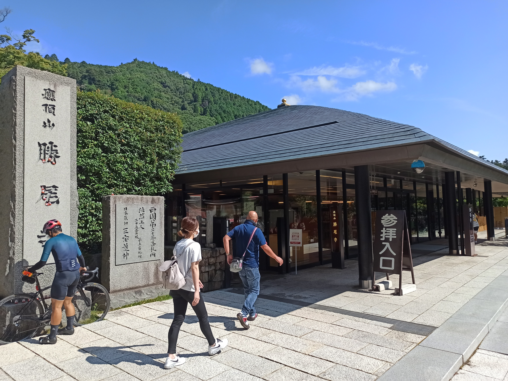

---
categories:
- 自転車
- bike
date: "2025-02-15T23:42:50+09:00"
draft: false
image: images/My+Post.jpg
summary: 残暑厳しい中、2年ぶりにロードバイクを引っ張り出して乗ってみることにしました。ルートは南千里公園から北上し箕面大滝、勝尾寺のだるまを見て戻るコースです。
tags:
- 勝尾寺
- サイクリング
- ポタリング
- ロードバイク
- Madone2.1
title: 箕面大滝、勝尾寺ライド
---

残暑厳しい中、2年ぶりにロードバイクを引っ張り出して乗ってみることにしました。ルートは南千里公園から北上し箕面大滝、勝尾寺のだるまを見て戻るコースです。

## コース

{{< mbox json="track.json" center="{ \"lng\": \"135.494\", \"lat\": \"34.833\" }" zoom="11" >}}

## ライド詳細

千里南公園を7:30に出発。国道423号、御堂筋を北上。

中国自動車道沿いに西へ向かいます。天気が良く六甲山が見えます。

モノレール少路駅を過ぎたところで再度右折し府道43号を北へ。勝尾寺まで12kmの標識が見えます。

突き当りまで行くと左が箕面駅です。右に折れて山を登る道に入ります。右折直後から急坂が始まりすぐに心が折れそうになります。高度が上がり、大阪市内のビル群の眺望が素晴らしいですが写真を撮る余裕はありませんでした。

坂をゼェゼェいいながら登り、浄水場前までたどり着きました。ここで一度休憩。ここが箕面の山への入り口のような感じで、まだまだ先は長いです。

フロントインナー×リア1速縛りで歩くようなペースで登っていき、才ヶ原林道との出会いでやっと登りが終わります。

ここからしばらく下り基調で気持ちよく走れます。

おもむろに歩道に人がちらほら現れ、箕面大滝の入り口、杉の茶屋に到着です。

ここから箕面大滝までの道は自転車を乗ることができません。鍵を忘れたので自転車を押して入っていきます。滝までは500mちょっとあり、結構遠いです。

いい雰囲気で涼しい道を歩いていくと、、、

滝に着きました。

まあ、ただの滝ですが見ていると心が癒やされます。まだ9時前ですが結構観光客がいて皆写真を撮っています。

杉の茶屋まで戻り、そこから先に進みます。箕面大滝の駐車場は8割くらい車が停まっていてもうしばらくしたら満車にないそうでした。進むこと20分、勝尾寺に到着です。

勝尾寺はだるまがたくさん置いてあることで有名で、見るのを楽しみにしてきたのですが、なんと財布を家に忘れてきてしまい入山料が払えず、外に置いてあるだるまさんを見るだけになってしまいました。

こんなところにも、、、

こんなところにも、、、

こんなところにも、小さなだるまさんが置いてありました。次回は是非中に入りたいものです。だるまさんグッズのおみやげもたくさん置いてありました。これも次回は何か買って帰りたいですね。

ここからはザーっと一気に下って彩都への分岐です。

阪急北千里駅へ向かい、阪急沿いに千里南公園まで戻りました。

総距離28.3km、平均スピード17.5km/h、2年ぶりのロードバイクでヘロヘロになりましたが、これくらいがちょうどよい感じです。ビワイチとかもう無理。
