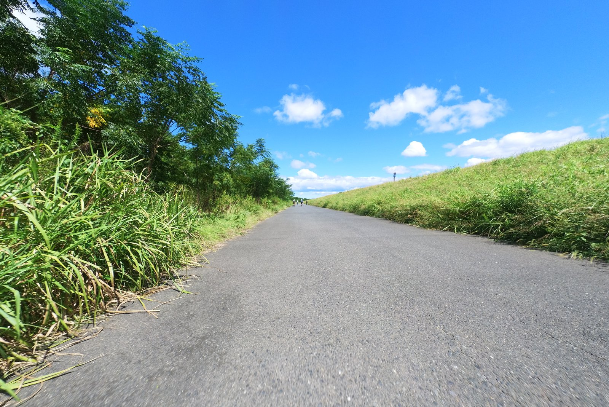
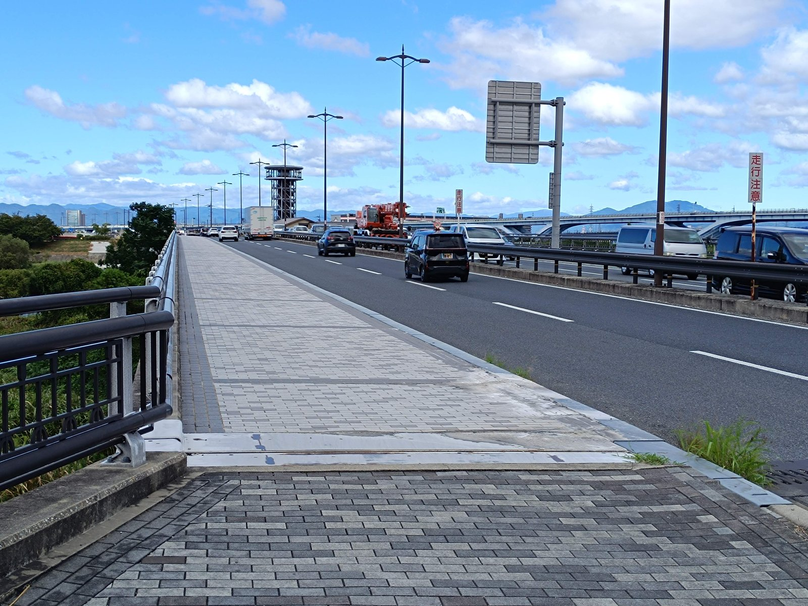

---
categories:
  - 自転車
  - bike
date: "2025-02-15T23:44:25+09:00"
description: 京都府の木津川に流れ橋という観光名所があります。全長356.5メートル、幅3.3メートルの日本最長級の木造の橋で、増水時に橋板をあえて流すように設計された橋を見に淀川から木津川沿いを走るサイクリングコースをご紹介します。
draft: false
images:
  - images/018.jpg
summary: 地獄のような暑さの夏が過ぎ、だいぶ気温も落ち着いてきました。まだ暑いですが秋晴れを感じる休日の朝に自転車で少し遠出をして木津川にかかる名所、流れ橋を見てきました。
tags:
  - サイクリング
  - ポタリング
  - ロードバイク
  - Madone2.1
  - 京都
  - 木津川
  - 流れ橋
title: 木津川の流れ橋を見にサイクリング
---

地獄のような暑さの夏が過ぎ、だいぶ気温も落ち着いてきました。まだ暑いですが秋晴れを感じる休日の朝に自転車で少し遠出をして木津川にかかる名所、流れ橋を見てきました。

## マップ

{{< mbox json="track.json" center="{ \"lng\": 135.646028, \"lat\": 34.828257 }" zoom="10" style="" >}}

鳥飼大橋から淀川左岸を上り、そのまま木津川沿いにずっと川沿いを漕いていきます。流れ橋を見たら帰りは近くの駅、大山崎駅で輪行袋に自転車を詰めて電車で帰りました。

## 鳥飼大橋から淀川左岸を上る

家から自走で淀川まで一番近い鳥飼大橋からスタートです。

木津川に入ることを考えると、左岸（上り方向で川の右側）を走ります。右岸も変わらず走りやすい道ですが、北河内サイクルラインにもなっている左岸を走ることが多いです。今回は堤防の下を走ってみます。

すっきり晴れた青空が広がり、気持ちよく走れます。前日は雨が少し降ったので道が水没していないか心配でしたが問題無かったです。

ところどころに自転車止めの障害物がありますが、信号もなく車もいないフラットな道なので軽快に走れます。自転車に乗っていると気持ちいいですが、写真だと単調ですね。

枚方大橋を越えたところで堤防の上に上がります。

下は淀川河川公園枚方地区の芝が広がっています。以前下の道を進んだらレンガ敷のガタガタ道だったのでここは上に行きました。川のすぐ側にも道があるようなので次はそちらの走ってみたいと思います。

少し進むと天野川にかかる橋があります。

橋を渡ると「淀川リバーサイドサイクルライン」の案内が道にペイントされていました。

あれ、北河内サイクルラインではないの？と思いましたが、万博に向けてさくらであい館から万博会場までの自転車道が整備されており、その一環で路面に新しい案内ができているようです。



すぐ先に下の写真でわかりにくいですが、下に降りる道があり、今回は下の道を走ってみました。淀川沿いはいつも上か下か迷いますね。

自転車日和でたくさんのロードバイクが走っています。抜きつ抜かれつ、すれ違いながら進みます。道が広いので気にせず自分のペースで進めるのがいいですね。

ゴルフ場を右手に走っていくと、建設中の大きな橋脚が現れました。

新名神高速道路の高槻ICから八幡京田辺へ続く道路のようです。もうこんなに進んでいるんですね。完成すれば京都をバイパスして名古屋方面へ出れるので便利になりそうです。

この先、しばらく進み3つの川が合流して淀川となる地点で一旦河原から上がります。左手の橋の向こうにさくらであい館の塔が見えますが、寄らずに写真右手の信号を渡り木津川に入っていきます。

## 木津川沿い

木津川沿いは、道の状態も良く人も少なくなり、淀川沿いにある自転車止めの障害物も無いのでスピードを上げて快適にスピードを上げて進めます。目の前の鉄橋のような構造物は大阪ガスのパイプラインのようです。

自転車で走るには最高の道で、どんどん進んでいきます。気分は最高ですが、写真は単調ですね。。。

あっという間に今回の目的地、流れ橋が見えてきました。低い橋なので遠目からはわかりにくいですが、黒く見える小さな橋がそれです。

流れ橋の前に着きました。自転車スタンドやベンチのあるちょっとした広場があり、休憩ができます。

## 流れ橋

広場から、茶畑の向こうにかかる流れ橋の風景を一望できます。

もう少し望遠で写真を撮りたかったのですが、スマホとアクションカメラしか持ってきていなかったのでちょっといまいちな写真になってしまいました。

下に降りて流れ橋の入口まで来ました。柵も無く、木でできた橋の光景は昔にタイムスリップしたような気分になれます。自転車に乗って渡るのは禁止と看板があったので歩いて渡りましょう。

素晴らしい景色です。せっかくなので自転車を立て、写真をパシャリ。風があり自転車が倒れて橋の下に落ちていかないかヒヤヒヤしながら撮りました。川に水がなく、砂漠のようになっていますが、反対側（右岸）に水の流れがあります。

自転車を押しながらトボトボ歩いて橋を渡ります。川が増水すると橋桁が浮いて流され、橋全体の崩壊を防ぐとのこと。左右にワイヤーが通してあるのが見えますが、流れたあとは、ワイヤーを引き上げて復旧するみたいです。これまで23回も流されているのだとか。

奥まで行くと川の流れがあります。結構人が来ていますが、歩いて来る場合どうやってここまでくるのでしょうか？

橋の反対側に着きました。これで今日のメインイベントは終了、あとは帰るだけです。

帰りは木津川右岸を走ります。右岸は京阪電車の鉄橋が交差するところで踏切があります。

自転車専用道路の踏切は、南河内サイクルラインにもありましたが珍しいですよね。渡る途中で意味もなく写真を撮ってしまいます。

さくらであい館に着きました。自動販売機でドリンクを買って飲んだら近くの駅、阪急大山崎駅に向かいます。

大山崎駅へ行くため、一番北の桂川を渡ります。3つの川があってどこから橋に上がるか、下りるかいつも迷ってしまいます。

## 輪行で帰宅

ここからは河原ではなく、国道171号を走ったほうが近いかなと思い、国道を走りましたが車がビュンビュン来るので怖く、失敗でした。

大山崎駅に着きました。これにて今回の旅は終了です。

帰りは自転車を輪行バッグに詰めて楽ちんです。これを覚えてしまうと自走で戻れなくなりますね。ただ、最寄りの駅から家までまた自転車を出して組み立てるのが大変です。

