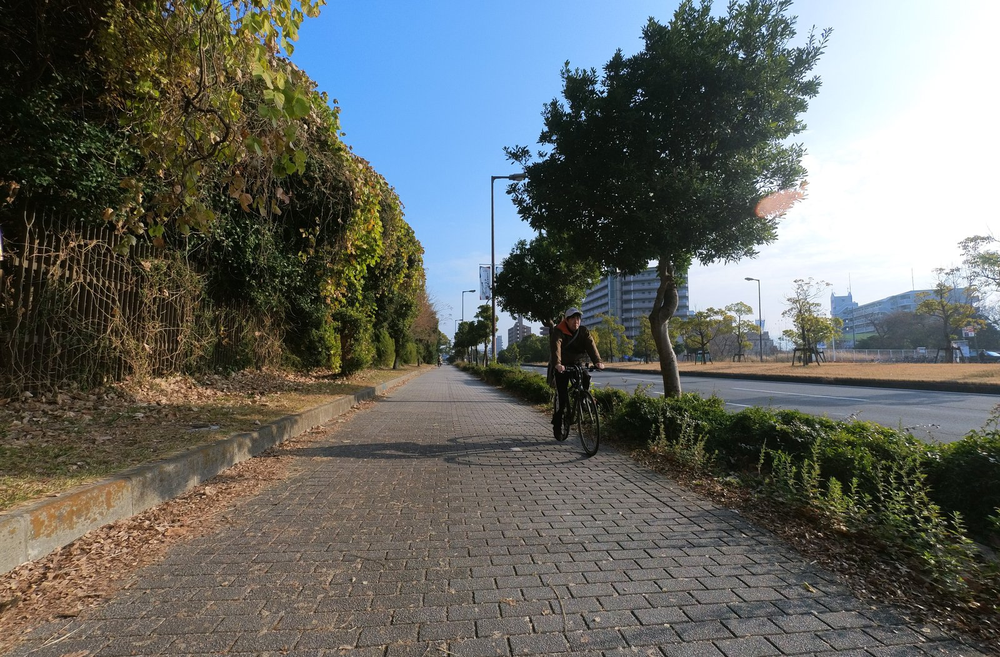
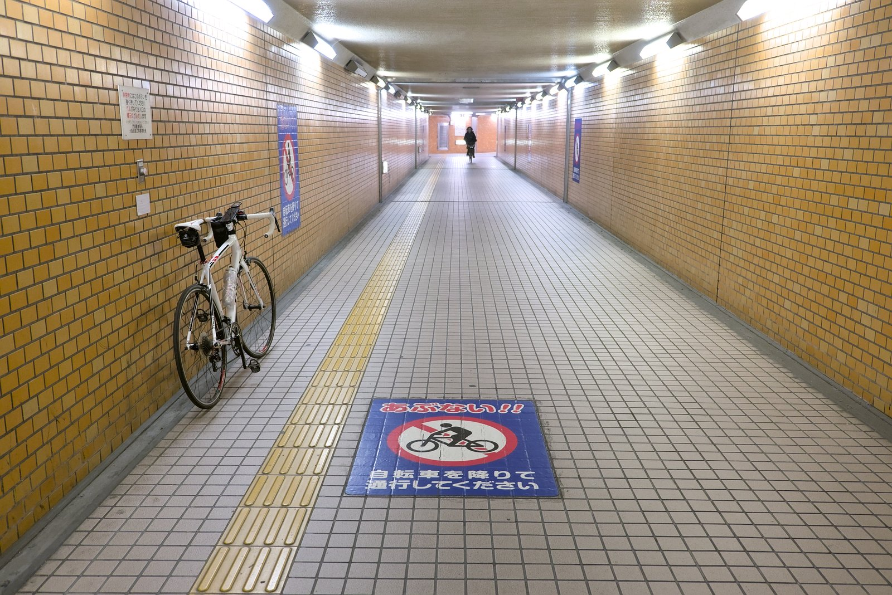
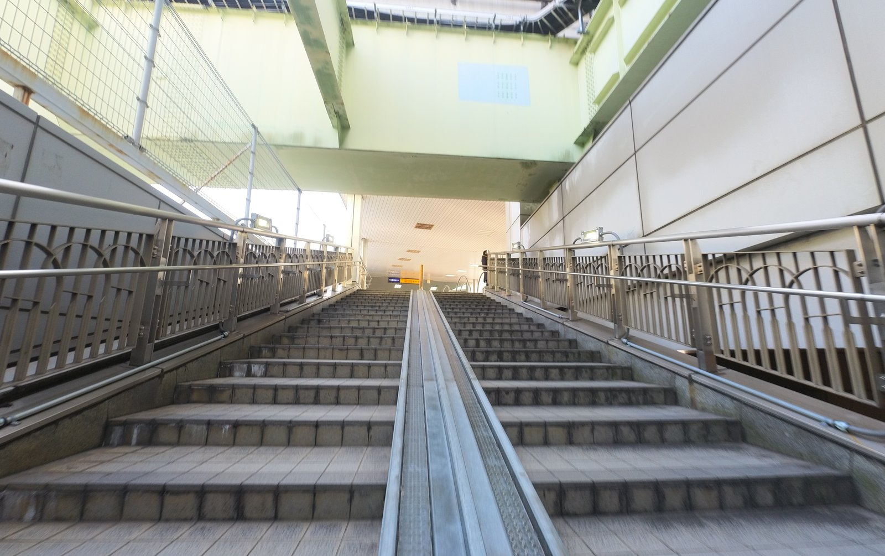
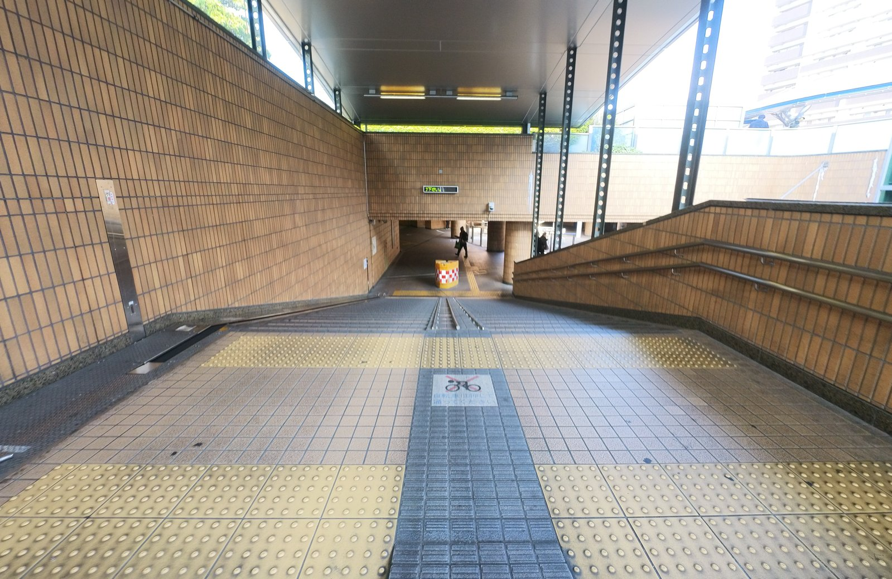
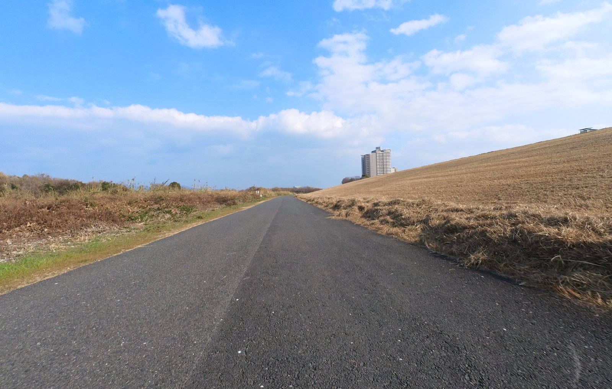
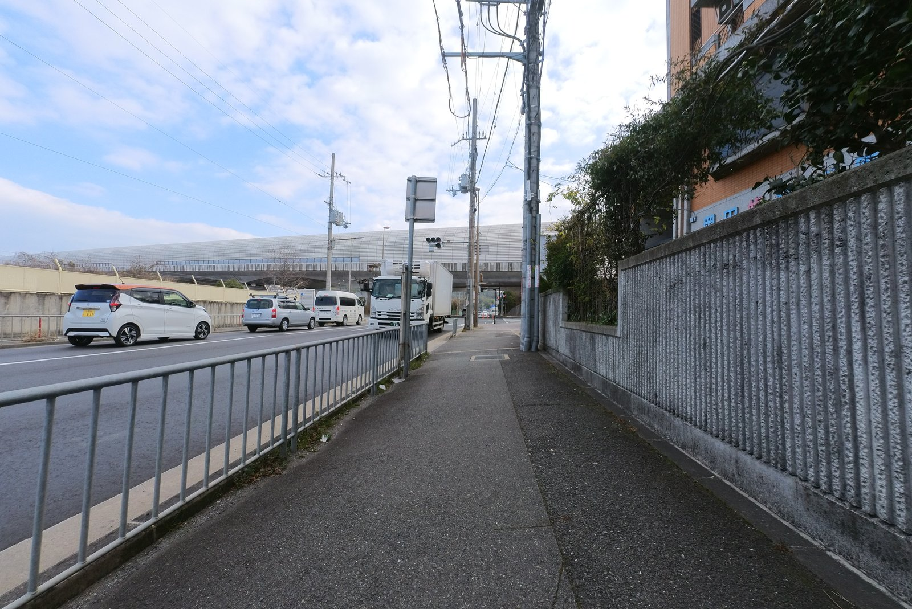
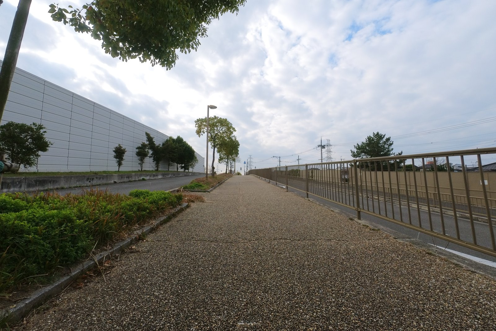
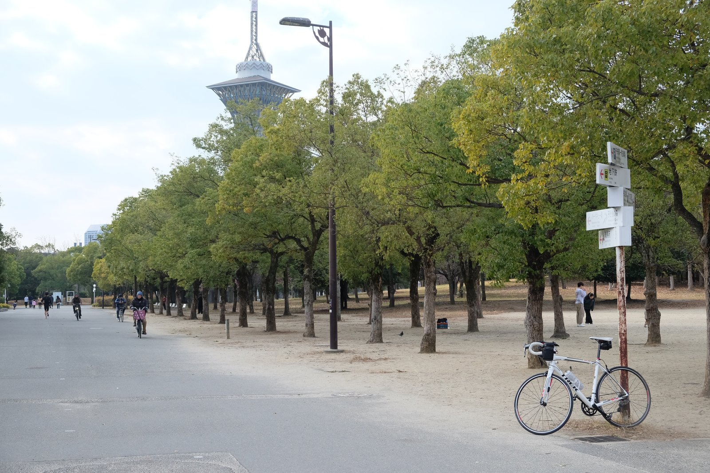

---
categories:
  - 自転車
  - bike
date: "2025-02-15T23:44:21+09:00"
description: 大阪府の大規模自転車道の一つ、北河内サイクルラインのコースをご紹介します。鶴見緑地を起点にして大阪中央環状線→淀川左岸→穂谷川→第二京阪道路と一周する45.5kmのサイクリングロードを実際に走った感想を写真付きでレポートします。
draft: false
images:
  - images/0037-1.jpg
summary: 大阪府の大規模自転車道の一つ、北河内サイクルラインを走ってみました。鶴見緑地を起点にして大阪中央環状線→淀川左岸→穂谷川→第二京阪道路と一周する45.5kmのサイクリングロードです。
tags:
  - サイクリング
  - ポタリング
  - ロードバイク
  - Madone2.1
  - 大阪
  - 北河内サイクルライン
  - 自転車道
title: 北河内サイクルライン
---

大阪府の大規模自転車道の一つ、北河内サイクルラインを走ってみました。

## 北河内サイクルライン概要

北河内サイクルラインは、鶴見緑地を起点にして大阪中央環状線→淀川左岸→穂谷川→第二京阪道路と一周する45.5kmのサイクリングロードです。

* [南河内サイクルライン](/bike/mbox/madone21-minamikawachi-cycle-line)
* [北大阪サイクルライン](/bike/mbox/madone21-kitaosaka-cycle-line)
* [なにわ自転車道](/bike/mbox/madone21-naniwa-cycle-line)

などと合わせ大阪を代表する？自転車道です。

## コース

{{< mbox json="track.json" center="{ \"lng\": 135.641885, \"lat\": 34.777 }" zoom="10" style="" >}}

鶴見緑地からスタートし、大阪中央環状線、門真JCTから高速道路の高架下を淀川まで北上します。淀川左岸を上流に向かい進み、穂谷川に出会ったところで右折して穂谷川沿いを南東へ走ります。第二京阪道路の高架下を進み鶴見緑地へ戻ります。途中に深北緑地へ分岐する道も南河内サイクルラインの一部になっていますが、あまり意味は無さそうなのでパスしました。

サイクルラインとはいっても、自転車専用道路が続くわけではなく、大阪中央環状線沿いは普通の車道か歩道を走り、第二京阪道路沿いは自転車専用道路らしき線が引かれていたりしますが実態は幅広の歩道といった感じで信号も多く、ストレス無くスイスイ走れるのは淀川左岸と穂谷川沿いの一部くらいになります。

## 鶴見緑地からスタート

寒い冬はなかなか自転車を乗る気が起こりませんが、今年の冬は暖かいこともあり天気の良い日の朝、鶴見緑地に車を停めてサイクリングスタートです。

鶴見緑地の中央口から道路へ出ます。

花博通の車道は広いのですが、車も飛ばしているため歩道側を走ります。うっすら白線もあるのでこちらが正規ルートでしょうか？

 

ほどなく門真JCT高架下の交差点に着きます。ここを左折します。

## 近畿自動車道下、門真から守口まで

門真ICからしばらく高速道路沿いを北へ進んでいきます。ここも車が多いので歩道を走ったり車道に出たりで走っていきました。いちおう赤いラインが自転車道ということでしょうか？？

この道はサイクルラインと言いつつもなかなかのクセモノです。まずは松尾町の交差点です。この交差点は、車道で直進する道は高架になっており、自転車通行不可です。下の道は強制的に左折させられるので直進できません。歩道はというと、横断歩道もありません。

マップ

いうことで、地下に入る必要があります。こんな入口になってます。

自転車は降りて押して歩く必要があります。

しかも結構長く、出口が4箇所あるので方向感覚がわからなくなり違った出口に出てしまったりします。

歩きにくいクリートを付けた靴でなんとかこれを渡ると、次の障害物は門真市駅です。ここも車は高架で直進ですが、自転車は下道を進みます。

駅の下に着きました。さて、どうする？

こんどは階段を上に上がります。

駅の改札前を通ります。結構人が多いのでロードバイク乗りの格好が恥ずかしいです。。。

階段を降り、さらに北へ進みます。ここから車道の右側を走っていきました。

サイクルラインの道は、いちおう自転車に配慮したかのような雰囲気ですが、細い道路と交差したり信号があったりとあまり走りやすい道ではありません。

上にモノレールを見ながら走っていると大日あたりまで来ました。

大日駅も直進できず地下に潜ります。

 

大日駅を越えると、淀川までもうすぐです。

淀川の土手が見えてきました。

ここから淀川沿いに入ります。

淀川入口に北河内サイクルラインの看板がありました。ここまではサイクルライン感があまり無い道でしたが、これを見ると北河内サイクルラインを走っている実感が出ますね。

頭上のモノレールは淀川を渡っていきます。

## 淀川左岸に入り穂谷川まで

少し休憩をしたあと、淀川に入ります。

淀川沿いはたまに自転車止めがあるものの快適に速度を上げて走ることができます。

代わり映えのしない景色ですが、視界が開け気持ちいいです。

土手上を走っていきましたが、淀川新橋は土手上を直進できないので下へ降ります。

 

広い道を進みます。下の道は雨上がりだと水溜りがあったりして大変ですが、今日はそういうこともなく、どんどん進みます。

枚方大橋を越えたあたりでいつもはここを土手上に上がるのですが、今回は下を進んでみました。

そうしたらレンガの道になっており、自転車で通るには向いていません。素直に上を進むべきでした。

そしてその先はなんと砂利道。完全に失敗です。

ここで上に上がります。

穂谷川までもうすぐです。

この先で穂谷川に合流し、川沿いに右折します。

## 穂谷川沿い

細い川沿いの道を牧野駅まで進みます。

牧野駅です。

ここからさらに穂谷川沿いを進みますが、自転車道らしくなり走りやすい道になります。

途中、右手にちょっとしたお花畑があり冬でも花が咲いていたので少し休憩しながら鑑賞します。

この道もすぐに国道1号に突き当たり終わりです。

国道1号を渡った先は細い車道で車も通るのでいまいち走りにくく、サイクルライン沿いの山田池公園に入ってみました。山田池にカモなのか、水鳥がたくさんいました。

山田池公園から出て北河内サイクルラインに戻ります。

この道も、車道は細くて車が多く危ないので歩道を走ったり車道を走ったりしながら進みます。歩道は広いのですがやはりロードバイクの細いタイヤではガタガタして走るのが辛いです。あとで気づきましたが穂谷川の反対側には自転車道があったみたいです。どうりで走りにくいわけです。

藤阪駅が見えてきました。

坂を登りながら穂谷川を越えて、第二京阪道路の方に行きます。

ここを上に登るのが正解ですが、はじめ間違って左に行ってしまいました。といっても、この道自体がサイクルラインから外れており、北河内サイクルラインは一つ右に並走する自転車専用道路があったみたいです。

ともかく、穂谷川沿いから外れ、第二京阪道路に向かいます。

ここでローソンを発見。淀川沿い、穂谷川沿いと川沿いの道は走りやすいのですがコンビニが少なく、ちょうどここでお昼時になっていたのでパンとジュースを買って補給です。

ローソンからすぐに第二京阪道路が見えます。

第二京阪道路に着いたところで立派な自転車道らしき入口があり、看板まであります。自転車と歩道の境界線も引いてあるし、期待できそうです！

鶴見緑地からだいぶ来ました。あとはまっすぐ進むだけです。

## 第二京阪道路下

「立派な自転車道」の期待はすぐに裏切られることになります。しっかり自転車が走れる道があるのですが、路面がなんというか、「ザリザリ」です。

おそらく舗装直後はとても良い感じだったのでしょうが、この黄色い舗装の材質は表面の小石が剥がれやすいようでザラザラ、ブツブツになっており、走るとなんか「ザリザリ」した感触で抵抗がありひび割れ、うねりも相まってスピードが出ず疲れます。

交差点も多く、少し走っては止まったりの繰り返しです。

ザリザリしながら進みます。体力も削られていきます。

途中で踏切を渡り、学研都市線の線路を越えます。

北河内サイクルラインは、第二京阪道路の左右に二本並走しており、今回は右側を走りました。ここともう一箇所線路を越える場所がありましたが左側の道はスロープで上に上がり越える形になっており、左側の道の方が走りやすかったかもしれません。

相変わらずザリザリの道に悩まされていましたが、ところどころ舗装が新しい場所があり、舗装が新しいと路面抵抗が少なくとても走りやすくなります。北河内サイクルラインが整備された当初は全部こういう道だったのでしょう。

もう一箇所、線路超えです。この先は行き止まりです。

どうしたものか、と思うと左手に陸橋に上がる階段がありました。

あとは門真JCTを目指し進むのみ。左は高速道路の高架、右は住宅と全くみどころがありません。

また新しい舗装です。ラッキー。

と思ったら一瞬でザリザリ。

門真JCTに近づいてきました。

ここでザリザリの道も終了です。

門真JCT下の交差点は自転車では越えられないので陸橋を渡ることになります。

上の高速道路が近いです！

あとは最初に通った道を走り鶴見緑地へ戻るだけです。

鶴見緑地に着きました。

微妙なキャベツみたいな花の咲いた花壇でゴールです。

45.5kmとはいえ、自転車に乗れていないので終盤は体にこたえました。

## まとめ

北河内サイクルラインは、淀川沿いの道を除くと走りやすいわけでもなく、見どころがあるわけでもなく、自転車道としては微妙です。鶴見緑地、深北緑地に車を停めることができ、一周するのでスタート地点に戻ってくるため車に自転車を載せて行くには便利だと思います。南河内サイクルラインの方が走っていて楽しいと思いました。
