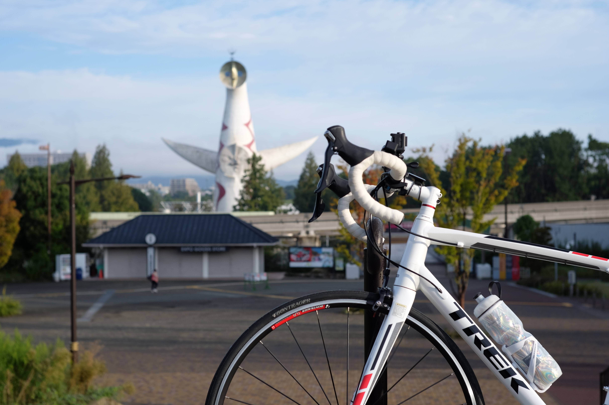

---
categories:
  - 自転車
  - bike
date: "2025-02-15T23:42:56+09:00"
draft: false
images: 
  - images/DSCF0485.JPG
summary: 大阪の自転車道の中で、大阪市役所前から万博記念公園まで、北摂地区を南北につなぐ北大阪サイクルラインを走ってみました。
tags:
  - Madone2.1
  - サイクリング
  - ポタリング
  - ロードバイク
  - 自転車道
  - 大阪
title: 北大阪サイクルライン
---

最近またロードバイクに乗り始めたので大阪の自転車道について調べています。ネット情報では、

-   北河内サイクルライン
-   南河内サイクルライン
-   なにわ自転車道
-   北大阪サイクルライン

あたりがよく出てきます。北河内サイクルラインは前回その一部を走ったので、今回は北大阪サイクルラインを走ってみることにします。

コースは一般的にネットで紹介されている、大阪市役所前から万博記念公園へ向かう方向とは逆の、万博記念公園をスタートとして走ってみました。単純に、そちらのほうが家から近いためです。

## コース

{{< mbox json="track1.json" center="{ \"lng\": \"135.54\", \"lat\": \"34.75\" }" zoom="10.5" >}}

## 万博記念公園からスタート

ブログなどのネット情報では万博記念公園の太陽の塔を写した写真が大きく出て「ゴールです」みたいな感じで終わっていますが今回は万博記念公園からスタートします。早速、太陽の塔と自転車のツーショット写真を撮ろうと思い立ちますがそもそも万博記念公園内は自転車進入禁止で北大阪サイクルラインの出発点もどこだか良くわかりません。

下の地図に赤線で描いたように万博記念公園の周りをぐるっと自転車道があります。しかし中央の太陽の塔からは遠いので基本、見えません。

{{< mbox json="track2.json" center="{ \"lng\": \"135.53241\", \"lat\": \"34.80952\" }" zoom="13" >}}

とりあえず万博記念公園の太陽の塔前入り口付近まで行ってみて適当なところで太陽の塔と記念写真をパチリ。なんかもうゴール感が出てしまっています。ちなみにここは階段の道です。

万博記念公園周回道路に降りてとりあえずスタートです。

## モノレール下を進む

周回道路の公園東口駅手前から右へ曲がりモノレール下の道路へ下ります。

モノレール下の道路はあまり走りやすい道とは言えません。こんなふうに自転車道がひかれている場所もありますが、基本普通の車道です。

車道は交通量が多く、たくさんトラックに追い越されながら進みます。歩道はロードバイクが走れるような道ではありません。

しかも、幾度もこんな歩道橋みたいなところを渡らされます。

事前に走りにくい道だとは調べていまいたが、そのとおりで自転車用の道というよりは車道と歩道をつないで何とか走れる道でした。

## 鳥飼大橋を渡り淀川右岸

スピードが上げられず思うように進みませんが、淀川までたどり着きました。鳥飼大橋を渡ります。

橋を渡り淀川左岸を進みます。度々現れる自転車止めが邪魔ですが、ようやくサイクリングロードらしくなってきました。

毛馬閘門に到着です。今日は門が上がっていたので念願の「毛馬閘門と自転車」写真を撮ることができました。

## 大川沿いに大阪市役所まで

毛馬閘門ら左へ折れ、大川沿いを進みます。水面が地面に近いです。

大阪ふれあいの水辺(桜ノ宮ビーチ)です。ビーチバレーの練習をしている人たちがいました。

川沿いは橋の下をくぐる際に水たまりがあることを除いてはそれなりに快適な道ですがロードバイクで走るよりミニベロや折りたたみ自転車とかでゆっくり気持ちよく走るのに適した道です。

途中に特筆すべきランドマークもなくアクションカメラの電池も切れてしまい、大阪市役所前に到着してゴールです。

## 総評

万博記念公園から淀川までは自転車で走りやすい道とは言えません。淀川沿い、大川沿いはそれなりに走りやすいですが歩行者も多いためのんびりと走るイメージが合っているかと思います。あまりランドマークは無いので大阪城に寄り道してみたら良かったかもしれません。
