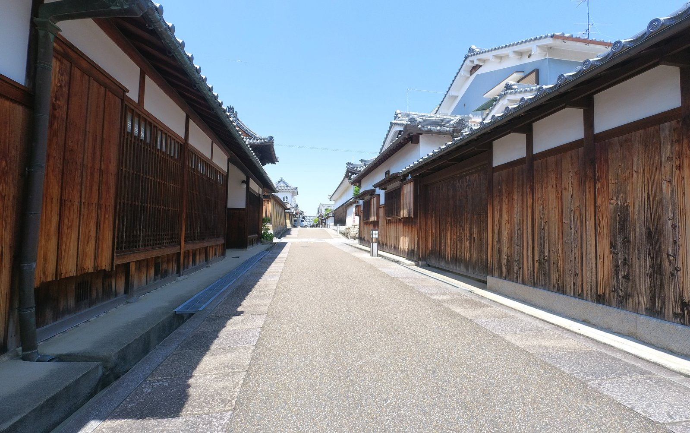
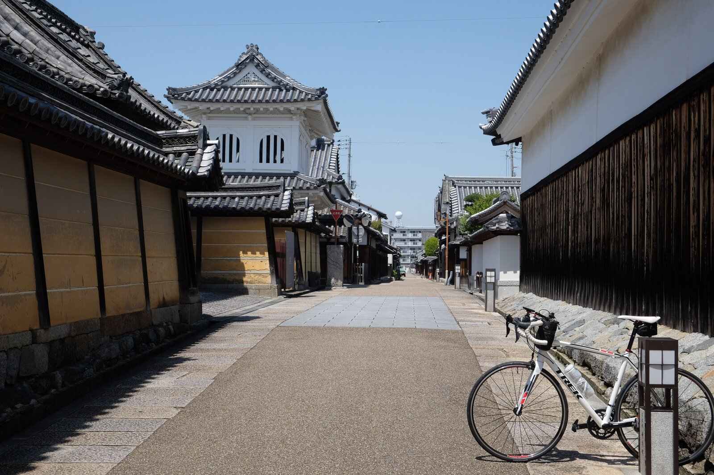
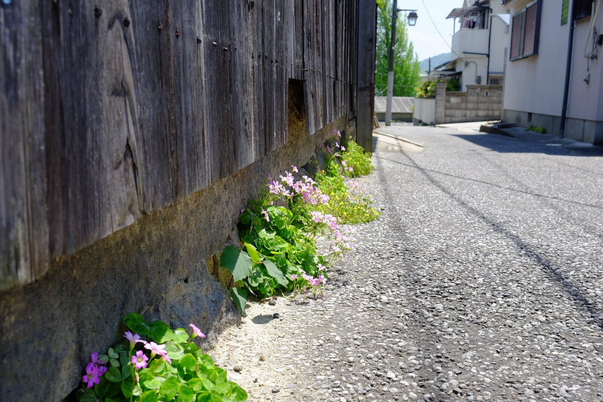
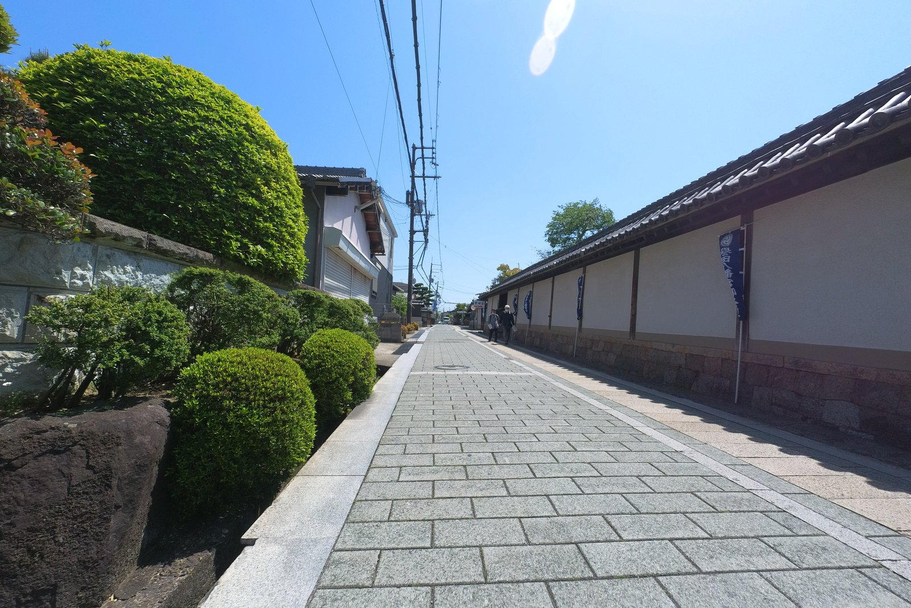

---
categories:
  - 自転車
  - bike
date: "2025-02-15T23:44:08+09:00"
description: 南河内サイクルラインのを終点から始点まで、昔の町並みが残る富田林寺内町や誉田御廟山古墳をはじめとした古市古墳群など、観光名所を寄り道しながら走るポタリングコースをご紹介します。
draft: false
images:
  - images/0041.jpg
summary: 南河内サイクルラインの帰り道を終点から始点まで、昔の町並みが残る富田林寺内町や誉田御廟山古墳をはじめとした古市古墳群など、観光名所を寄り道しながら走りました。
tags:
  - サイクリング
  - ポタリング
  - ロードバイク
  - Madone2.1
  - 大阪
  - 南河内サイクルライン
  - 自転車道
  - 寺内町
  - 古墳
title: 南河内サイクルライン 復路に寺内町と古市古墳群観光
---

大阪府の自転車道、南河内サイクルラインをスタート地点の大正橋から終点まで走りました。帰りは同じ道を戻るのもアレなので昔の町並みが残る富田林寺内町や誉田御廟山古墳をはじめとした古市古墳群など、観光名所がいくつかあるので寄り道しながら大正橋へ戻ります。

## コース

{{< mbox json="track.json" center="{ \"lng\": 135.597226, \"lat\": 34.522955 }" zoom="10" style="" >}}

南河内サイクルラインの終点、国道170号と国道310号の交差点からスタートします。南河内サイクルラインは国道309号との交差点で右折し、石川を渡り川沿いの道に入っていくのですが、この交差点をまっすぐ通過してから細い道を右へ、富田林寺内町に入ります。

寺内町を抜けたら金剛大橋を渡りまた南河内サイクルラインへ戻り終盤まで走り、西名阪自動車道と出会うあたりで西へ出て古市古墳群の古墳をいくつか巡ったあと、南河内サイクルラインの始点まで戻ります。

## 南河内サイクルライン終点から寺内町へ

前回の記事で南河内サイクルラインの始点、大正橋から終点まで走った記録を書きました。帰りは同じ道を戻るのも面白くないかと思い、富田林寺内町という古い町並みが残る観光名所があるようなのでそちらに向かいます。

特に見どころもない国道170号を北へひたすら走ります。南河内サイクルラインは途中で左折し国道309号へ進みますが、そのまま北へ進み、府立河南高校あたりを右に折れ、細い道を進んでいくと趣のある町並みが現れました。ここのあたりから寺内町です。

重要文化財の旧杉山家住宅です。中は一般公開されていて入れるようですが、GWのためか閉まっていました。

ノスタルジックな町を見ながら進んできます。

左手に町の中でひときわ高い建物、鐘楼と鼓楼がある富田林興正寺別院のある通りです。富田林寺内町は、この富田林興正寺別院を中核として作られた町です。

入口の立派な山門は伏見桃山城の城門を移築したものだと言われています。

他にもいくつか見どころがあるようですが、事前知識があまりなかったので古い町並みに満足し寺内町を出て先に進みます。

大阪にこんな時代劇のような町並みが残っているなんて知りませんでした。

## 南河内サイクルラインを戻る

寺内町から東へ出るとすぐに金剛大橋に着きます。南河内サイクルラインはこの橋の向こう側、石川左岸にあるので橋を渡ります。

橋を渡り左折し、車道から南河内サイクルラインへの入口を伺っていると、柵が途切れ歩道に入れる場所がありました。ここから川へ降りることができます。

帰りも石川サイクル橋を渡ることができました。この場所はやはり、外せないですね。

石川サイクル橋からほどなく北、鴨井堰あたりにサイクルスタンドとテーブルがあるちょっとしたいい感じの広場がありました。行きは気付きませんでしたがせっかくなので自転車を掛けて少し休憩です。

鴨井堰越しに見えるのは大和葛城山(左)と金剛山(右)でしょうか。

このあとはひたすら南河内サイクルラインを戻ります。一気に石川沿いの終わりあたり、西名阪自動車道の手前にさしかかると、こんもりとした山が見えてきます。古市古墳群の一番大きな古墳、誉田御廟山古墳
(応神天皇陵)です。

## 古市古墳群巡り

南河内サイクルラインから西へ出て誉田御廟山古墳を目指します。右奥の山ですが、周りが平地なので目的地が良く見えるので迷いません。

古墳の手前でまた雰囲気の良い道が出てきたと思ったら右に誉田八幡宮という神社がありました。

多くの人で賑わっていました。後ろの森は誉田御廟山古墳 (応神天皇陵)
で、応神天皇を主祭神とする神社みたいです。多くの人で賑わっていました。

誉田御廟山古墳の南側から来ましたが、古墳そのものは北側に入口(？)があるので、ここから細い道をごちゃごちゃ迷いながら進んでいきました。

関係者以外通行禁止の農道に阻まれたり、未舗装の道に出てしまったりしながら結局国道170号まで出てしまったので、はじめから国道170号を進めばよかったです。

なんとか入口に着きました！宮内庁の管理する古墳の入口はいつもこんな感じですね。

前方後円墳の、前方、四角形部分の端部から古墳を見る位置に鳥居が立っています。

そして、古墳あるあるですが誰一人として人がいません。まあ、これだけしかありませんし、下から見ても古墳の形は分かりませんから。

古墳入口の道路反対側の広場に自転車を停めていましたが、これも大鳥塚古墳という古墳みたいです。

そしてすぐ北には古室山古墳。ここはなんと入ることができます。てっぺんまで登ってみたいですが、クリートを付けた足では面倒なので今回は見るだけにします。ここも、誰もいません。

古室山古墳のすぐ北に仲津山古墳です。応神天皇の皇后、仲姫命の陵とされています。誉田御廟山古墳のように管理されています。ここでついに私以外に古墳に来ている人を見つけました。

いつもの古墳正面写真です。誉田御廟山古墳より小ぶりですが同じパターンです。

## 南河内サイクルライン始点に到着

このあたりは古市古墳群といって古墳だらけなのですが、お腹いっぱいになったので南河内サイクルラインに戻りましょう。大和川沿いに出て南河内サイクルラインの始点を目指しラストスパートです。

大正橋の始点に戻り今回のサイクリングは終了です。

サイクリングにランニングとたくさんの人が次々と通過してきます。走っても楽しく、途中で寄り道して観光しても良く、大阪でイチオシの自転車道でした。

## まとめ

南河内サイクルラインは、（終点付近の国道以外は）よく整備され景色も良いので走って楽しい自転車道です。自転車道から少し外れても見どころがあり、特に富田林寺内町や古市古墳群は一見の価値あるのでぜひ立ち寄ってみることをおすすめします。
