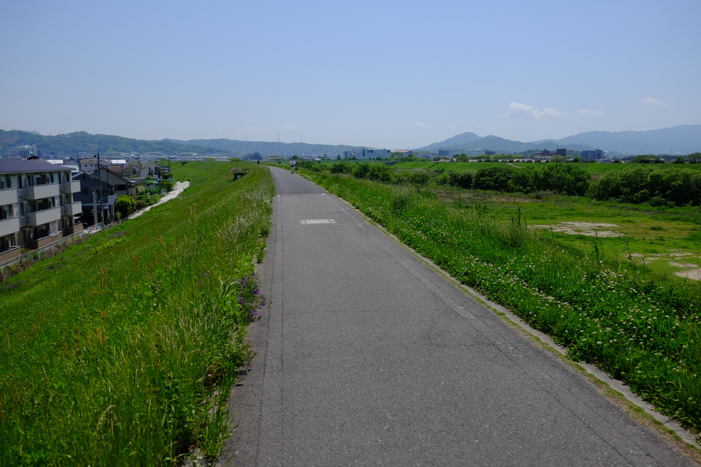
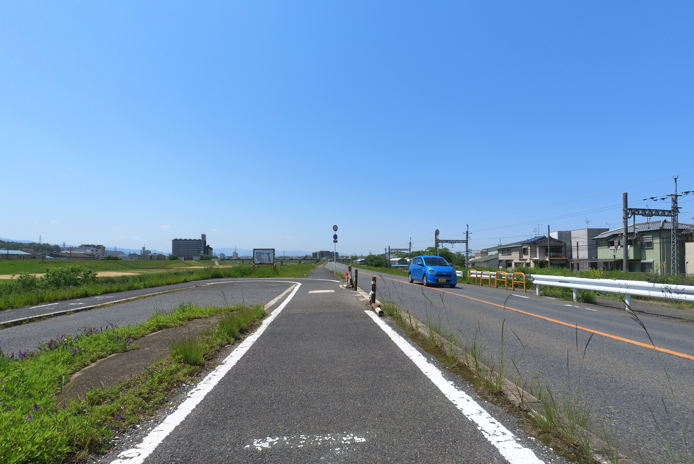
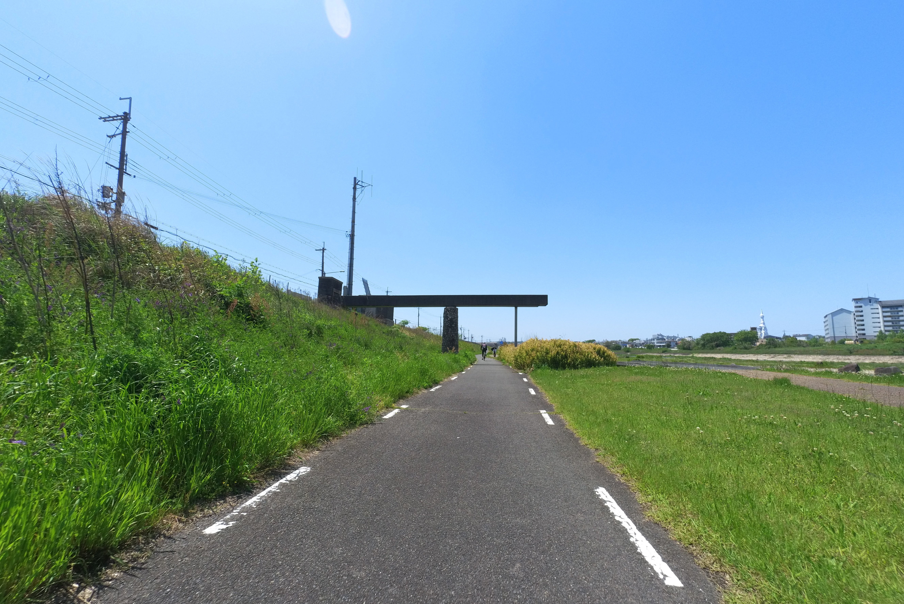
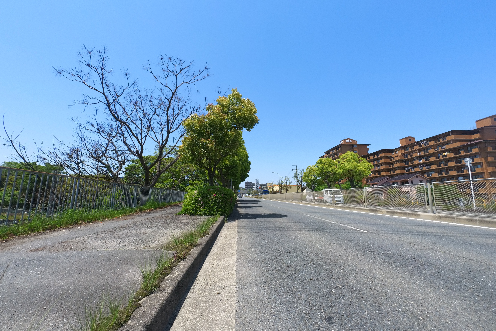
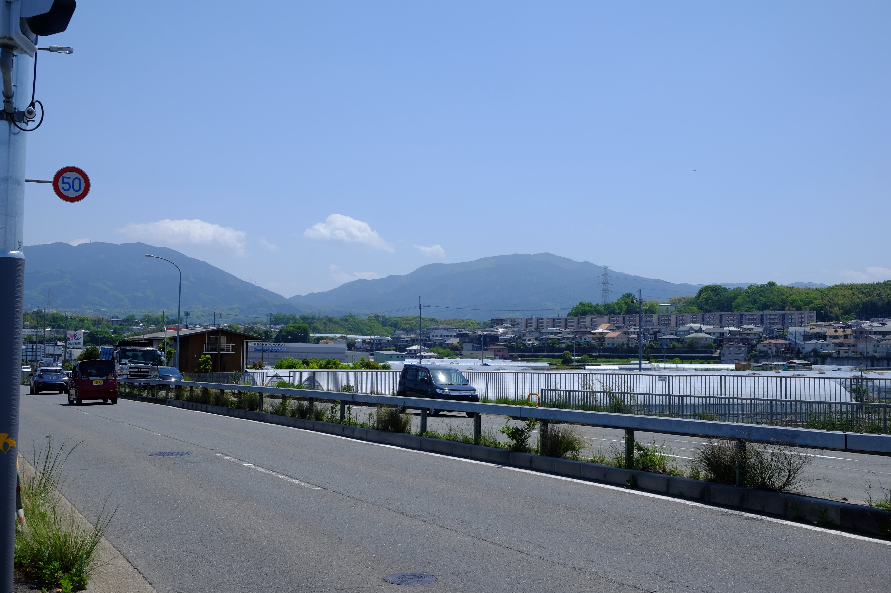
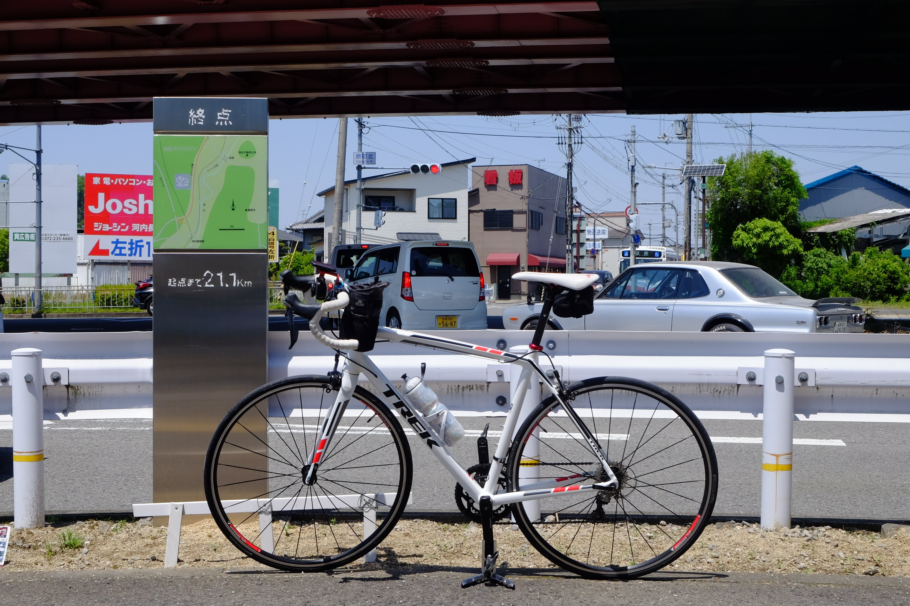

---
categories:
  - 自転車
  - bike
date: "2025-02-15T23:44:06+09:00"
description: 大阪府の大規模自転車道、南河内サイクルラインをご紹介。始点、終点にめぼしいシンボル的なものが無いのですが、川沿いの道は気持ちよく走れ、道もよく整備され走りやすい道です。石川サイクル橋など見どころもあるので飽きずに走れます。
draft: false
images:
  - images/0015-1.jpg
summary: 大阪府の大規模自転車道、南河内サイクルラインを走ってみました。始点、終点にめぼしいシンボル的なものが無いのですが、川沿いの道は気持ちよく走れ、道もよく整備され走りやすい道でした。石川サイクル橋など見どころもあるので飽きずに走れます。
tags:
  - サイクリング
  - ポタリング
  - ロードバイク
  - Madone2.1
  - 大阪
  - 南河内サイクルライン
  - 自転車道
title: 南河内サイクルライン 往路
---

大阪府の大規模自転車道、南河内サイクルラインを走ってみました。

## 南河内サイクルラインとは

南河内サイクルラインとは、大阪府が整備した大規模自転車道の一つです。大阪府や大阪市が指定する自転車道として他に有名なものは、

-   北河内サイクルライン
-   北大阪サイクルライン
-   なにわ自転車道

などがあります。

北大阪サイクルラインやなにわ自転車道は走ったことがあり、北河内サイクルラインも淀川沿いの部分はよく走るのですが、南河内サイクルラインは家から遠いこともありこれまで走ったことがありませんでした。

全長 21.1km
と距離はそれほど長くありませんし、後半は車道(国道)を走るというのがいまいちな気がしますが、GW
の気持ち良い春の晴れ日に走ってみることにしました。

## コース

{{< mbox json="track.json" center="{ \"lng\": 135.597226, \"lat\": 34.522955 }" zoom="10" style="" >}}

南河内サイクルラインの始点は、大和川にかかる大正橋という橋からスタートします。地図で見るといかにも中途半端な位置なのですが、今後河口まで自転車道を繋げる計画があるようです。

大正橋から大和川を右手に見ながら上流側へ進み、石川と合流地点でこんどは石川を上流へ向かっていきます。南河内サイクルラインのシンボル的な存在である石川サイクル橋まで気持ちよく川沿いを走る自転車道が続きます。

石川サイクル橋を越えて間もなく車道に上がり、そこからは交通量の多い国道170号を車と並走しながら鬼のように漕いだら何の変哲も無い高架下の交差点でゴールです。

## アクセス

スタート地点の大正橋はなかなかアクセスしにくい場所です。車であれば近くのコインパーキングを探しましょう。大和川沿いで近くに1箇所小さなパーキングがあるのですが、満車でした。輪行の場合は地下鉄谷町線の終点、八尾南駅か、近鉄南大阪線の藤井寺駅が近いです。

## 大正橋からスタート

コインパーキングを探して少し時間がかかりましたが、無事大正橋まで辿り着け、スタートです。

地面には南河内サイクルラインの別名、八尾河内長野自転車道の起点と書かれています。

案内板等がほぼ何もない北大阪サイクルラインと違い、案内図まであるじゃないですか、と思ったら真っ白に消えた看板でした😶

この時期の晴れの日はまさにサイクリング日和りです。爽快に自転車を漕いて進みます。

川沿いには紫色の小さな花がたくさん咲いています。

あとで調べてみるとクサフジというマメ科の植物みたいです。

途中にある2箇所の橋で車道を横断しますが、とても走りやすい道です。

左前方には生駒山が見えています。

地面にスタート地点からの距離が表示されています。

前に線路を走る電車が見えてきました。

なんと踏切です。

自転車道に踏切なんて珍しいですね。

踏切のすぐ左手には柏原南口駅があります。ちょうど電車が出発したところでした。単線でうまく電車に出会えたのは運がよかったのかも。

## 新大和橋を渡り石川沿いを走る

線路を越えるとすぐ先に橋が見えます。この新大和橋を渡ります。

自転車、歩行者専用の橋があるのが南河内サイクルラインの特徴でしょうか。

大和橋から大和川上流の眺めです。

新大和橋を越えたあたりが大和川と石川の合流地点で、右へカーブしながら石川沿いに入っていきます。

石川沿いにくると、Uターンをするように川の傍へ降りていく道になっています。

Uターンのところに案内図がありました。こちらはまだ消えていません！だいぶ大雑把な地図ですね。

下へ降りていきます。

下に降りると川が近くなります。

そしてまた川からやや高いところへ遠ざかり、、、

またヘアピンカーブで川まで下ります。

そんな感じで川に近づいたり離れたりしながらスイスイ進みます。淀川沿いのような通るのに苦労する自転車止めが無い（数カ所ありますが自転車を降りなくても通過できるようなもの）ため、とても走りやすい道です。

石川沿いの道には、いたるところにトイレがあります。長距離サイクリングで意外と困るのがトイレですが、南河内サイクルラインにはたくさんトイレがあります。

## 南河内サイクルラインのシンボル、石川サイクル橋

大きな橋が見えてきました。これが西河内サイクルラインのシンボル、石川サイクル橋です。

ネットで南河内サイクルラインを検索すると必ず出てくるこの橋の写真ですが、写真より実物は大きく感じます。自転車道でこれだけ長く立派な橋はなかなか無いと思います。

橋を渡っていきます。

橋から見た上流側、これから進む方向です。

橋を渡ると目指す上流は右手なのですが、左に曲がり、坂を下りながらUターンで川に降りて上流への道が続きます。ここは気をつけないと右へ間違えて行ってしまいそうなところです。

渡ってきた橋です。

GWだったので河川敷の広場に鯉のぼりがたくさん泳いでいました。思わず停車し写真をパチリ。

さらに川沿いを進みます。

## 突然車道に出る

石川サイクル橋からほどなく、突如として川沿いの道は終わり、車道へ上がります。

車道に出ると目の前にある川西大橋を右折し、国道309号を西へ走り国道170号を目指します。

## 最後はひたすら国道を走る

河川敷の気持ちの良いサイクリングから一気に雰囲気が変わり、国道を車に追い越されながらストイックに走ります。

国道170号に出ました。

ひたすら走り、、、

結構長い坂もあります。川沿いは高低差があまり無かったのでここが一番きつい登りでした。

南河内サイクルラインの終点は、国道310号との交差点にあるのですが、今走っている国道170号は高架になり国道310号の上を通過していくので左の脇道に入っていきます。

イルカマークのビルの下あたりが終点です。

## ゴール

到着です！何故ここ！？と思う普通の交差点でした。終点の看板がポツンとあったので証拠写真を撮って南河内サイクルライン制覇です。

## 帰りは観光もおすすめ

車で来たので戻らなければなりませんが、少し寄り道して昔の町並みが残る富田林寺内町や誉田御廟山古墳をはじめとした古市古墳群などを観光してみるのもおすすめです。

帰りのコースはまた別記事で書きたいと思います。

## まとめ

南河内サイクルラインは、始点、終点にめぼしいシンボル的なものが無いのですが、川沿いの道は気持ちよく走れ、道もトイレなどもよく整備されていて変な自転車止めもないので大阪の自転車道の中でも一番走りやすい道だと感じました。石川サイクル橋など見どころもあるので飽きずに走れます。

一方で後半の車道走りは特に何があるわけでもなく、何故このルートがあるのか、そして終点をなぜこの場所に選んだのかよくわからない感じです。また走るとしたら、車道はカットし川沿いを往復すると思います。
