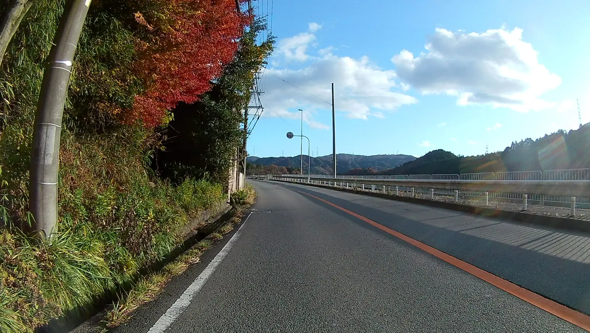
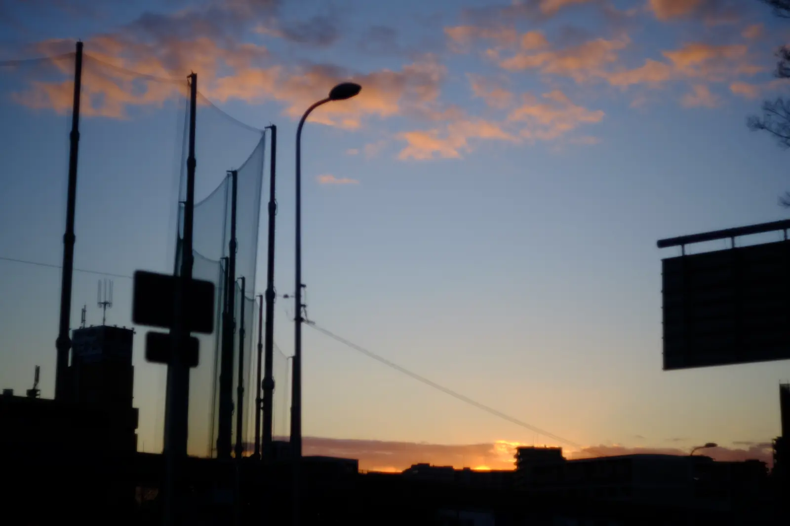

---
categories:
  - 自転車
  - bike
date: "2025-02-15T23:43:33+09:00"
description: 紅葉の箕面大滝を越え、さらに山奥のキリシタン、右近の里を通り止々呂美へ下りさらに妙見山までのサイクリングコースをご紹介します。
draft: false
images:
  - images/aKCBa.webp
summary: 紅葉の箕面大滝を越え、止々呂美へ下りさらに妙見山まで自転車を漕いできました。
tags:
  - サイクリング
  - ポタリング
  - ロードバイク
  - Madone2.1
  - 大阪
title: 千里中央〜箕面大滝〜妙見山ライド
---

日を追うごとにどんどん気温が低くなってきました。寒さに弱いので冬はほとんど自転車に乗らないのですが、今週末は天気が良かったので今年最後（？）のライドとして紅葉の箕面大滝を越え、止々呂美へ下りさらに妙見山まで自転車を漕いできました。

## コース

{{< mbox json="track.json" center="{ \"lng\": 135.475, \"lat\": 34.8703 }" zoom="10" style="" >}}

## 千里中央公園をスタート

千里中央公園からスタートです。写真は公園の西を通る府道121号の歩道です。

\

ここからシャカシャカ北へ進み、箕面の山の麓、府道9号まではいつもどおり見どころもなく淡々と進みます。だんだん箕面の山々に近づいてきました。

府道9号を西へ浄水場前に来ると見晴らしが良く千里中央方面と奥の生駒山が良く見えます。

奥には大阪市内のビル群も。

## 箕面大滝へヒルクライム開始

浄水場前の交差点からいきなりキツいヒルクライムが始まります。

勾配がきついのは始めの方で、なんとか登りきって峠を越えると奥にきれいな山々が見えます。

## 渋滞の箕面大滝

箕面大滝の駐車場、大日駐車場まで到着すると車が激混みです。紅葉シーズンはいつもこんな感じみたいですね。先週の勝尾寺といい、すごい渋滞になっています。自転車を停めて紅葉の箕面大滝まで人歩きしようかと考えていたのですが、これを見てやめました。サクッと通り過ぎていきます。

箕面大滝から先はしばらく駐車場から溢れた車が道半分を駐車場にしてズラズラ並んで停めています。路駐ではなく、片側通行規制にして1車線を潰して駐車場にしていました。

駐車の列を過ぎて落ち着くと静かな山にきれいな紅葉を見ながらのんびり走ります。

箕面川ダムまで来ました。

左に折れると五月山方面ですが、今回はトンネルを通って北へでます。

## マリアの泉と右近の郷

途中にマリアの泉という汲み上げ式のポンプがありました。古来「ちょんちょん水」と呼ばれていたもので、飲めるみたいですね。

マリアの泉から少し進むと高山という町に出ます。フェンスに大きく「右近の郷」と書かれていますが、高山右近というキリシタン大名の生まれた地ということだそうです。

後で高山右近について調べてみました。高山右近は織田信長、豊臣秀吉の家来となりますが、最後は徳川家康の時代に伴天連追放令により国外追放されフィリピンのマニラでその生涯を閉じたそうです。全然知りませんでした。

高山の棚田です。

高山を過ぎたら山道をどんどん下り、国道423号まで出ます。

## 国道423を妙見山麓まで進む

緩い登り基調ですがさすが国道、道は整備され走りやすいです。交通量もやや多いですが。

府道605号との交差点を左へ折れて府道605号に入ります。

この交差点がコスモスで有名なとよのコスモスの里入口です。コスモスの時期はとっくに過ぎていますが、9月頃にはとてもきれいなコスモスを見ることができます。

府道605号に入ると上り坂になります。既に箕面の山を越えて来ているので足が動かず歩きながら登り、やっと妙見山への入口に辿り着きました。

## 妙見山ヒルクライム

この鳥居をくぐると本日2回目のヒルクライム開始です！既に体力はボロボロで正直ここで引き返そうか悩みましたがせっかくなので頑張って突入です。

予想通りの激坂であっさり敗退、トボトボ歩きながら登っていきました。

最後だけ頑張って自転車を漕ぎ、到着！達成感を満喫です。

山の上なので、既に紅葉は終盤ですね。帰りの時間も気になるので歩き回らず少し休憩してから山を下りました。

体力と時間が許せばさらに西へ、知明湖まで行けるかなと思っていましたがもう無理、限界です。日も短くなってきたし、あっさり撤退を決定。

## 帰りは国道423号を池田方面へ下る

坂を下り国道423号に出ます。

もう山を越える気力はないので箕面の山々を左手に見ながら423号を直進、池田まで向かいます。途中でバイクと一緒にツーリングのような格好になりました。

\

箕面とどろみICを越えてさらに南下していきます。

## 市街地を抜け千里中央公園に戻る

池田まで来ると市街地に入ります。商店街のような一方通行の道（自転車は歩道通行可）を通り東へ方向転換します。

足もだいぶ動かなくなってきてえっちらおっちら自転車を漕いで千里中央公園前までやってきました。今回のライドはこれにて終了です。

夕焼けがきれいです。日が短くなりましたね。

## まとめ

箕面大滝から妙見山に抜ける道は箕面大滝周辺の渋滞はありましたが紅葉の山々を見ながら気持ちよく走れるコースでした。時間があれば箕面大滝や右近の郷、能勢妙見山で観光を組み合わせても面白そうです。
