---
categories:
- 自転車
- bike
date: "2025-02-15T23:43:00+09:00"
draft: false
images: 
- images/FHD0023.JPG
summary: なにわ自転車道とは、大阪の神崎川と淀川に囲まれた領域を出来島大橋から赤川鉄橋まで川沿いに走るコースです。今回は榎木橋を起点とし、淀川河口を含めた淀川三区一周しました。
tags:
- Madon2.1
- 大阪
- 自転車道
- なにわ自転車道
- XOSS
title: なにわ自転車道
---

## なにわ自転車道とは

激安GPSサイコンを XOSS G
を買ったので試走を兼ねてなにわ自転車道を走ってみました。正確には、なにわ自転車道とは、大阪の神崎川と淀川に囲まれた領域を川沿いに走るコースです。正確には出来島大橋から神崎川を東へ進み、淀川と合流して淀川沿いを赤川鉄橋までです。

## 今回走行したコース

地図を見るとなにわ自転車道は、神崎川と淀川に囲まれたいわゆる淀川三区をほぼ一周しています。せっかくなのでぐるりと一周したいと思います。

スタートとゴールを榎木橋とし、時計回りに神崎川を上流へ向かい、淀川を下り先端の矢倉緑地公園まで行って海を見て帰りは川沿いから逸れますがちょっと気になった大野川歩行者自転車専用道というのを通り神崎川沿いへ出て榎木橋に戻るルートを走りました。

{{< mbox json="track.json" center="{ \"lng\": \"135.489\", \"lat\": \"34.7221\" }" zoom="11" >}}

## 榎木橋から出発、淀川との合流まで

気持ちの良い秋晴れの午後、榎木橋から神崎川沿いへ下りてスタートです。なんとも中途半端な場所ですがここを起点、終点にしたのは、単に家から近いためです。なにわ自転車道の神崎川沿いには、これでもかというくらいの頻度で「なにわ自転車道」看板が設置されていて入り口がわかりやすいですね。

看板から川へ下る道を下りていきます。下りた後は反対向きになって川を遡行していきます。

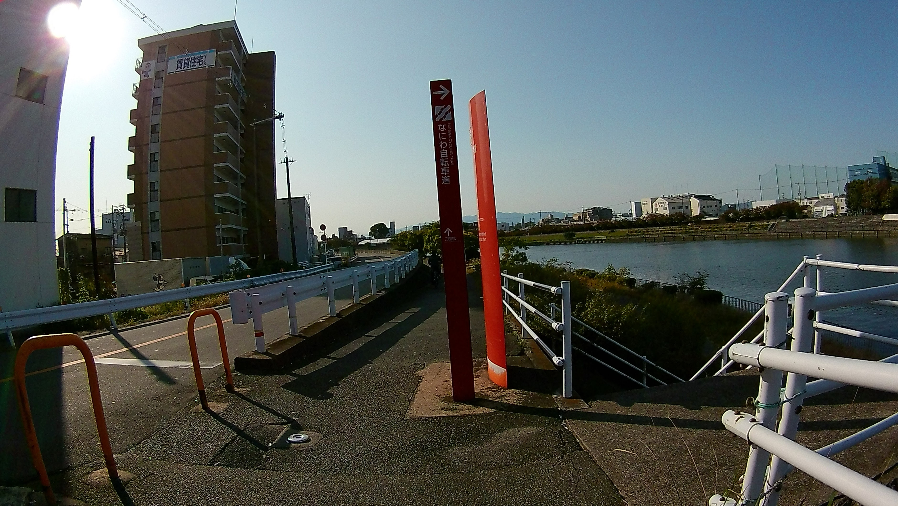

神崎川沿いの道は、こんな感じで細いながらもなかなか走りやすい道です。たまに釣り人がいますが、景色は川と橋だけで単調です。

しばらく走り、途中で安威川との合流を左手に見ながらしばらく進むと川沿いの道が終わり、車道へ上がらされます。下の写真は川沿いの道が終わったところを振り返った写真です。

まっすぐ車道を走るとすぐに突き当りのT字路で淀川沿いの土手へ上がる場所がありました。初めて走るので道が分かるか不安でしたが迷う心配はありません。

## 淀川右岸を下る

土手を登ったところです。広々とした景色が広がります。

ここも進みやすい道です。淀川特有の自転車止めがたまに現れますが。河原では野球やサッカーをやっている場所がたくさんあります。

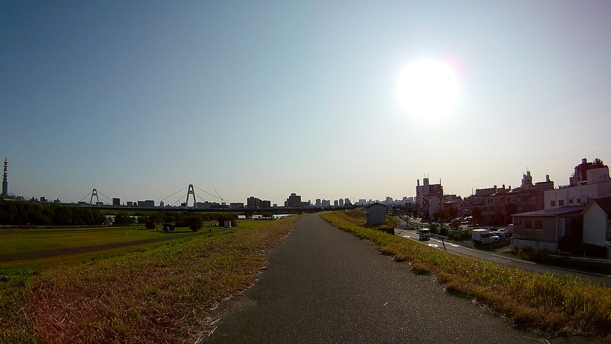

目の前の豊里大橋は直進で横断できなさそうなので、ここで土手から下の道に下ります。この下あたりは淀川河川公園で駐車場があり、人もたくさんいます。

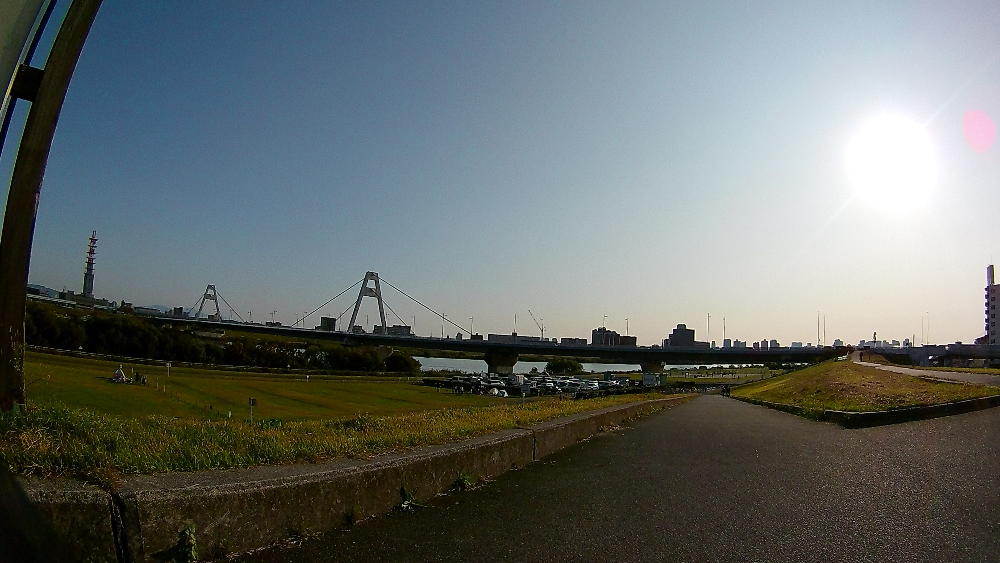

毛馬閘門が対岸に見えます。北大阪サイクルライン、北河内サイクルラインを走った際に左岸を通りましたが、右岸から見ても存在感溢れてますね。

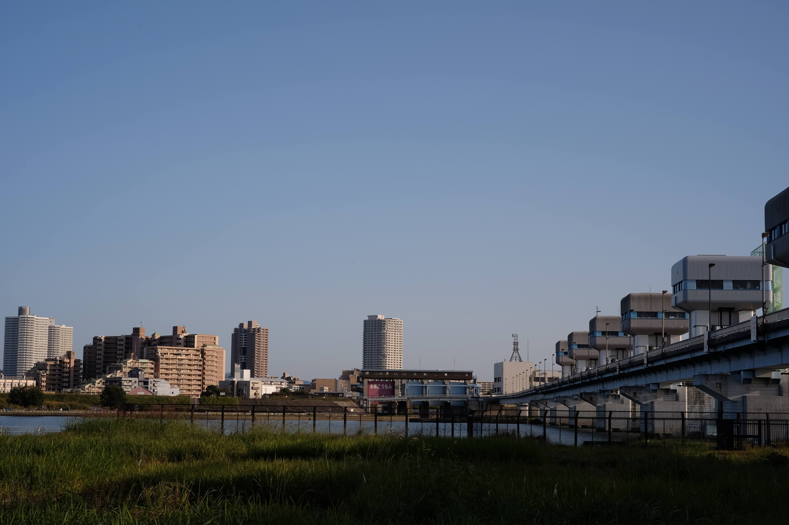

バーベキュー場があり、多くの人で賑わっていました。（写真は後ろ振り返り撮ったものです）

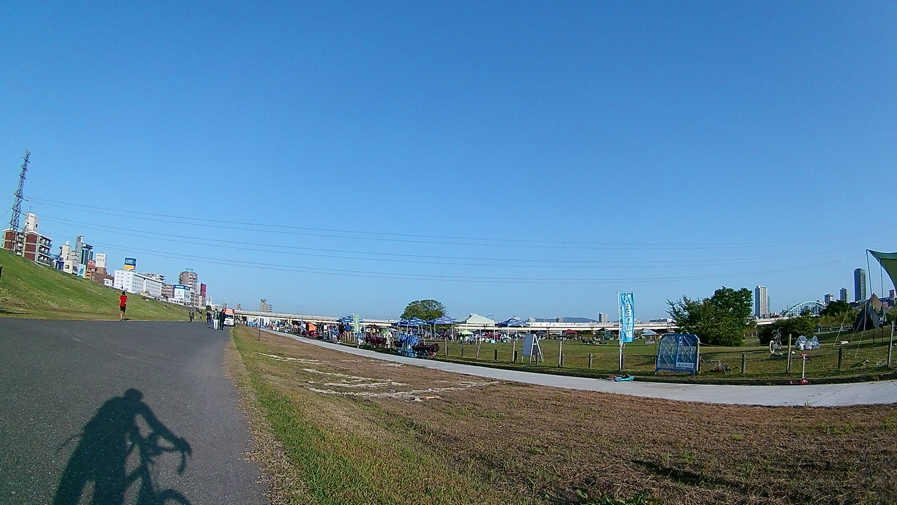

そのまま進み淀川大橋まで行くと、川沿いの道が途切れ車道へ上がります。

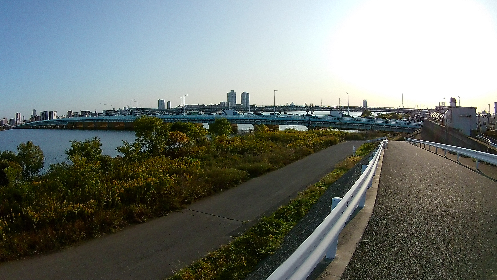

車道へ上がり上流方面の写真です。梅田あたりの高層ビル群が並んでいます。

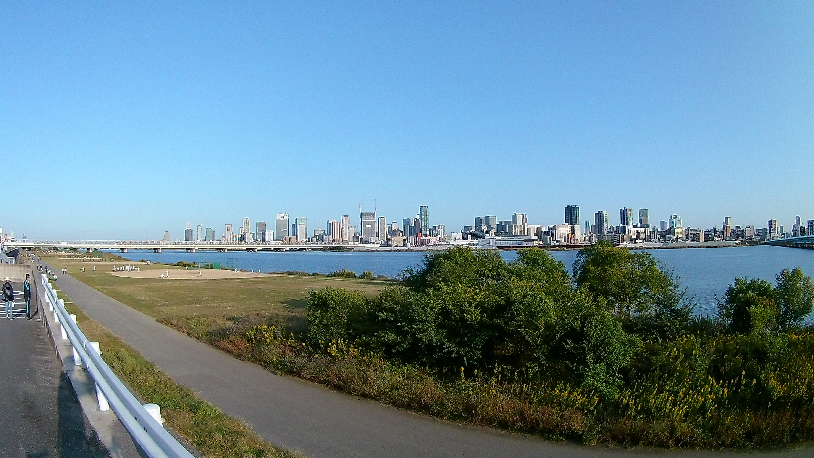

## 伝法大橋をくぐり抜け矢倉緑地公園へ

川沿いに車道を進み、阪神なんば線の踏切を越えると眼の前に伝法大橋が低く現れます。

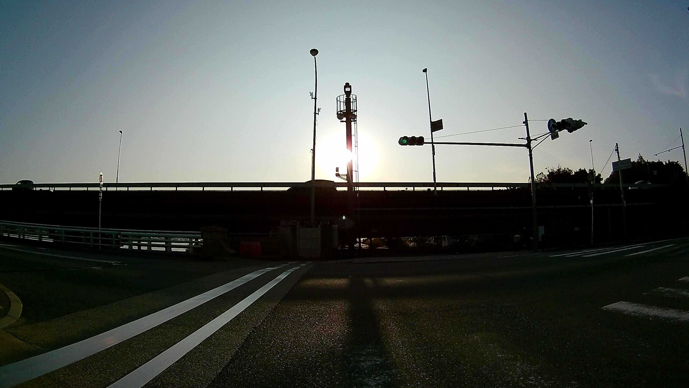

やっと自転車が通るくらいの高さです。しゃがみながら自転車を押して通過です。右を見ると車道があるので、T字路で少し右に逸れると普通に通過できたのかもしれません。

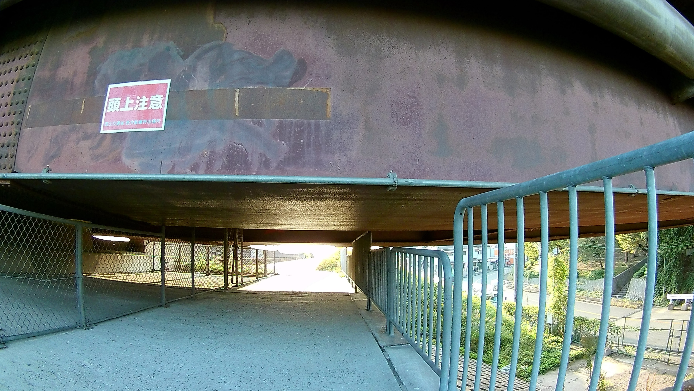

ここまでは川沿いに野球やサッカーをする人たちで賑わっている感じの淀川右岸沿いでしたが、この橋をくぐると何か少し今までと雰囲気が変わります。人気も少なくなりママチャリが打ち捨てられていたり川をぼーっと眺めている人がいたりと日が落ちてからはあまり通りたくない雰囲気を感じます。ロードバイク乗りにも一切会わなくなります。

落ちていく日に向かいながらひたすら前に進みます。

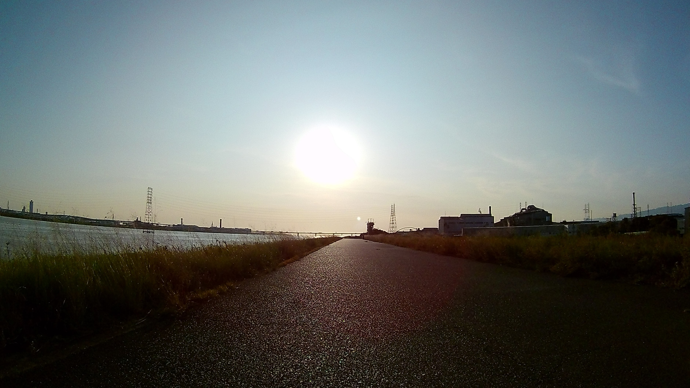

矢倉緑地公園に着きました。

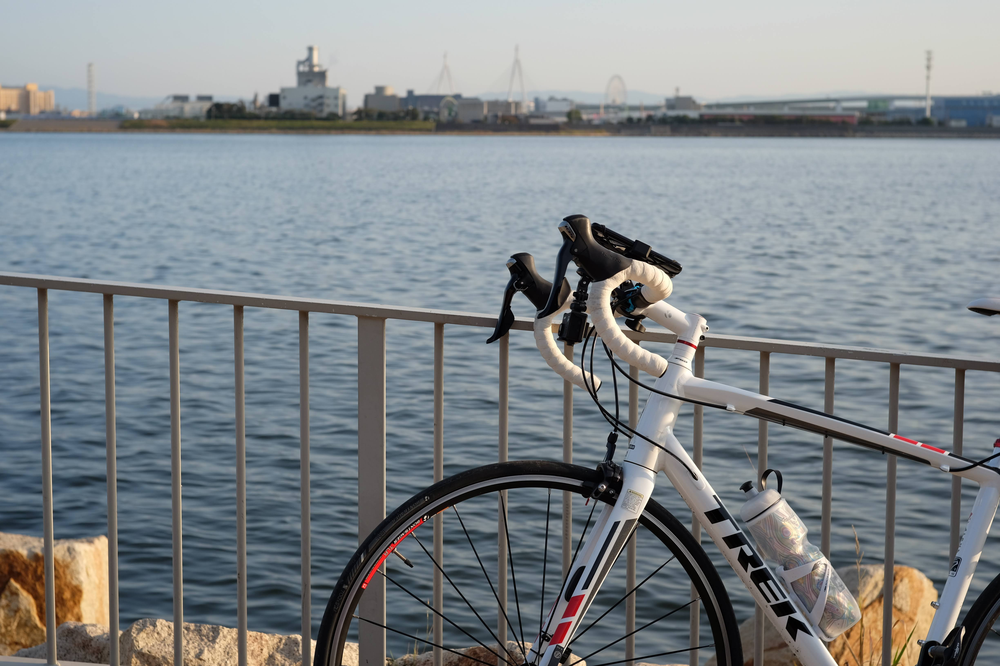

淀川右岸の先端で、向こうは海原です。釣り人が何名かいました。

景色の良い場所なのですが、なんとなく日が落ちる前に戻りたくてそそくさとここを後にします。

## 大野川歩行者自転車専用道

西島水門まで戻り、その先を左折すると道路の間の遊歩道のような大野川歩行者自転車専用道の入り口があります。

青く塗られた自転車専用道路があり、林の中を進んでいきます。ユスリカだらけで目や口に入り不快でしたが道自体は走りやすいです。特に見どころはなし。

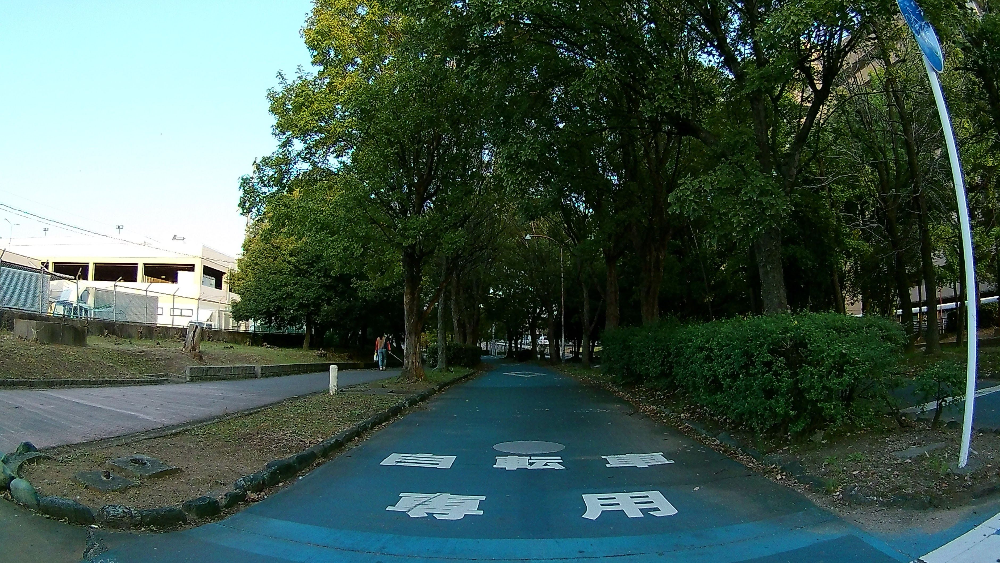

## 神崎川左岸をゴール榎木橋まで

途中で左へ折れ高速の下をくぐり千船大橋より神崎川左岸沿いのなにわ自転車道へ入ります。

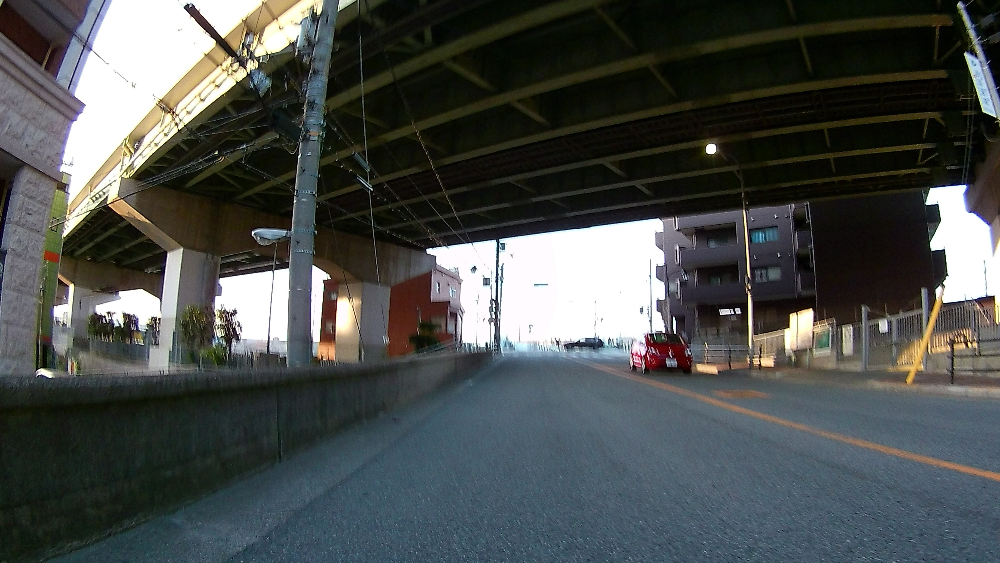

川沿いと言っても、川が全く見えない道がしばらく続きます。

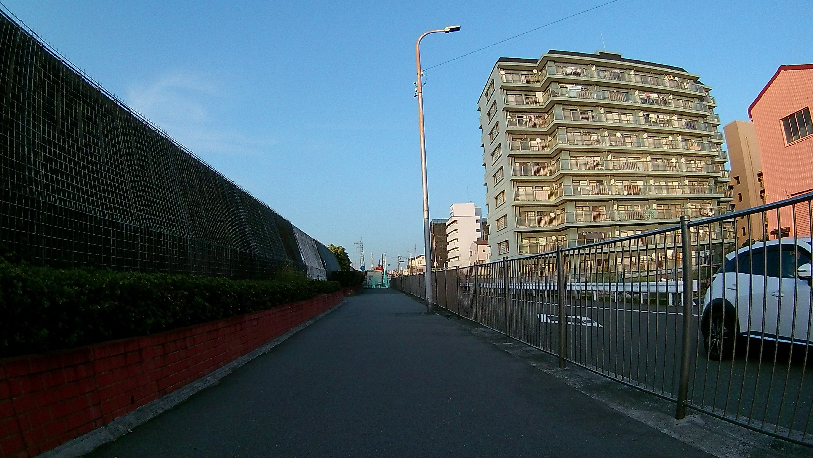

JR線の橋下あたりから川沿いに出ました。

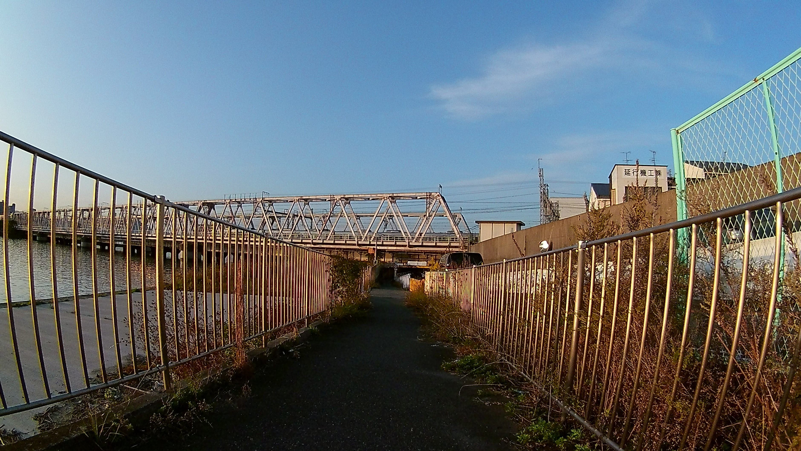

あとは川沿いをどんどん進みゴールを目指します。

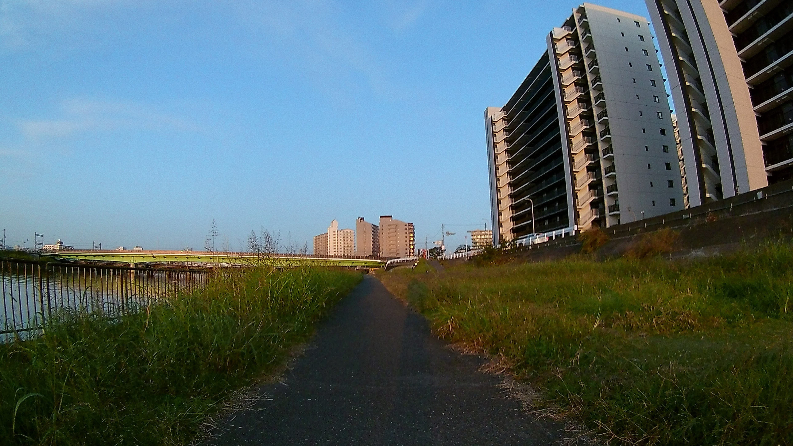

榎木橋まで戻ってきました。ランドマーク等見どころがあまり無く、期待していた淀川先端の海はいまいち落ち着いてゆっくりできず。淀川土手下の道以外は速度も上がらないので運動強度も低かったですが、秋晴れで気持ちの良いサイクリングでした。

## 総評

見どころはあまり無いのですが、30kmくらいをマイペースで走るのには良いコースだと思います。あえて海まで出る必要は無く、西島水門あたりで淀川から神崎川に向かってよいかと思います。個人的には北河内サイクルラインとかの方が好きですね。
