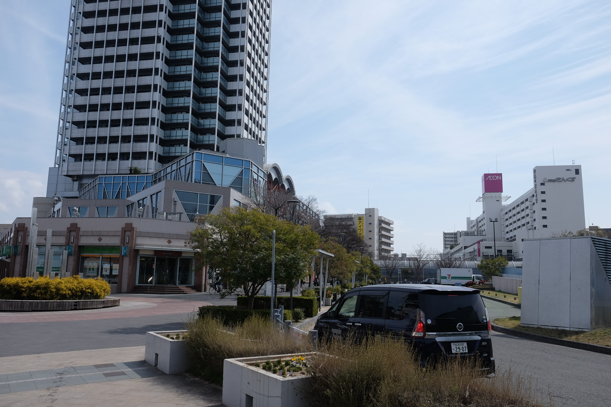

---
categories:
  - 自転車
  - bike
date: "2025-02-15T23:44:03+09:00"
description: 大阪城の南に、難波宮史跡公園があります。あまり知られていませんが日本初の首都とされる難波宮があった場所です。そんな知られざる歴史の名所を訪問する、吹田市立博物館から難波宮までのサイクリングコースをご紹介します。
draft: false
images:
  - images/DSCF8574.jpg
summary: 先日購入したナビ機能付き GPS サイコン XOSS Nav のレビューを兼ねて吹田市立博物館から日本初の首都とされる難波宮があった難波宮史跡公園までサイクリングしてきました。
tags:
  - サイクリング
  - ポタリング
  - ロードバイク
  - Madone2.1
  - 大阪
  - 難波宮
title: 難波宮史跡公園までサイクリング
---

先日購入したナビ機能付き GPS サイコン XOSS Nav
のレビューを兼ねて吹田市立博物館から日本初の首都とされる難波宮があった難波宮史跡公園までサイクリングしてきました。

## コース

{{< mbox json="track.json" center="{ \"lng\": 135.52, \"lat\": 34.735 }" zoom="10" style="" >}}

距離：17.81 km　獲得標高：100 m

大阪府吹田市の歴史が学べる吹田市立博物館から南へ神崎川、淀川を渡り毛馬閘門から大川沿いを走り大阪城の南、難波宮史跡公園までのサイクリングコースです。

## 難波宮とは

大化元年(西暦645年)に孝徳天皇が遷都した日本初の首都です。歴史の授業でよく知られている大化の改新はここで行われました。（前期難波宮）

その後、藤原京、平城京などを経て、西暦744年に再度遷都されました。（後期難波宮）

この難波宮の跡地の一部が難波宮史跡公園として整備されています。

## 吹田市立博物館のある紫金山公園をスタート

名神高速道路沿いにひっそりと目立たない場所に吹田市立博物館があります。高度経済成長期の千里ニュータウンに建てられた風呂の無い団地での生活など、興味深い展示があり、立派な建物ですが人もまばらです。

XOSS Nav とスマホをこんな感じでセットしています。

吹田市立博物館の隣、紫金山公園からスタートです。

まずは普通に街中の道を吹田駅に向かって走ります。

ほどなくJR吹田駅前に到着。

吹田駅前にはひときわ高い高層マンションが建っています。このあたりにこんなに高い建物は他に無く、「吹田市のおじゃる丸タワー」として市民に親しまれています。

吹田駅は地下道で線路を超えることができますが、自転車は降りて歩いて渡る必要があります。

神崎川と安威川の合流点にかかる高浜橋です。

右の神崎川沿いはなにわ自転車道として整備されています。

神崎川を越えた次は淀川です。菅原城北大橋の車道は自転車通行禁止です。

橋の左側に歩道に上がる道が別に設けられています。

「じてんしゃはおりてわたりましょう」の看板が。とりあえず自転車を降りて坂を登り橋の上まで歩きます。

橋の上は自転車通行可の標識がありほっとします。道幅も広く自転車で快適に通行できます。どうやら歩く必要があるのは橋への登りと下り部分のようです。これだけ長い橋を歩いたら相当時間かかってしまいます。

橋の上からは釣り人の憩いの場、城北ワンドと淀川沿いのサイクリングロードが見えます。

橋を降りると城北公園に出ます。ここから右側に坂を登り淀川左岸の堤防に出ます。

淀川沿いを毛馬まで下ります。淀川沿いの道は堤防上と下に2本が並走しており、今回は下側を走りました。

堤防上の道にもサイクリングやランニングの人がちらほら通っています。

ほどなく淀川大堰が見え、毛馬閘門から左へ折れ大川沿いを進みます。

## 淀川を渡り大川沿いを下る

大川沿いの道に入ります。

この道は北大阪サイクルラインの一部で、桜の木がたくさんあり桜の時期にはとても綺麗です。通った時点では開花はまだまだでした。

大川を外れ、XOSS Nav
に案内された道はなんと線路下へ続く階段！アプリでルート作成時によく確認していませんでした。階段横に自転車を押せる坂があるので歩いて渡ります。

線路を越えると目の前に大阪城が見えました。

今回は大阪城の南、難波宮を目指すのでお堀り沿いの道路を進んでいきます。

大阪歴史博物館とNHKの立派な建物が見えれば目的地はもうすぐそこです。

## 難波宮史跡公園

難波宮史跡公園に着きました！公園は芝生の広場といった感じでどこからでも入れますが、南の入口から入りました。入口にモニュメンテ的なものとかは特に無く、中もただの広場のようです。

広場には低い石段があり、これが史跡でしょうか？

真っ直ぐ北へ進むとひときわ目立つ大極殿跡があります。

意味もなく自転車を担いで大極殿跡に登り写真を取ってゴールです！

## まとめ

淀川〜大川沿いの道以外は街中の道を走るユルユルサイクリングでしたが、一度行ってみたかった難波宮で日本の歴史を感じた、気がしました。

しかし難波宮史跡公園は大極殿跡以外はあまり見所も無く、芝生の広場といった感じで人も多いため土は踏まれ凸凹しており史跡としては微妙な感じです。

難波宮史跡公園は、2050年の難波宮跡遷都1400年に向けて
[整備計画](https://www.city.osaka.lg.jp/kensetsu/page/0000573091.html)
があるため平城京跡のように史跡も復元されていくのかもしれません。未来は大阪城に並ぶ名所になるかもしれませんね。
