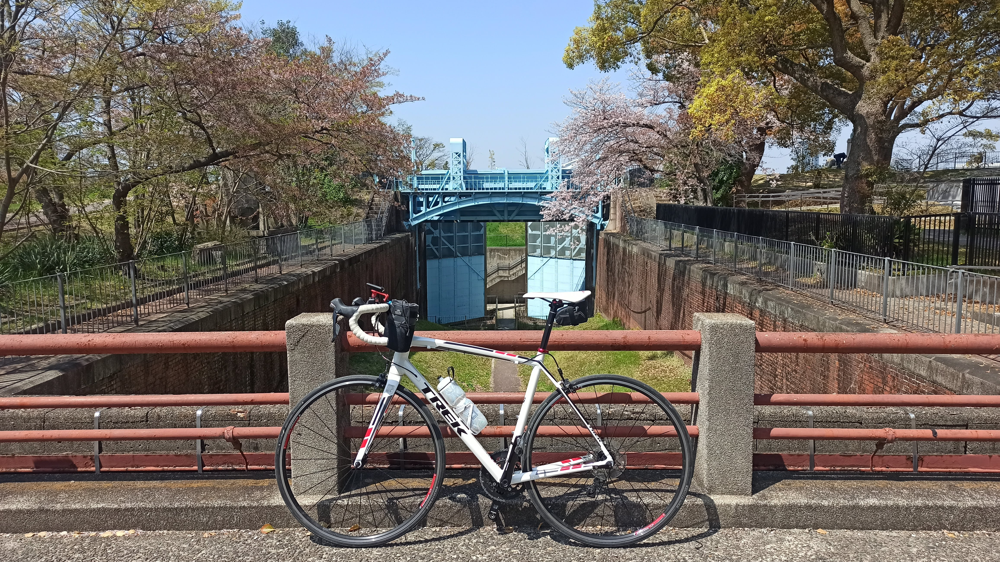
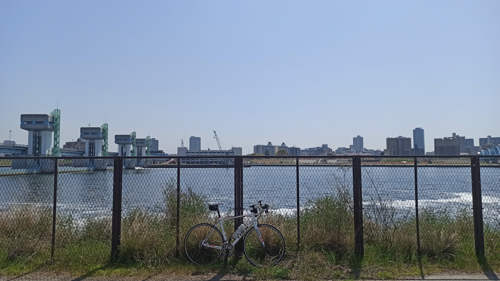
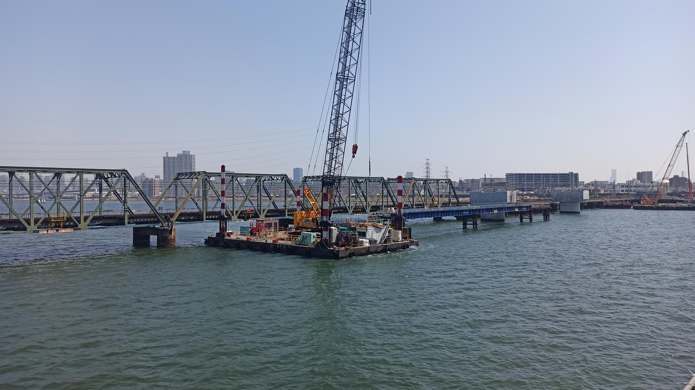
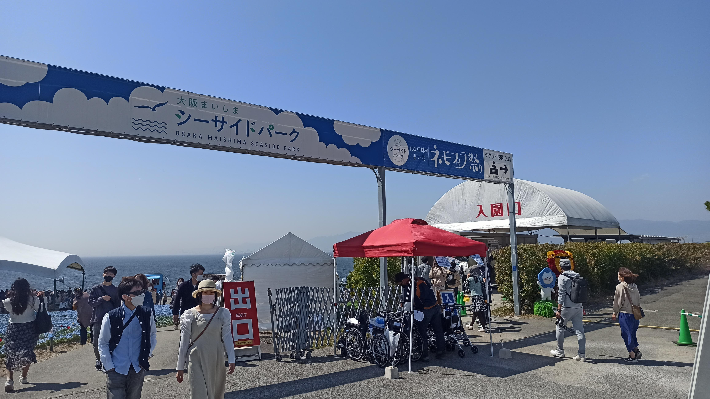

---
categories:
  - 自転車
  - bike
date: "2025-02-15T23:43:45+09:00"
description: 大阪、舞洲の海沿い一面に咲く春の花、ネモフィラ。淀川を下り舞洲までネモフィラを見に行くサイクリングコースをご紹介します。
draft: false
images:
  - images/DSCF6023.jpg
summary: 春の花といえば桜ですが、ソメイヨシノが満開を迎えた先週末は家でグズグズしていたら既に散り始めてしまいました。大阪で春の花といえばもう一つ、舞洲に一面に咲くネモフィラが有名です。前々から気になっていたので淀川を下り舞洲まで行くことにしました。
tags:
  - サイクリング
  - ポタリング
  - ロードバイク
  - Madone2.1
  - 花
  - 大阪
title: 舞洲のネモフィラを観に行くライド
---

春の花といえば桜ですが、ソメイヨシノが満開を迎えた先週末は家でグズグズしていたら既に散り始めてしまいました。大阪で春の花といえばもう一つ、舞洲に一面に咲くネモフィラが有名です。前々から気になっていたので淀川を下り舞洲まで行くことにしました。

## コース

{{< mbox json="track.json" center="{ \"lng\": 135.46, \"lat\": 34.695}" zoom="10" style="" >}}

毛馬閘門からスタートし、淀川を下ります。毛馬閘門のある梅田側、淀川左岸は淀川河川公園
海老江地区が工事中で入ることができないため、一度右岸へ渡り伝法大橋で再度左岸に渡ります。

淀川沿いを海まで進み常吉大橋を越えると舞洲です。舞洲の西の端まで行くとシーサイドバークのネモフィラ祭りをやっています。

## 毛馬閘門からスタート

自宅から自走し長柄橋で淀川を越え、毛馬閘門からスタートです。かなり暖かくなり自転車に最適な季節になりました。

今回は桜の名所、旧第一閘門に訪れてみます。桜はだいぶ散ってしまいました。

下に降りることができます。煉瓦造りに鉄の重厚な水門がかっこよいですね。この旧第1閘門は淀川の水位が高くなった際に大阪市内の洪水を止めるために作られた水門で、明治40年竣工され今は使われていませんが国の重要文化財として残されています。

1本だけ桜の木が満開でした。

## 淀川右岸は写真が消えました

さて、毛馬閘門から淀川を下っていくわけですが、左岸は工事中で進むことができません。せっかく渡ってきた長柄橋を戻り、右岸へ戻ります。

河川敷への入口がわかりにくいのですが、なんとか堤防下の道に入ります。右岸からの写真です。

アクションカメラ Insta 360 ONE R
で走行中のインターバル写真を撮っていたのですが、何を間違えたか前半戦を消してしまいました。なので、全く写真がありません。天気が良く春の日差しが心地よい日であったので野球やサッカーの人がたくさんいました。

淀川右岸の様子は、以前なにわ自転車道を通り淀川・神崎川を周回した際の記事リンクを下に貼りますのでご参考ください。。



## 伝法大橋から淀川左岸

淀川右岸の堤防下を進むと淀川大橋手前で道が途切れ、車道へ上がります。梅田方面のビルがよく見えます。

阪神なんば線の踏切を越えると左に伝法大橋を渡ります。伝法大橋から阪神線を撮った写真です。線路沿いに巨大なクレーンがいくつも配置されていましたが橋を掛けかえる工事とかでしょうか。

伝法大橋を渡ったあとすぐ右へ曲がり此花通を進みましたが、川沿いの道もあったので橋下を川沿いまで戻り、川沿いの道を走った方がよさそうでした。

此花通の途中、酉島東公園という小さな公園にきれいな桜が満開に咲いていました。ソメイヨシノでは無くボリュームのある花の八重桜です。

此花通は信号によく捕まり思うように進みません。

途中で右側に堤防に上がれる場所を発見。

堤防に上がり上流側を眺めます。このまま進めば先程渡ってきた伝法大橋まで行くことができるのではじめからここを通るのが正解でした。

川ではゴムボードのようなヨットのような乗り物を楽しむ人々が。

川沿いを進みます。

淀川の先端、常吉臨港緑地までやってきました。芝生の広場が広がり、ドリンクを飲んでしばし休憩です。

## 常吉大橋を越え舞洲へ

常吉臨港緑地を出るとすぐに常吉大橋を渡ります。これを越えると舞洲です。

左に見える不思議な建物はユニバーサル・スタジオ・ジャパンの建物のようです。

橋を越えてすぐ右へ細い道に入ります。ガタガタした道が走りにくいです。

海に近い道で人通りも少なく、ボラが跳ねるのを観たりしながら進んでいくと、、、

着きました、舞洲シーサイドバークのネモフィラ祭り入口、ゴールです！

## ネモフィラ祭り

入場料はなんと1,200円もするのですが、すごい人出です。これは期待できそうです。

中に入ると、一面ネモフィラです。

ここの桜は少し遅いのかちょうど桜も咲いていてネモフィラと桜のコントラストがきれいです。

真上から。

それにしてもとても広い敷地です。1,200円取るのも頷けます。

ところどころにネモフィラのゆるキャラ、ネモにゃんがいます。

回るのに30分程度かかりました。見応えのあるネモフィラ祭りでした。

## まとめ

淀川左岸が工事中なので毛馬閘門から淀川を下るには右岸を通る必要があります。淀川沿い、その先も基本的に平坦で走りやすい道で距離も18.25kmとそれほど長くありません。ネモフィラ祭りは思っていたより壮大なネモフィラ畑を見ることができ大満足のライドでした。

