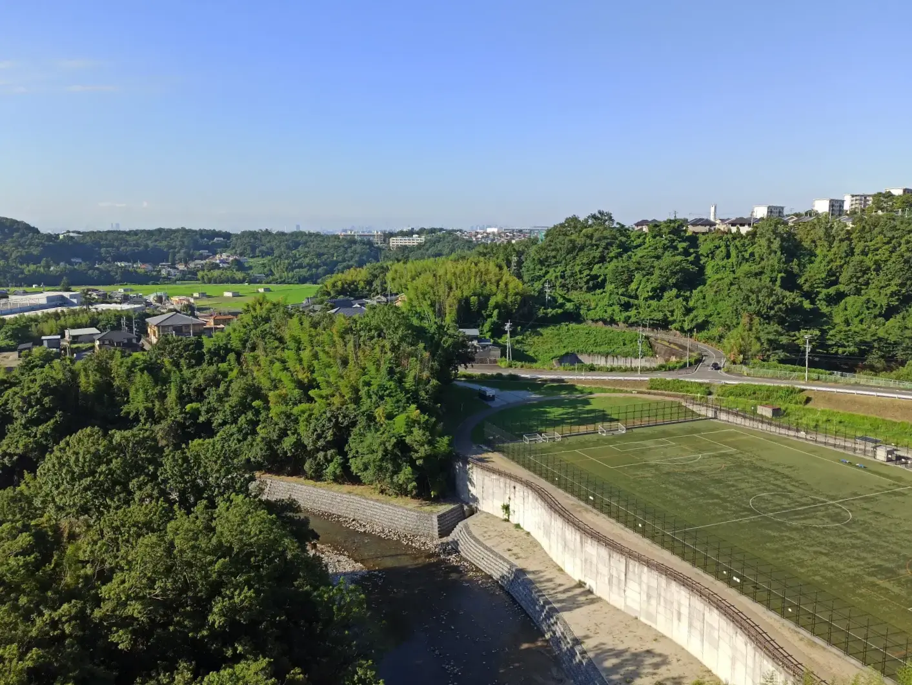
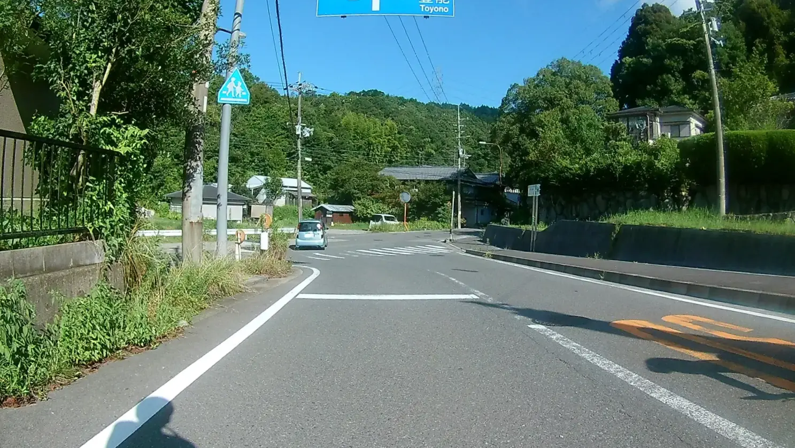
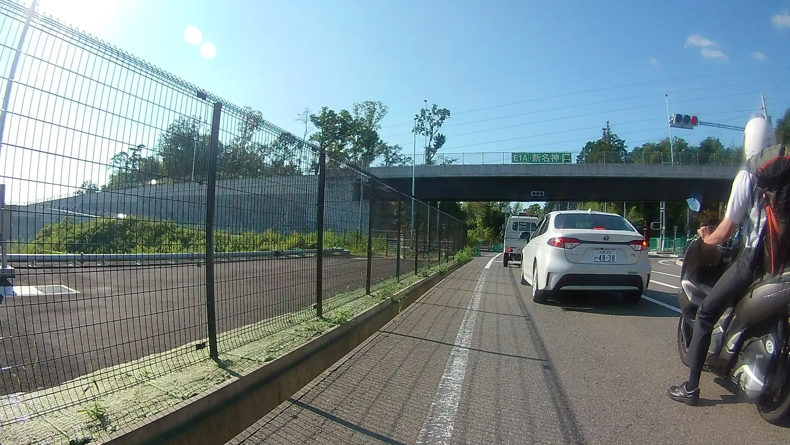

---
categories:
  - 自転車
  - bike
date: "2025-02-15T23:43:19+09:00"
description: 北摂ヒルクライムの定番コース、忍頂寺へのルートをご紹介します。
draft: false
images:
  - images/IMG_20210808_074510.webp
summary: 8月お盆休み中の夏晴れの日に、北摂のヒルクライム名所、忍頂寺までサイクリングしました。へなちょこサイクリストには辛い激坂にあっさり敗退。忍頂寺もスルーしてあまり見どころの無いコースでしたが晴れた日に良い運動ができました。
tags:
  - サイクリング
  - ポタリング
  - ロードバイク
  - Madone2.1
  - 忍頂寺
  - 大阪
title: 忍頂寺ヒルクライム（万博記念公園～忍頂寺）
---

8月お盆休み中の夏晴れの日に、北摂のヒルクライム名所、忍頂寺までサイクリングしました。へなちょこサイクリストには辛い激坂にあっさり敗退。忍頂寺もスルーしてあまり見どころの無いコースでしたが晴れた日に良い運動ができました。

## 忍頂寺ヒルクライムについて

坂の多い北摂地域はヒルクライムが盛んです。というか、淀川沿い以外は平地が無いと言ったほうが良いでしょうか。中でも
[勝尾寺ヒルクライム](../madone21-katsuoji-ajisai "勝尾寺ヒルクライム")
や
[五月山ヒルクライム](../madone21-satsukiyama "五月山ヒルクライム")
などが有名です。

忍頂寺は、摂津市千里丘から茨木市大字車作まで南北に伸びる大阪府道1号茨木摂津線の北限あたりにあるお寺です。東の車作から登るのがメジャーなようです。

## コース

{{< mbox json="track.json" center="{ \"lng\": 135.545, \"lat\": 34.8505 }" zoom="10" style="" >}}

## 忍頂寺とは

忍頂寺は、真言宗の小さなお寺で公式ホームページもなさそうです。その成り立ちについて、忍頂寺の看板にはこう書かれています。

> およそ千百年の昔、貞観年中に三澄が国家の安寧を祈願するために建てた寺院で寺号は清和天皇から賜ったものという。

ヒルクライムの最高点あたりにありますが、少し奥まった位置にあり道路沿いにはむしろ浄福寺があり、このお寺を目的にヒルクライムする人は多分少ないですがその名前が目を引くのと一帯の地名が茨木市忍頂寺なので「忍頂寺ヒルクライム」と呼ばれているのでしょう。

## 万博記念公園からスタート

北摂地域はランドマークになるような場所があまりないため、だいたいいつも万博記念公園をスタートにしています。今日はEXPO
CITY前、観覧車をバックにスタートです。

自転車専用道路を左回りに走り出します。

公園東口駅を越えて少ししたら右へ下ります。

名神高速の下をくぐり府道14号まで進みます。

府道14号との交差点です。ここを左折します。

自転車レーンがあるので安心して走れます。北の奥に北摂の山が見えます。

国道171とのY字交差点まで来ました。ここは自転車で右折できないので以前通ったときは一つ前の交差点を右折しましたが、間違えてここまで来てしまいました。とりあえず横断歩道を渡ってみます。

すると地下を通り右折後の左車線へ出る道がありました。自転車を降りて歩いて渡ります。

国道171を進みます。

車の通りが多く、自転車専用レーンも無いのであまり走りたくない道ですが、茨木川を渡るとすぐに府道46号茨木亀岡線へ左折します。

## 府道46号茨木亀岡線を北上

ヒルクライム開始地点まで、府道46号をひたすら北上します。始めのうちは平地で楽々です。

しかし後半、この交差点から先がなかなかきつい登りになります。

写真ではわかりませんがヒイヒイ言いながら登ります。

登りきれず降りてしまいました。まだ続きますが勾配は緩やかになってきます。

この登りの最後は橋に差し掛かります。

左手は防風壁がありますが手を伸ばして写真を撮ると眼下に川が流れています。だいぶ高い橋です。

右手は建設中のダムです。

橋の最後は大門寺トンネルです。

トンネルの中は広めの歩道がとってあり、自転車でも安心して通過できます。

トンネルを越えると下りになるかと思いきや、まだ少し登りがあります。ユニクロの看板がある大きな建物を左手に進みます。

道沿いに右に折れるとやっと下りになります。

このT字路が府道1号との交差点です。左へ曲がります。

## 府道1号茨木摂津線へ入りヒルクライム開始！

府道1号に入るといきなりきつい坂がお出迎え、ヒルクライムの始まりです。朝8時頃ですが気温は既に30℃！

さて、気合を入れて登るが、、、いきなり敗退、降りてバス停で休憩です。足つかないで登り切るとか、無理です。

えっちらおっちら漕いだり歩いたり登っていきます。

中間地点くらいでしょうか。

山奥に入っていく感じですが、意外にも家がたくさんあります。歩くと蚊が寄ってくるのが不快です。

だいぶ来ました。

最後の集落です。田圃に米が実ってきています。

## 浄福寺前でゴール、忍頂寺はスルー

この奥、横断歩道あたりが最高点、ゴールです。

忍頂寺ではなく、浄福寺と書いてあります。忍頂寺はここを右に曲がった奥にあります。しかし、蚊が来そうだったのでこのままスルーしました。

いや、勝尾寺ヒルクライムは勝尾寺が観光地的なお寺だし、五月山ヒルクライムはいちおう秀望台という眺めの良い場所があるのですが、忍頂寺はなんとなく花がない感じです。

蚊がたくさんいそうな雰囲気（というかさっき歩いていたときに刺された）なので忍頂寺そのものは秋～春のお楽しみにとっておきます。

## 府道1号を下り万博記念公園へ

ということで、ゴールにいた時間はものの10秒、そのまま先へ進みさっさと下ります。T字路を左に折れて進みます。

新名神高速の下をくぐり、

茨木千堤寺ICを越えて、

ここを左に入り、陸橋を渡りこの道路の右の道へ入ります。ここをまっすぐ進み陸橋をくぐってすぐ右に曲がってもOKです。

府道1号の東西に伸びる部分は、藪の中を進むような道です。細い道ですが意外と車が通ります。

T字路につきあたるので左に曲がり、またすぐ右へ曲がります。

ザ ファーム ユニバーサル 大阪というおしゃれな場所がありました。

ここを越えると彩都に出ます。ヒルクライムから突然新しい街に出た感じがします。

ここからはモノレール下の道をスイスイ下っていきます。

とても走りやすい道ですが、途中の高架は自転車は入れず、側道を走っていきます。

豊川駅から最後は登りになります。もう一息です。

万博記念公園周遊道路に出ました。

反時計回りに進むとすぐに万博記念公園の北口に着き、ここでゴールとします。コロナの影響で北口は閉鎖中みたいですね。。。

## まとめ

忍頂寺ヒルクライムは勝尾寺ヒルクライムよりやや強度高めと感じました。ヒルクライム起点まで結構登るので足を削られていたのもあるかもしれません。

これといった見どころが無いのでストイックに自転車を漕ぐのを楽しむコースといった印象でした。忍頂寺は涼しい時期に行ってみたいですね。
