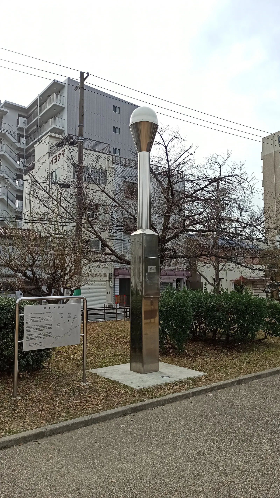

---
categories:
  - 自転車
  - bike
date: "2025-02-15T23:43:33+09:00"
description: 「大阪八低山」をロードバイクで一気に巡るコースをご紹介。初回は鶴見新山からスタートし、真田山までの2山までを書きます。
draft: false
images:
  - images/5nQxN.webp
summary: 「大阪八低山」をロードバイクで一気に巡りました。鶴見新山からスタートし、迷いながら真田山まで辿り着きました。
tags:
  - サイクリング
  - ポタリング
  - ロードバイク
  - Madone2.1
  - 大阪
  - 大阪八低山
title: 自転車で大阪八低山を踏破！ その1
---

大阪メトロの中吊り広告で「大阪八低山」という単語を見て気になり調べてみたところ、大阪市内にあり、山というより公園の一部や古墳のようです。ロードバイクで巡るのにちょうど良さそうだと思い、大阪八低山を一気に踏破しに出かけました。

## 大阪八低山とは？

大阪八低山とは、大阪市内にある下記8つの低い山のことです。最高峰の鶴見新山で標高39mとほんとうに低いので登山というよりは公園へお散歩にぶらっと行く感じです。

1.  鶴見新山 39m
2.  真田山 10m
3.  御勝山古墳 14m
4.  茶臼山 26m
5.  聖天山 14m
6.  帝塚山古墳 19.88m
7.  昭和山 33m
8.  天保山 4.53m

最高峰で比較的新しく、昭和58年に作られた鶴見新山、真田山、昭和山を除いた5山、御勝山古墳、茶臼山、聖天山、帝塚山古墳、天保山を大阪五低山というみたいです。

## コース

鶴見新山を起点とし、上に書いたリスト順に訪問しました。このうち、山頂（？）まで自転車で行けるのが真田山、天保山くらいで昭和山は階段を自転車を担いで上がりました。古墳である御徒山古墳、帝塚山古墳は普段は立ち入ることすらできないので、柵越しに眺めるだけになります。真田山は山頂がよくわからなかったりします。

{{< mbox json="track.json" center="{ \"lng\": 135.506664, \"lat\": 34.669368 }" zoom="10" style="" >}}

## 1座目：鶴見新山 {#1座目：鶴見新山}

鶴見緑地公園の駐車場まで家族に車で連れて行ってもらい、自転車を降ろしてスタートです。公園の北東を目指します。

と、いきなりここで自転車進入禁止です。自転車入れないのですね。。。

柵に自転車をロックしてクリートカバーを付け、歩きで登ります。「立ち小便禁止」の看板に今気づきました。。。

坂を登り、最後の階段です！といってもここまですぐですが。

鶴見新山山頂です。

三角点とかは無いので頂上で地面を写真に収めました！

さすが大阪市最高峰、山頂からの眺めがよいです。いのちの塔がよく見えます。

風車の下にはパンジーがきれいに咲いていました。梅はまだみたいでした。

さて、ここから
GPSサイコンXOSSをONにして次の真田山へ、、、と思ったらサイコンが動きません。結局帰宅後にファームウェアのアップデートで治ったのですが、スマホのSTRAVAアプリでGPSログを取るはめに。充電が気になります。

## 大阪城に寄り道

鶴見緑地から出て府道8号を西へ進みます。ただの車道ですがさすが大阪市内、交通量も人も信号も多いです。

そのまま京阪国道（国道1号）に入り、少ししたところで左へ折れて寝屋川を渡ります。

大阪城手前の城見通を高層ビルの間を通り抜けます。

大阪城は自転車でも外堀の中までは入れます。青屋門をくぐり、極楽橋の前からは近くから天守閣を見ることができます。

大阪城の天守閣は立派ですね。大阪に住んでいながら天守閣に入ったことが無いのでそのうち行ってみたいです。

## 2座目：真田山 {#2座目：真田山}

大阪城からさらに南下すると真田山公園です。ほんの少し坂を登ると上はほんとうにただの公園です。山の雰囲気が一切ありません。

この真田山がなかなかのくせ者です。公園を2週うろうろするも「真田山」らしき看板などは一切見当たりません。ふと気付いたのがこの宇宙と交信していそうな「電子基準点」を発見、いちおう写真に撮っておきます。おじいさんがこれによっかかりながら運動をしていたので気づきませんでした。

ただ、やっぱり何か違う気がする、ということで公園の隣にある三光神社に行ってみます。ネットで見た石碑のようなものは見当たりません。

やっと見つけました。真田丸顕彰碑です。公園の少し西、大阪明星学園の柵の前に道路上にポツンとあります。これはなかなか見つかりませんね。というか、ここが真田山で良いの？？既にバイカーがバイクと共に写真を撮っていたので一度通り過ぎしばし待ち、空いてから写真を撮りました。

真田山が一番の難所でした、見つからないという意味で。うろうろした真田山周辺の拡大地図を載せておきます。山マークが真田丸顕彰碑です！

{{< mbox json="track.json" center="{ \"lng\": 135.52836119918584, \"lat\": 34.67148813105379 }" zoom="14" style="" >}}

## まだまだ続きます

八低山全部書くと長くなりそうなので今回は鶴見新山、真田山の2山までで記事を分けます。次回は御徒山古墳、茶臼山、聖天山あたりまでを記事にしたいとおもいます。
