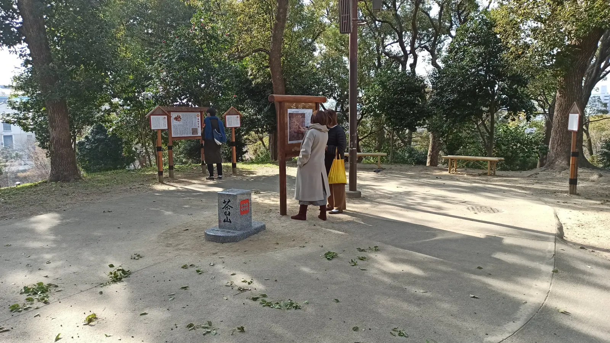
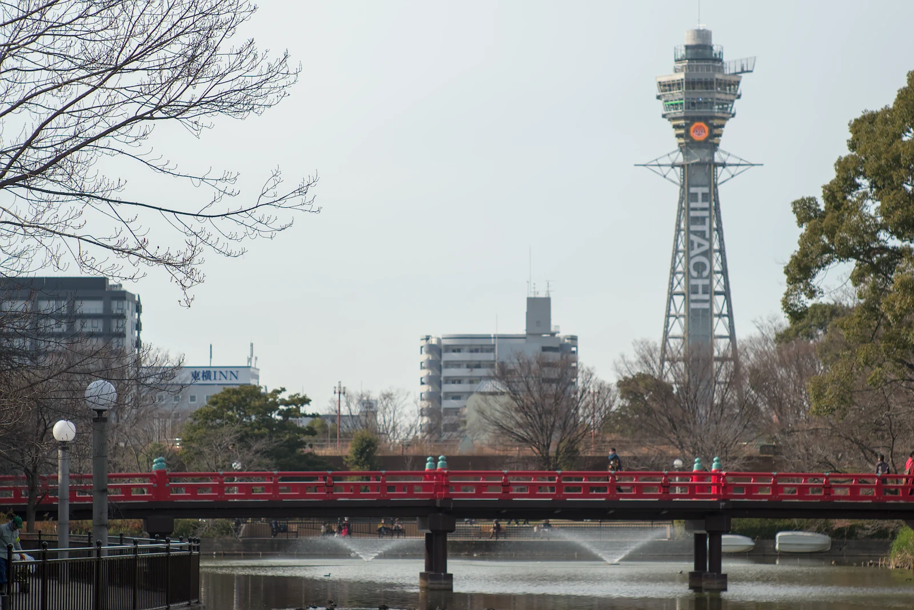
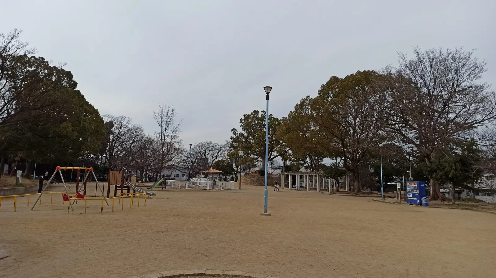

---
categories:
  - 自転車
  - bike
date: "2025-02-15T23:43:34+09:00"
description: 「大阪八低山」をロードバイクで一気に巡るコースをご紹介。第2回は御徒山古墳から茶臼山、そして聖天山まで行きました。
draft: false
images:
  - images/2f25r.webp
summary: 「大阪八低山」をロードバイクで一気に巡った記録です。真田山から南へ走り、御徒山古墳から茶臼山、そして聖天山まで行きました。
tags:
  - サイクリング
  - ポタリング
  - ロードバイク
  - Madone2.1
  - 大阪
  - 大阪八低山
title: 自転車で大阪八低山を踏破！ その2
---

大阪メトロの中吊り広告で「大阪八低山」という単語を見て気になり調べてみたところ、大阪市内にあり、山というより公園の一部や古墳のようです。ロードバイクで巡るのにちょうど良さそうだと思い、大阪八低山を一気に踏破しに出かけました。八低山3座目の御勝山古墳から5座目の聖天山までの記事です。

## コース

鶴見新山からスタートし、今回は八低山3座目の御徒山古墳から5座目の聖天山までです。

{{< mbox json="track.json" center="{ \"lng\": 135.506664, \"lat\": 34.669368 }" zoom="10" style="" >}}

## 3座目：御勝山古墳

真田山公園から南下しつつ大阪環状線の下を東へくぐり抜け、勝山通りにでます。

勝山通りを東に進むとすぐに御勝山古墳に着きました。スタートの鶴見新山から1座目の真田山までは距離がありますが、真田山から先は6座目の帝塚山古墳までは近くにあります。看板を見ると前方後円墳の後円部のみが残っていてるみたいですね。

御勝山古墳は柵で囲われており、立ち入ることができません。柵の前で記念写真を撮ります。

古墳の横は小さな公園になっています。右側の柵の向こうが古墳です。不思議な感じのする景色ですが、普段はあまり気にしないだけで意外と古墳はいろいろなところにあって公園になっていたりするみたいですね。

## 四天王寺に寄り道

勝山通りを西へ引き返し、そのまま直進してT字路まで突き当たると四天王寺の支院、真光院が見えます。

さきほどのT字路を左へ曲がり、少し行くと左手に「総本山
四天王寺」と書かれた立派な門があったので自転車を置いて少し入ってみます。

初めて入るためよくわからず、とりあえず見えた建物を写真に撮りました。後で調べると大黒堂みたいですね。敷地は広く、もっと奥にはいろいろあったようですが今回は八低山巡りなので次回のお楽しみとして四天王寺を後にしました。

## 4座目：茶臼山

国道25号の坂を登っていくと通天閣が見えました！

ここを左折し一心寺の横を通っていくと茶臼山が現れます。

階段の上が山頂です。別ルートでスロープもあり、自転車でも登れそう（階段を担いでも余裕でしょう）ですが、山頂が狭かったのでここに自転車を置いていきます。

階段を登ると、、、

山頂はすぐそこです。

着きました！

これまでで一番山らしく立派な三角点がありました。

真田幸村の看板が乱立しています。

山頂は狭く展望は無いですが次々と人が来ては真田幸村の看板を読んでおりました。

山から降りると梅林の中に、これは梅の花の仲間なのでしょうか？1本だけとても綺麗に花が咲いている木がありました。

河底池から通天閣を眺めつつ大阪市立美術館の方へ移動します。

大阪市立美術館前です。メトロポリタン美術館展がやっていて長い行列ができていました。

てんしばで「OSAKA」モニュメントとあべのハルカスを背景に写真を撮ります。大阪旅行に来た感じですね。

ここから天王寺動物園の上を抜けて聖天山に向かいます。

## 5座目：聖天山

堺筋を南へ進むと、だんだんミナミの大阪のディープな雰囲気になってきます。大阪名物、スーパー玉出と電車の高架向こう側は異世界感が出ています。

線路を右に、道がさらに細くなり狭い道を進んでいくと聖天山公園の前に出ました。

階段を登ると上は普通の公園になっています。

この木の真下は古墳のようです。ここが山頂のような雰囲気ですが、いちおう山頂は公園隣の正圓寺敷地内みたいです。

公園の裏側から正圓寺に回ります。正圓寺側はしっかり階段があって聖天山山頂の看板まであります。裏側から入ってきてしまった感じになりましたが、ここに自転車を置いて階段を登ります。

階段といっても、あと数段でお寺の門です。

中は小さなお寺ですがよく整備され、参拝者も多いのでしょう。

お参りをして、賽銭箱右側に「聖天山山頂」の看板がありました。

## コンビニで昼食

聖天山を降り、松虫通を西へ、次の帝塚山古墳へ向かいますが時刻はもうすぐ14時、10時半過ぎにスタートして、実は水も持ってこなかったのでもうお腹が空いて喉も乾いてヘロヘロになってきました。途中にファミリーマートを発見！

ここで昼食を買い、お昼休憩です。

スマホのSTRAVAでずっとGPSログを取っていたため、スマホの充電も8%まで低下していたので痛い出費ですがバッテリーチャージャーも購入しここからは充電しながら走ります。

GPSサイコンがトラブルで使えなくなっていることを先に確認をしておくべきでした。。。スマホが無いとGPSログは残らない、写真も撮れない、おまけに自分がどこにいるかわからなくなって迷子で家にも帰れない、と、いかにスマホに依存しているか実感します。

## まだまだ続きます

ここまで大阪八低山の5座を踏破（踏んでない山もありますが）して、残るは3座、次の記事で完結です。
