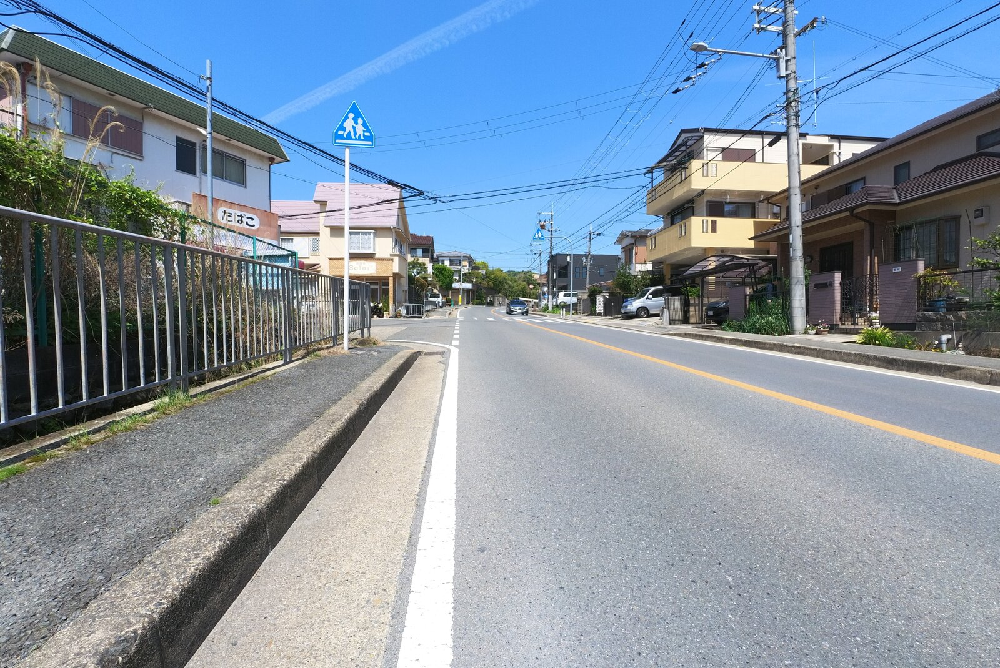

---
categories:
  - 自転車
  - bike
  - アウトドア
  - 登山
date: "2025-02-15T23:44:07+09:00"
description: 大阪と京都の間にあり、名前が特徴的なポンポン山。都市部から近い割にはアクセスが悪いため、自転車で本山寺までヒルクライムして山頂を目指すコースをレポートします。
draft: false
images:
  - images/0700.jpg
summary: 大阪と京都の間にあり、名前が特徴的なポンポン山。都市部から近い割にはアクセスが悪いため、自転車で本山寺までヒルクライムして、そこから徒歩で山頂を目指しました。
tags:
  - サイクリング
  - ポタリング
  - ロードバイク
  - Madone2.1
  - 大阪
  - ヒルクライム
title: 北摂ヒルクライム 本山寺 ＋ ポンポン山登山
---

大阪と京都の間にあり、名前が特徴的なポンポン山。関西では有名な山で常々行きたいと思っていましたが、駐車場の情報がほとんど無く、バスでのアクセスは結構不便で遠いためこれまで行く機会がありませんでした。

大阪、南側からの登山道途中の本山寺まで自転車でヒルクライムしてそこから登山したらよいのでは？と自転車＋登山を組み合わせてみました。

この記事では、自転車の部分、万博記念公園から神峯山寺まで走り、そこから本山寺までのヒルクライムまでを書きます。ポンポン山登山はまた別の記事で書きたいと思います。

## コース

{{< mbox json="track.json" center="{ \"lng\": 135.58907406097566, \"lat\": 34.88 }" zoom="10" style="" >}}

万博記念公園から本山寺方面へは国道171号や西国街道を通ったことがありますが、今回は名神高速沿いを走ってみました。府道6号を北へ登り、神峯山寺へ入る鳥居からは本格的な山道になります。本山寺と川久保への分岐からはさらに斜度が上がり、ほとんど歩いて本山寺まで到着です。自転車を置いて本山寺、ポンポン山へ登った後、帰りは同じ道を戻ります。

## 万博記念公園からスタート

家にそれなりに近くてスタート地点としてモニュメント的な要素のある場所として、万博記念公園からスタートすることが多いです。太陽の塔と自転車のツーショットで開始したいのですが、万博記念公園内には自転車が入れず、写真スポットに苦労するのでパナソニックスタジアムをバックにスタート写真です。

モノレールと一緒に万博記念公園周遊道路を東へ進みます。

公園東口駅手前から坂を下り、近畿道沿いに交通量の多い道に出ます。

府道14号を北へ進みます。

## 名神高速沿いを走り、府道6号を登り神峯山寺へ

国道171を越え、さらに少し北を走る名神高速道路沿いに出ます。国道171号に比べて車は少なく、直線で走りやすい道です。

途中のセブンイレブンでお昼ご飯とドリンクを買っておきます。今回は山登りもあるので無補給ではエネルギーが切れてしまいます。

府道6号に入り、登りが始まります。どんどん斜度が急になっていき、この時点で結構体力を消耗しています。

ヒーヒー言いながら上の口バス停まで来ると、登りは終了です。ここが峠になっており、この先しばらく下り坂です。

下りが始まると、それまでの住宅街から一気に田舎の景色に変わります。まっすぐの道なので一気に飛ばしていきます。

分岐の看板が出てきました。ここを川久保方面へ右折します。

左奥の山の中に神峯山寺があります。山の手前で左へ入ると登山口のような鳥居があります。

右の鳥居から坂を登っていきます。

鳥居の右には牛地蔵という牛の形をしたお地蔵さんがあります。鳥居の向こう側には既に急坂が見えていますね。

## ヒルクライムスタート

急坂を登りきると神峯山寺の駐車場があり、ここから登山客をたくさん見ます。ほとんどがポンポン山を目指す登山者だと思いますが、バスの場合は先程の牛地蔵のある鳥居より手前から歩く必要があり、車だとこの先も駐車場はあるのですが道が非常に狭いため神峯山寺の駐車場を利用する方が多いのでしょうか。

森に囲まれた細い山道をゆっくりと登っていきます。

少しずつ高度を上げていきます。辛いけど森林浴で癒やされます。

ロードバイクの人も結構見ました。貧脚なのでどんどん抜かされていきます。

しばらく進むと本山寺と川久保の分岐に出ました。以前、柳谷観音のあじさいを見るためにここを通ったときは川久保方面へ下りましたが、これからさらに登るなんてありえねー、と思いましたが今回は左の本山寺へさらに登る道を進みます。自転車で次々と上がってくる人たちはほとんどが下りへ行き、本山寺方面へ行く人は見ませんね。

進む前に一旦ここで休憩です。ベンチもあって休むのにちょうど良い場所です。後ろの木々の色が春らしくて奇麗ですね。

さて、行きますか！と、その前に靴をトレイルランニングシューズに履き替えです。実は、これまでも度々自転車を降りては歩いて、乗っての繰り返しでしたが、ここからさらに坂は急になるので敗北宣言のような形になりますが、歩いて自転車を押すのが楽なように靴の履き替えです。

案の定、きつい登りで半分以上歩いて登ります。なかなか進まないのでゴールまで着くことができるか不安になってきます。

だいぶ高度が上がってきました。写真ではよくわかりませんが、遠くに大阪のビル群まで見えています。

## 本山寺に到着

本山寺の駐車場が見えてきました。やっと到着です。

駐車場はたくさんの車で埋まっていました。途中で対向車と出会ったらすれ違いがかなり難しそうな道でしたが、ここまで車で来る人も多いのですね。

自転車とバイクの駐輪場もありました。無料でした。

ロードバイクを立てる場所が無く、駐車場隅の小さな柱に立て掛けてます。ちなみにこんなところまで自転車で来ているのは自分だけでした。

## 本山寺とポンポン山

ここから本山寺までは1kmほど歩く必要があります。

> 本山寺は、北山と号して天台宗に属し、毘沙門天を本尊とします。役小角(えんのおづぬ)が開き、宝亀年間(770頃)に開成皇子が創建したといわれます。

1000年以上前からあるお寺なんですね。

こんな山奥に立派な山門があり、この先が境内です。

本堂です。本堂の裏側に登山道が続きます。

ここから相当長い山道を歩き、ポンポン山まで到着しました。山頂でお昼ご飯を食べ、駐輪場まで戻ったときは足がガクガクでした。

## もと来た道を戻りゴール

登りでは自転車は重い荷物で歩行者にも追い抜かれながら押し歩き、乗って降りては休憩していましたが、下りは楽ちんです。

登山客をどんどん追い抜き、一瞬で降りてきました。ブレーキをかける手が疲れますが。

平地に戻り、名神高速沿いを走り、、、

万博記念公園まで戻ってきました。

今回のヒルクライム＋登山の旅は終了です。

## まとめ

きつい上り坂が延々と続き、途中敗退も考えましたが歩きながらも登り、さらにその先は登山でポンポン山の頂上までなんとか辿り着くことができました。神峯山寺から本山寺駐輪場まで足をつかず登れたらすごいですが、自分は一生できないと思います。
