---
categories:
- 自転車
- bike
date: "2025-02-15T23:42:53+09:00"
draft: false
images: 
- images/DSCF0290.JPG
summary: 大阪北摂のヒルクライム入門コースと言われる五月山に自転車で登りました。いきなりつらい坂道は即敗退しましたが、箕面川ダム、勝尾寺を経て一周しました。
tags:
- サイクリング
- ポタリング
- ロードバイク
- Madone2.1
- 五月山ヒルクライム
- 大阪
title: 五月山ヒルクライム
---

先日の箕面大滝〜勝尾寺ライドでなんとかまだ体が動くことを確認したので、今回はもう少し大回りで五月山から登り始め、勝尾寺方面へ下るルートで行ってみます。

## コース

府道9号沿いのマックスバリュを起点として、西へ走り五月山を登り、箕面川ダム、勝尾寺を通り府道4号を下りマックスバリュへ戻る周回コースです。

マックスバリュまでは自走です。

{{< mbox json="track.json" center="{ \"lng\": \"135.465\", \"lat\": \"34.8494\" }" zoom="12" >}}

## 五月山入り口まで

マックスバリュからスタートします。西へ進むとすぐに一条アルチメイトファクトリー箕面という良さげな雰囲気の自転車屋さんがあるのでそこ起点に写真を撮った方が良かったです。マックスバリュをバックにTREK
MADONE2.1の記念写真です。

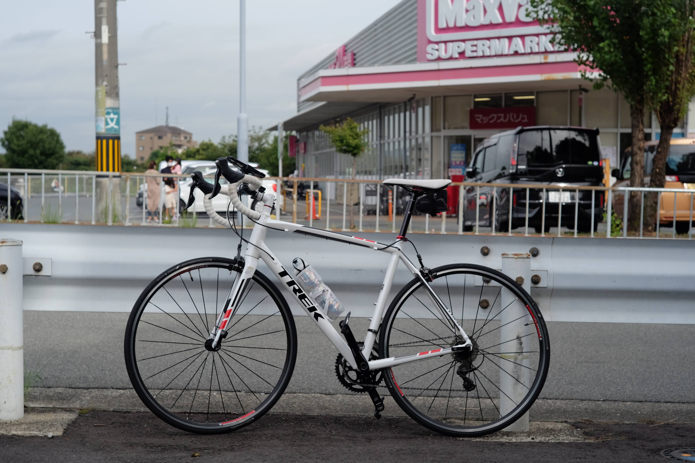

箕面駅手前は高台で大阪中心部方面の長めが良くて気持ちいいです。交通量はそれなりに多く走りやすいとは言えません。坂を大きく回りながら下ると箕面駅前の交差点へ出ます。

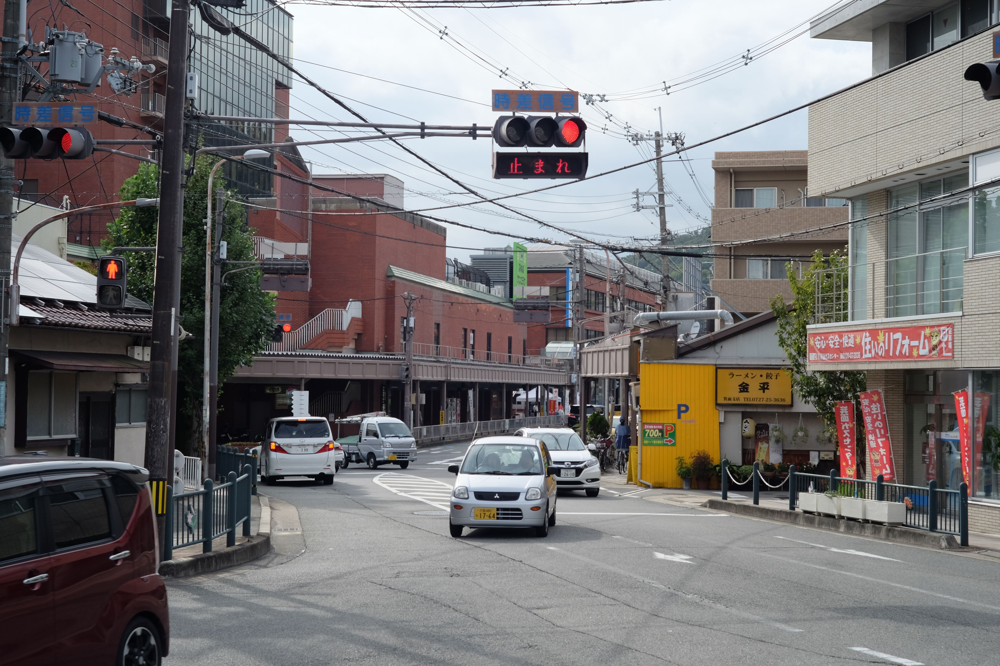

さらに西へ進み、五月山公園前の交差点に着きます。ここは無料の小さな動物園と公園があり、駐車場待ちの行列ができるほど賑わっていました。

## 五月山ヒルクライム

信号を右に曲がり少し上がると有料道路の料金所です。「五月山公園幹線園路」という名前みたいです。ここは二輪車通行禁止ですが、自転車は無料で通っていけるという、不思議ですが自転車乗りにはありがたい道です。

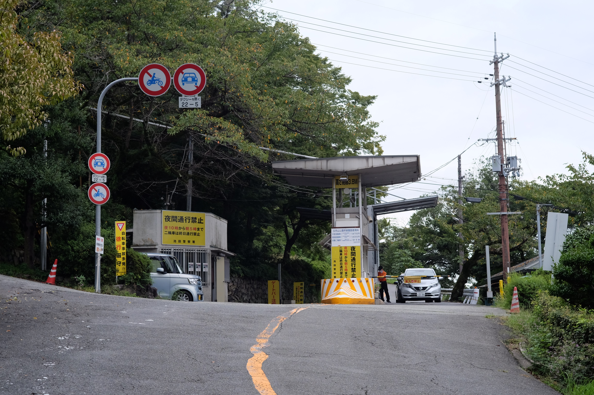

料金所を越えるとすぐに激坂が始まります。いきなりクライマックスです。そして、サクッと敗北、自転車を降りてしまいました。

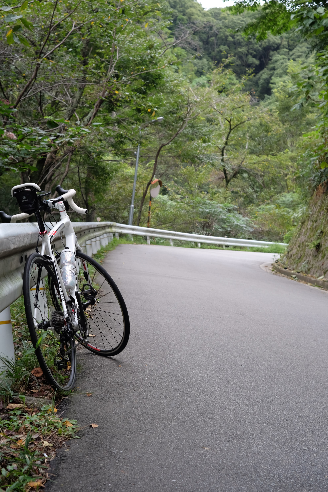

いや、こんなにエグいとは、、、箕面大滝からの登りより辛いです。それでも秀望台までそれほど距離はありません。ほどなく秀望台に着きます。ここが写真スポットですが、電線が大きく邪魔して台無しです。

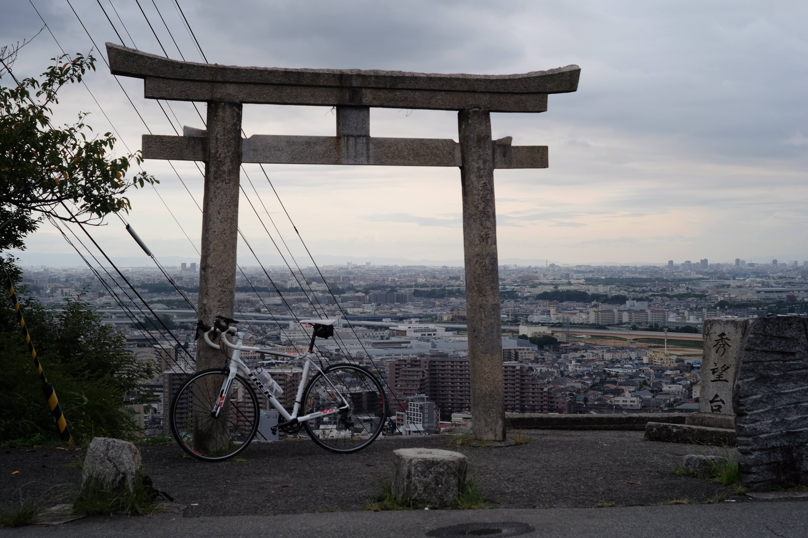

薄暗い曇りでしたが、見晴らしは良いです。

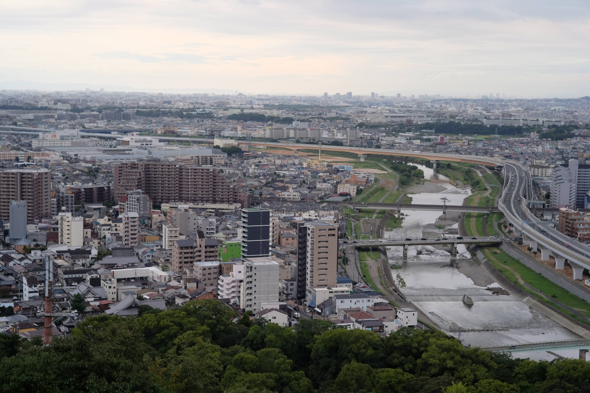

六甲山も見えます。

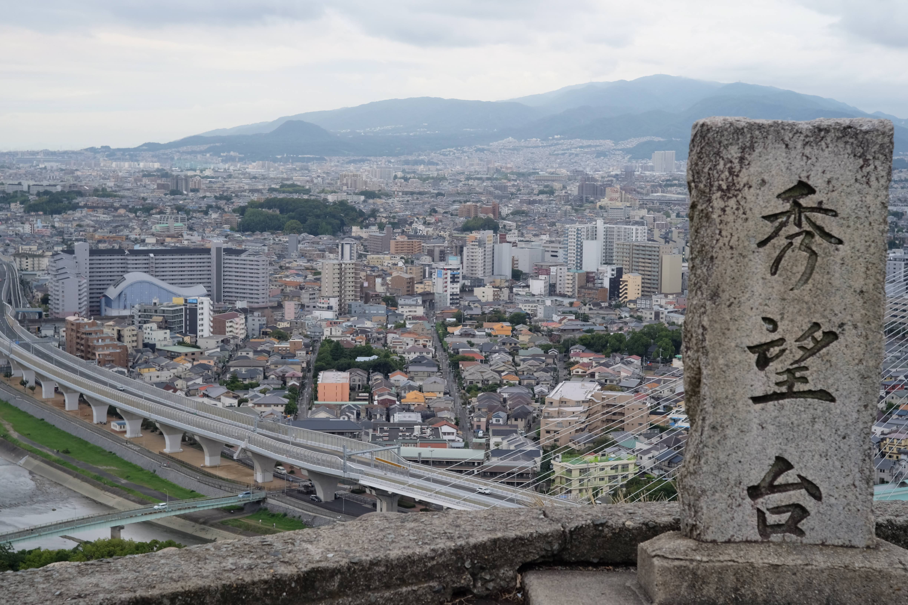

## 箕面川ダムへ

ここから先もしばらく登りが続きます。もうヘロヘロで降りたり歩いたりしながら登っていきました。途中は霊園、ゴルフ場と見どころも無く写真を撮る気もおきません。

エキスポ90みのお記念の森手前あたりから下りになります。ここはどんなところか少し気になっていましたが雨が降ってきたのでスルーです。

雨が激しくなり、箕面川ダムに到着です。ここも特に何か見どころがあるわけでも無く、分岐を右に下っていきます。

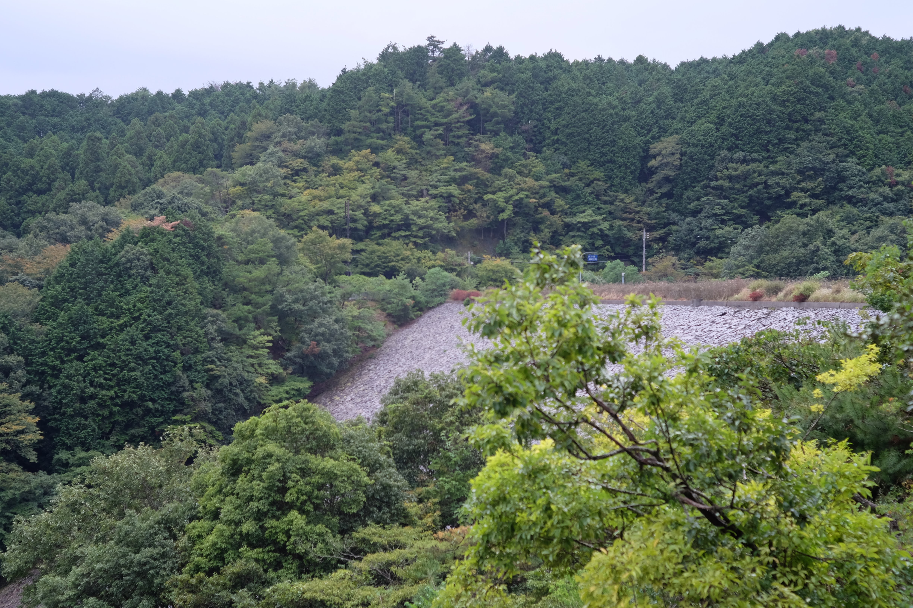

この道を下っていきます。道路が濡れているのでブレーキを引くと滑って速度を出せずノロノロ下ります。それでもロードバイクのスリックタイヤはツルツルです。

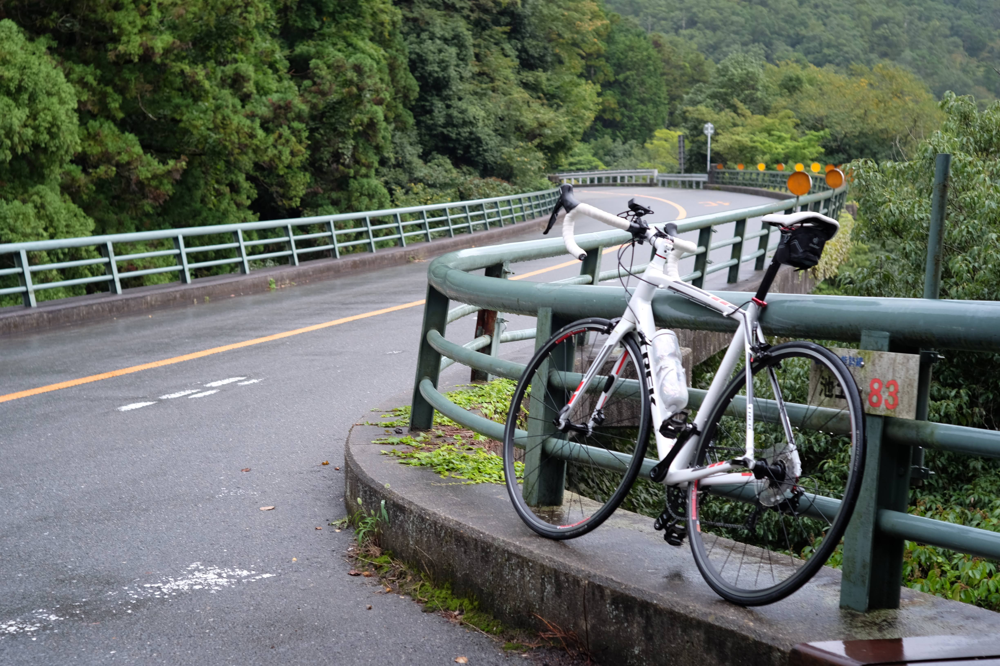

## 勝尾寺から下りマックスバリュへ戻る

勝尾寺まで来ました。前回財布を忘れたので今度こそは入りたいと思っていましたが、なんと今回も財布忘れてしまいリベンジならず。

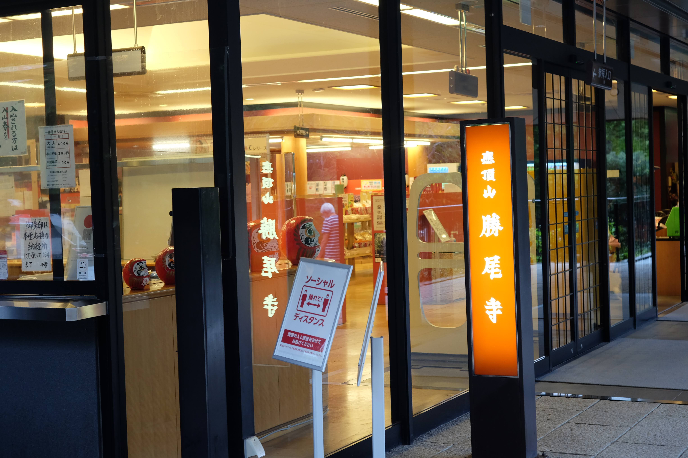

また外のだるまさんを写真におさめて先へ行きます。前と少し挟まっている場所が違いますね。

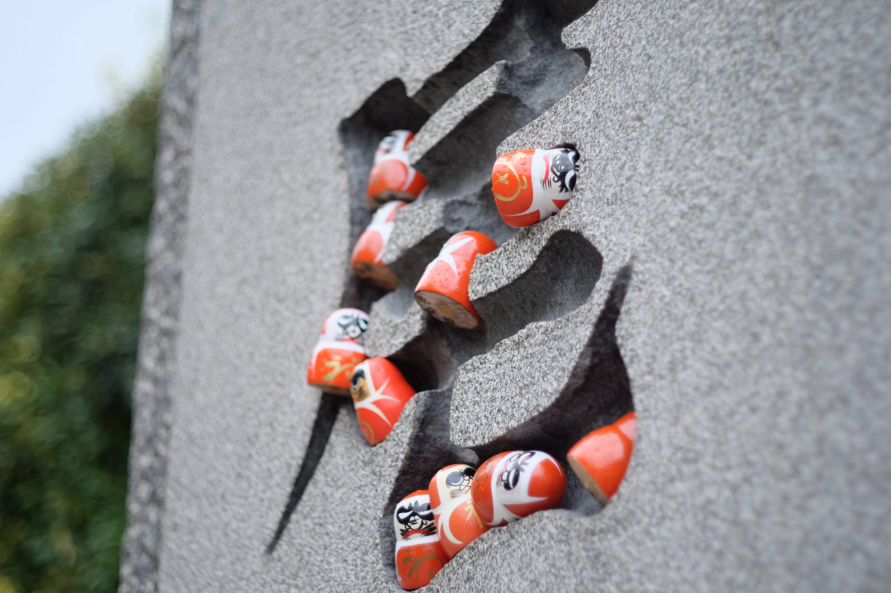

ここからも雨が止まずツルツルの道をなんとか下り、マックスバリュへ戻り終了です。

下までくると雨がほとんど降っていないので、山道は雨が降りやすいということなのでしょう。

## 感想

甘く見てましたが箕面大滝から登るより一段辛いコースです。五月山ヒルクライムと言われるくらいなので。麓が曇りくらいだと土砂降りになる可能性があるので天気には注意です。
