---
categories:
  - 自転車
  - bike
date: "2025-02-15T23:43:27+09:00"
description: 大阪北摂最難関といわれる天狗岩ヒルクライム、2.5kmと短いですが斜度16%のキツイコースをレポートします。
draft: false
images:
  - images/IMG_20211008_111705.jpg
summary: 大阪から京都にかけての北摂地方は山が多く数々のヒルクライムコースがあります。北摂最難関といわれる天狗岩ヒルクライムにチャレンジ。コースは2.5kmと短いですがあまりの斜度に大部分を歩いてしまいました。
tags:
  - サイクリング
  - ポタリング
  - ロードバイク
  - Madone2.1
  - 忍頂寺
  - 大阪
title: ほぼ歩いて登った天狗岩ヒルクライム
---

大阪から京都にかけての北摂地方は山が多く数々のヒルクライムコースがあります。これまで、

-   勝尾寺ヒルクライム
-   五月山ヒルクライム
-   忍頂寺ヒルクライム

と登ってきました。今回北摂最難関といわれる天狗岩ヒルクライムをしてきました。コースは2.5kmと短いですがあまりの斜度に大部分を歩いてしまいました。そんな天狗岩ヒルクライムコースをレポートします。

## コース

{{< mbox json="track.json" center="{ \"lng\": 135.507, \"lat\": 34.8385 }" zoom="10" style="" >}}

## 千里南公園をスタートし、茨木高原CCまで

10月になったのにまだ夏のように暑い平日の朝、千里南公園前からスタートです。

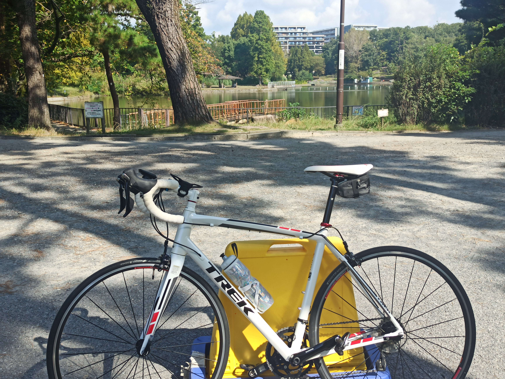

府道129号を北上し、万博記念公園前で左に曲がり府道119号千里けやき通りをひたすら北へ進みます。

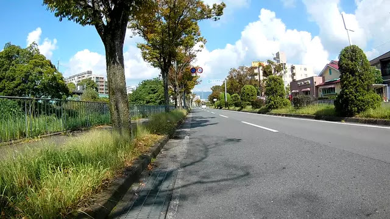

勝尾寺ヒルクライムの起点、西田橋を左折してここから登り坂が始まります。

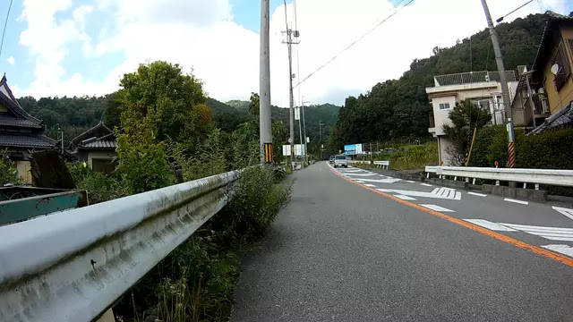

「明治の森霊園」の大きな看板を左へ曲がると勝尾寺方面ですが、今回はそのまま直進していきます。

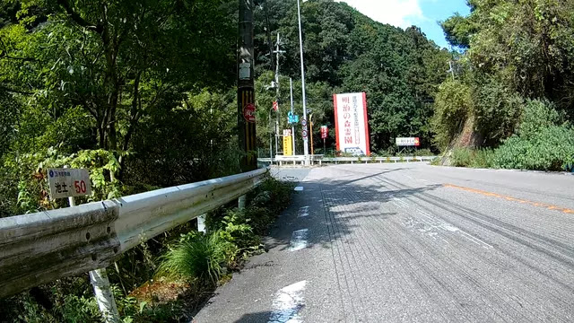

しばらく進むと左に「茨木高原CC」への交差点が現れます。ここを左に曲がったところから天狗岩ヒルクライムの始まりです。

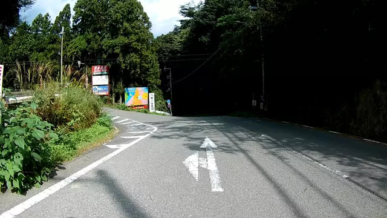

## 斜度16%の坂を登る！

最初から激坂がお出迎えです。斜度16%の看板に心が折れます。

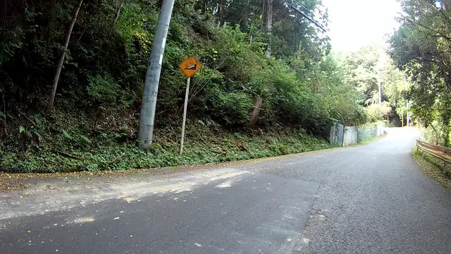

200mくらい進むと分岐があります。左に下がる道は工事現場への道のようで、右側の道をまっすぐ進んでいきます。この時点でもう限界です。

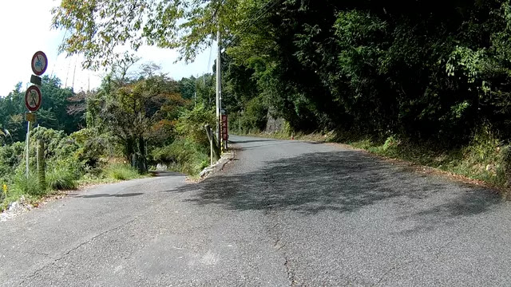

先程の地点を超えてすぐ、もう無理、自転車を降りてしましました。早っ！帰ろうか、と頭によぎりましたが思い直し、とぼとぼ歩いて登ります。

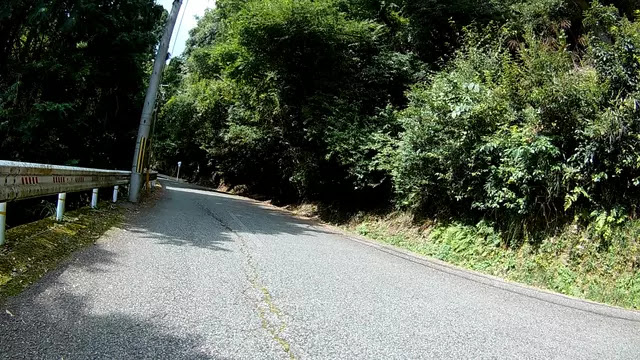

天狗岩名物16%看板です。

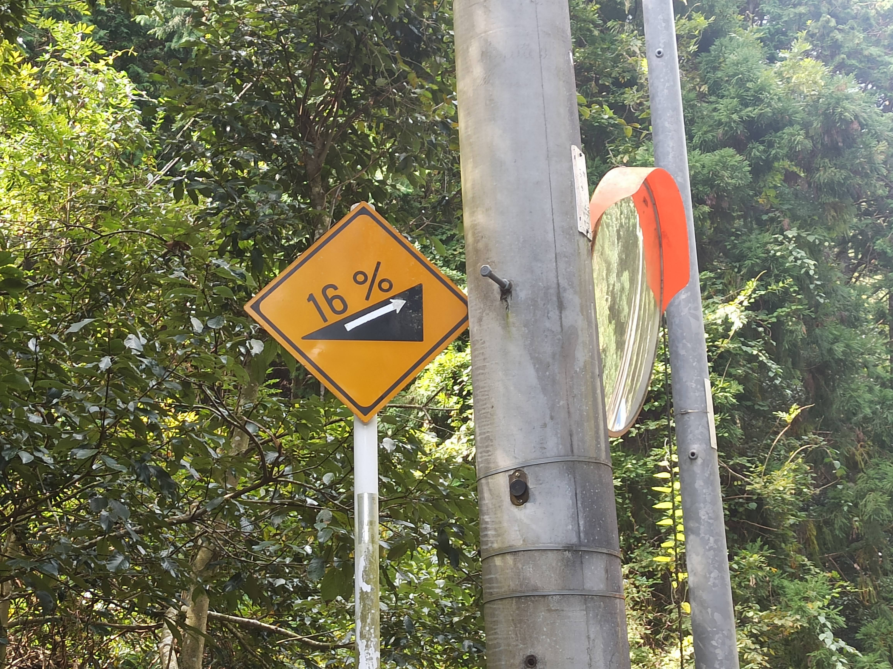

その後も歩き、自転車を少し漕ぎ漕ぎ、の繰り返しでカメの歩みでよちよち進んでいきます。

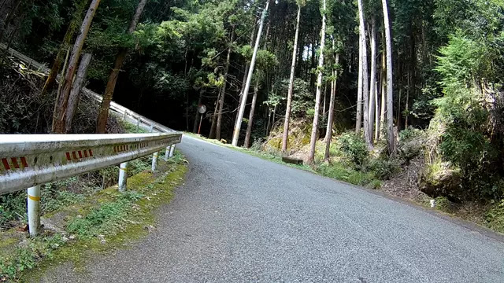

後半は少し傾斜も緩やかになり、なんとか自転車を漕ぐ時間も増えました。それにしても見どころの無いコースです。途中で1箇所、下の景色が見える場所がありましたがそれ以外は森の中を淡々と進む感じでした。

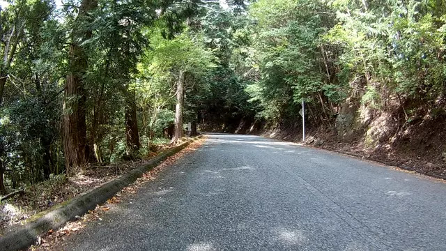

## 茨木高原CC入口でゴール。天狗岩はどこ？

天狗岩ヒルクライムのゴールに着きました。 *距離が短いので*
歩いても着いてしまうので意外とあっさり来てしまいました。ゴールは茨木高原CCと大阪北摂霊園への道の交差点上で、開けた場所になっています。

ちなみに茨木高原CC側はこの先CCの敷地であり、大阪北摂霊園側もこの先はサイクリング禁止の看板があるのでここがどん詰り。この先には行けません。

北摂ではそれなりに有名なヒルクライムコースだと思うので他にローディがいるかなと思っていましたが、平日だったためか誰一人居ません。見上げると気持ちの良い秋晴れの空です。

茨木高原CC前で記念写真を撮って戻ります。

このコース、天狗岩と名付けられていますが結局「天狗岩」らしきものは見当たりませんでした。ネットで調べても名前の由来がよくわからず、行けばもしかして「天狗岩」があるのでは、と思っていたのですが、、、由来を知っている方いれば教えてください！

## 来た道を戻り千里南公園で終了

下りは来た道をそのまま戻るだけです。天狗岩ヒルクライムのスタート地点までは一瞬です。そこからひたすら漕いで千里南公園に戻り今回のライドは終了です。

## まとめ

天狗岩ヒルクライムは斜度16%の激坂であっさり足を着き惨敗でした。しかし距離が2.5kmと短いので足に自信が無い方も歩いてゴールまで行けるので貧脚にも激坂ヒルクライムを感じられるコースです。「天狗岩」の由来は分かりませんでした！
