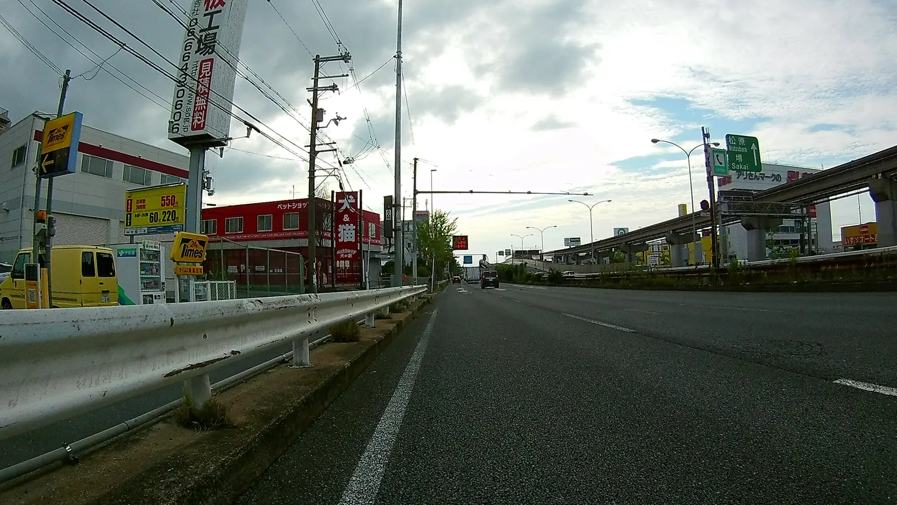
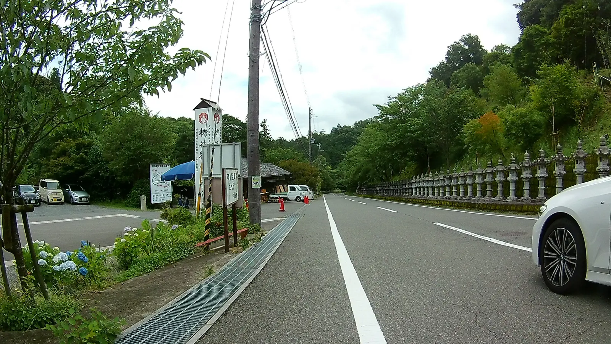

---
categories:
  - 自転車
  - bike
date: "2025-02-15T23:43:17+09:00"
description: 万博記念公園から東、高槻方面へ走り、牛地蔵から山道を登り、あじさいの花が有名な柳谷観音楊谷寺までのサイクリングコースをご紹介します。かなりキツいヒルクライムですが、境内に咲き誇るあじさいの花と花手水は必見です。
draft: false
images:
  - images/260.webp
summary: 万博記念公園から東、高槻方面へ走り、牛地蔵から山道を登り、あじさいが見頃の柳谷観音楊谷寺まで行きました。かなりキツいヒルクライムですが、境内に咲き誇るあじさいの花と花手水は素晴らしく綺麗でした。
tags:
  - サイクリング
  - ポタリング
  - ロードバイク
  - Madone2.1
  - ヒルクライム
  - 大阪
  - 楊谷寺
  - 寺
title: 万博記念公園～柳谷観音 楊谷寺 あじさいライド
---

万博記念公園から東、高槻方面へ走り、牛地蔵から山道を登り、あじさいが見頃の柳谷観音楊谷寺まで行きました。かなりキツいヒルクライムですが、境内に咲き誇るあじさいの花と花手水は素晴らしく綺麗でした。

## 柳谷観音 楊谷寺について

公式ホームページに開山と歴史について書かれています。

> 柳谷観音は806年（大同元年）平安時代、清水寺を開山された第一世延鎮僧都により開創されました。
> 延鎮僧都は　『西山にて生身の観音様に出会うことができる』　という夢のお告げにより、清水寺からこの西山に入り、柳（楊）生い茂る渓谷の岩上に生身の観音様を見つけられました。
> [柳谷観音 楊谷寺ホームページ](https://yanagidani.jp/about/)

この観音様が千の手のひとつひとつに眼を持つということで、眼のご利益があるそうです。

## コース

万博記念公園
パナソニックスタジアム前から東へ府道14号、国道171号を東へ。府道6号を北へ進み、牛地蔵から山道に入り神峯山寺を越えて川久保に至り府道79号を柳谷観音
楊谷寺まで行くコースです。

{{< mbox json="track.json" center="{ \"lng\": 135.6030040, \"lat\": 34.86 }" zoom="10" style="" >}}

## 万博記念公園からスタート

万博記念公園、パナソニックスタジアムの駐車場前からスタートです。

モノレール公園東口駅前を右に下ります。

モノレール、高速道路と並走してしばらく走ります。

## 府道14号から国道171を走る

左へ曲がり府道14号をイオンを右手に見ながら北へ進みます。

途中から国道171に合流します。国道171号との出会いは自転車ではちょっと危ないので少し手前で府道14号から出て、回り道をして171へ入りました。

国道171はストレートな道で早朝は車が少なく走りやすいですが、帰りは車が多く2車線ですが左車線は自転車と車が並走するには車線が狭く、トラックも多いためあまりおすすめできる道では無いです。

## 府道6号 枚方亀岡線を北上

前回は西国街道を継体天皇陵を見たりしながらノロノロ進みましたが、ストレートの国道171を走ると見どころもないので早いです。ロイヤルホストを左手に府道6号へ出ます。

ここからは前回通った道なのでひたすら北へ向かいます。

## 牛地蔵から山道を登る

牛地蔵に着きました。ここから坂を登っていきます。

山道といった感じで、なかなかの激坂です。

大変でしたが、それほど長くはなく、道がひらけきれいな駐車場に出ました。

## 神峯山寺

神峯山寺の駐車場でした。案内板がありました。

東海自然歩道にもなっているようですね。駐車場からは下に高速が通っているのがみえます。

駐車場は新しく大きいです。歩いている人も多く、有名なお寺なのでしょうか。

駐車場から先に下ると神峯山寺の門に着きました。ここも寄ってみたいですが、またの機会とし今回はパスして山道をさらに登っていきます。

## 川久保を通り 柳谷観音 楊谷寺へ

この先は登りがキツく、ゼエゼエ言いながら自転車を降りたり乗ったり、歩いたりしながらゆっくり進みます。

途中で本山寺への分岐があります。左に行くと本山寺、そしてその先はポンポン山へと続きます。こちらも気になってますが、さらにかなり登る必要があるので体力的に厳しそうです。

分岐を過ぎると下りになります。

さくっと下って府道79号、伏見柳谷高槻線へ川久保で合流します。ここを左へ曲がります。

しばらく両側林の道が続き、途中で大沢の集落を過ぎます。

ゆるやかな登り道を進み、京都との境手前にゴルフ場が見えました。ここから下りになり、もうすぐです。

## 柳谷観音 楊谷寺のあじさいを観賞

やっと到着です！左手が入り口、駐車場です。

自転車はここに停めるみたいです。自転車を置いてクリートを付けたままよちよち歩いていきます。

あじさいがたくさん咲いています。ちょうど今が見頃でした。

9時から開門ですが、着いた8時40分頃には既に人が行列を作り一番近い駐車場は満車でした。

拝観料を払い、門をくぐると左手にいきなりハイライト、あじさいを水に浮かべて龍の口からジャーっと水が落ちるもの（何という名前かわかりません→花手水というみたいです）です。人が集まって撮影会になっています。

それにしても綺麗です。見に来たかいがありました。

 

本堂の左手にはこんなかわいらしい展示もあります。

本堂右手の階段から奥の院まで外の道にはあじさいがたくさん咲いています。

本堂と奥の院を結ぶ回廊にはところどころあじさいを浮かべたこんなのがあり、きれいです。

## 万博記念公園へ戻りゴール

あじさいを堪能し、柳谷観音 楊谷寺を後にします。

帰りは神峯山寺へは行かず、府道79号を高槻駅付近まで南下し、そこから西へ国道171号を走り万博記念公園まで戻りました。

## まとめ

柳谷観音
楊谷寺のあじさいはとても見事で、特に水に浮かべたあじさいが見どころです。万博記念公園からの国道171号は早朝は速く進めますが車が多くなると走りにくいので日中はあまりおすすめできません。時間があれば西国街道をゆっくり進むのが良いでしょう。

途中の神峯山寺やポンポン山方面の本山寺、柳谷観音
楊谷寺からさらに東の長岡京など見どころもたくさんありそうで、今後また通りたいコースでした。
