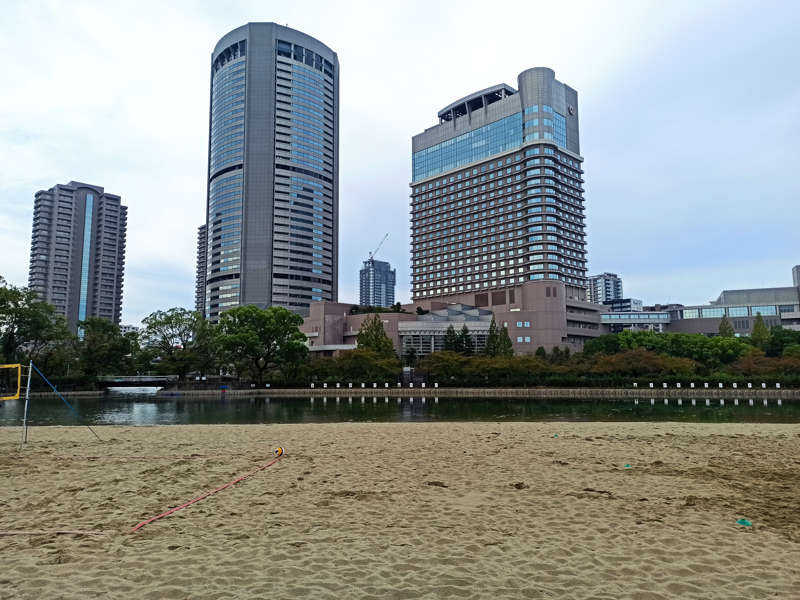

---
categories:
  - 自転車
  - bike
date: "2025-02-15T23:44:09+09:00"
description: 大阪府、大阪市、堺市が2025年の大阪万博を目指して自転車道の整備事業を進めています。淀川リバーサイドサイクルライン、大和川リバーサイドサイクルライン、石川リバーサイドサイクルライン、大阪ベイサイドサイクルライン、4つのサイクルラインのルートを解説します。
draft: false
images:
  - images/undraw_biking_m4mb.png
summary: 大阪府、大阪市、堺市が2025年の大阪万博を目指して自転車道の整備事業を進めていることがわかりました。万博が開催され、大部分が開通しているようなので情報をまとめました。
tags:
  - 大阪
  - 自転車道
  - 淀川リバーサイドサイクルライン
  - 大和川リバーサイドサイクルライン
  - 石川リバーサイドサイクルライン
  - 大阪ベイサイドサイクルライン
title: 大阪のサイクルライン整備計画
---

大阪のメジャーな自転車道として、北大阪サイクルライン、北河内サイクルライン、南河内サイクルライン、なにわ自転車道があります。先日、南河内サイクルラインを走ってみましたが、スタート地点が中途半端なところにあるのが気になっていました。

ネットで調べてみると、大阪府、大阪市、堺市が2025年の大阪万博を目指して自転車道の整備事業を進めていることがわかりました。万博が開催され、大部分が開通しているようなので情報をまとめました。

## マップ

大阪市の広域的な自転車通行環境整備事業計画によると、下記4つのサイクルラインが整備中／整備済です。

* 淀川リバーサイドサイクルライン
* 大和川リバーサイドサイクルライン
* 石川リバーサイドサイクルライン
* 大阪ベイサイドサイクルライン

## 淀川リバーサイドサイクルライン


<iframe src="https://www.google.com/maps/d/embed?mid=1g1d6cjvFgncJ70AiAcwmswxEW6zaKro&ehbc=2E312F" style="width:100%;height=400px" height="400"></iframe>


淀川沿いを京都の3つの川が合流し淀川となる地点にあるさくらであい館から、夢洲の万博会場まで続く自転車道です。北河内サイクルライン、北大阪サイクルラインと大半がかぶっていますね。

夢洲の駐輪場は事前予約制とのことなので、自転車で万博に行こうと思われている方はご注意ください。

淀川リバーサイドサイクルラインという名称にもかかわらず、毛馬から下流はしばらく淀川沿いから離れてしまいます。淀川下流域の左岸が大規模な整備中で通れないためと思われます。

## 大和川リバーサイドサイクルライン


<iframe src="https://www.google.com/maps/d/embed?mid=1ooQEbXxl1S-4MARS4-npz_2NtN7qzsI&ehbc=2E312F" style="width:100%;height=400px" height="400"></iframe>


南河内サイクルラインの始点である大和川にかかる大正橋から、さらに西、下流を大和川の河口、咲洲まで繋がるサイクルラインです。南河内サイクルラインの川沿いは非常に走りやすい自転車道ですが距離が短く物足りないと感じていました。大和川河口まで繋がると走りがいがありそうです。

咲洲から万博会場の夢洲へは自転車は通行できず、コスモスクエアに自転車を停めて電車で行く必要があります。

## 石川リバーサイドサイクルライン

[NAVITIME地図へのリンク](https://www.navitime.co.jp/coursebuilder/course/a817192f12b94104949b6e2609893601)

地図では南河内サイクルラインとほぼ同じルートですが、途中で東へ奈良方面へ、道の駅近つ飛鳥の里太子までの分岐があります。

金剛山地を超えて京奈和自転車道まで出るのも面白そうですね。

## 大阪ベイサイドサイクルライン

[NAVITIME地図へのリンク](https://www.navitime.co.jp/coursebuilder/course/6803af02a36c4bd4aef6657f7c5de449)

2025年4月時点で大和川の河口付近、遠里小野橋からりんくう公園までが整備されています。海沿いに走る府道29号沿いを走ると思いきや、一本奥の府道204号を中心に走る道です。

なので、ベイサイドという名称なものの海を見ながら走る道ではなさそうです。少しルートから外れ観光名所の旧堺燈台や岸和田城など寄り道しても面白そうです。

この先未整備ですが、おそらく終点は太平洋岸自転車道の終点、加太まで続くのではないでしょうか。太平洋岸自転車道は、千葉県の銚子から和歌山県の加太まで、1,400kmにも及ぶ自転車道なので、大阪湾サイクルラインが加太まで繋がるとしたら、もはやどこまで行ったらよいかわからなくなりますね。

## まとめ

大阪府、大阪市、堺市が2025年の大阪万博を目指して整備した／している4つの自転車道を調べました。今後のライドで実際に走りレポートしていきたいと思います。
