---
categories:
  - 自転車
  - bike
  - Webサービス
date: "2025-02-15T23:44:23+09:00"
description: 無料でサイクリングルートを作成できるサービス、Ride with GPSと、Brouterの使い方をご紹介します。
draft: false
images:
  - images/001.jpg
summary: 無料でサイクリングルートを作成できるサービス、Ride with GPSと、Brouterの使い方をご紹介します。
tags:
  - XOSS
  - GPSサイコン
  - Ride with GPS
  - Brouter
  - GPS
title: 無料で利用できるサイクリングルート作成サービス2つのご紹介
---

格安GPSサイコン XOSS Nav
のルート作成機能が微妙だったので、前回フリーソフト QMapShack
を使いルート作成を試しました。しかし自動で道に沿ってルート設定してくれる機能はありそうだが実際には機能しなく、直線をポチポチ繋いで作成する必要がありました。

もともと STRAVA
のルート作成は有料プランに入っていないと利用できないため、Web
サービスは諦めていたのですが実は無料でルート作成できる Web
サービスもあるようですね。2つ見つけたので紹介します。

## Ride with GPS

言わずとも知れた STRAVA
と双璧をなす有名なサイクリングルート作成、ナビ、記録ができるサービスですね。STRAVA
のルート作成機能は有料ですが、これは無料でした。似たようなサービスだから当然有料だろうとの思い込みから使っていませんでした。

ということでこれでいいでしょう、おしまい。なのですが1点不満は POI (Point
Of Interesting)
というルート以外に目印となる点を追加するには有料プランが必要なところです。

ルートプラナーで通過点をクリックしていくと自動で道に沿ってルートを作成してくれます。

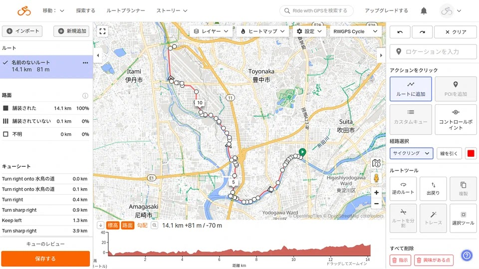

何も考えずにルート作成していくと、わざわざ細い道を選択して遠回りしたりしてしまいますが、ポイントは「経路選択」で「運転」を選ぶこと。これで大通りを横道に入らずストレートに進むルートが作成できます。作成途中で「サイクリング」を選択して自転車道や細い道に入るなど経路選択を臨機応変に使い分けるとルートが作りやすいです。

エクスポートは、XOSS Nav が FIT 形式を読み込めないようなので GPX
形式で書き出します。

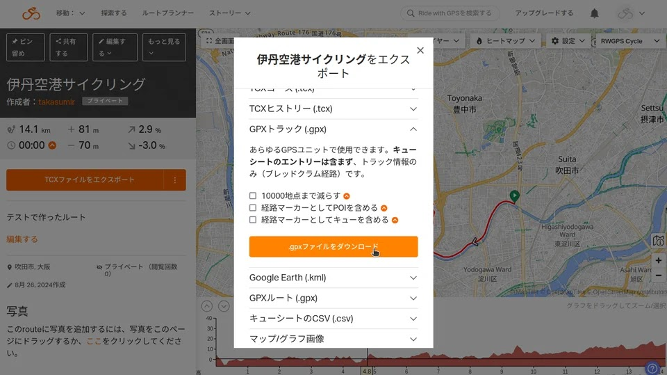

[Ride with GPS](https://ridewithgps.com/)

## BRouter

Open Street Map (OSM)
をベースにしたサイクリングルート作成サービスです。こちらはルート作成機能のみでユーザー登録とかは無く、作成したルートも
PC にダウンロードするだけというシンプルなサービスです。ルート作成は Ride
with GPS と遜色なく使えます。

ルート作成画面はこんな感じです。

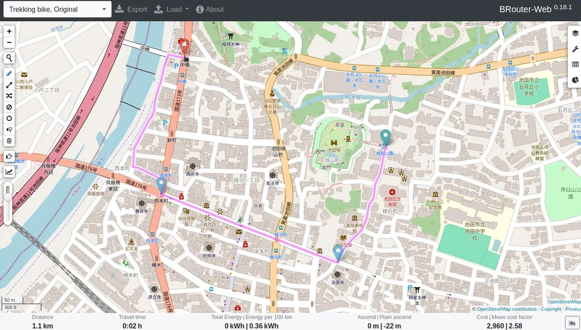

Ride with GPS 同様、デフォルトではルート選択が「Trekking
bike」となっているためとにかく細い道に入っていこうとします。

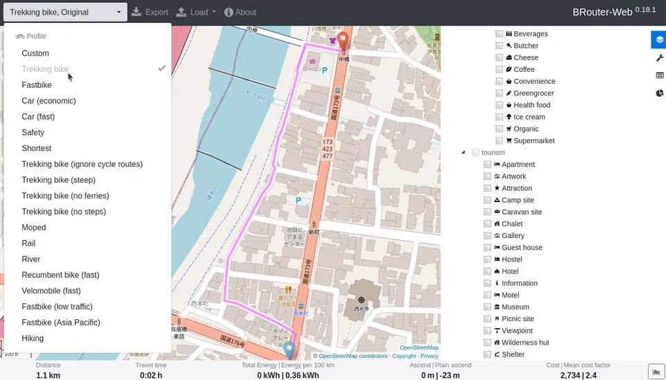

「Car」を選ぶことで大通りを選択しながらルート作成ができます。

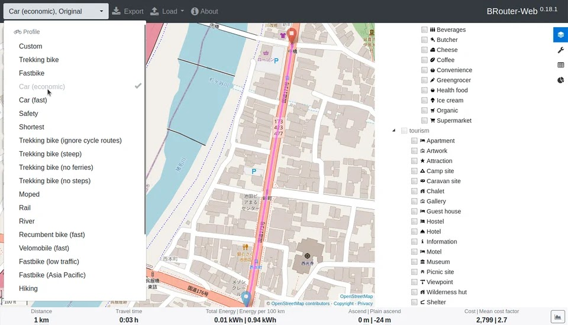

作成したルートは GPX 形式にエクスポートします。

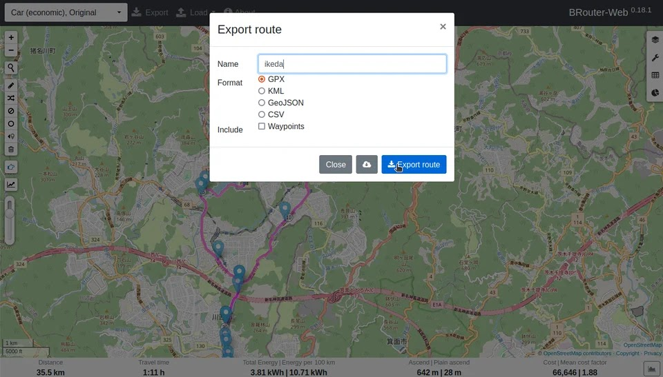

[BRouter-web](https://brouter.de/brouter-web/)

## XOSS Nav に転送

GPX 形式にエクスポートしたあとの XOSS Nav
での使用のやり方は下記記事を参照ください。



## XOSS Nav でナビゲーションしてみた

週末に台風直撃かと思いきや、大阪は晴れています。まずは家から箕面の山へヒルクライム！は、前回敗退したのでヒルクライムはせずに山の麓にある
Google マップで気になった3つの池の近くにある神社に行ってみます。



Brouter で作成したルートでナビを使いながら行きます。

前回 QMapShack
で作成したルートは道路に沿ってルート設定してくれる機能が使えなかったので直線を繋いで作りましたが、
Brouter
は自動で道路に沿ったルートを作ってくれるのできちんと交差点ごとにナビしてくれるのを期待しましたが、どうやらそうではなさそうです。

たとえば、こういった交差点で直進する場合です。

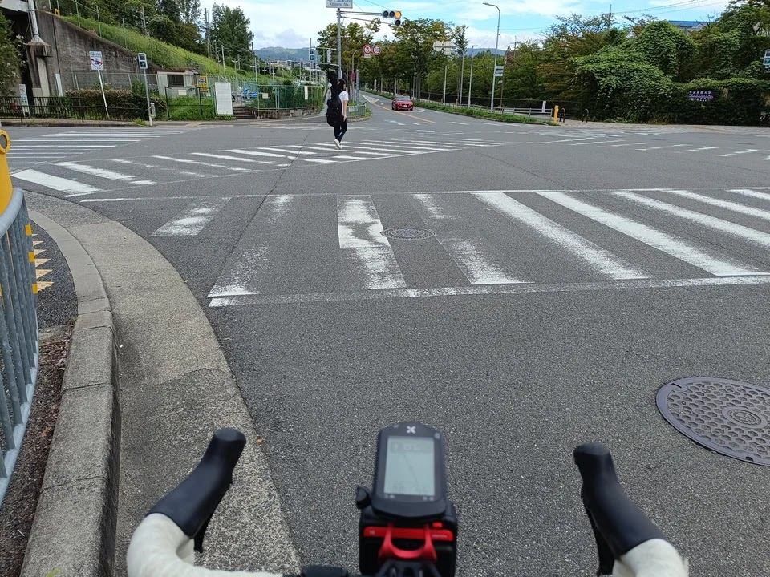

次は直進の指示なのですが、この大きな交差点の前では何も出なくスルーされます。

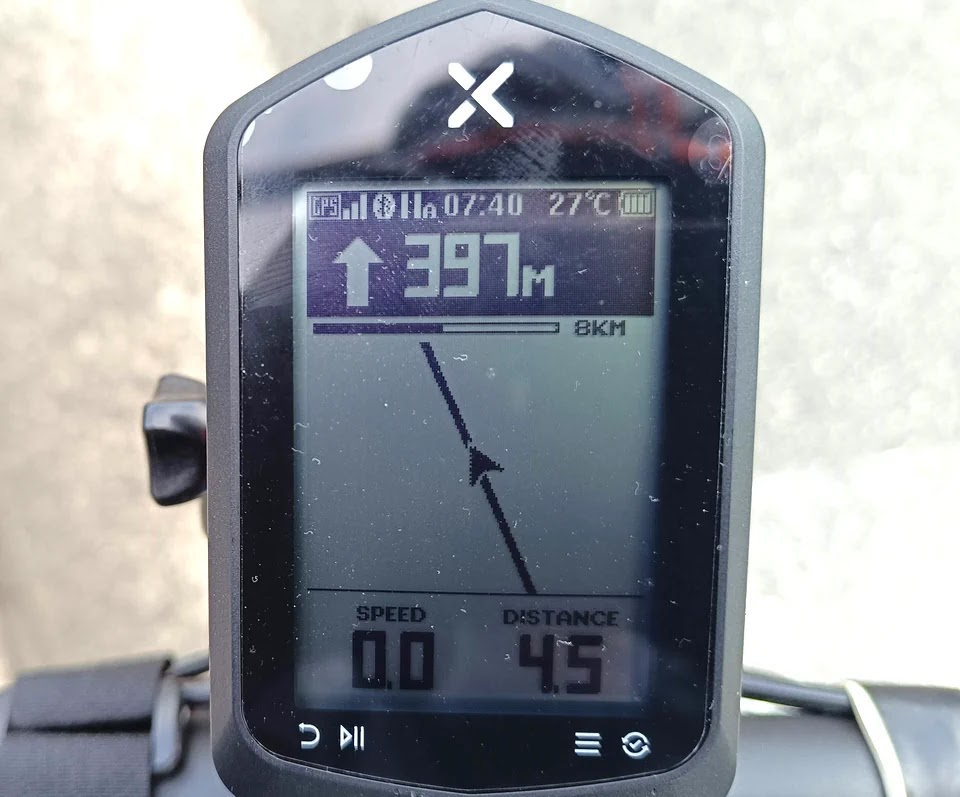

では、 397m
先の直線は何なのかというと、緩やかにカーブしながら直進する点で、交差点とか何もなかったりします。

どうやら交差点を認識している様子は無く、ルートの方向が変わるところでナビをしてくれるだけのようです。

とは言っても交差点で左右に曲がる際は確実にナビしてくれるので問題なく使えます。

北へ向かい、山の麓あたりまで来ました。

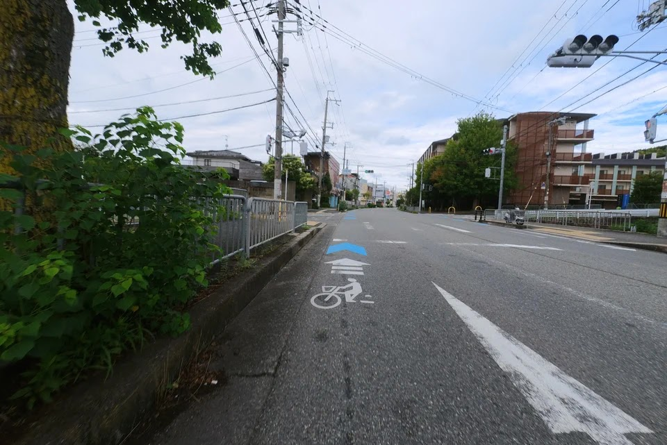

右に曲がり細い道に入ると一気に山深くなったきがします。

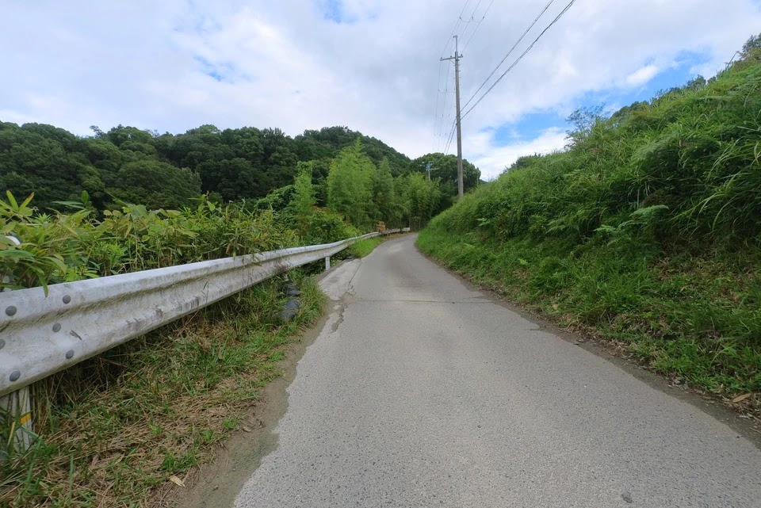

神社の前に3つの池があります。まずは薩摩池。

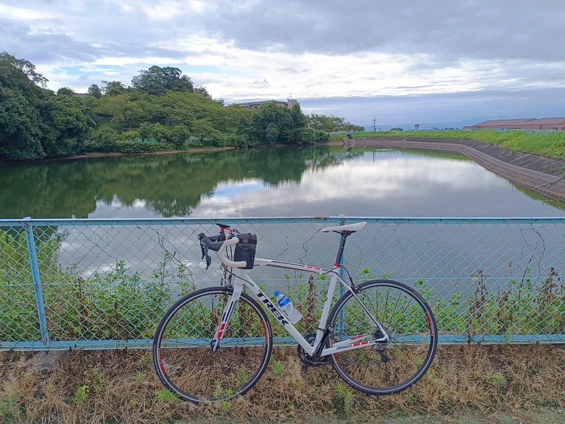

次に薩摩新池。

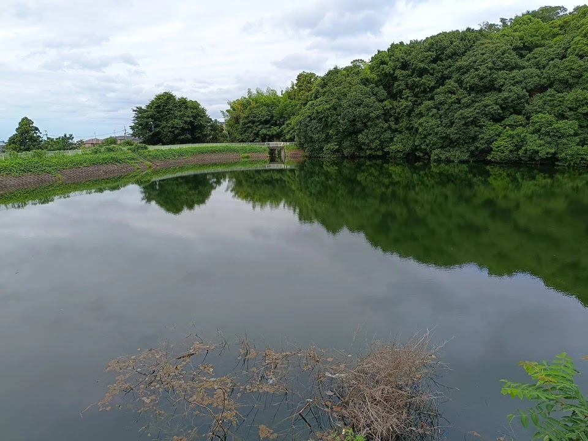

そして五藤池、、、は、フェンスがあって見えませんでした。

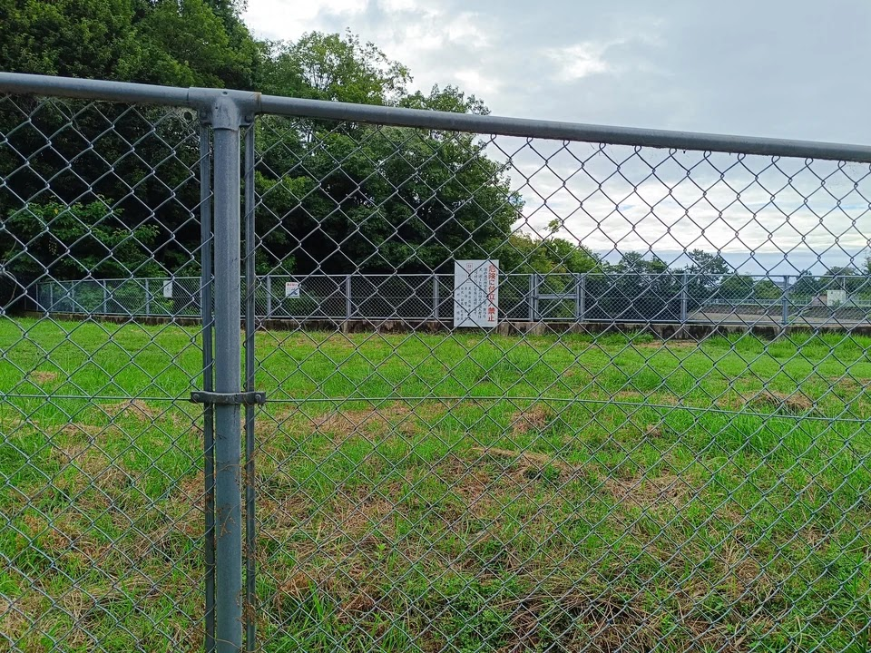

地図上で気になる3つの池でしたが、ただのため池で見どころなしです。池を越えるとすぐに白姫大明神（水神社）に到着しました。

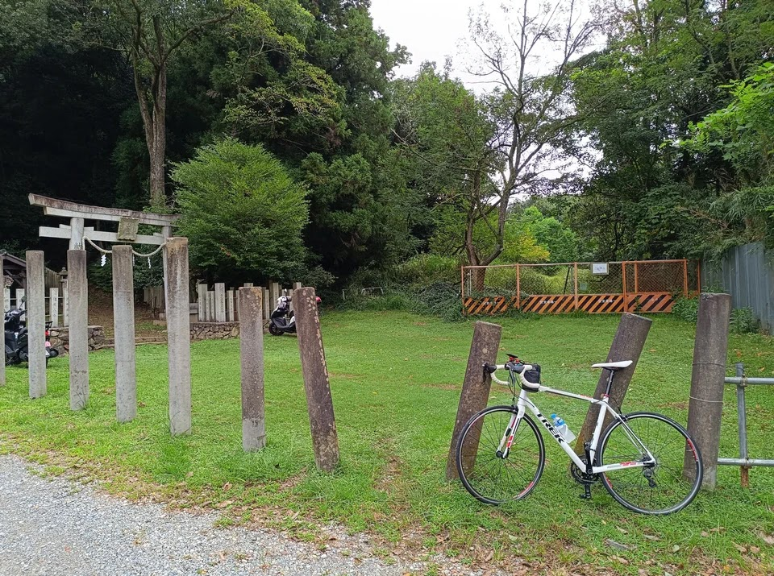

鳥居の奥に拝殿があるようですが、自転車を停めた瞬間に大きなアブが襲ってきたので払いながら写真を撮ってすぐ撤退です。アブのいない季節であれば奥に行ってみたいのですが、目的地選びに失敗です。

ちなみにこんな辺鄙な神社にバイクが2台停まっていましたがおそらくバス釣りだと思います。魚釣り禁止の看板がありますが釣りしている人がいました。

ここから Ride with GPS
で作成したルートに切り替え、東へ足を伸ばし、安威川ダムを目指そうと思いまいしたが時間が無く途中で帰宅です。Ride
with GPS のルートは交差点を認識してくれるかと期待しましたが BRouter
と同じくルートが曲がったところでナビする感じで今回走った限りでは違いは感じませんでした。

## まとめ

GPS サイコン用に無料でルートを作れるサービスとして、Ride with GPS と
Brouter をご紹介しました。XOSS Nav のような地図を内蔵しない安い GPS
ナビはおそらく交差点情報は無く、ルートが曲がるところでナビするという仕様だと思われ、特に両者で作ったルートで違いは感じませんでした。

XOSS の純正アプリやスタンドアロンのソフト QMapShack
よりはだいぶ使いやすいのでそのときの気分で Ride with GPS または Brouter
どちらかを使って行こうと思います。
