---
categories:
  - 自転車
  - bike
date: "2025-02-15T23:43:48+09:00"
description: 自転車のボルト頭は錆びやすく、見た目が悪くなるので何とか錆びにくくしたいもの。「常温亜鉛メッキ」なるものがあると知り、「ROVALメッキカバー」を購入。しかしこの製品は亜鉛を含まず、「ROVAL」が正解でした。間違って購入してしまい、間違い防止として記録に残します。
draft: false
images:
  - images/IMG_20220503_144151.jpg
summary: 自転車のボルト頭は錆びやすく、見た目が悪くなるので何とか錆びにくくしたいもの。「常温亜鉛メッキ」なるものがあると知り、ROVALメッキカバー スプレーを購入しボルト頭を塗装、が、しかし、、、
tags:
  - 自転車
title: ボルトのサビ対策 － ROVAL メッキカバー は単独で錆止め効果なし
---

自転車のボルト頭は錆びやすく、見た目が悪くなるので何とか錆びにくくしたいもの。以前に黒いボルト頭をアサヒペイントの屋外用塗料で塗装してみたところかなりの耐候性があることが分かりました。シルバーボルト用にも錆取り、錆止めをしたいと思い「常温亜鉛メッキ」なるものがあると知り、ROVALメッキカバー スプレーでボルト頭を塗装してみました。

結果から言うと、この「ROVALメッキカバー」自体は亜鉛は含まず錆止め効果が無いと記載されており、1年半くらい経つとサビサビになってしまいます。常温亜鉛メッキは「ROVAL」という製品で「ROVALメッキカバー」は「ROVAL」の上から外観上の色合わせなどのために塗るもので、製品の選定ミスでした。

全然気付かなかったので、同じ轍を踏む人がいるかもしれないと思い防備録として記載します。

## 亜鉛メッキとは

亜鉛メッキとは、金属（鉄）の表面に亜鉛皮膜を作るメッキです。亜鉛皮膜が鉄から水と空気を遮断する効果（皮膜作用）と、亜鉛自体が鉄より先に錆びていくため（犠牲陽極作用）母材となる鉄の防錆効果があります。

一般的に金属にメッキを行うには設備、薬品等が必要でDIYで行うのはハードルが高いですが塗装するだけで行うことができる「常温亜鉛メッキ」というものがあります。ローバル株式会社から「ROVAL」という製品名で常温亜鉛メッキ塗料が販売されています。

## ROVAL メッキカバー スプレー

上を踏まえた上で、常温亜鉛メッキ塗料と勘違いして買ってしまった「ROVAL
メッキカバー」です。こちらは亜鉛メッキの上から塗るもので防錆効果は無いのですが、ホームセンターで見つけて良く確認せずに購入しました。

## 1年半くらいで錆びます

いきなり結論ですが、一度錆びたボルトを錆取り後、ROVAL
メッキカバーを塗装して1年半後のボルト頭の写真です。

盛大に錆びてますね。。。通勤用自転車で、家での保管は屋根も無く雨ざらし、駅では屋根のある駐輪場に停めています。かなり厳しい条件ですがサビサビになってしましました。

## 錆びたボルト頭にROVAL メッキカバーを塗る

上記の時点で製品選択の間違えに気付かず、もう一度ボルトを外して錆取り、ROVAL
メッキカバーを塗装した経過を記載します。下の写真が通勤用自転車、ルイガノLGS-MV1です。ブルホーンにしていますがこのハンドルを固定するボルトが錆びています。

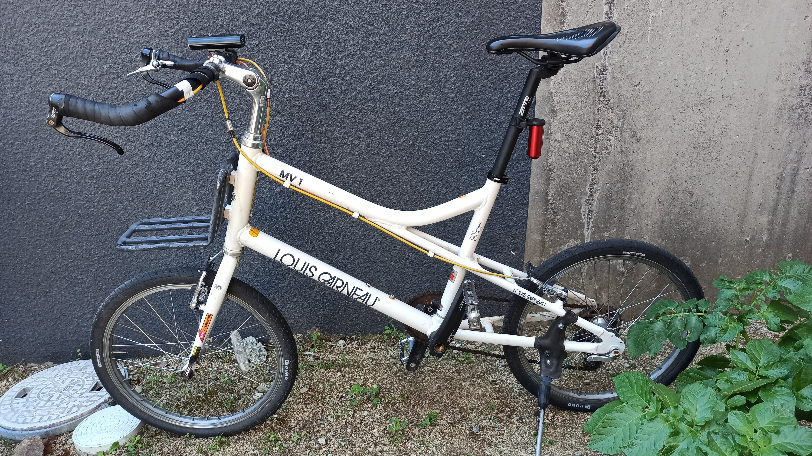

ハンドルを固定しているボルト4本を外します。

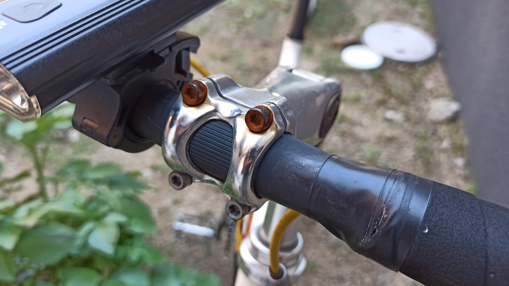

外したボルトです。上2本が盛大に錆び、下はあまり錆びていません。上のほうが水の溜まりやすかったためでしょうか。

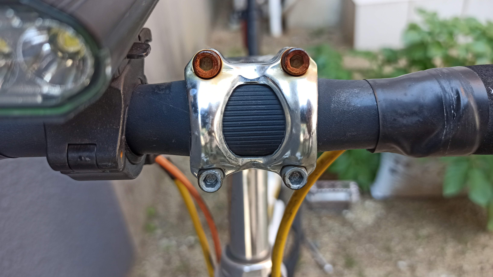

ワイヤーブラシで擦ってみますがサビが深く進行していて取りきれません。

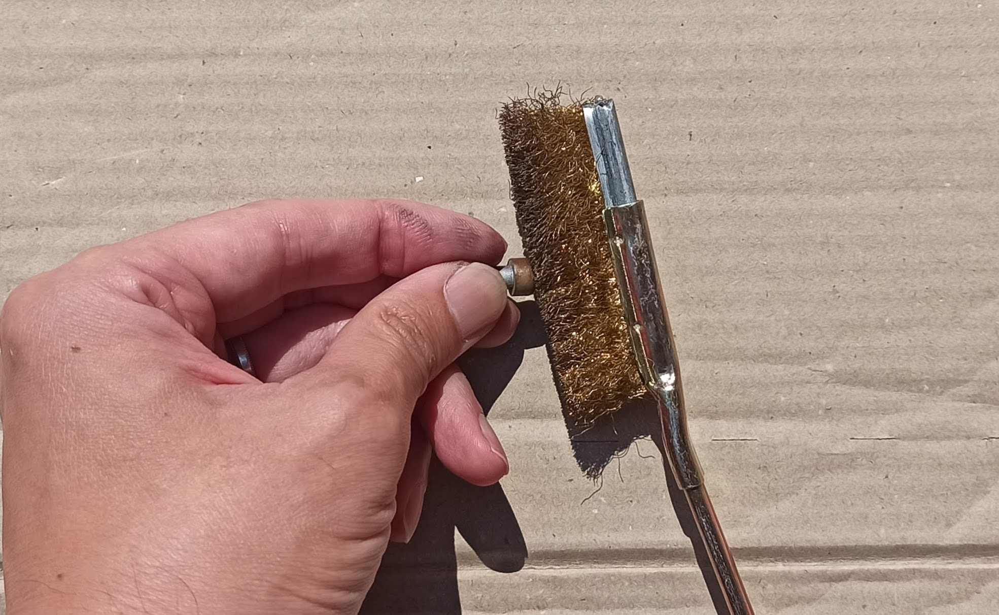

DREMELさんの登場です。

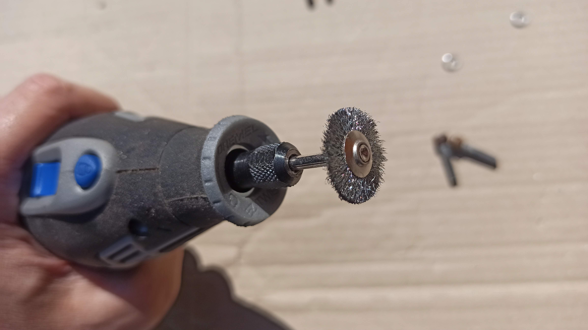

DREMELにワイヤーブラシディスクを付けて力技で擦ります。

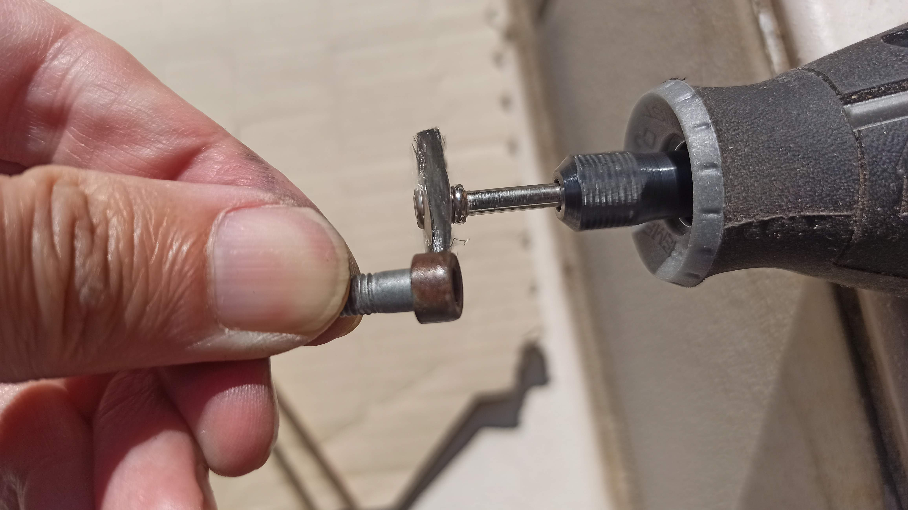

さすが電動の力、サビが取れました。

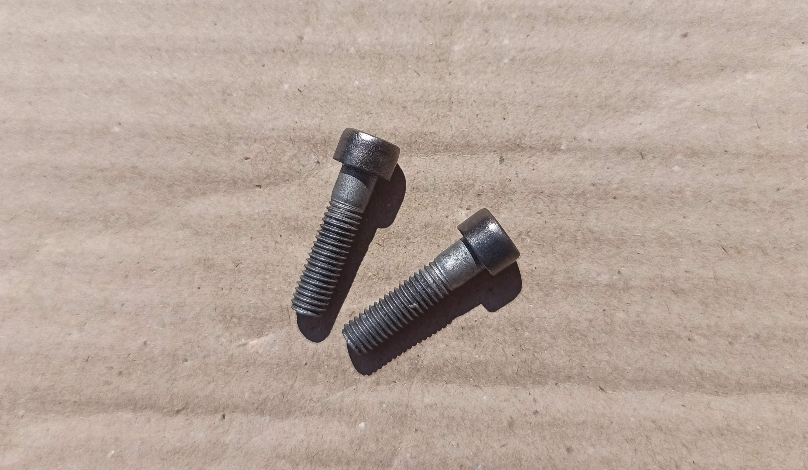

六角穴の打ち合わはサビが残っていますがここは仕方ないですね。

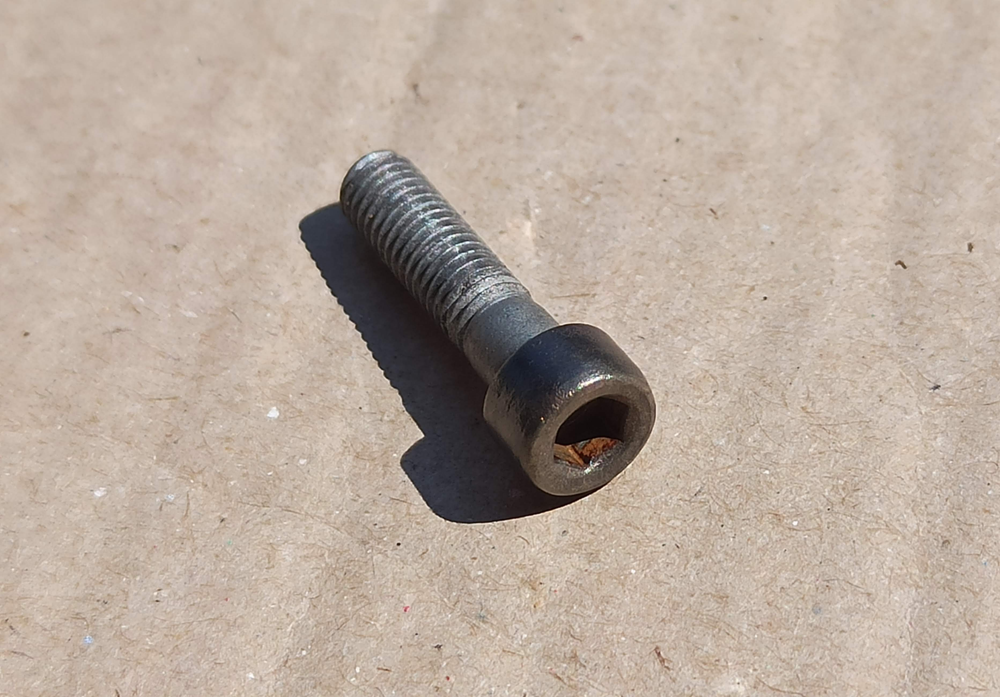

さて、問題の「ROVAL メッキカバー スプレー」の登場です。

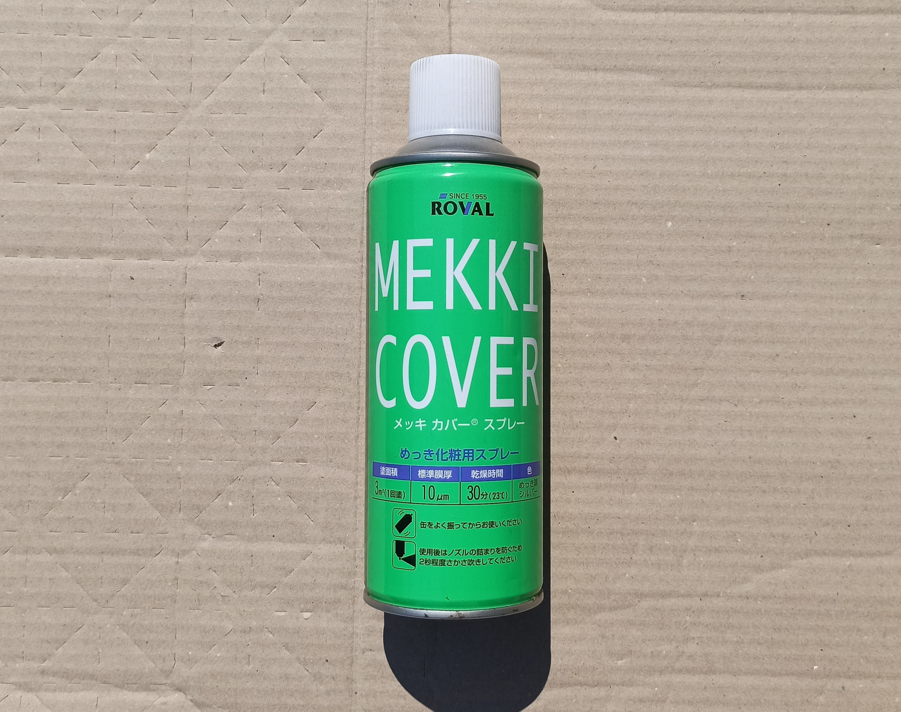

スプレーを吹いていきます。ねじ部ごとスプレーしてしまっていますが、このときは常温亜鉛メッキだと思っていたのでねじ部の防錆効果も期待してマスキングはせず全部スプレーを吹いてしまっています。

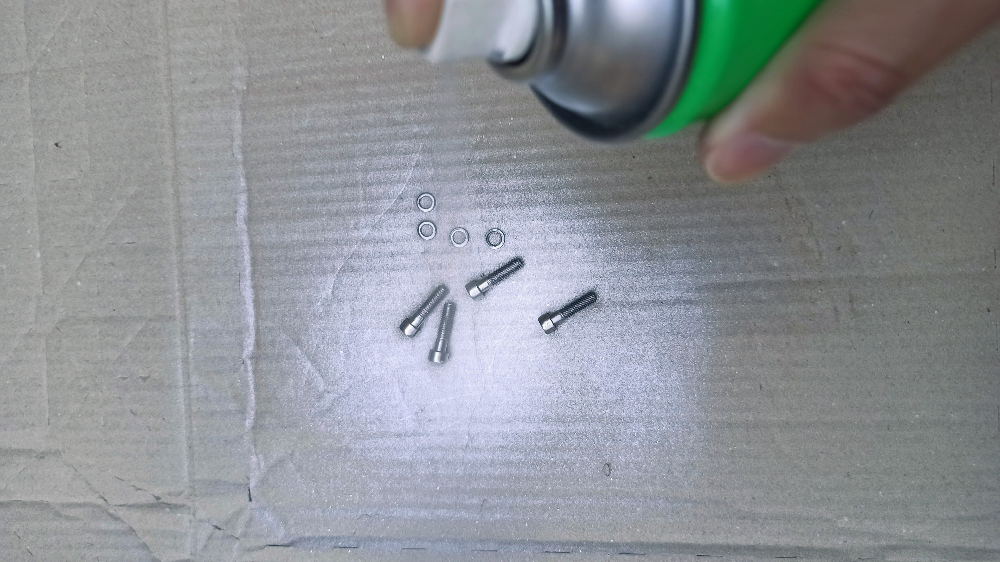

けっこう綺麗な銀色になりました。

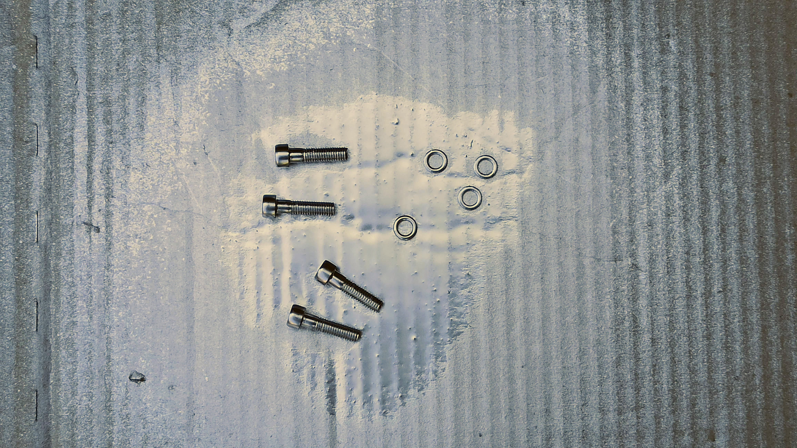

調子に乗って塗りすぎてしまい乾くのにまる一日以上かかってしまいました。。。

塗りすぎてボテッとしていますがなかなかの銀色ですね。

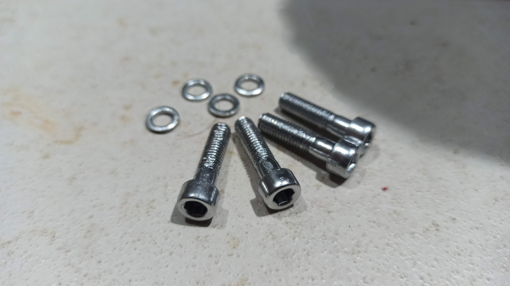

銀色に復活したボルトでハンドルを固定します。塗装膜が厚すぎてボルト頭側面がホルダーに擦りちょっと塗装が剥げてしまいました。六角穴の中も六角レンチで締める際に剥がれてしまいましたがとりあえず完了です。

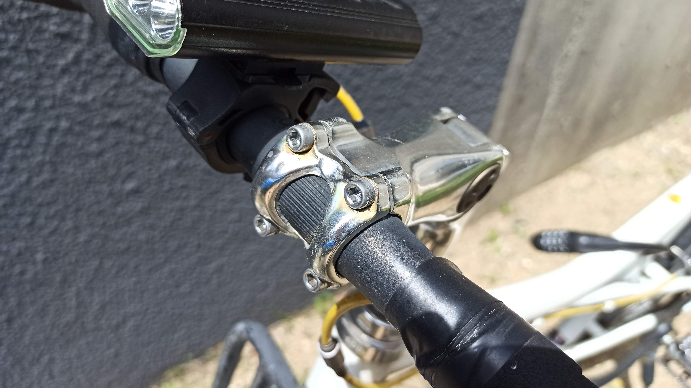

で、1年半前に同じことをして、結果が始めの錆びた写真です。ここまでやってようやく「ROVAL
メッキカバー」には錆止め効果が無いことを知りました。。。こんどは常温亜鉛メッキの「ROVAL」を購入して試してみたいと思います。

下リンクの製品が錆止め効果のある常温亜鉛メッキの「ROVAL」です。お間違えのないように。。。

[常温亜鉛めっきお ROVAL](https://www.roval.co.jp/products/roval/)

## まとめ

犠牲陽極作用で高い錆止め効果を発揮し、DIYでも簡単にできる「常温亜鉛メッキ」をやってみたつもりが錆止め交換の無いメッキ補修用塗料を塗っただけというオチでした。「ROVAL」と「ROVALメッキカバー」を間違えないようにしましょう。今後「ROVAL」を入手して常温亜鉛の錆止め効果を実験したいと思います。
