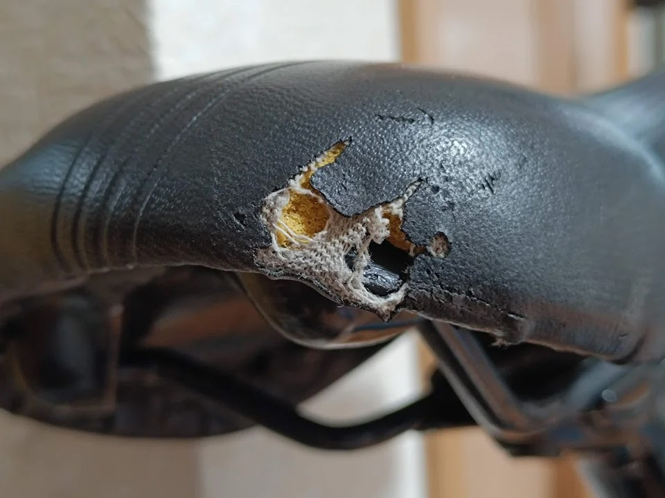
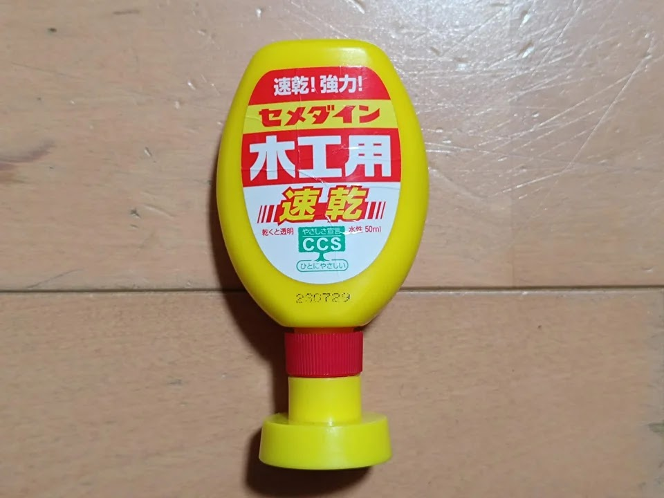

---
categories:
  - 自転車
  - bike
date: "2025-02-15T23:44:28+09:00"
description: 自転車の破れたサドルを革靴の補修材、アドベースとアドカラーという製品を使って補修をする方法を解説します。表面の合皮が破れたサドルは、雨が降ると中のスポンジが水を吸い、お尻が濡れて不快な思いをします。
draft: false
images:
  - images/001.jpg
summary: 自転車のサドルは長く使用していると表面の合皮が破れてきます。雨が降ると中のスポンジが水を吸い、自転車に乗るとお尻が濡れて不快な思いをします。革靴の補修材、アドベースとアドカラーという製品を使って補修を試みました。
tags:
  - サドル
  - アドベース/アドカラー
  - Fuji ACE24
  - Superfly24
title: 自転車のサドルの破れを補修
js: js/paad.ts
---

自転車のサドルは長く使用していると表面の合皮が破れてきます。雨が降ると中のスポンジが水を吸うので表面を拭いても自転車に乗ると水が染み出してきてお尻が濡れて不快な思いをします。革靴の補修材、アドベースとアドカラーという製品を使って補修を試みました。

## コロンブス　アドベース・アドカラー

靴の手入れや補修に関する製品を出しているコロンブス社の製品です。靴の傷を埋めるアドベース、色褪せを補修するアドカラーを使います。

アドカラーは様々な色があり、絵の具のようなチューブに入っています。アドベースとアドカラーセットで千円程度と価格も安いので失敗してもいいや、と思いアマゾンで購入しました。クロスも付いてきましたが今回は使いませんでした。



## 破れたサドル

子供用自転車のFuji Ace 24と、TREK Sperfly24のサドルが破れていました。

Fuji Ace 24のサドルは丸く剥がれています。

TREK Superfly 24のサドルは後ろが大きく破れています。

サドルごと交換するのが簡単ですが、TREKの刻印があるなど、捨ててしまうには惜しいので補修を試みます。

## アドベースで埋める

### Fuji Ace 24のサドル

まずはFuji Ace 24のサドルの皮が剥がれた部分にアドベースを塗布します。

お菓子の箱の切れ端をスクレーパー代わりに表面を整えます。

はみ出した部分を拭いて取り除きます。

なかなかいい感じに仕上がりました！

しかし、乾くと痩せてくるのか下地のスポンジに吸い込まれるのか凹んでくるので数回繰り返して追い盛りします。凸凹になってしまいました。

### TREK Superfly 24のサドル

次に、TREK Superfly
24のサドルです。こちらは破れが大きく、下地が空洞になっている部分があったり合皮もさらに剥がれそうです。

下地を作るため、適当な布の切れ端を合皮の裏に入れました。

木工用ボンドで布と剥がれそうな合皮を接着する作戦です。

ボンドで接着したままセロテープで固定します。

微妙な感じですが接着できたようです。

アドベースをモリモリ盛って、乾かしてを繰り返します。かなり凸凹ですがなんとかここまできました。

## やすりで形をととのえる

アドベースが乾いたら、サンドペーパーでフラットに仕上げます。サンドペーパーが無かったのでスポンジヤスリを使っています。

なんか微妙な感じになりましたが、妥協してこれでよしとします。

TREK Superfly 24のサドルはこんな感じになりました。

## アドカラーで塗装

絵の具用の筆でアドカラーを塗ります。広めに塗って、塗装と合皮の境界は布かティッシュペーパーでぼかすと境目が目立たなくなります。

## 補修後のサドル

アドカラーが乾いたあとのFuji Ace
24のサドルです。まあ、補修した部分は分かってしまいます。遠目からはあまり目立たないので素人補修としては上出来でしょう。

TREK Superfly
24のサドルです。補修した部分に光沢があり、凹凸もわかりますが、ぱっと見であればそこそこ満足できる仕上がりです。

靴用の補修材なので力がかかることはあまり想定されてなさそうなので耐久性はどうでしょうか。経時変化を見ていきたいと思います。

## まとめ

サドルの破れを靴用の補修材、アドベース／アドカラーで補修しました。補修した部分が分からない、というレベルにはならず凹凸や光沢の具合で補修跡が残りますが、遠目からは十分見るに耐えうる外観になりました。耐久性は疑問ですが、使用してどうなるかですね。

今付いているサドルにこだわりが無ければ、サドルごと交換した方が簡単です。サドルの革の張替えよりは楽です。


