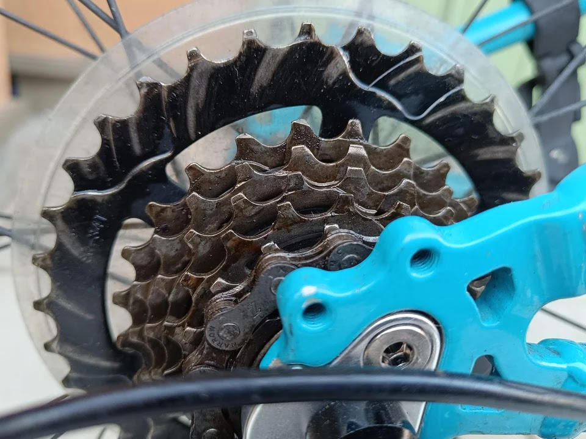

---
categories:
  - 自転車
  - bike
date: "2025-02-15T23:44:31+09:00"
description: 子供が毎日のように使っていたTrekSuperfly24。いつの間にかブレーキシューがすり減り金属部が露出しホイールをガリガリ削っていました。MTB用24インチホイールはあまり売ってなさそうで、子供も大きくなったため思い切って26インチ化に挑戦しました。
draft: false
images:
  - images/015.jpg
summary: 子供が毎日のように使っていたTrekSuperfly24。いつの間にかブレーキシューがすり減り金属部が露出しホイールをガリガリ削っていました。MTB用24インチホイールはあまり売ってなさそうで、子供も大きくなったため思い切って26インチ化に挑戦しました。
tags:
  - Superfly24
  - 26インチ化
  - 8速化
title: Trek Superfly24 ホイール26インチ+8速化 1 - まさかのタイヤ干渉
js: js/paad.ts
---

子供が毎日のように使っていたTrekSuperfly24。ノーメンテで放置していたらいつの間にかブレーキシューがすり減り金属部が露出しホイールをガリガリ削っていました。MTB用24インチホイールはあまり売ってなさそうで、子供も大きくなったため思い切って26インチ化に挑戦しました。

失敗だらけで散財し過ぎてしまいましたが、注意点含め記録に残します。

## リムの削れた Trek Superfly24

Trekの子供用24インチ自転車、Superfly24です。もう売られて無いみたいですが、太いタイヤに3×7速と使いやすく、見た目もかっこいいのか使用頻度の一番高い自転車です。

一度タイヤを交換しているので遠目からはまだまだ新しく見えますが、ホイールのリムがガリガリに削れています。

ブレーキシューが削れすぎて、ピンのような金属部が露出し、ガリガリホイールを削ってしまいました。ブレーキシューは交換済ですが、リムが割れてしまいそうです。

リムだけでなくチェーンも1度も交換したことが無いのでのびのびです。

ここまでチェーンが伸びているということは、チェーンリング、スプロケットも摩耗しているので交換ですね。

ということで、ホイール、チェーン、スプロケット関係をすべて交換してみます。

## 購入したもの

摩耗した部品の交換、のつもりで調べはじめましたが、まず24インチホイールが売ってない。MTB用、7速、リムブレーキというのが無い。まじっすか。アマゾンで中国メーカーと思われるものを見つけてオーダーしましたが、2週間くらい待たされた挙句キャンセルされてしまいました。AliExpressでも見つからず。世の中のMTBはディスクブレーキになり、27.5インチや29インチと大径化がトレンドなので24インチのVブレーキ仕様なんて無いのですね。。。

ということで、26インチの安物中華ホイールを購入することに。完組ホイールのフリーホイールは8速用。そうなるとカセットスプロケットも8速にしたくなり、シフターも交換することに。そうこうするとあれもこれもと欲が出てきてとんでもない散財をしてしまいました。

1.  [26インチ前後ホイール
    中華謎ブランド](https://www.amazon.co.jp/dp/B0B9GZ1FVB?&linkCode=ll1&tag=takasumir-22&linkId=f7aa08ea5b7786225bf7e0a3e3fb9f7c&language=ja_JP&ref_=as_li_ss_tl)
2.  [26インチタイヤ Panaracer ~~26×1.95~~ →
    26×1.5](https://www.amazon.co.jp/dp/B001LGX46Y?th=1&linkCode=ll1&tag=takasumir-22&linkId=e9fc23d51c672e81d05d1b23dc7ef28d&language=ja_JP&ref_=as_li_ss_tl)
3.  [26インチチューブ
    Panaracer](https://www.amazon.co.jp/%E3%83%91%E3%83%8A%E3%83%AC%E3%83%BC%E3%82%B5%E3%83%BC-%E3%83%81%E3%83%A5%E3%83%BC%E3%83%96-26x1-50-%E8%8B%B1%E5%BC%8F%E3%83%90%E3%83%AB%E3%83%96-0TH26-15E-NP/dp/B000ZX6ZW4?__mk_ja_JP=%E3%82%AB%E3%82%BF%E3%82%AB%E3%83%8A&crid=3OCWLRRYGLIUC&dib=eyJ2IjoiMSJ9.fHWUc0NwkQudhtjT4iafNXmGUfxOEcVbCf8mdvUpC9JKYmDdhUmdyj8PlhCDVqd39w2mNsQinJ86M5ubYfXSo5tZr8fth5kzGjsiK1iYgwG8xYbM7uNt8WutInGt4SdBSRR-tzOSg52LxIER3ImDQjuMsQt1MLczS544NJRH7bmsLqgJzx8tqZ8StS5PbQr6k6JOOKkTtjfVVTH8GDNQA5PnBDEEgqAk0ronG9oTHa-5Koxq_9PY6Txs39mEgLY2_4_xx0Xwsj_Op47GoIBV6gVvp2GOjWupCXSHZsQIj4MLgEz_0o4IpkKrMbU7-Jpothb9bYqzam-1jie6aruT0AvxDVKgCKV5Adp_czBkHFA.R1vKtotJLpcru9kvQG5asPPPoj1WaAnqvejNU0oZ7Cs&dib_tag=se&keywords=26%E3%82%A4%E3%83%B3%E3%83%81%2B%E3%83%81%E3%83%A5%E3%83%BC%E3%83%96&qid=1735912629&s=sports&sprefix=26%E3%82%A4%E3%83%B3%E3%83%81%2B%E3%83%81%E3%83%A5%E3%83%BC%E3%83%96%2Csporting%2C226&sr=1-19&th=1&linkCode=ll1&tag=takasumir-22&linkId=7c89983048ab6daf7df9b64b815a3ba1&language=ja_JP&ref_=as_li_ss_tl)
4.  [リムテープ
    SCHWALBE](https://www.amazon.co.jp/dp/B0013HBANU?&linkCode=ll1&tag=takasumir-22&linkId=199baa42a2dc35db24cfb557acf7f895&language=ja_JP&ref_=as_li_ss_tl)
5.  [8sカセットスプロケット
    Shimano](https://www.amazon.co.jp/dp/B00518SJ8G?th=1&linkCode=ll1&tag=takasumir-22&linkId=89ee04f11433895b864acf8f2e27f38e&language=ja_JP&ref_=as_li_ss_tl)
6.  [チェーンホイール SHIMANO ALTUS ~~48×38×28T~~ →
    42×32×22T](https://www.amazon.co.jp/dp/B00B7062N6?&linkCode=ll1&tag=takasumir-22&linkId=3970b496c1137d15a1ce08cf489f94c7&language=ja_JP&ref_=as_li_ss_tl)
7.  [フロントディレイラー SHIMANO ALTUS
    3×8S/7S](https://www.amazon.co.jp/dp/B005CMV9NI?&linkCode=ll1&tag=takasumir-22&linkId=c6f8460e36a86aaf2fb07c03de0095d1&language=ja_JP&ref_=as_li_ss_tl)
8.  [プーリー MicrOHERO 13 ×
    2個](https://www.amazon.co.jp/dp/B091F669NR?th=1&linkCode=ll1&tag=takasumir-22&linkId=64f44c6140a02495a7c2dc7e4eb462af&language=ja_JP&ref_=as_li_ss_tl)
9.  [Vブレーキシュー
    BBB](https://www.amazon.co.jp/dp/B003BH7O8U?th=1&linkCode=ll1&tag=takasumir-22&linkId=aeddec355a2ef000ab8fa5143856e5be&language=ja_JP&ref_=as_li_ss_tl)
10. [チェーン KMC Z8.3
    シルバー](https://www.amazon.co.jp/dp/B07T9BPDQF?&linkCode=ll1&tag=takasumir-22&linkId=813faddedfdc2217a10c1579397c9081&language=ja_JP&ref_=as_li_ss_tl)
11. [シフティング/ブレーキレバー SHIMANO ACERA
    8S](https://www.amazon.co.jp/dp/B01HI6T01S?th=1&linkCode=ll1&tag=takasumir-22&linkId=14312af2f71ca34e45626abe858c1966&language=ja_JP&ref_=as_li_ss_tl)
12. [ブレーキケーブルセット SHIMANO
    ステンレスMTB](https://www.amazon.co.jp/dp/B0050O89NQ?th=1&linkCode=ll1&tag=takasumir-22&linkId=e18ada2a95bea3deadaafe662cca76dd&language=ja_JP&ref_=as_li_ss_tl)
13. [シフトケーブルセット SHIMANO
    ステンレスMTB](https://www.amazon.co.jp/dp/B0050O89NQ?th=1&linkCode=ll1&tag=takasumir-22&linkId=e18ada2a95bea3deadaafe662cca76dd&language=ja_JP&ref_=as_li_ss_tl)
14. ( [シフティング/ブレーキレバー SHIMANO ACERA
    3S](https://www.amazon.co.jp/dp/B01HI6T054?th=1&linkCode=ll1&tag=takasumir-22&linkId=b7117e965f45cff6f7a7547796f9a830&language=ja_JP&ref_=as_li_ss_tl)
    )
15. ( [リアディレイラー ALTUS
    7/8S](https://www.amazon.co.jp/dp/B0050O89NQ?th=1&linkCode=ll1&tag=takasumir-22&linkId=e18ada2a95bea3deadaafe662cca76dd&language=ja_JP&ref_=as_li_ss_tl)
    )
16. ( [グリップ
    ノグチ](https://www.amazon.co.jp/dp/B0050O89NQ?th=1&linkCode=ll1&tag=takasumir-22&linkId=e18ada2a95bea3deadaafe662cca76dd&language=ja_JP&ref_=as_li_ss_tl)
    )



ちなみに、取消線で消したものは取付できず買い直したものです🙄
最後の3つ、括弧で囲んだものはまだ取付けしていません。リアディレーラーは後述しますが今付いているTourneyを流用しましたが、8速対応していなかったことに最後に気づきオーダー中、フロント用のシフティング/ブレーキレバーは在庫なしで待ち状態です。

## ホイールにタイヤを取付け−あとで悲劇が

購入したホイールです。注文から約2週間、どんなものが来るかドキドキでしたがそれなりにしっかりしてそうなものでした。

ブランドは、meijun？シールはすぐに剥がれてしまいそうですね。

フリーホイールは8/9/10スピードと記載、ハブはアマゾンの写真では真っ赤で謎のメーカーロゴもありかっこよさそうだったのですが、無地の黒塗装でした。なんだか安物感が漂いますが実際安物なのであきらめましょう。

チューブとリムテープです。リムテープはホイールに付属していましたがせっかくなのでSHWALBEのものを使います。

Panaracerの26インチ、26×1.95のタイヤです。ブロックパターンと赤いロゴがかっこよくお値段もリーズナブルでこれを選びましたが、後に悲劇を生むことに、、、

サクッとタイヤ取付け完了です。うーん、見た目いい感じ、いい感じなのでしたが、、、

さて、準備は完了です。ホイール交換していきましょう。

## ホイールを外す

自転車をひっくり返してホイールを外します。

外した24インチホイール(左)と新しく購入した26インチホイール(右)の比較です。2インチアップということでやはり大きいですね。嫌な予感が。。。

## 26インチホイールを付けたがタイヤが干渉

はい、後輪入りました！ん！？なんかホイールが回らないぞ？？

こ、これは、、、タイヤがフレームに干渉しているではないですか😧

確認したはず、なんでこうなった！？思い起こすと、直径2インチ、半径1インチ=25.4mm、隙間結構空いてるから余裕でいけるだろ、と測りもせずひと目見ていけると思い込んでいました。

これはどうしようも無いですね。痛い、痛すぎる！

悩んだ挙句、細いタイヤであれば径方向も小さくなるのでは、と考え26×1.5のタイヤを注文しなおしました。ここでタイヤが届くまで一時中断です。先が思いやられます。。。
