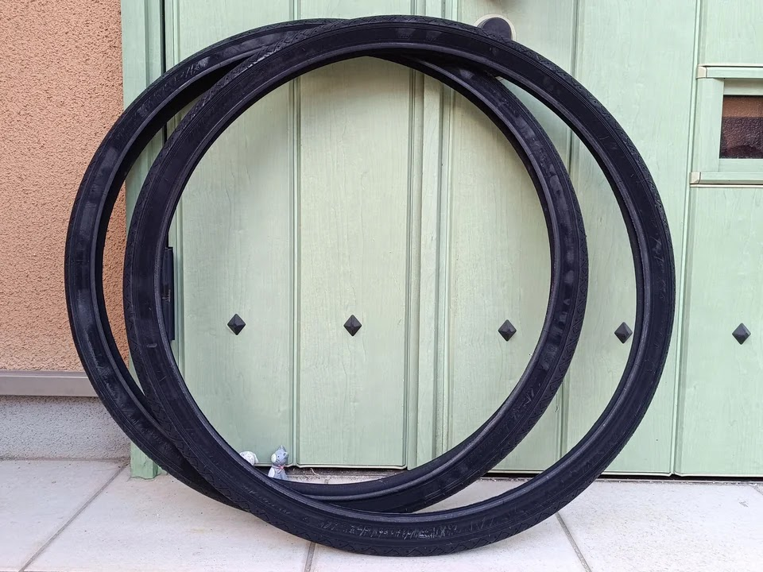
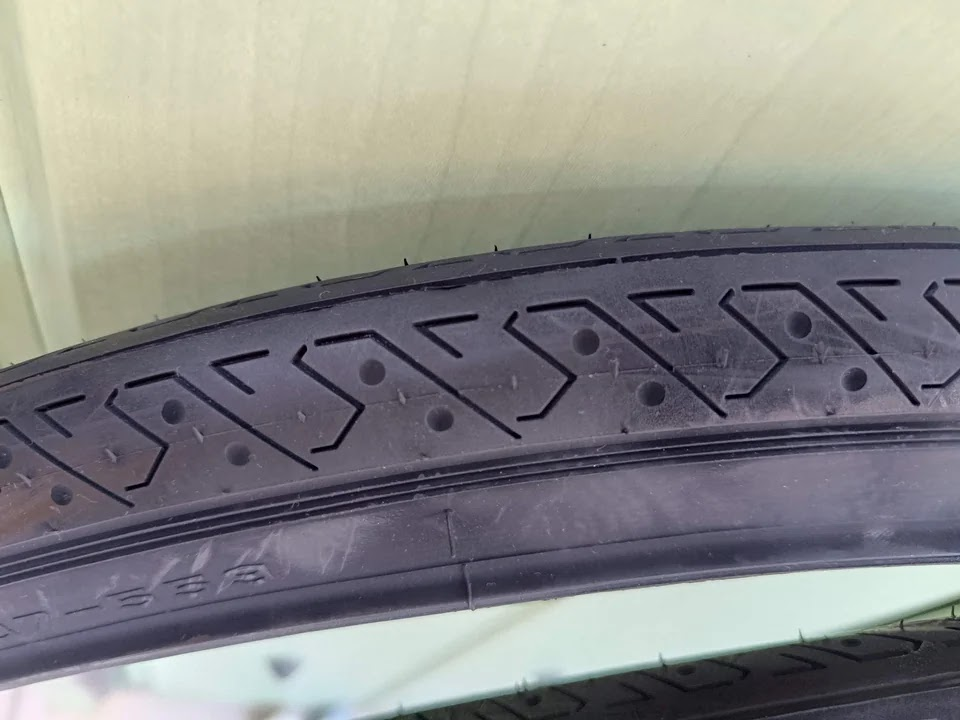
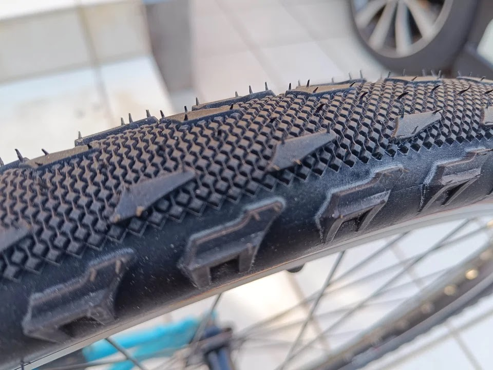
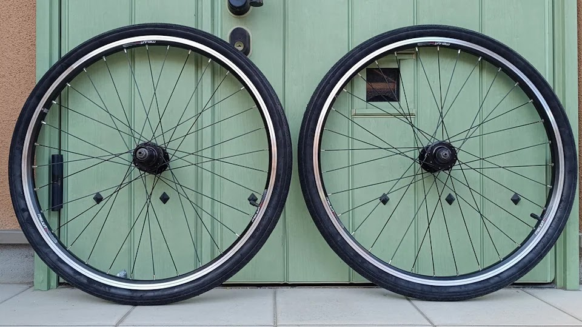
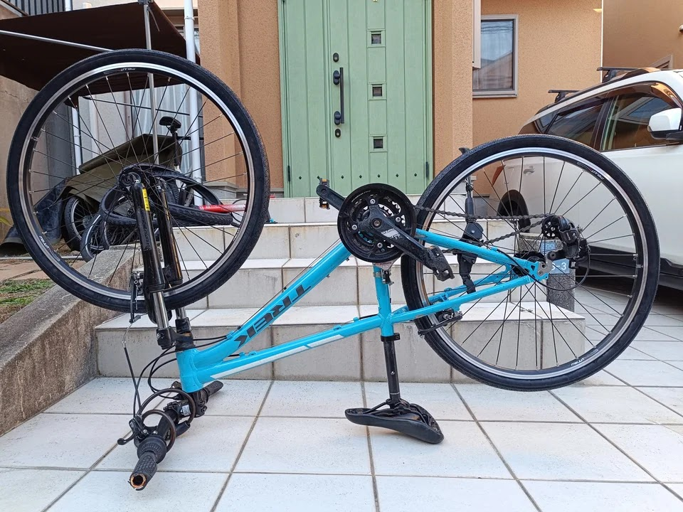
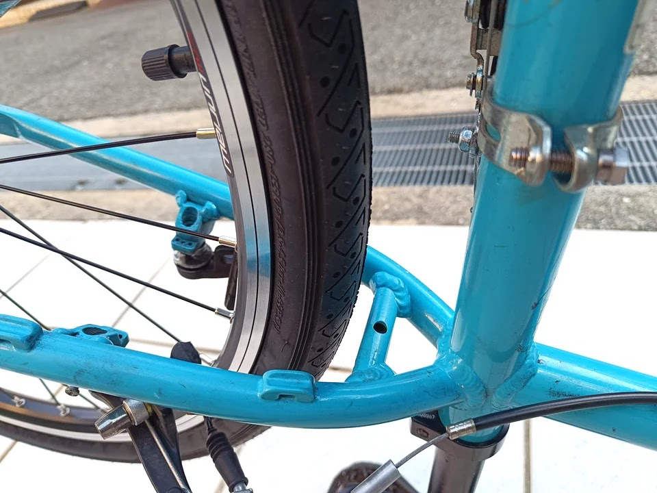
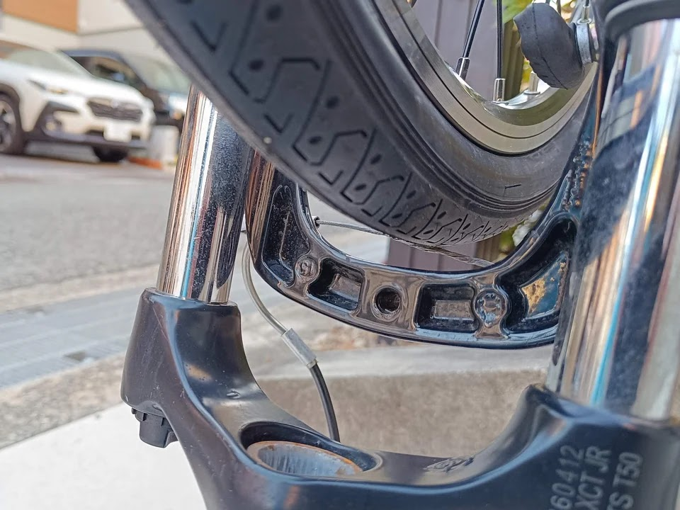

---
categories:
  - 自転車
  - bike
date: "2025-02-15T23:44:30+09:00"
description: 26インチホイールを取付けたら後輪タイヤがフレームに干渉してしまいました。購入したタイヤは、26×1.95でしたが、どうやら同じインチサイズでも幅が広いほど外径は大きくなるようです。細い26x1.5のタイヤを買い直し、無事に取付できました。
draft: false
images:
  - images/021.jpg
summary: 26インチホイールを取付けたら後輪タイヤがフレームに干渉してしまいました。購入したタイヤは、26×1.95でしたが、どうやら同じインチサイズでも幅が広いほど外径は大きくなるようです。細い26x1.5のタイヤを買い直し、無事に取付できました。
tags:
  - Superfly24
  - 26インチ化
  - 8速化
title: Trek Superfly24 ホイール26インチ+8速化 2 - 細いタイヤで干渉回避
js: js/paad.ts
---

[前回の記事](/bike/superfly24-26inch-8speed-1)
で26インチホイールを取付けたら後輪タイヤがフレームに干渉してしまいました。購入したタイヤは、26×1.95でしたが、どうやら同じインチサイズでも幅が広いほど外径は大きくなるようです。タイヤの断面はほぼ円形と考えると、幅が広がれば高さも高くなるのはあたりまえですね。車のタイヤであれば扁平率とかありますが。

より細いタイヤは、26×1.75、26×1.5があります。MTBには太いタイヤが似合うと思っていますが、中途半端に26×1.75にしてまた干渉したらさすがにメンタル折れそうなので安全に26×1.5にします。これで干渉したら26インチ化は諦めます。

購入したのはPanaracerのハイロードという製品。「転がり抵抗の小さいオンロード専用モデル」ということで、もはやマウンテンバイクと呼べなくなってしまいますが、致し方なしです。



届いたタイヤです。真っ黒ですね。

表面もツルンとしています。確かに転がり抵抗は少なそうですが見た目はフツーです。

干渉した26×1.95のタイヤはそれなりにマウンテンバイクしていました。本当はこういうほうがいいのですが。。。

## タイヤを交換し取付け

気を取り直しタイヤ交換です。サクッと26×1.5のタイヤを付けました。

ホイール取付けです、ドキドキ。

やった、いけた！

フロントタイヤも干渉なしです。26×1.95でも干渉してなさそうでしたが、これを見るとギリギリだったかもしれません。

よかった、よかった😆

これで勝ったも同然、残りの部品を交換していくだけだ、と、思ってましたがまだひと悶着もふた悶着もあったのでした。
