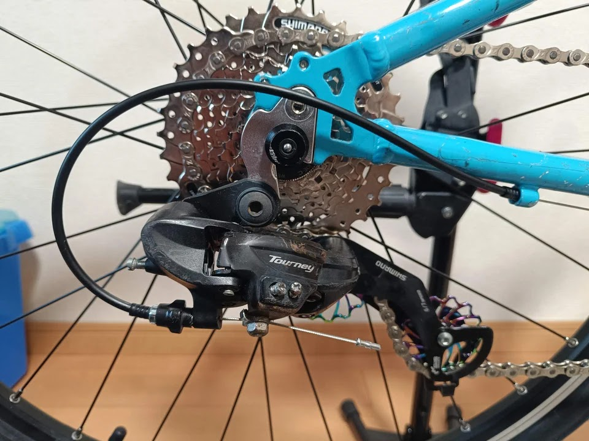

---
categories:
  - 自転車
  - bike
date: "2025-02-15T23:44:31+09:00"
description: Trek Supefly24のスプロケットを8速化しました。スプロケット含むコンポーネントの交換方法を解説します。
draft: false
images:
  - images/046.jpg
summary: Trek Supefly24のスプロケットを8速化しました。スプロケット含むコンポーネントの交換方法を解説します。
tags:
  - Superfly24
  - 26インチ化
  - 8速化
title: Trek Superfly24 ホイール26インチ+8速化 3 - いろいろあったが完成
js: js/paad.ts
---

[前回の記事](/bike/superfly24-26inch-8speed-2)
でホイール26インチ化がなんとかできました。残り8速化のコンポーネント関連を交換して完成です！が、いろいろありました。

## ホイール以外の部品交換

購入したものです。ここに写っていない物もあったり、一番目立つチェーンホイールは、後で述べますが使えず買い直していたりします。

## カセットスプロケット

ホイールにカセットスプロケットを取付けます。

これまでは7速のスプロケットでしたが、新しいホイールのフリーボディが8速用だったのでスプロケットも8速にしました。



## フロントチェーンホイール交換

コッタレスクランク抜き工具を使い、クランクを抜きます。

BBはスクエアテーパのカセット式です。少しガタが出てきているようで、交換したほうが良さそうでしたが購入していなかったのでこのまま使います。

そして新しいチェーンホイールを付けたのですが、、、

あれ、フレームと近くない？購入したのは48-38-28Tというもので、よく見ると外したものより径が大きいです。よく調べずに買ってしまいました。くそう😭
泣く泣く、42-32-22Tを買い直しました。



痛い出費です。シマノのALTUSですが、少しでもダメージを軽くとチェーンガードなしのモデルです。

前付いていたものと同じ歯数なので隙間を確保できました。高いお勉強代でした。

## Vブレーキ交換

ホイールをインチアップしたため、ホイールが届かなくなるため、ブレーキも交換します。

ブレーキシューを外径側に移動できるように、取付部の長穴が長いものです。RIDEAという結構お値段の高いものでした。安い類似品もありますが、評判が悪そうで、ブレーキなのでここはお金をかけてしっかりしたものを選定しました。

ちゃんと長穴がリムのブレーキ面まで来ています。

ブレーキシューを付けました。いい感じです、これはうまくいきました、よかったよかった😆

ワイヤーも取付け後のリアブレーキです。かっこいいですね。

フロントブレーキも同様に交換しました。



## シフターとリアディレイラーのプーリー交換

カセットスプロケットを8速にしたので、シフターも交換します。7速用のシフターを外します。

シマノACERAの8速用シフターとブレーキレバーがセットになったものを購入してみました。



フロント用シフターも同モデルを注文したのですが、在庫切れで未だ届かず。左右で見た目が異なり変な感じになってしまいましたが、気長に待つことにします。

さて、リアディレイラーはこれもよく調べず8速いけるだろ、と勝手に思い込み流用することにします。でも、何かいじりたくなってしまいセラミックベアリングのプーリーに交換します。MicrOHEROというメーカーです。



取付後です。レインボーカラーがかっこいいです。

よく回ります。

## フロントシフター交換

ここまで来たらと、フロントディレイラーも交換してしまいましょう。

シマノALTUSのフロントディレーラーです。



## 完成！

ここまできたらチェーンを付けてやっと完成です！

26インチ化され、ホイールが一回り大きくなりタイヤも細くなったのでクロスバイクの風貌になりましたが、これはこれでありかな、と思います。

ドライブトレインはほとんど新品に交換したのでピカピカで気持ちいです。

## 最後の落とし穴！

リアディレイラーの調整をしていたところ、あれ、なんかおかしいぞ？ローに入りません。

Tourneyのディレイラーですが、よく見ると6/7
speedとの文字が！ストローク足りませんね😭

7速と8速は、ギヤ間ピッチは一緒だったはずなので、2〜8速を使い、7速として使うことができるため、スプロケットとシフターは8速なのに7速でしばらく使うことにしました。8速用のディレイラーも届きましたが、ここまでで燃え尽きてしまい、そのうちやろうと先送りしています。

## まとめ

去年の秋頃から少しずつ部品を買い揃え、失敗して買い直したものもあり、散財してしまいましたがなんとかホイールの26インチ化と8速化、その他部品交換をして完遂（いや、まだ残ってますけど）できました！

総額は怖くて集計していませんが、これだけお金と時間をかけて改造するのであれば、新しい自転車を買うのが正解かもしれません。いろいろ勉強しながら楽しめたので、まあよしとしましょう。
