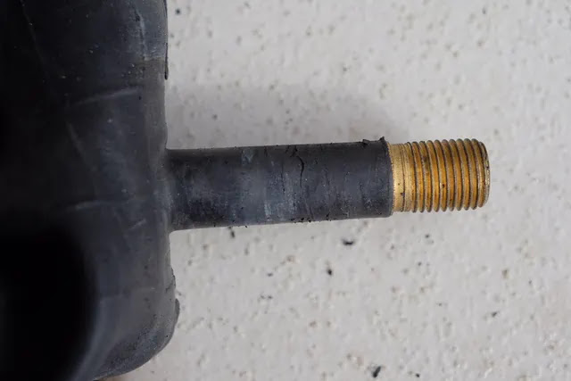

---
categories:
  - 自転車
  - bike
date: "2025-02-15T23:43:55+09:00"
description: MTBバイク風の子供用自転車、TREK Superfly24の前輪がパンクしたのでチューブを交換します。もともと付いていた米式バルブは子供が空気を入れにくいため、空気入れの簡単な英式バルブのチューブを選択しました。
draft: false
images:
  - images/DSCF6642.webp
summary: MTBバイク風の子供用自転車、TREK Superfly24の前輪がパンクしたのでチューブを交換します。もともと付いていた米式バルブは子供が空気を入れにくいため、空気入れの簡単な英式バルブのチューブを選択しました。
tags:
  - Superfly24
  - パンク修理
title: TREK Superfly24 パンク修理でチューブ交換 米式→英式バルブに変更
---

MTBバイク風の子供用自転車、TREK
Superfly24の前輪がパンクしたのでチューブを交換します。もともと付いていた米式バルブは子供が空気を入れにくいため、空気入れの簡単な英式バルブのチューブを選択しました。

## 英式バルブのチューブを購入

パンクしてヘナヘナの前輪です。

チューブ交換が必要ですが、パンクしていない後輪を見るとバルブがめっちゃ斜めになっています。この自転車は購入時から米式バルブが付いています。

米式バルブは虫ゴムが無いため英式バルブに比べて長持ちするし空気圧も測定できるため、個人的にはメリットが大きく英式バルブより米式バルブの方が好きです。しかし家族にとっては空気入れの使い方が分からない、うまく接続できないなどが理由で空気を入れず乗り続けると上の写真のようにチューブがズレて斜めになり、根元に負荷がかかってパンクしてしまいます。

結果、空気入れはお父さんの仕事になってしまい、大変なので今回交換するチューブは英式バルブにしました。

TREK
Superfly24のタイヤは、24×1.85だったので、チューブはSHWALBEの24×1.50〜2.40英式バルブのチューブを購入。バルブも変更するので前後とも交換です。

## パンクしたチューブを抜く

六角レンチでハブの固定ボルトを緩めます。この自転車はクイックリリースのボルト固定版というめずらしい固定方法です。

緩めたら自転車をひっくり返してホイールを抜きます。タイヤがブレーキに引っかかりますがパンクしているのでそのまま抜くことができました。

前後輪とも外しました。

次にタイヤのビードを落とします。ロードバイクだと硬いのでタイヤレバーを引っ掛けてこじっていますが、タイヤの大きいマウンテンバイクだからか手で簡単にビードを持ち上げてリムから外すことができました。素手では痛いのでグローブをしています。

一周ビードを落としていきます。

チューブを引っ張り出します。

バルブをリムから抜きます。

購入から6年、初めてタイヤを外しましたがリムテープはきれいです。リムテープはこのまま使うことにします。

外したチューブはバルブのゴム部分に亀裂があります。バルブが斜めになってリムの穴と擦れてゴムがひび割れたのがパンクの原因です。

## 新しいチューブを入れる

新しいチューブです。英式バルブです。英式バルブのチューブは、基本的にロックナットがあるので空気が抜けてきてもロックナットのおかげでバルブが沈み込むことがありません。

バルブをリムの穴に通すため、バルブコア、ロックナット等を外します。

バルブをリムに入れます。

チューブをタイヤの中に押し込んでいきます。

チューブを入れたらタイヤのビードをリムに入れていきます。

ビードを引き上げてリムの内側にどんどん入れていき、、、

最後はこんな感じでパツンパツンになります。

ロードバイクだと、最後のここを入れるのが固くて大変なのですが、あっさりと入りました。タイヤが太いと入れやすいのですね。

バルブにロックナット、バルブコアを入れてキャップをしてできあがりです。

最後にビードとリムの間にチューブを噛み込んで無いか忘れずに一周確認しましょう。

## 空気を入れる

空気入れですが、一度我が家の自転車を全て米式と仏式バルブにしてしまったので英式バルブ用の洗濯バサミみたいな口金がどこかにいってしまいました。今回新たにTOPEAKの英式バルブ用口金を購入しました。

airboneの米式、仏式バルブ共用の口金（左）に英式バルブ用口金（右）を接続します。

これで英式バルブ対応です！

バルブに接続します。英式バルブは虫ゴムが劣化したり、構造上空気圧が測れないというデメリットがありますが、こうして挟むだけで空気が入れられるのでお手軽ですね。これであれば子供でも空気を入れることができます。全ての自転車から一度英式バルブを撤去して今回改めて英式バルブの良さを実感しました。

## タイヤを取り付けて完成

先にタイヤに空気を入れてしまったので、ブレーキに干渉するためブレーキワイヤーを一度外してからホイールをセットします。

完成です。これでまたしばらくは乗れそうですが、タイヤがツルツルになっていたので今度はタイヤ交換をしたいと思います。

