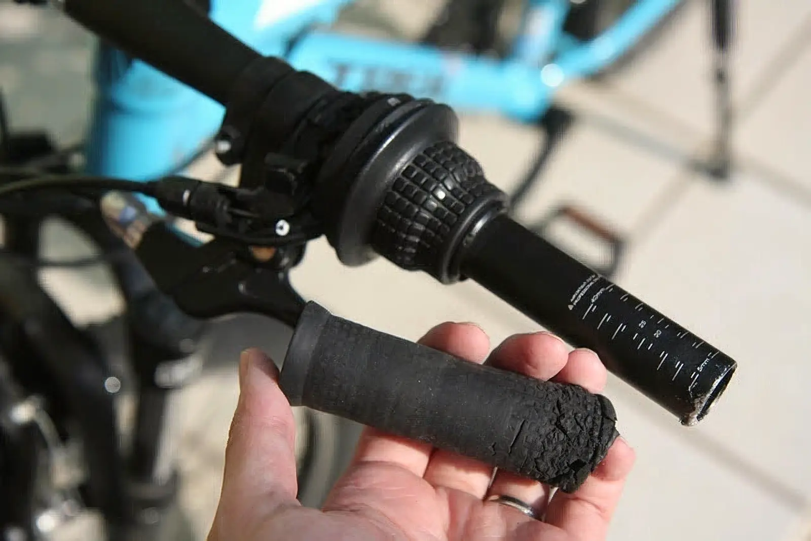
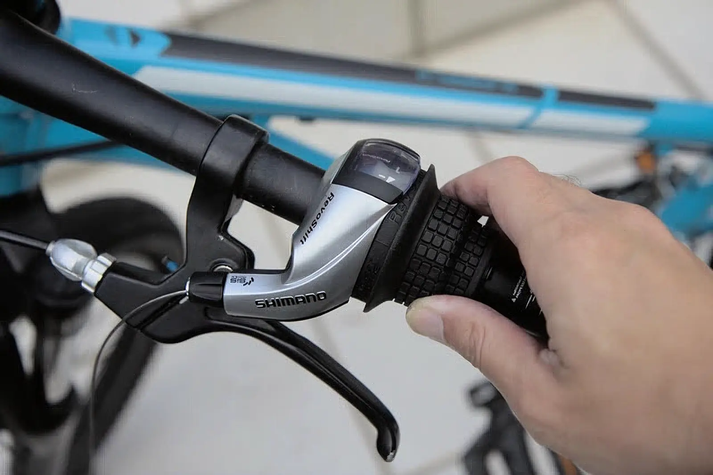

---
categories:
  - 自転車
  - bike
date: "2025-02-15T23:43:32+09:00"
description: 子供の自転車、TREK Superfly 24のフロントシフターのカバーが破損してしまいましたのでDIYで新品に交換しました。交換方法と注意点を解説します。
draft: false
images:
  - images/TcgPx.webp
summary: 子供の自転車、TREK Superfly 24のフロントシフターのカバーが破損してしまいましたのでDIYで新品に交換しました。
tags:
  - Superfly24
  - シフター
title: TREK Superfly 24 フロントシフター交換
---

子供の自転車、TREK Superfly
24のフロントシフターのカバーが破損してしまいましたのでDIYで新品に交換しました。

## TREK Superfly 24のフロントシフター破損

長男の乗っている自転車、TREK Superfly
24です。24インチのカッコよい外観で、当時6万円超えと子供用自転車としてはかなり高額でしたがY's
Roadで購入したものです。小学2年生から中学生になってもまだ乗り続けているのでまあ、元は取れたかなと思います。

チェーンに油を差すくらいでほぼノーメンテでしたが、今回初めての故障らしい状況になりました。どこかにぶつけたのかフロントシフターのカバーが取れてしまいました。はめあい部のピンが割れているので元に戻すことはできません。

## 新しいフロントシフターを購入

新しいフロントシフターをアマゾンで購入しました。シマノの製品でRevoShiftと書いてあります。これで千円ちょっとでした、驚きの安さです。

## フロントシフターの取り外し

早速フロントシフターを外していきましょう。まずはグリップを抜く必要があります。普通、自転車のグリップは入れたが最後、きつくて抜くことなどできないので切って取ることになりますがTREK
Superfly
24のグリップは何故か弛く、普通に走っていても抜けてくるようなものだったので幸いにも引っ張って簡単に抜くことができました。

ゴムがボロボロですね。。。

これでフロントシフターを外すことができます。フロントシフターは、六角穴付きボルトでハンドルにクランプされているため、六角穴付きボルトを弛めます。

六角穴付きボルトを弛めましたがワイヤーがあるためハンドルからフロントシフターを抜くことができません。ワイヤーは下写真のように止められていて、横に抜くことはできず、フロントディレーラー側を外して引き抜く必要があるようです。

フロントディレーラーのワイヤー固定ナットを弛めます。ナットの二面幅は8mmでした。

フロントディレーラーからワイヤを外したら、フロントシフターをハンドルから抜くことができます。下の画像が取り外したフロントシフターです。後ろに見えているワイヤーのアウターケーブルは使いまわすので抜いておきます。

フロントシフターを抜いたあとのハンドルです。

## フロントシフターの取り付け

新しいフロントシフターをクランプボルトを弛めてハンドルに入れます。

古いフロントシフターのワイヤーから外したアウターケーブルを新しいフロントシフターのワイヤーに挿入します。ワイヤーにシリコンスプレーを吹いて潤滑しておきました。

フロントディレーラーにワイヤーを固定します。シフターは1速にしてたるみが出ないように少し引っ張りながら固定します。写真のようなワイヤー引き工具があると便利です。

余ったワイヤーをカットします。このフロントシフターにはワイヤーが付属しているんですが、ワイヤーエンド金具がありませんでした。なので、ワイヤーエンド金具を後ほど購入し取り付けしようと思います。

フロントシフター取り付け後のハンドルです。新品になりました！

フロントシフター交換後の全体写真です。横からでは何もわからないですが、元通りになりました！フロントディレーラーの調整は、ワイヤーテンションを少し調整する程度で済みました。

グリップがボロボロなのでグリップの交換もしていきたいと思います。
