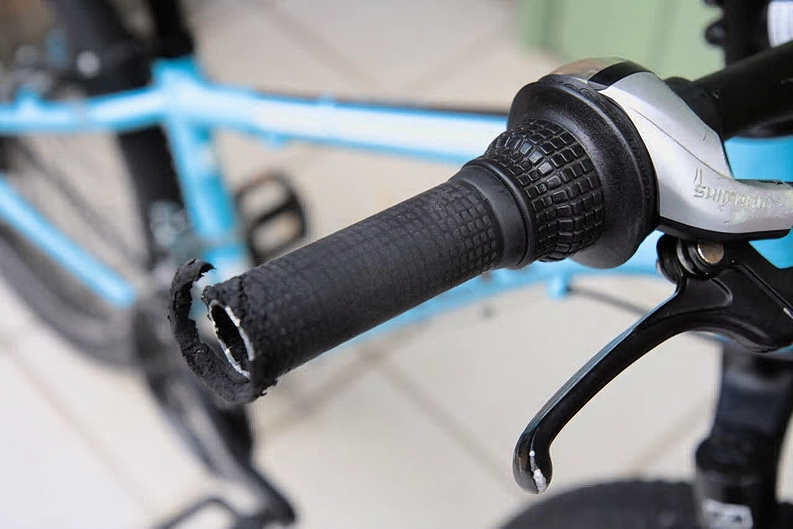

---
categories:
  - 自転車
  - bike
date: "2025-02-15T23:43:32+09:00"
description: 子供用自転車TREK Superfly 24のハンドルグリップもボロボロになっていたので、Gorix エルゴグリップに交換しました。リーズナブルなお値段で握りやすい形状です。
draft: false
images:
  - images/qMaXN.webp
summary: 先日フロントシフターを交換した子供用自転車TREK Superfly 24ですが、ハンドルグリップもボロボロになっていたのでこちらも新しいものに交換しました。
tags:
  - グリップ
  - Superfly24
  - Gorix
title: Gorix エルゴグリップ GX-AGOO
---

先日フロントシフターを交換した子供用自転車TREK Superfly
24ですが、ハンドルグリップもボロボロになっていたのでこちらも新しいものに交換しました。

## Gorix エルゴグリップ (GX-AGOO)

グリップに求める機能を整理してみます。

-   簡単にボロボロにならなそうな材質、形状
-   今のグリップはだんだん抜けてくるためクランプできるもの
-   左右ともショートグリップ
-   外観が良い（見栄え）
-   子供用なのであまり高価なものはNG

アマゾンで探してみましたがショートグリップはそれほど種類が無く、その中で良さそうなものとしてGorix
エルゴグリップ (GX-AGOO)
を選びました。お値段もリーズナブルなわりにしっかりしていそうです。

TREK Superfly
24にはじめから付いていたグリップは約80mmでしたがそこまで短いものを見つけられず、これは95mmですがなんとかなるでしょう。

## 古いグリップを外す

早速ボロボロのグリップを外していきます。満身創痍のグリップです。先端が削れていますが壁にかけたり地面に置かれたりと雑に扱われたのでしょう。子供だから仕方ないですね。

このグリップはあまりきつくなく、ハンドルもシボ塗装というかサラサラした表面のため普通に使っていてもだんだん抜けてきてしまうものでした。普通は一度入れたグリップを簡単に抜くことはできず、切って取ったりするのですがこれはズルズルめくることができるめずらしいグリップでした。

材質も薄くて柔らかいゴムなので耐久性は悪いのでしょう。

外したグリップです。まあ、5年間も乗っているのでお疲れ様でした。

## Gorix エルゴグリップ (GX-AGOO)の取付け

新しいグリップ、Gorix エルゴグリップ
(GX-AGOO)です。少し平たく膨らみがあり、手のひらを乗せて力を分散させるエルゴデザインとのことです。なかなか掴みやすそうな形状です。根元のボルトでしっかりハンドルに固定できます。バーエンドキャップも付いていました。

クランプ部は割りを入れたリングをボルトで締め上げる構造です。オレンジ色のプラスチックが間に入っているのでボルトを締めてもハンドルに傷はつかないようになっています。

クランプ部のボルトです。M4ですが十分でしょう。ボルトの材質はステンレスではなく、鉄のユニクロメッキでしょうか。野ざらしだとサビが心配ですね。

これのグリップをハンドルに挿入してボルトを閉めればおしまいなのですが、ハンドルバー先端が傷つきカエリが出ているためキツくて入っていきません。

片側はゴリゴリしながら無理やり入れましたが相当体力を消耗したのでもう片方はしっかりDremellでカエリを削り取ります。

だいぶ削りました。

スポンと先程の苦労が嘘のように入りました。もともと80mmのグリップでしたが、95mmを入れるのでブレーキとシフターも内側へ寄せる必要があります。それぞれボルトでハンドルバーにクランプされているのでボルトを弛めて内側へ寄せます。

このくらい入れば大丈夫でしょう。

バーエンドキャップを入れて完成です。バーエンドキャップはハンドルバーの内側に圧入されますが、固いので軽くプラハンで叩いて入りました。

上から見た写真です。ブレーキが短い気がしますが、これはもともとでしょう。シフター、グリップが新しくなりここだけ見ると新品の自転車のようです。

ということで完成です。子供用自転車としては高いTREK Superfly
24でしたが5年も使ってまだまだ乗れそうなので期間を考えると安い買い物だったと言えるかもしれません。何しろ、カッコイイので自分も子供の頃に欲しかったなと思える自転車です。

