---
categories:
  - 自転車
  - bike
date: "2025-02-15T23:43:56+09:00"
description: 先日子供の自転車 TREK Superfly24 がパンクしてチューブ交換したのですが、タイヤも摩耗していたので今回、新しいタイヤを注文してタイヤ交換しました。タイヤ交換方法を解説します。
draft: false
images:
  - images/35.webp
summary: 先日子供の自転車 TREK Superfly24 がパンクしてチューブ交換したのですが、タイヤも摩耗していたので今回、新しいタイヤを注文してタイヤ交換しました。
tags:
  - Superfly24
  - タイヤ交換
title: TREK Superfly24 タイヤ交換
---

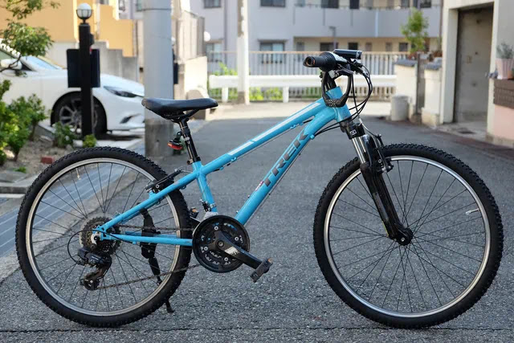

先日子供の自転車 TREK Superfly24
がパンクしてチューブ交換したのですが、タイヤも摩耗していたので今回、新しいタイヤを注文してタイヤ交換しました。

前回チューブ交換した TREK Superfly24
です。遠目にはわからないのですが、、、

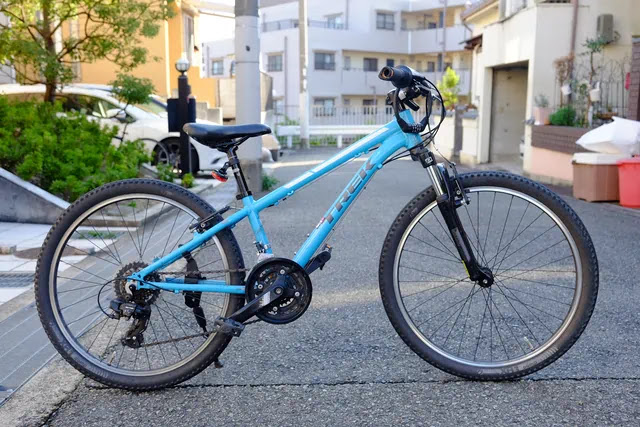

タイヤのブロックがほとんど残っておらず丸坊主です。ゴムが剥げてプライコードまで露出しています。さすがにもう使えません。

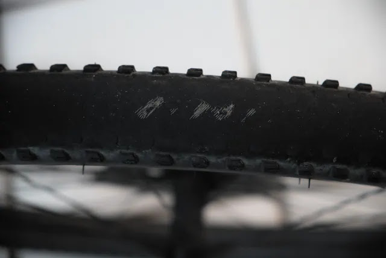

タイヤ交換していきます。まず自転車をひっくり返します。

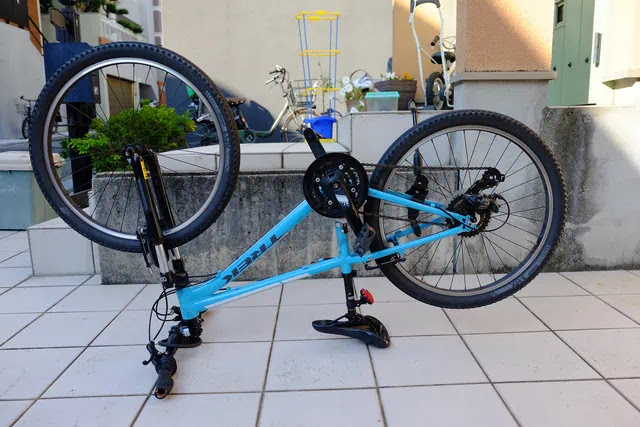

ハブ固定ボルトを緩めます。

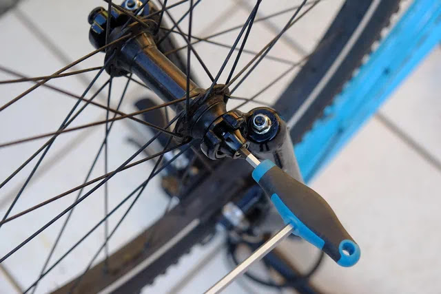

後輪はギヤをトップに入れてチェーンを外側にしておくと外しやすいです。

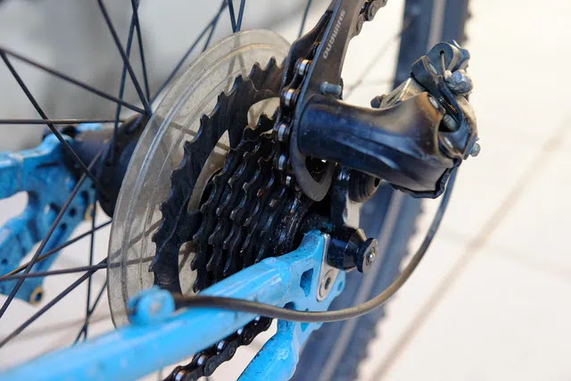

タイヤにエアが入ったままだとブレーキに干渉してホイールを抜くことができません。ブレーキワイヤーを緩めるのが通常のやり方だと思いますが、面倒なので先にタイヤの空気を抜いて、タイヤがブレーキをすり抜けられるようにします。

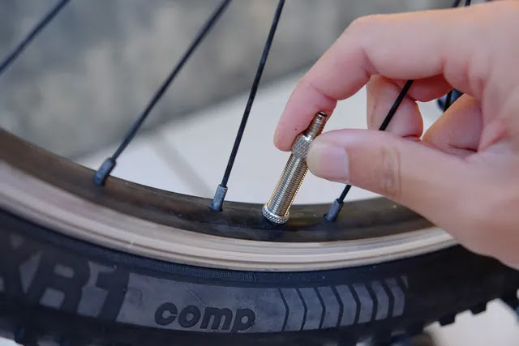

ホイールを外します。

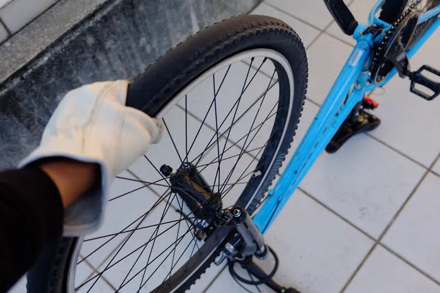

前後ともホイールが外れました。

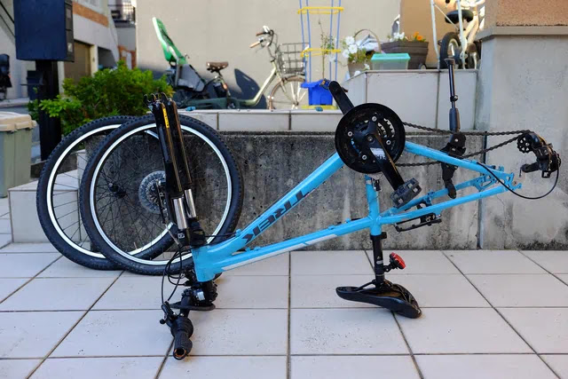

丸坊主のタイヤたちです。

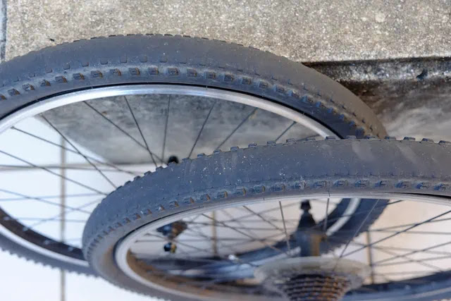

タイヤのサイドを指で上に持ち上げながらビードをリムから外します。タイヤレバーがあると楽ですがマウンテンバイクの太くて高いタイヤは手だけでビードを落とすことができます。素手だと指が痛いので手袋必須ですが。タイヤのサイド部もひび割れしていますね。。。

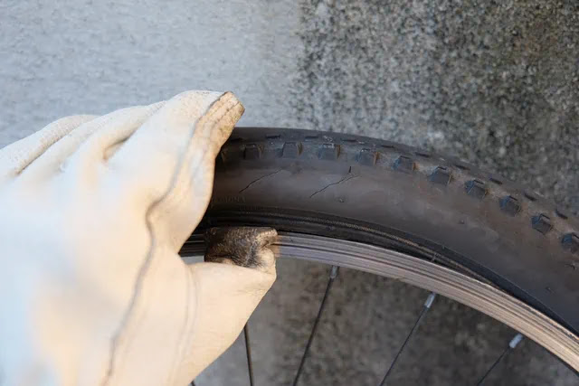

この状態になったら、全周ビードを外していきます。

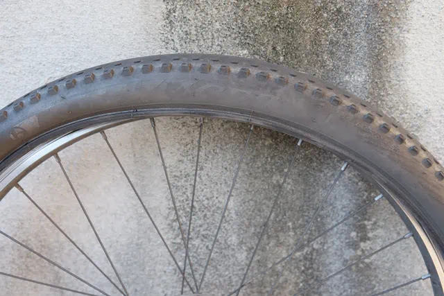

手前側のビードを一周外すことができました。

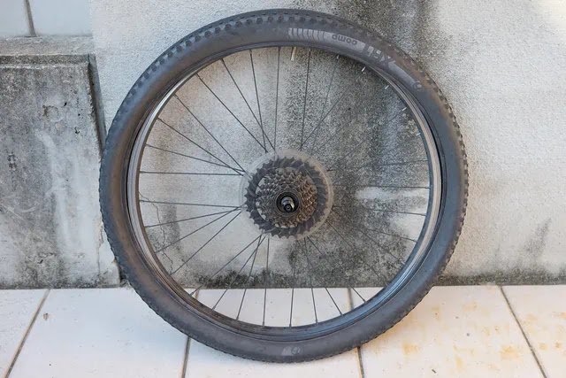

チューブを引き出して抜いておきます。

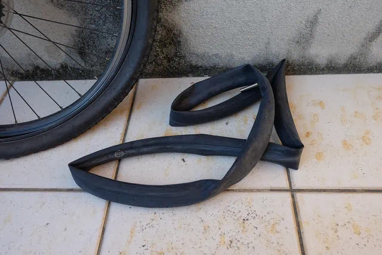

チューブを外したら、タイヤを手前に引っ張りホイールから外します。

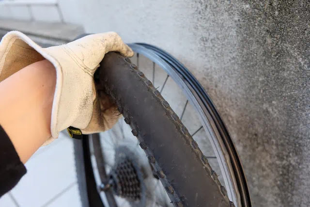

ホイール、タイヤ、チューブです。

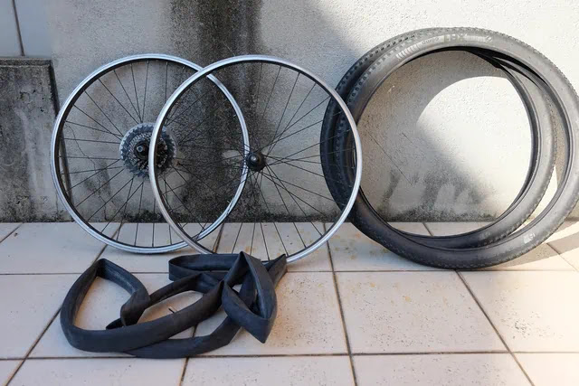

TREK 純正の BONTRAGER のタイヤはかっこいいです。サイズは24×1.85でした。

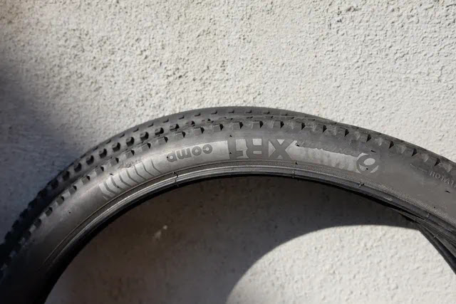

同じもの、といきたいところですが Amazon ではもちろん売っていなく、TREK
取り扱い店で注文できるかもしれませんが、面倒なので Amazon で IRC
のタイヤをポチりました。

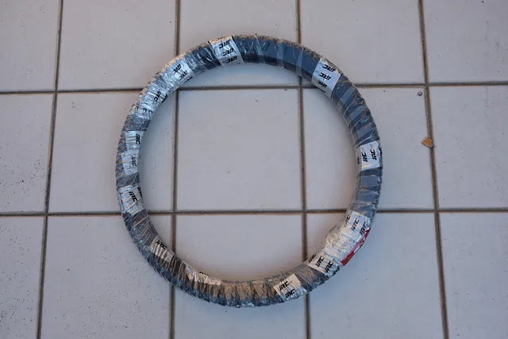

サイズは24×1.75で少し細くなります。

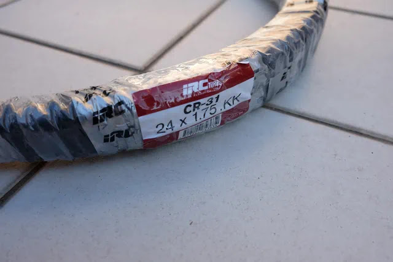

タイヤ、チューブ、リムテープ（ゴム）が2セットあります。

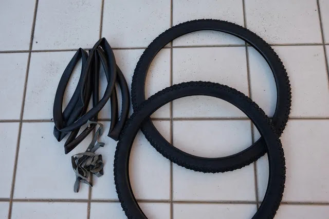

チューブは SCHWALBE のものに交換したばかりで、SCHWALBE
のバルブコアは、スーパーバルブのようなひと工夫されたものです（写真上）。付属していたチューブは「虫ゴム」が入った昔からあるバルブ（写真下）なので、SCHWALBE
のチューブを再利用することにしました。

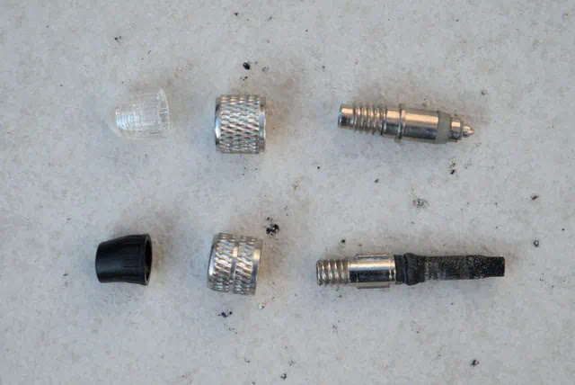

リムテープもきれいなので交換せずそのまま使います。

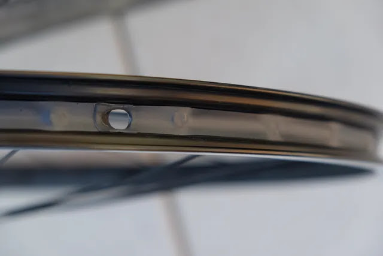

付属の粉まぶしされたゴムより長持ちしそうです。

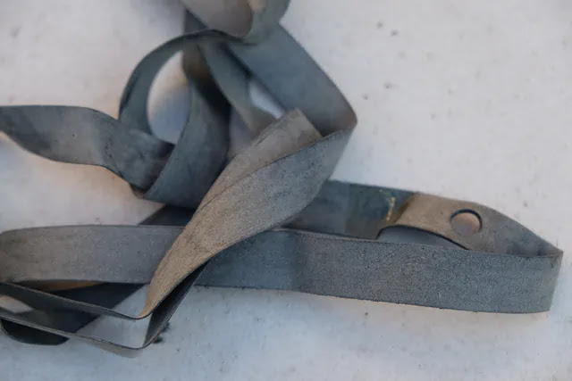

このタイヤには回転方向指示があります。矢印の方向に回るように取り付けましょう。前輪は間違えてもホイールごとひっくり返せばよいのですが後輪はスプロケットがあるためそうはいかないので注意しましょう。

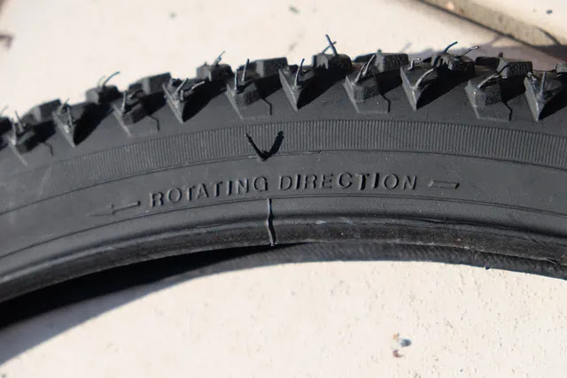

ブロックパターンはこんな感じです。ひげ（スピュー）があるので毛虫みたいですね。

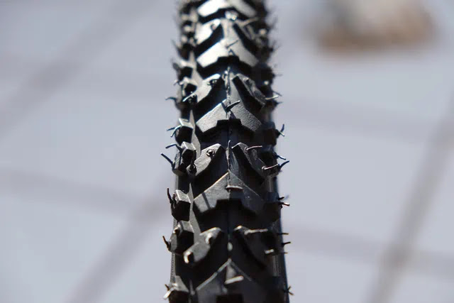

タイヤを取り付けていきます。まずはビードの片側をリムに入れます。

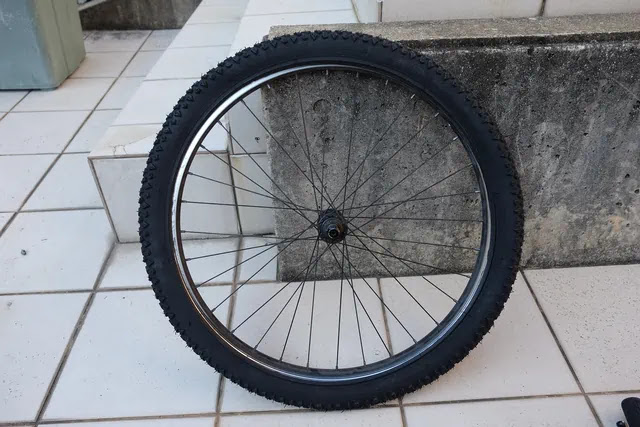

チューブのバルブをホイールの穴に入れます。

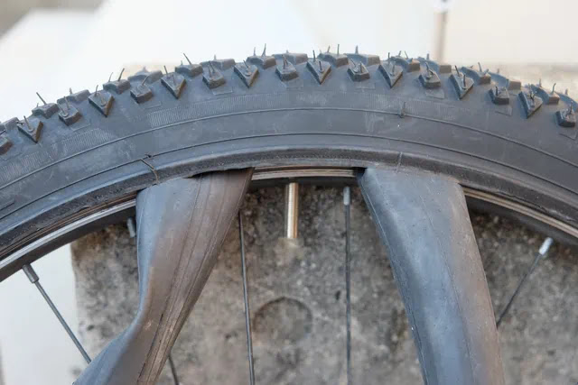

隙間からチューブを入れていきます。SCHWALBE
のチューブは高級感があります。

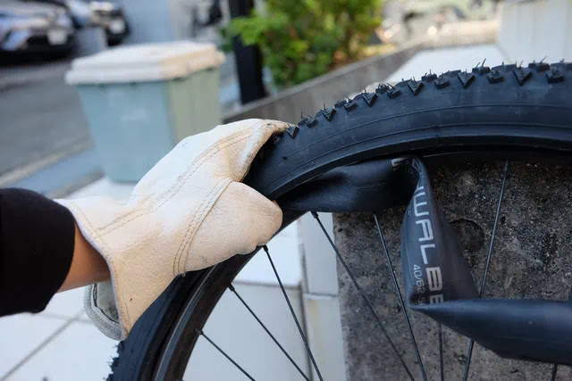

チューブが入りました。

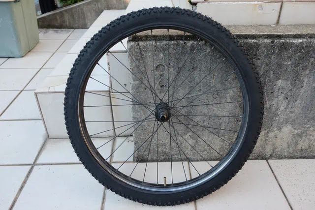

もう片側のビードを持ち上げてリムの内側に入れていきます。

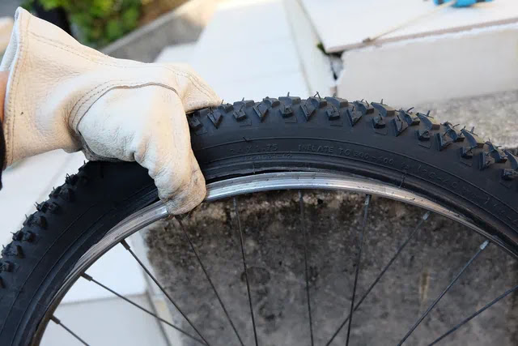

チューブを噛まないように注意しながら一周入れていきます。

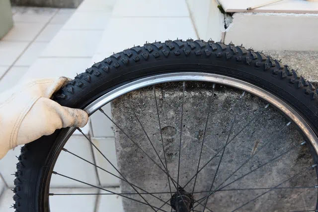

なんかビード付近が裂けていますが、、、見なかったことにします。。。

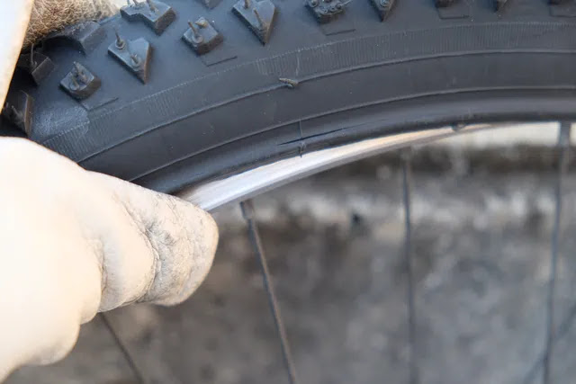

ビードが両側入りました。タイヤレバーは使わず手でいけました。

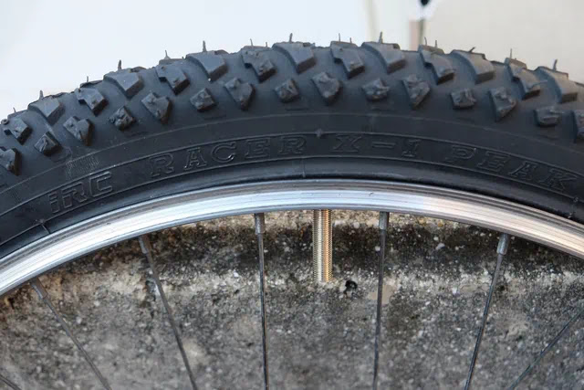

チューブが飛び出していないか両側全周確認します。

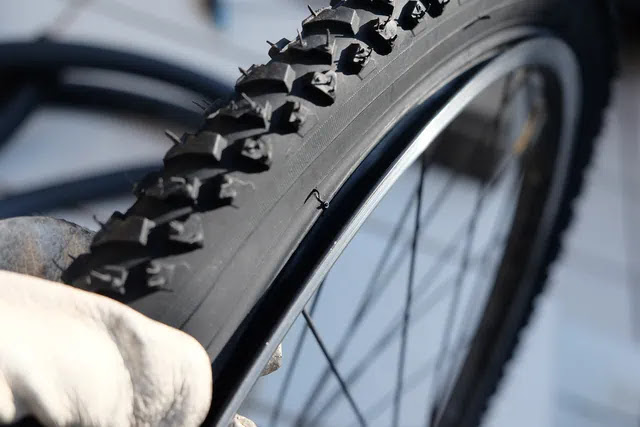

空気を入れる前にホイールを自転車に取り付けます。

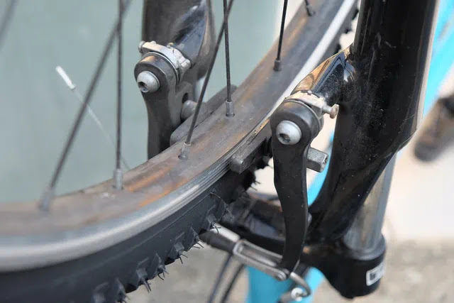

バルブコアを入れてから空気を入れます。

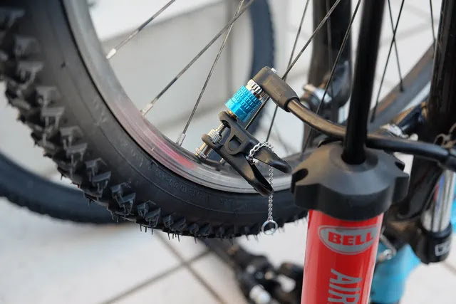

完成です！

これでまたブロックが摩耗して丸坊主になるまで数年はもつでしょう。しかしハブがゴリゴリしていたり他にもメンテ必要そうです。子供は毎日のように自転車に乗るので摩耗も激しいですね。

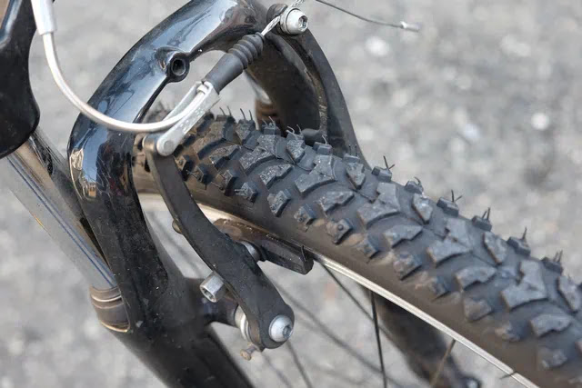
