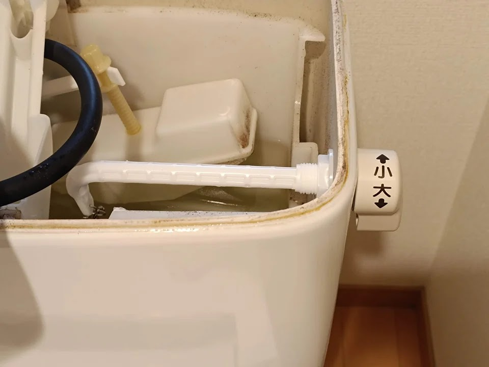

---
categories:
  - DIY
date: "2025-02-15T23:44:28+09:00"
description: トイレのレバーハンドルから水がじわじわ滲み出している場合の対処法を解説します。LIXILからレバーハンドル一式を購入し、DIYで交換する手順を写真付きで説明します。
draft: false
images:
  - images/001.jpg
summary: トイレのレバーハンドルから水がじわじわ滲み出していることに気づきました。LIXILからレバーハンドル一式を購入できるので自分で交換してみました。
tags:
  - トイレ
  - レバーハンドル
  - LIXIL
title: トイレのレバーハンドル交換 LIXIL
---

トイレのレバーハンドルから水がじわじわ滲み出していることに気づきました。LIXILからレバーハンドル一式を購入できるので自分で交換してみました。

家のトイレのタンクです。INAXのロゴがあります。今はLIXILになってみたいです。

レバーハンドルが少し濡れていると感じ、見てみると水がじわじわ漏れて水アカが固まっています。

タンクを開けてみました。結構カビて汚いですね🙈

はじめはパッキンでも交換すればよいのだろうと思い調べてみますがよくわからず。
[LIXILストア](https://store.lixil.co.jp/)
でレバーハンドル一式で交換部品が売られており、値段も1,600円程度なのでレバーハンドル一式を注文しました。

いろいろ種類がありましたが、レバーの色と形、そして長さを測ってたぶんこれでいいだろう、という型番を選びました。

部品が届いたので、交換です。樹脂製の六角ナットを緩めます。

レバー先端には針金を曲げたような金具が付いており、ボールチェーンに引っ掛けられています。レバーが回るとボールチェーンが引っ張られる構造みたいです。たぶん、引っ掛ける位置が重要なので5玉目と6玉目の間と覚えておきます。

引っ掛けは↓のような金具です。こんなのでよく外れないな、と思いますが単純だけに信頼性の高い機構なのでしょうね。

ナットとボールチェーンを外したらレバーハンドルをタンクから抜きます。四角い穴にはまっていました。

新しいレバーハンドルを取付けボールチェーンを引っ掛けたら交換完了です。簡単で拍子抜けしました。

2つ注意点があります。1つ目は四角穴に入れる際に、回転方向の取付向きによってハンドルが回らないことがあります。一回取付確認し、大小どちらかの水が流れなければまたナットを緩めて四角穴のはめあい部を回転させます。

2つ目は確認の際はタンクのフタを付けていないと水が噴水のように上に吹き出すので気をつけてください。（一度やってしまいました🤐）

交換作業自体は簡単でした。

## まとめ

トイレのレバーハンドルから水漏れをDIYで修理しました。メーカー（LIXIL）の公式通販サイトでレバーハンドル一式交換部品が売られているので現物と照らし合わせて公式通販で購入するのがおすすめです。交換作業は簡単でしたが、レバーの回転方向取付向きの確認と動作確認の際にフタを付け忘れると噴水状態になることが注意点でした。
