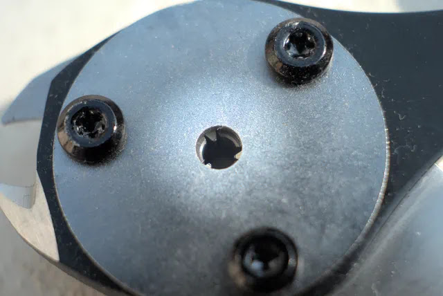

---
categories:
  - 自転車
  - bike
date: "2025-02-15T23:43:58+09:00"
description: 自転車のブレーキやシフトに使われるインナーケーブル（ワイヤー）のエンドキャップを3つ爪で3方向からきれいにカシメるための工具、Jagwire Pro Cable Crimper & Cutter をご紹介します。
draft: false
images:
  - images/01.webp
summary: 自転車のブレーキやシフトに使われるインナーケーブル（ワイヤー）のエンドキャップを3つ爪で3方向からきれいにカシメるための工具、Jagwire Pro Cable Crimper & Cutter をご紹介します。
tags:
  - 工具
  - ワイヤー
  - ブレーキ
  - シフター
title: ワイヤーエンドキャップを3つ爪できれいにカシメる Jagwire Pro Cable Crimper Cutter WST036
---

自転車のブレーキやシフトに使われるインナーケーブル（ワイヤー）のエンドキャップを3つ爪で3方向からきれいにカシメるための工具、Jagwire Pro Cable Crimper & Cutter をご紹介します。

## インナーケーブルのエンドキャップのカシメ方

自転車のブレーキやシフト用インナーケーブル（ワイヤー）の末端処理にエンドキャップを付けますが、アルミのエンドキャップをプライヤーなどで潰してカシメるのが一般的です。

エンドキャップは知らぬ間に取れてしまっていたり、インナーケーブルを交換したりする際に自分で取り付けることがあります。はじめの頃は特に何も考えずペンチなどで潰していました。

下の写真のように、自転車専用のケーブルカッターにはエンドキャップをカシメる部分が付いています。支点に対して刃と反対側に（）のようになっている部分にエンドキャップを挟んでカシメます。PWTのこの工具は1つでアウターケーブルのカット、アウターケーブルの切り口をグリグリして整える、インナーケーブルのカット、エンドキャップのかしめと全てができるので使い勝手が良いです。

## Jagwire Pro Cable Crimper & Cutter

さて、本題の今回ご紹介するJagwireのPro Cable Crimper &
Cutterというものです。頭でっかちで小さな丸い穴が付いています。

この穴にエンドキャップを入れて握ると、3つ爪が閉まりエンドキャップをなんと、3方向から美しくカシメることができるというマニアックな工具です。

ちなみに、インナーケーブル（ワイヤー）専門の工具で、先端のカッター部分は小さくアウターケーブルはカットできません。（できないことは無いかもしれませんが）

先に紹介したPWTの何でもこいのケーブルカッターがあるのにわざわざ買う必要があるのか？と思いますが工具マニアの血が騒ぎ、ポチってしまいました。。。

## 使ってみる

早速試しに使ってみます。子供用自転車のインナーケーブル（ワイヤー）の写真です。自転車を買ったときからこうなのですが、ワイヤーの余りがかなり長く飛び出しているためもう少し短くしてみましょう。

まずは先端のカッターでワイヤーを切ります。

切れました。ワイヤーがややほどけてしまいました。

手でねじねじしてワイヤーを束ねます。

3つ爪の穴です。ここにエンドキャップを入れます。

ワイヤーをエンドキャップに入れて、軽く握ってカシメます。

カシメ後のエンドキャップです。少し突き抜けてワイヤーが見えてしまっていますね。もう少し弱くても良かったかもしれません。肝心の3方向からカシメの様子はこの写真ではわかりにくいですが、しっかり3方向ともカシメができています。

## 感想

上の写真を見て「だから何？」と言われてしまえばそれまでなのですが、隠れたところでオシャレをしているような妙な満足感があります。まあ、万人におすすめできるものでは無く、私のような細かいところに自己満足を感じてしまう工具マニア向け製品ですが、自分的には良いお買い物でした！
