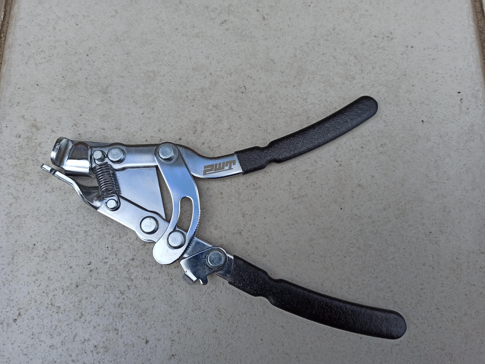
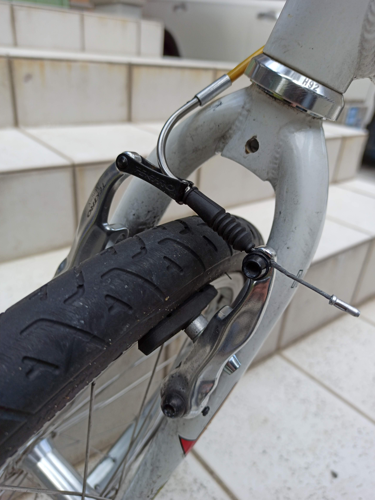
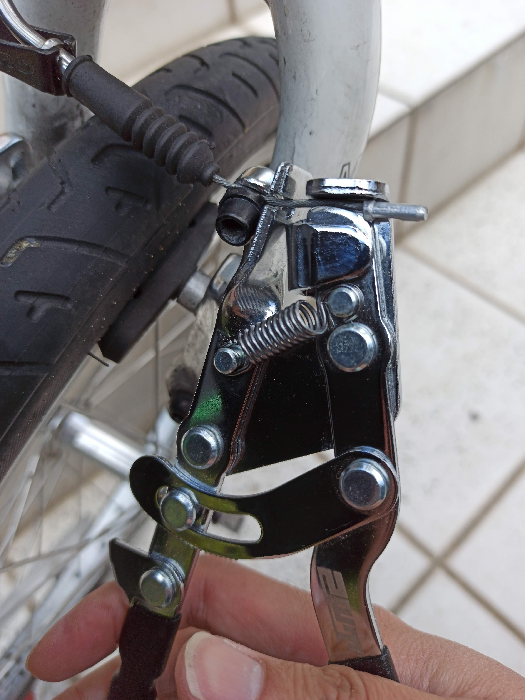
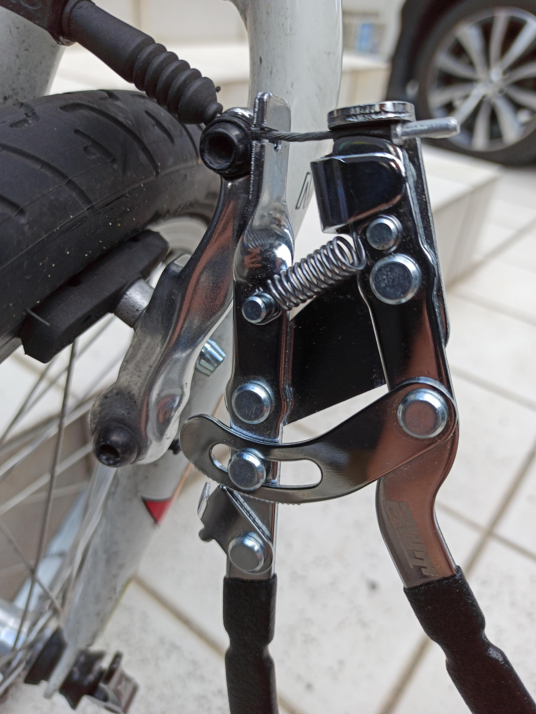
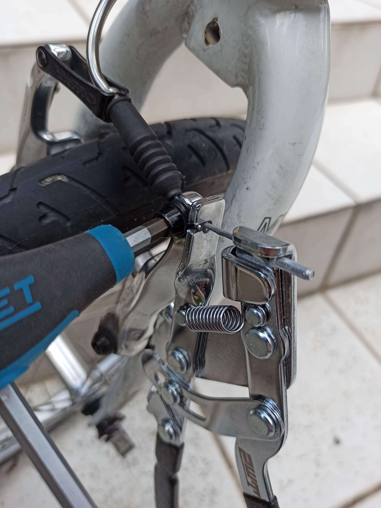

---
categories:
- 自転車
- bike
date: "2025-02-15T23:42:40+09:00"
draft: false
image: images/IMG_20200405_155957.jpg
summary: ブレーキワイヤー、シフトワイヤーを固定する際、テンションをかけておくのが意外とやりにくく大変です。ワイヤーにテンションをかけて固定できる専用工具、インナーワイヤープライヤーをレビューします。
tags:
- 工具
- インナーワイヤープライヤー
title: PWT インナーワイヤープライヤー
js: "js/paad.ts"
---

自転車に乗っているとブレーキ、シフターのワイヤーが伸びてきてブレーキの効きが悪くなる、変速がうまくいかなくなってきます。

最近は油圧ブレーキや電動シフターなんていうのも出てきていますが、高級ロード、MTB以外の普通のチャリンコにはまだまだ普及していません。

ワイヤーはボルトやナットで挟んで締めているだけなのでボルトを緩めてペンチとかで引っ張ればよいのですが、やってみるとなかなかうまく引っ張れなかったり、引いたままボルトを締めるのに難儀します。

そこでこの「ワイヤーを引っ張る」だけの専用工具が売られています。

Parktoolを始めとした様々なメーカーから同じような形をしたものが売られていますが、PWTという安くてそれなりに品質も良さそうなメーカーのものを購入してみました。

外観です。

見た目では機能が説明しづらいので写真で説明します。

フロントブレーキに

こんな形でワイヤーをクランプします。

ハンドルを握ると右側がワイヤーを挟み、左側がブレーキ本体を押しながら左右が開くことでワイヤーを引っ張ります。

開いたまま固定できるようになっていて、ワイヤーを引きながらボルトを締めることができます。

自転車のワイヤー引っ張る用途にしか使えませんが、自転車に乗っているとちょくちょく緩んだワイヤーにテンション掛けたくなることが多いので持っておくと重宝する工具です。PWTからはもう売られていないようなので下記はGORIXの製品です。形状は全くと言っていいほど同じです。


