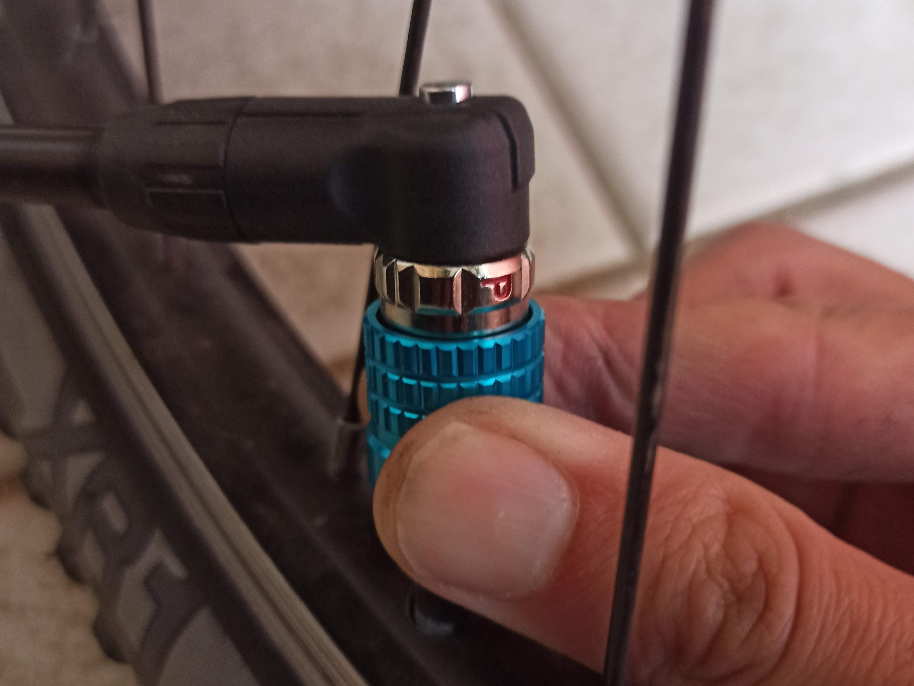

---
categories:
- 自転車
- bike
date: "2025-02-15T23:42:44+09:00"
draft: false
images: 
- images/IMG_20200427_172150.jpg
summary: 自転車の米式、仏式バルブ両方に1つの口で対応でき、独自の着脱方法を採用するairboneのポンプヘッドを試しました。レバーが無く指が挟まれ痛い問題が解決し大満足です。
tags:
- 米式バルブ
- 空気入れ
- ポンプヘッド
title: 米式／仏式両対応ポンプヘッド airbone クイックポンプヘッド
js: "js/paad.ts"
---

我が家にはママチャリ、子供用自転車、ロードバイク、ミニベロなどたくさん自転車があってタイヤのチューブに空気を入れるバルブも日本で一般的な英式、車やマウンテンバイクに使う米式、ロードバイクの仏式と3種類のバルブ全てが使われています。

空気入れはアメリカのウォルマートで買ったBellというメーカーの安い空気入れを使っています。

このポンプヘッドは米式、仏式両方に対応していますが、いちいちポンプヘッドをバラして中のゴムを組み替えなければいけません。

ポンプヘッドをバラすと2つのゴム部品が出てきます。それぞれをこの向きに入れると米式バルブ対応になります。

ゴムを2つとも逆さまにして組み立てると細い仏式バルブにフィットするようになります。

ちなみに英式バルブはこれ以前に使っていて壊れた空気入れに付属していた、米式→英式の洗濯バサミのようなアダプターを使用しています。

毎回組み替えるのが面倒だなと思いながら使っていたのですが、前々から気になっていた、組み替えなくても両方対応しているポンプヘッドを購入してみることに。

アマゾンで調べると、口が2個あるものが主流のようですが、この airbone
のポンプヘッドは1つの口で両方のバルブを挿入でき、評価も上々のようなのでこれを買ってみました。

それでは交換していきます。まずポンプヘッドとチューブを止めているねじを回して外します

チューブを抜きます

外したポンプヘッドと新しいポンプヘッドの比較です。airboneのポンプヘッドはレバーが無いのが特徴です。

ポンプヘッド固定用ナットをチューブに通します。固定ナットはチューブ径の異なる2種類が付属しています。

ポンプヘッドをチューブに突っ込んでナットで締めて固定すれば取り付け完了です。

使い方ですが、一般的な空気入れと違うので付属の説明書を読まないと理解できません。

まずポンプヘッド先のリングの白丸を使用するバルブの位置に回して合わせます。米式の場合は「ｓ」マークのところに合わせます。

青いリング部分を上に引いたままポンプヘッドをバルブに押し当てます。

ポンプヘッドを押し付けたままリング部を下げ、そのまま右回しに回すとポンプヘッドがバルブに固定されます。

空気を入れ終わったらリング部を上に引くイメージで、本体を下に押し下げるとポンプヘッドが外れます。

次は仏式バルブに空気を入れてみます。今度はリングの白丸を「ｐ」の位置に合わせます。

あとは同じ要領で空気を入れます

交換後のポンプヘッドはこんな感じになりました。

バルブへの取り付けにちょっとコツがいるのと、やり方を知っている人でないと使えない、特に家族には難しそうです。ですが毎回ポンプヘッドをバラして組み替えるよりは楽になりそうです。英式バルブの自転車が残っていますが、全てPanaracerの英式→米式アダプターを付けて米式、仏式2つにまとめようと思っています。


