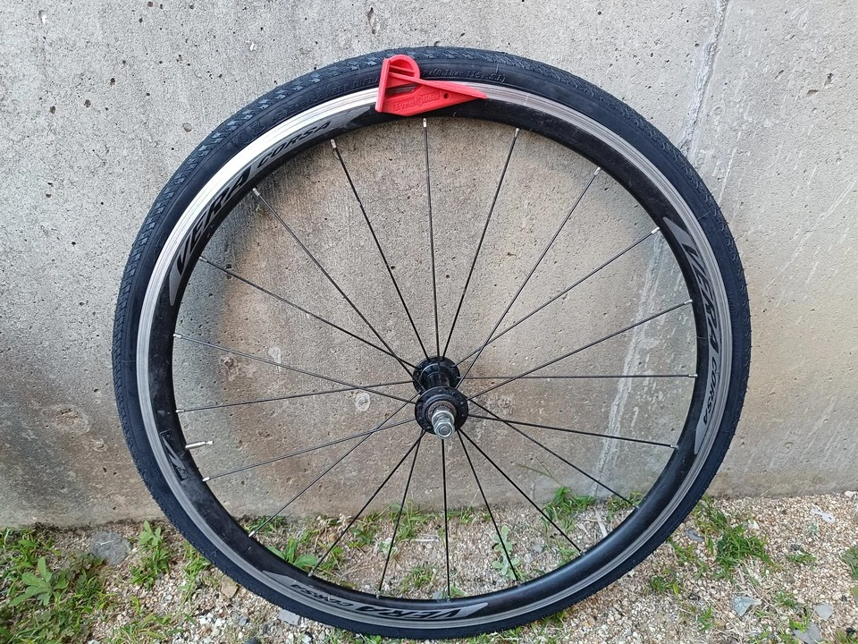

---
categories:
  - 自転車
  - bike
date: "2025-02-15T23:44:18+09:00"
description: 自転車のパンク修理やタイヤ交換で大変なホイールからのタイヤを外し、取付作業を簡単にする工具、Tyre Gliderをご紹介します。
draft: false
images:
  - images/0015.jpg
summary: 自転車のパンク修理やタイヤ交換で大変なホイールからのタイヤを外し、取付作業を簡単にする工具、Tyre Gliderをご紹介します。
tags:
  - 工具
  - パンク修理
  - タイヤレバー
  - Tyre Glider
title: タイヤレバーの革命！？Tyre Gliderを使ってみた
js: js/paad.ts
---

自転車のパンク修理やタイヤ交換で大変なのがホイールからタイヤを外し、またはめ込むところです。タイヤを外す際はタイヤレバーを複数使いビードを落とし、タイヤ取付の際は最後のパツンパツンになったビードを持ち上げるのに難儀します。

そんな悩みを解決する道具、Tyre Gliderというものがあることを知り、使ってみました。

## Tyre Gliderとは

タイヤレバーみたいなものです。一般的なタイヤレバーに対して、形状が大きく異なります。特徴は、タイヤレバーは通常複数個使うのに対し、Tyre
Gliderはこれ１個でタイヤの着脱ができます。

見た目は三角形のようで厚みがあり、通常のタイヤレバーとは風貌が大きく異なります。

子供用のロードバイク、Fuji ACE
24のタイヤ、チューブ交換をする機会があったので早速Tyre
Gliderを使ってみます。

普段乗りに使っているので、知らぬ間にタイヤがすり減って糸が見えてしまっています。

ホイールを取りました。

## タイヤを外す

ここでTyre
Gliderの出番です！タイヤを外す際には、下写真の爪部分を使用します。

爪をホイールのリムとタイヤのビード間に滑り込ませます。爪の先端が丸く厚みがあり、幅も広いので一般的なタイヤレバーに比べると少しやりにくいですね。。。

爪の奥までタイヤのビードがうまく乗ったら、タイヤレバーと同様、テコの原理でビードをリムの外に落とします。

この状態でTyre Gliderを握りしめ周方向に押していきます。

硬い場合は立って足の間にホイールを挟み、上から体重をかけるとやりやすいです。

一周すると片側のビードがすべて外れてくれます。

前後輪ともタイヤを外しました。

## タイヤを取り付ける

新しいタイヤはPanaracerのPASELAというタイヤです。24×1のタイヤは700Cとは違い選択肢があまりありません。これを取り付けていきます。

まずは片側のビードリムに入れ、チューブも入れた状態にします。

タイヤ取付にはTyre Gliderロゴの書いてある裏面にある溝を使います。

タイヤのビードを一部リム内側に押し込み、リムとビードの間にTyre
Gliderの溝を引っ掛けます。

こんな状態になります。

ビードをリム内側に入れていくのは力がいるため、ホイールを立てて足の間に挟みます。

掌の付け根あたりで体重をかけながらTyre
Gliderを押し滑らせてビードを入れていきます。

最後はパツンパツンで硬いですが、体重をかけながら押します。

Tyre
Gliderが折れないか、タイヤのビードは大丈夫かヒヤヒヤしながらグッと押し込むと無事に一周ビードが入りました。

無事にタイヤ交換が終わりました。めでたしめでたし。

## 感想とまとめ

タイヤを外す際は、爪をビードに引っ掛けるのが少しやりにくいことや、タイヤ取付の際は結構力がいるのでドキドキしましたが一度使ってあとは、2本目はすんなりタイヤ交換できました。

タイヤを外すのは、正直タイヤレバーでも普通に外せるのでそれほど大きなメリットは感じませんでした。

Tyre
Gliderが本領発揮するのは取り付けの方ではないでしょうか。最後のパツンパツンの部分を手でうまく入れるのが正義、みたいな思いがあり、タイヤレバーでこじってビードを入れるのは無理矢理入れている感じがして後ろめたさを感じていたものです。Tyre
Gliderを使えばスルッと、いや、無理に入れている感はあるのですが「こういうツールだ」と思うことで正しくできた感があります。

最後に、タイヤレバーが複数個使うのに対し、Tyre
Gliderは1個でできてしまう！ということで荷物の軽量化、省スペース化にも期待していましたが実物は厚みがあるのでタイヤレバー3枚重ねて持っていくのとそれほど違いはありません。

たかがタイヤレバーですが工夫を凝らしたなかなかおもしろいツールでした。同じようなコンセプトで異なる製品もいくつかあるようなので試してみたくなってきますね。


