---
categories:
- 自転車
- bike
date: "2025-02-15T23:42:54+09:00"
draft: false
image: images/XOSS.webp
summary: 激安GPSサイコン XOSS G で取得したGPSトラックログをスマホに転送するためのアプリインストール方法とSTRAVAとの連携方法を解説します。
tags:
- GPSサイコン
- XOSS
title: 激安GPSサイコン XOSS G レビュー （２．アプリインストール編）
js: "js/paad.ts"
---

激安GPSサイコン XOSS G をロードバイク TREK MADONE 2.1
に取付けました。次に、記録をスマホに転送するためにアプリのインストールとSTRAVAへの接続をできるようにします。



後継品 XOSS G+ *Gen2*
が発売されました！電池容量の増加、自動バックライトなど機能がアップグレードされています。



## XOSS アプリのインストール

以下、Android での説明です。

XOSS G に付属の説明書記載のQRコードをスキャンするか Google Play で XOSS
を検索してアプリをインストールします。

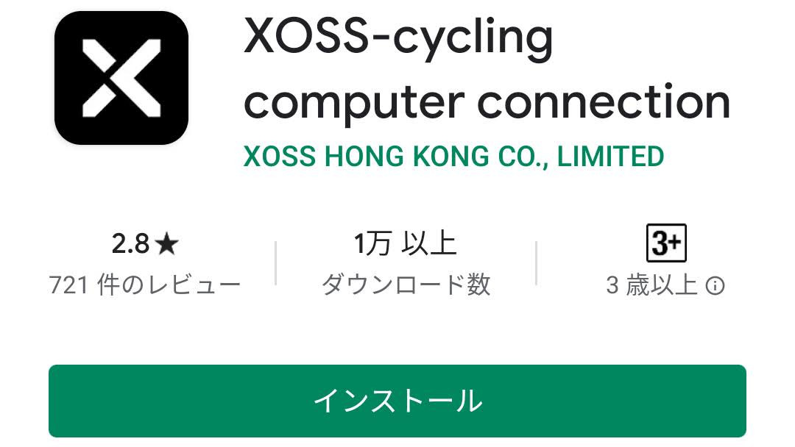

アプリを起動して「メールでサインアップ」をタッチ。

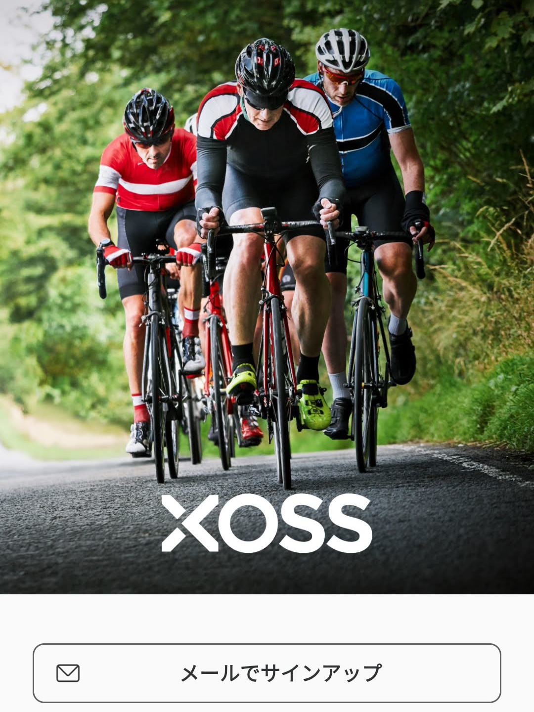

メールアドレス確認のメールが届くのでリンクをクリックすると登録終了です。確認完了までは下のようにプロフィール画面にメールを確認するようメッセージが出ます。

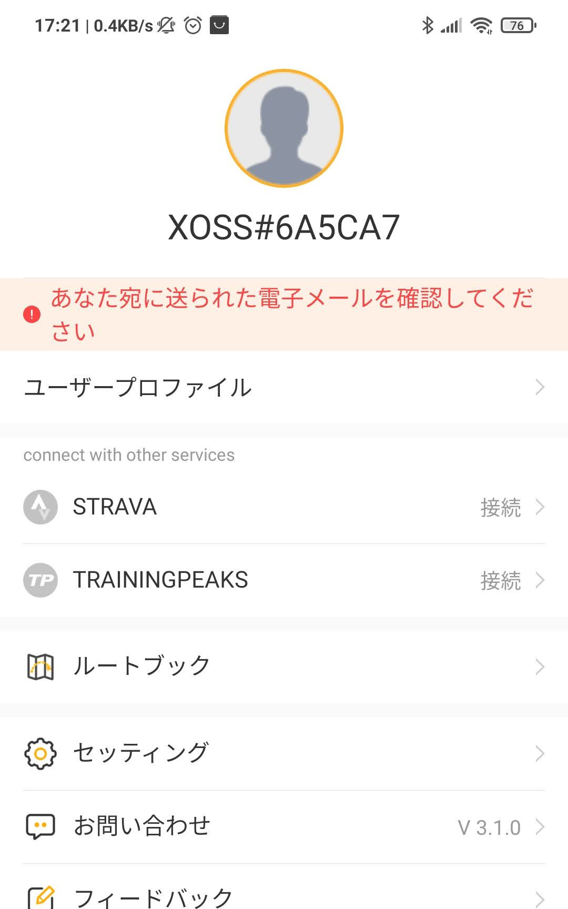

サインアップしたら使用している製品の選択画面が出ます。XOSS G/G+ を選択。

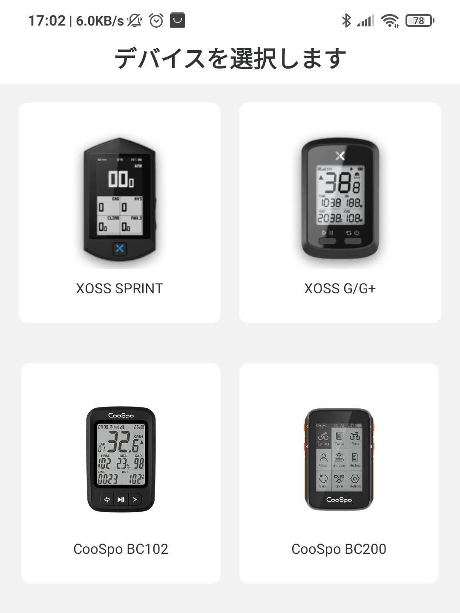

サイコンと接続されていない。とメッセージが出ています。ここでサイコンの電源を入れて「と接続」と書かれたボタンをタッチします。

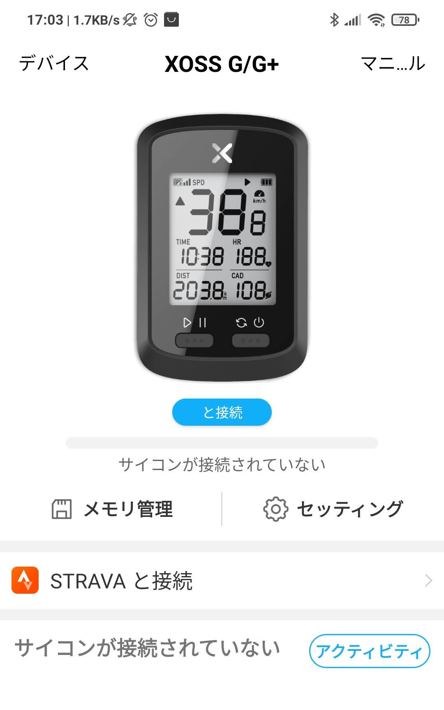

デバイスが表示されるので選択します。なぜか１回目は何も出ず、サイコン電源入り切り、アプリ再起動してみたら出てきました。

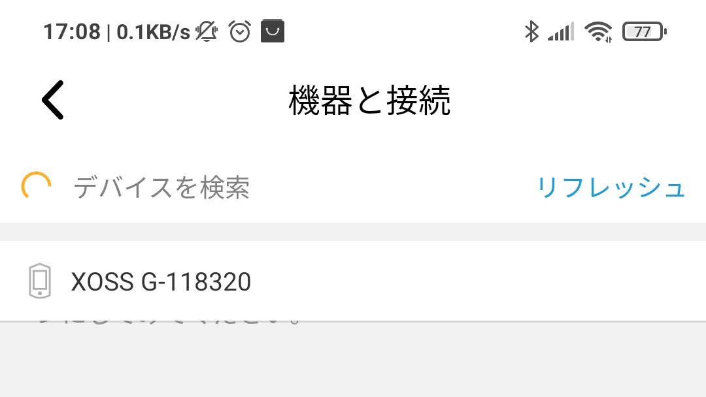

「接続済み」と表示されれば接続成功です。

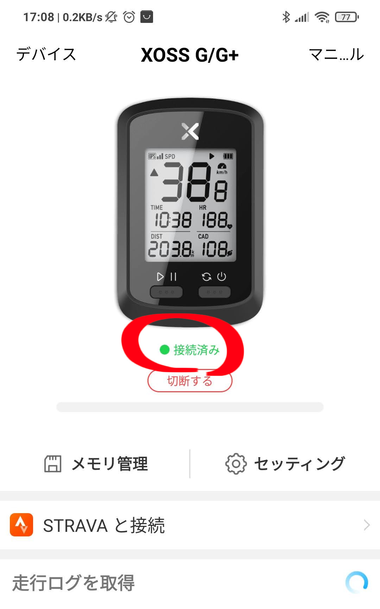

## STRAVA との接続

ここまで順調です。気を良くして STRAVA との接続に進みます。が、Google
アカウントでの STRAVA との接続は落とし穴があります。

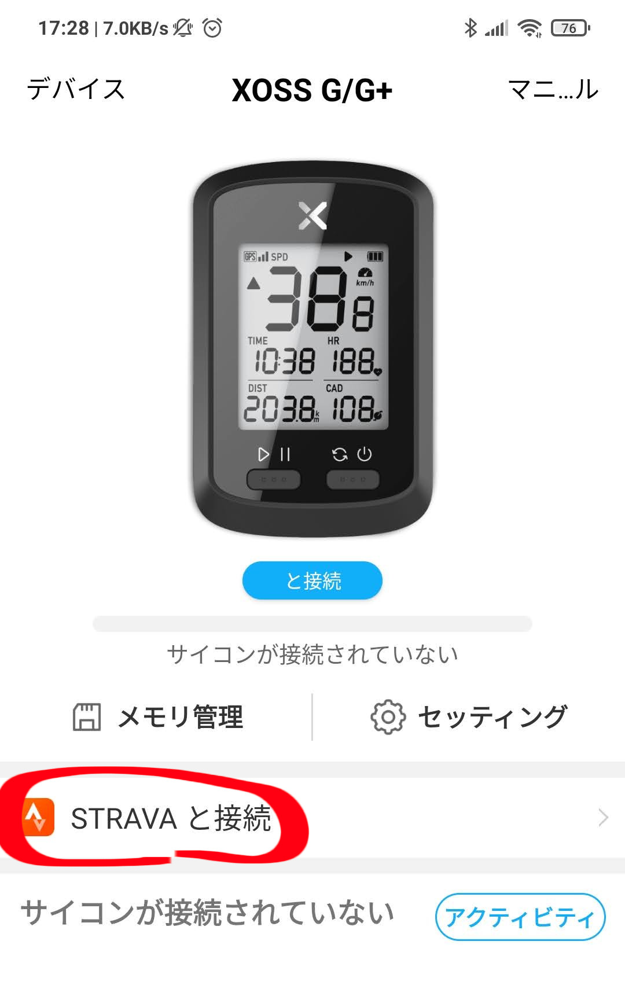

STRAVA と接続ボタンをタッチすると、、、

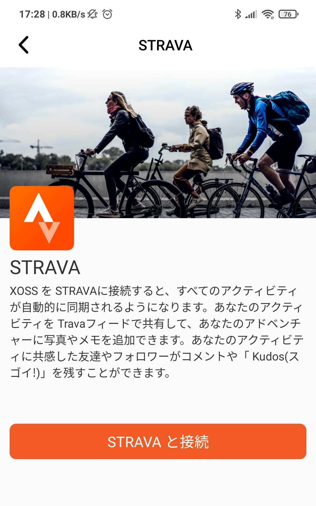

ログイン画面が現れます。PC で STRAVA には Google
アカウントでログインしているので、もちろん Google でログイン。

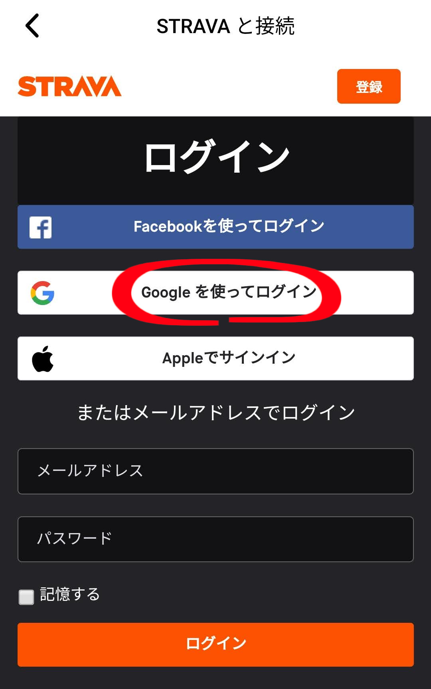

！？、接続エラーです。何度やっても駄目です。

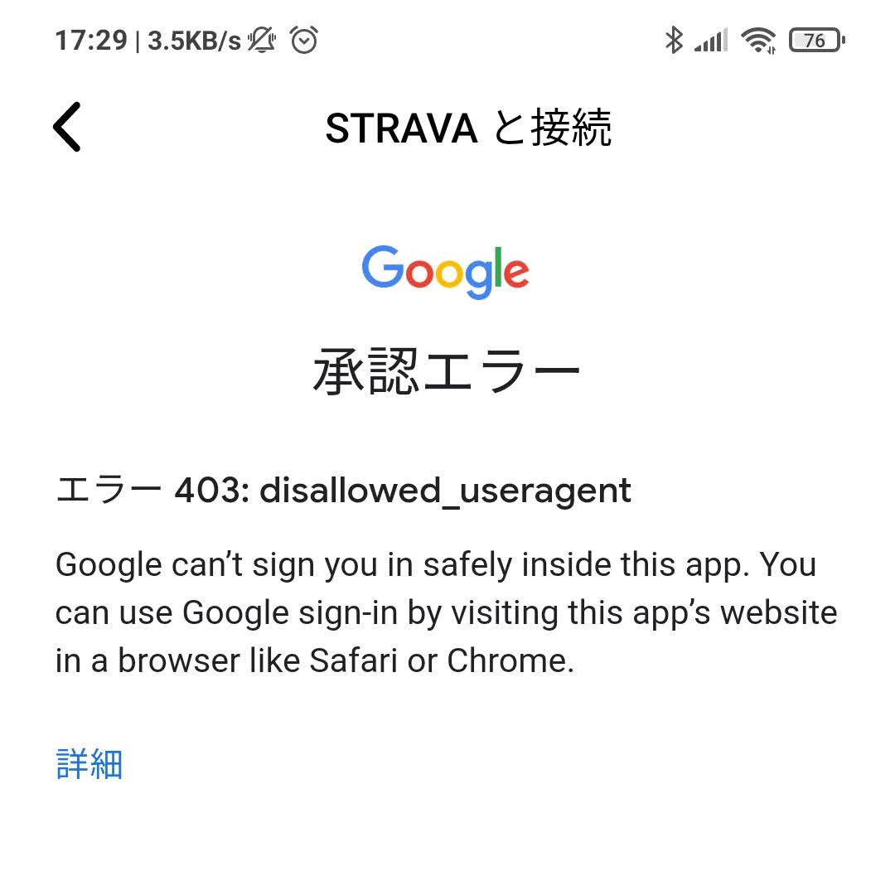

ネットで調べてみると、どうやらこのアプリから Google
アカウントでのログインはできないようです。

Google のメールアドレスでログインすれば良いのですが、普段 STRAVA に
Google
アカウントでログインしている人はパスワードが設定されていないのでパスワードを設定してやる必要があります。どうやって設定するかというと、「パスワードを忘れてしまったので再設定」の手順を踏みます。

一度 PC などで STRAVA
からログアウトし、ログイン画面を出します。「パスワードをお忘れですか？」をクリック。

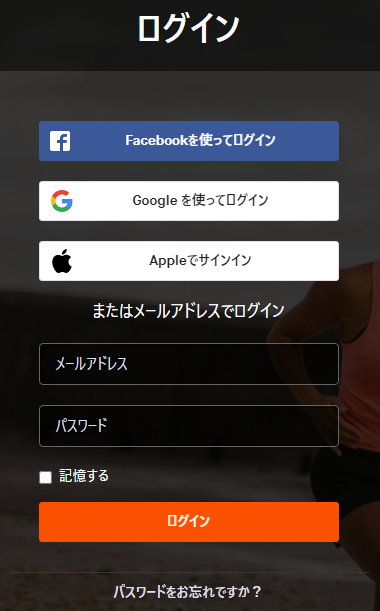

メールアドレスを入力すればパスワード再設定へのリンクがメールに送られてきます。そこからパスワードを再設定します。

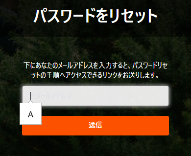

XOSS
アプリに戻り、再度メールアドレスとパスワード入力しログイン成功です。

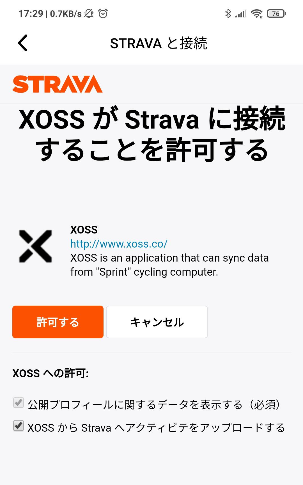

接続済みになりました！

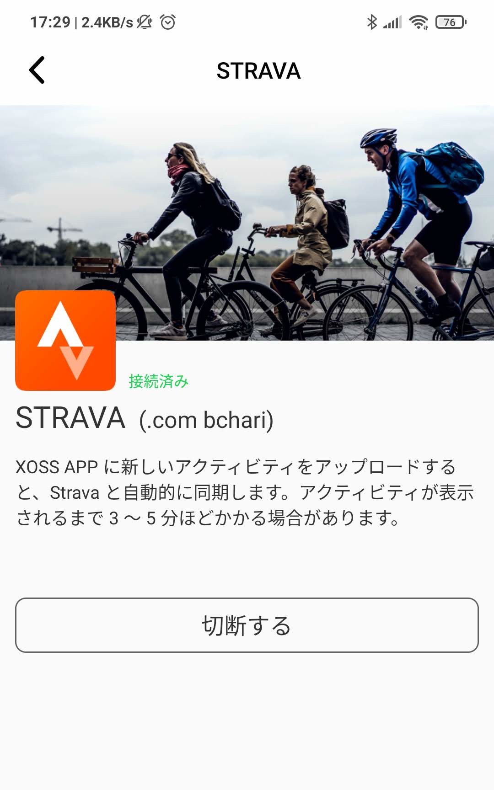

Google アカウントでの STRAVA
との接続で戸惑いましたが、やっと準備完了です。次は試走して GPS
データ取得、STRAVA へのアップロードと使用感を確認していきます。


