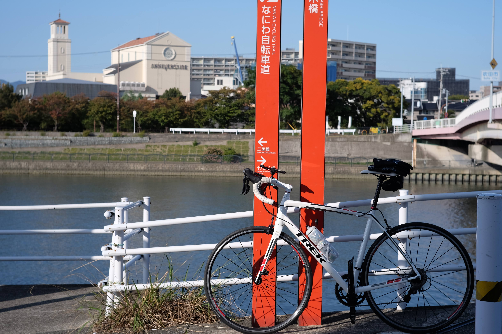
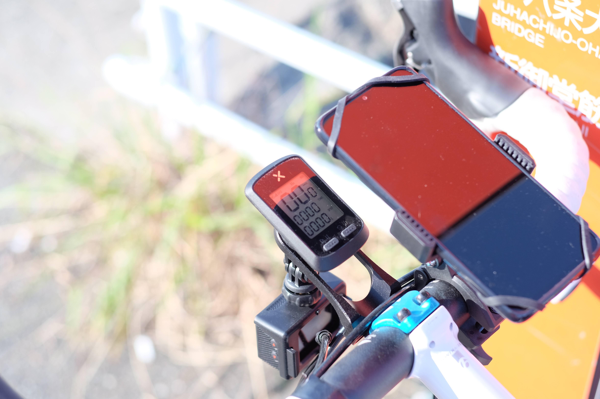
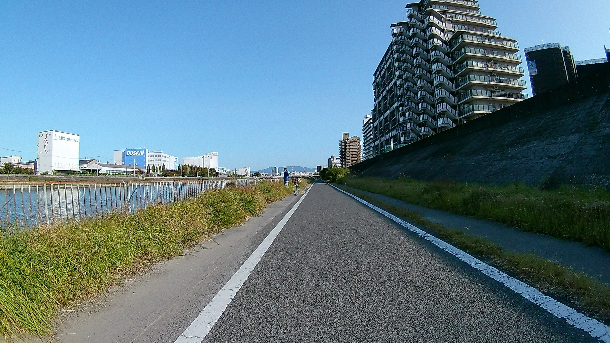
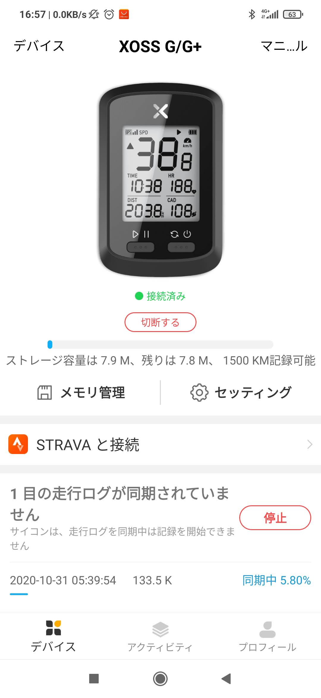
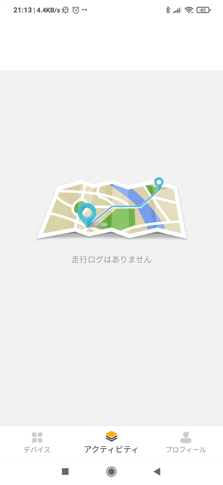
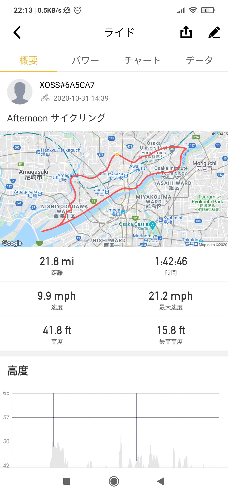
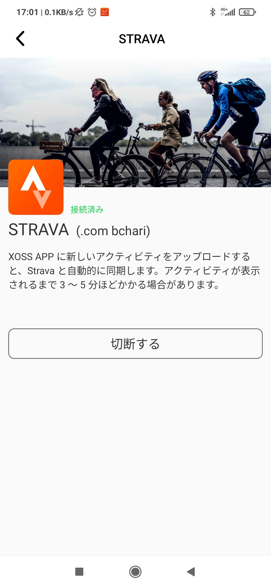
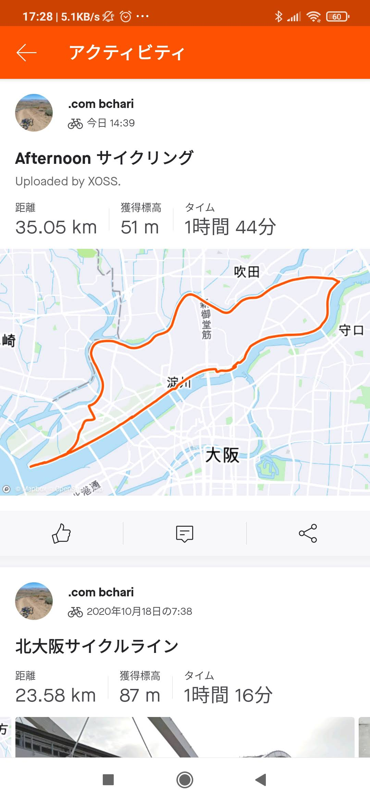

---
categories:
- 自転車
- bike
date: "2025-02-15T23:42:55+09:00"
draft: false
image: images/XOSS.webp
summary: 激安GPSサイコンを購入、自転車へ取付けアプリもインストールし STRAVAへの接続と一通り準備が整ったので早速使ってみます。
tags:
- XOSS
- GPSサイコン
title: 激安GPSサイコン XOSS G レビュー （３．試走編）
---

激安GPSサイコンを購入、自転車へ取付けアプリもインストールし STRAVA
への接続と一通り準備が整ったので早速使ってみます。

大阪の神崎川と淀川に囲まれた領域を川沿いにぐるっと一周してみます。このルートの大部分はなにわ自転車道という大阪ではメジャーな自転車道を通ります。自転車道の様子はまた別の記事にまとめましたので下記を見ていただければと思います。



## 記録開始

スタート地点の榎木橋で電源を入れます。ボタンは2つしか無く、右側のボタンが電源です。電源を入れたら左側のボタンを押せば記録スタートです。左側のボタンを押した後、GPS信号を補足するまで数秒時間がかかります。ピッと音がしたら準備完了。あとは走るだけです。

走行中は速度、走行時間、走行距離を表示してくれて普通のサイコンを使っている感じです。GPS
はログを取っているだけで地図などは表示できないので地図確認はスマホです。

気持ちの良い秋晴れの午後、時計回りに神崎川、淀川沿いを走り、、、

淀川右岸の先端、矢倉緑地公園まで行って海をみて戻りました。走行距離は約35kmでした。

## 電池の持ちは？

公式ホームページには25時間とありますが、今回電源 ON していた時間は 2:12
うち走行時間は 1:44 でした。走り終えた後も電池は満了表示でした。25
時間も走ること無いので電池切れまでは確認できませんでしたが、1日走る程度であれば全然気にしなくて良さそうです。

## スマホアプリで GPS ログを取り込み

記録停止後、スマホアプリを起動しサイコンと接続すると GPS
ログの取り込みが始まります。結構時間がかかり、数分間で取り込み完了しました。

しかし、取り込み完了後に XOSS
アプリでアクティビティを確認しても、下の通り「走行ログがありません」表示が。あれれ？

※ 後日確認したらアクティビティに表示されました。STRAVA
へアップロード後に出てくるのかもしれません。

## STRAVA へのアップロード

XOSS
アプリでは何も確認できませんが、「STRAVAへ接続」を押すと下記画面が。接続済みと表示されていて、「Stravaと自動的に同期します。アクティビティが表示されるまで3～5分ほどかかる場合があります。」

ということで、少し時間経ってからおそるおそるSTRAVAアプリを立ち上げてみると、、、ちゃんとアップロードされてる！ホッとしました。題名がAfternoonサイクリングになっています。Uploaded
by XOSSとも表示されているのでめでたしめでたし、です。

今回走行したコースはこちらです。

::: {style="text-align:center"}
:::

## 総評

### 良い点

3,000円の激安GPSサイコンなのでまともに使えるか疑問でしたが、普通に便利に使えます。サイコンとして速度、距離等の表示は問題なく画面も大きくて見やすいです。気になる電池の持ちは1日なら全然気にしなくて良いでしょう。

### マイナスな点

アプリに接続するサイコンが出てこなくて電源ON/OFF、アプリ再起動などすることがありましたがまあ大きな不具合では無いと思います。

### まとめ

この安さでGPSログを取れSTRAVAにアップロードできるのは素晴らしいです。スマホのSTRAVAアプリをずっと起動しておくよりも使い勝手がよく、オススメです。

後継品 XOSS G+ *Gen2*
が発売されました！電池容量の増加、自動バックライトなど機能がアップグレードされています。


