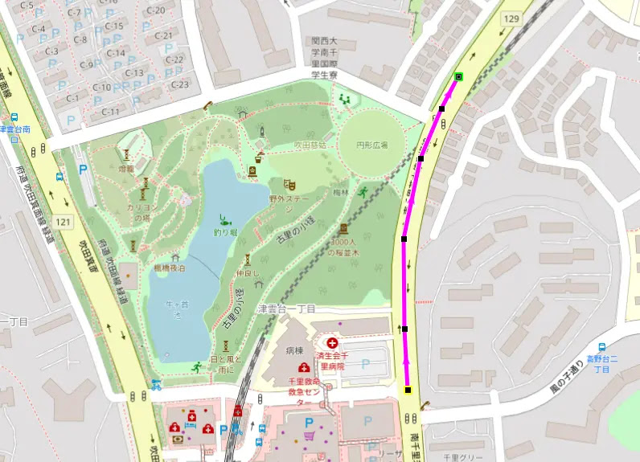

---
categories:
  - 自転車
  - bike
  - ソフトウェア
date: "2025-02-15T23:44:22+09:00"
description: 愛用しているGPSナビ、XOSS Navはスマホ公式アプリのルート作成機能に不満がありました。フリーソフトのQMapShackでルートを作成し、XOSS Navへ転送し使用する方法をご紹介します。
draft: false
images:
  - images/203.webp
summary: 愛用しているGPSナビ、XOSS Navはスマホ公式アプリのルート作成機能に不満がありました。フリーソフトのQMapShackでルートを作成し、XOSS Navへ転送し使用する方法をご紹介します。
tags:
  - QMapShack
  - GPSサイコン
  - XOSS
  - GPS
title: XOSS Nav フリーソフトで作成したルートを読み込む
---

最近めっきり自転車に乗っていません。年とともに体力低下を感じ、休日は子供の習い事に連れて行くくらいで外にも出なくなってきています。これでは運動不足なので、夏休みだし久しぶりにサイクリングです。

## XOSS Navの不満な点

愛用している（と言っても、そんなに使っていませんが）GPSナビ、XOSS Navですが、スマホ公式アプリでのルート作成機能が微妙でした。15点までしか指定できないうえ、ポイント間は自動補完されますが、大通りをまっすぐ行けばよいところを何故か細い道をクネクネしたルートを選んでしまいます。



## QMapShackでルート作成

STRAVAのサブスクリプションなど有料のサービスであればルート作成ができます。しかし無料で実現したいため、フリーソフトであるQMapShackでルートを作成し、XOSS Navで使用できるか試してみることにしました。

QMapShackに関しては、走行したログを見たり編集するために使用しており、下記記事をご参照ください。



QMapShackを立ち上げ、左上の＋マーク「Add empty project」ボタンをクリック。

プロジェクト名を入力し、ファイル形式はGPX形式を選択、OKボタンをクリック。

地図上のスタート地点で右クリックし、「Add
Route」を選択します。ちなみに地図は、Open Street Mapです。

道路上の点をクリックしながらルートを作成していきます。

地図の上に表示されているボタン「A」は、道に沿って自動でルートを設定してくれそうな説明ですが、そんなことはなく普通にポイント間が直線で結ばれました。ということで、全て自力で点をポチポチ押してルートを作っていきます。

作成したルートです。赤い点がクリックしたポイントで、とてもたくさんありますがそれほど苦ではなかったです。約30km程度のルートです。

Workspaceで先程名前をつけたプロジェクト名を右クリックしてSave
As...を選択し、GPXファイルに書き出します。

GPXファイルはスマホで読み込みできるようにGoogle
Driveなどに保存しておきます。

## XOSSアプリで読み込みルートを転送

XOSSアプリのプロフィール画面からルートブックを選択します。

「ルートブックをインポートします」をタップ。

右下の＋ボタンから、「インポート」をタップし、先程書き出したGPXファイルを選択します。

ルートを読み込むことができました。距離が0.00kmになってしまっていますね。ナビゲーション中は距離が表示されていましたので気持ち悪いですが実用上は問題なさそうです。

次に、XOSS
Navの電源を入れ、スマホアプリと接続し、「ルートブック」を選択します。

「ルートブックをインポートします」をタップ。

先程のルートブックをインポートすれば準備完了です。

## ナビゲーション機能を使い走ってみた

作成したルートを使い、ナビゲーション機能を試してみましょう。メニューボタン長押し→Navigation→ルートを選択し、In
Useにします。ちゃんと表示されてますね！

ルート表示だけでナビゲーションはしてくれないのでは？と期待してませんでしたが、機能してくれているようです。目の前の丁字路、ここを右ですが、、、

ナビもきちんと8m先を右と表示してくれています！

どうやって交差点を認識しているのか、不思議に思い走りながら見ていると、どうやらQMapShackでルート作成時にポチポチクリックした点ごとに次の点への方向を表示しているようです。なので交差点でないところで案内しまくりで微妙ですがルートが表示されているだけでもよしとしましょう！

颯爽と箕面の山方面へロードバイクを走らせます。

気持ちは前へ！ですが久しぶりのライド、彩都への坂道でやられてしまいます。

ということで山道に入る前にキリンレモンを飲んで敗退。。。

茶色線が作成したルート、赤太線が実際走ったルートです。作ったルートの半分も走れませんでした😭

## まとめ

フリーソフトQMapShackでルートを作成し、XOSS Navでルート表示とナビゲーションができました。ナビゲーションはポイントごとに案内するので微妙なところがありますが、実用上は問題なく使えそうです。フリーソフトでここまででき、XOSS Navもナビ付きサイコンとしては格安なのでこのコスパ最強組み合わせでしばらく使ってみたいと思います。

