---
categories:
- 自転車
- bike
date: "2025-02-15T23:44:04+09:00"
draft: false
image: images/xoss-nav.webp
summary: 激安GPSサイコン XOSS G/G+ を発売する XOSS からナビゲーション機能が付いたGPSサイコンが発売されていました。早速購入し、愛用中の XOSS Gと比較しながらレビューします。
tags:
- XOSS
- GPSサイコン
title: XOSS Nav GPS ナビゲーション サイコンレビュー
js: "js/paad.ts"
---

激安GPSサイコン XOSS G/G+ を発売する XOSS からナビゲーション機能が付いた
GPS サイコンが発売されていました。早速購入し、愛用中の XOSS G
と比較しながらレビューします。

## GPS サイコンメーカー XOSS とは

XOSS は香港にある GPS サイコンを中心とした機器メーカーです。激安 GPS
サイコンは iGPSPORT や COOSPO
など、様々な中華メーカーが出てきていますが、その中でも機能をシンプルに絞り安いメーカーという印象です。

## 激安 GPS サイコン XOSS G/G+

XOSS の主力製品は、なんと3千円程度という激安の XOSS G
と、心拍計などのセンサーと接続できる ANT+ 対応の XOSS G+ があります。

愛用している XOSS G は、スピードメーター＋ GPS
ログ取得用に申し分無い性能で、下記にレビュー記事を載せているので興味のある方はご参考ください。

## ナビゲーション機能付き XOSS Nav を購入

XOSS G
でログ取得は不満が無いものの、走りながらちょくちょくスマホでマップを見るのは面倒で、やはりせっかくサイコンに
GPS が付いているならサイコンで地図を見たくなってきます。

XOSS のホームページを見てみると、XOSS Nav
というナビゲーション付きのサイコンが出ているではありませんか。どうやら地図は表示できませんが、あらかじめ作成したルートを表示し、交差点でどちらに曲がるかなどナビしてくれるもののようです。

こういった仕様の GPS
ナビの中では1万円前半と価格も安く、買ってみることに。



XOSS Nav
本体とシリコンカバーを購入しました。高級そうな外箱に入っておりました。写真右側がカバーで、ストラップと傷防止のフィルムも付いています。

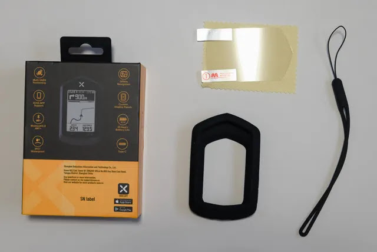

本体箱の中身です。XOSS G
でも付属している輪ゴムのようなゴムで固定するマウントが付いています。充電ケーブルは
USB-C です。AC
アダプターは付いていません。あとは紙の説明書です。日本語もありました。

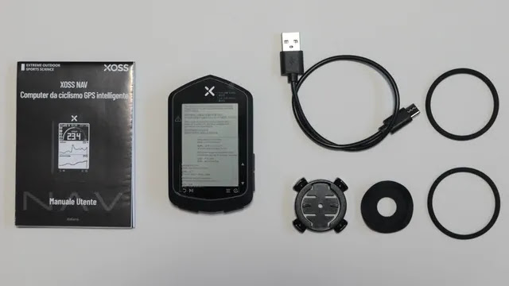

XOSS Nav（写真左）とXOSS G（写真右）を並べてみました。XOSS Nav
の方が一回り大きいですが、何故かXOSS G
よりも軽いです。技術の進歩でしょうか？？

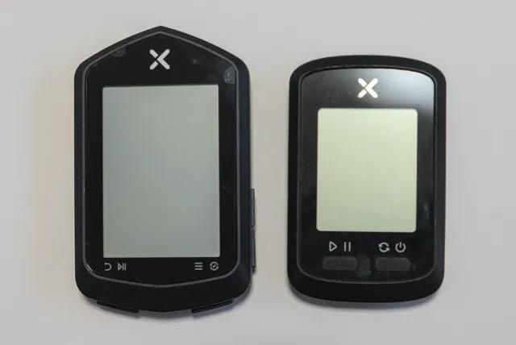

何はともあれ、まずは充電です。裏側に USB-C のコネクタがあります。

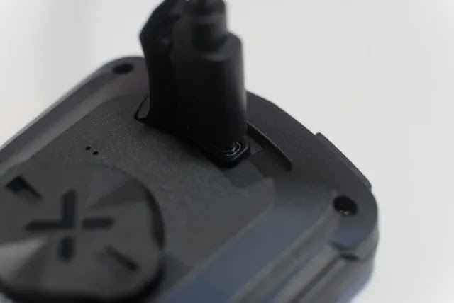

## 初期設定とスマホアプリとのペアリング

本体右下のボタンを長押し、電源が入ると初期設定画面が表示されます。言語(英語か中国語)、距離の単位、温度の単位を選んでいきます。

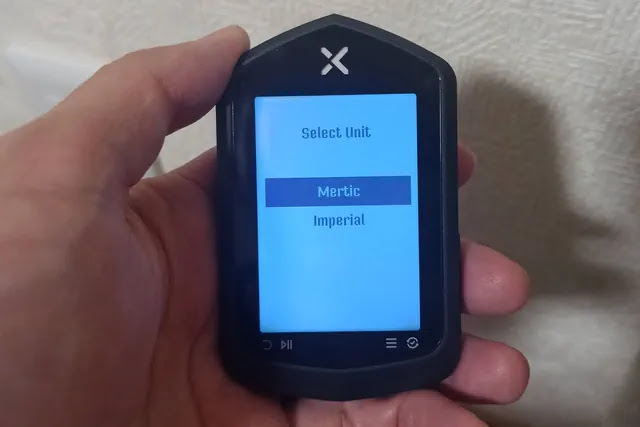

XOSS アプリに接続するか聞かれます。OK を選択します。

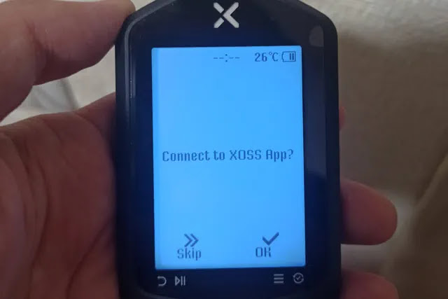

スマホでアプリをダウンロードするようです。

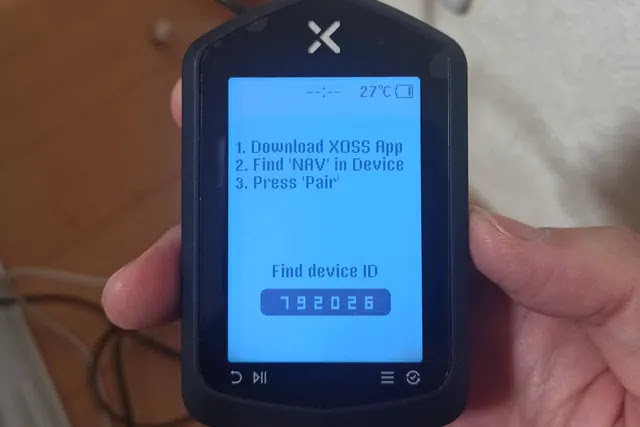

スマホは Android なので Google Play
でアプリをダウンロードします。説明書にリンクの 2D
コードが記載されています。XOSS G
と同じアプリなので既にインストール済でした。

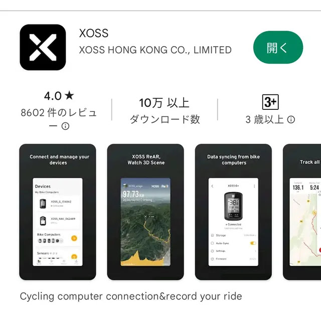

アプリを起動して、いくつか権限の許可を聞かれた後、接続するデバイスを選択します。

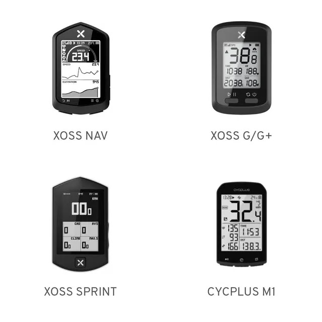

ペアリングします。

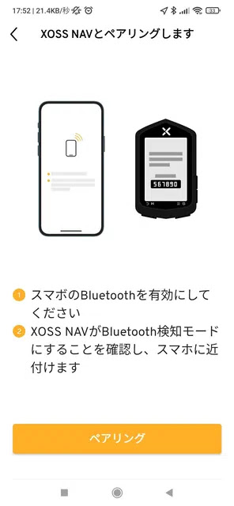

ペア設定リクエストのポップアップが出るので「ペア設定して接続」を選びます。

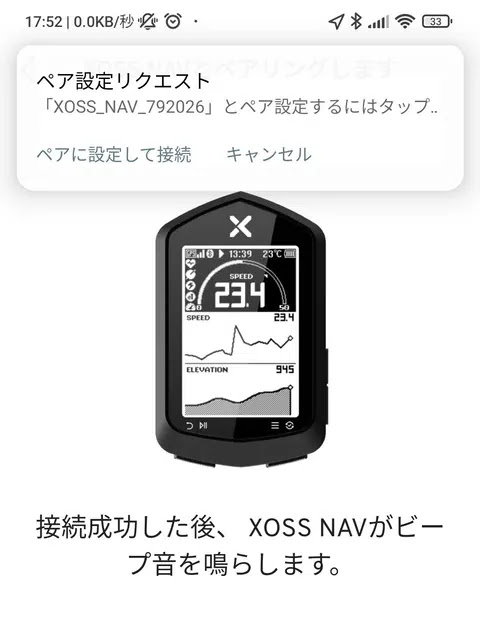

1度目はペアリング失敗してしまいました。XOSS G もそうでしたが Bluetooth
での接続はやや不安定で一発で成功しないことが多々あります。

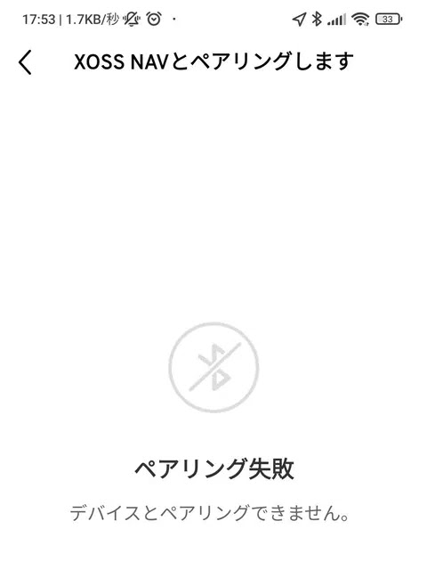

接続できました！

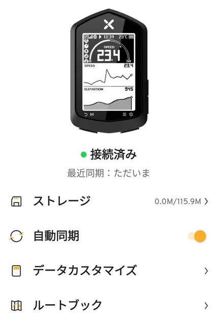

## ファームウェアアップデート

スマホアプリにファームウェアの更新が通知されています。以前 XOSS G
でファームウェアを更新をしないで痛い目にあったのでここで更新することにします。

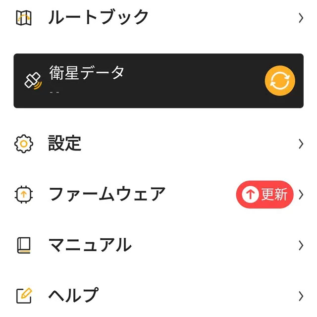

アップデートが開始されました。

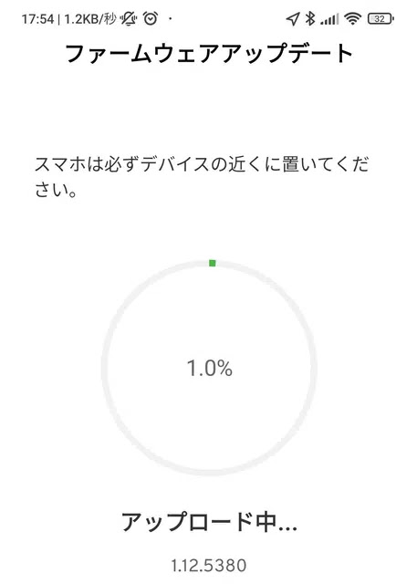

と思ったら「失敗しました」と表示され、XOSS Nav
の方は更新中の画面から操作できない状態に！しばらく待ったりアプリを再起動していたりしたらおもむろにアップデート再開されました。ふぅ、一安心。

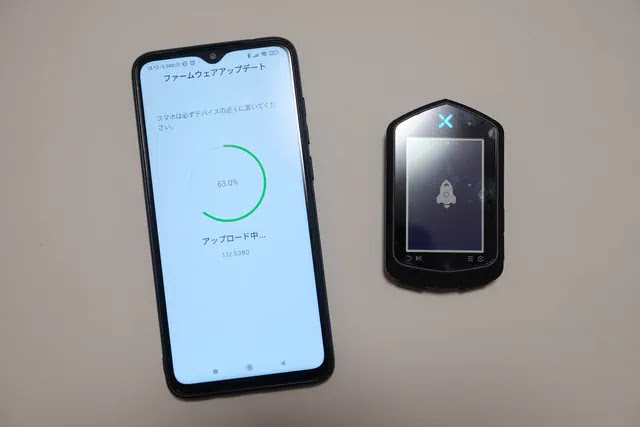

ファームウェアのアップデートが完了しました。

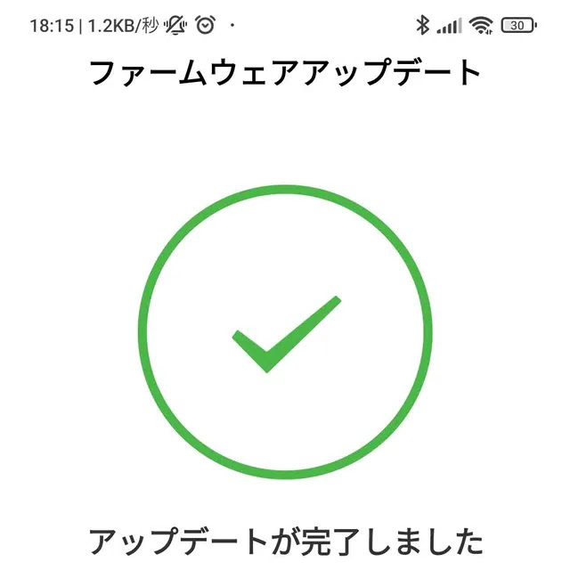

## ルート作成

やっと準備が整いました。これから XOSS Nav
目玉の機能であるルート作成を行います。スマホアプリの「ルートブック」メニューから新規作成できます。

スマホでポイントをタッチしていくと、ポイント間を勝手に繋げてくれます。

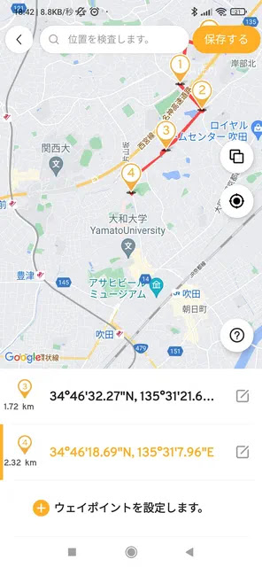

操作は直感的にできますが、難点が1つ。
*スタート、ゴール含めて指定できるポイントが最大15まで*
と少なすぎないか？と思います。なので長距離や複雑なルートの場合、ポイントが足りず走りたい道を指定できない可能性があります。とりあえず、試しに吹田市博物館から難波宮までのルートを作ってみました。アプリの地図はGoogleマップで自転車専用道路なども指定できるのが嬉しいところです。

ルートを作成したら同期することで XOSS Nav に転送されます。

## 実走してみた

それではようやく実走です。XOSS Nav のマウントは、XOSS G
と同じくガーミン互換マウントです。なのでこれまで使用していたものが使えました。

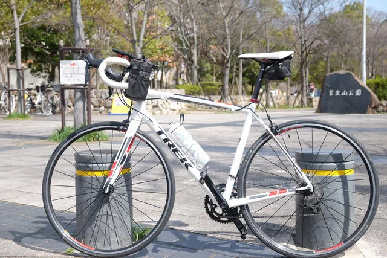

こんな感じでセンターに付けてます。スマホは Sincetop
のステムにマウントするワンタッチ着脱できるものを使い、その前方にハンドルバー固定ボルトに共締めするブラケットを付けて
XOSS Nav をマウントしています。電源 ON したらメニューで Navigation
を選択します。

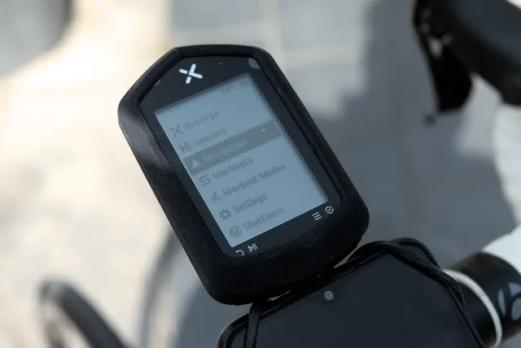

作成したルートが出てきますので、ルートを選択して In Use を選びます。

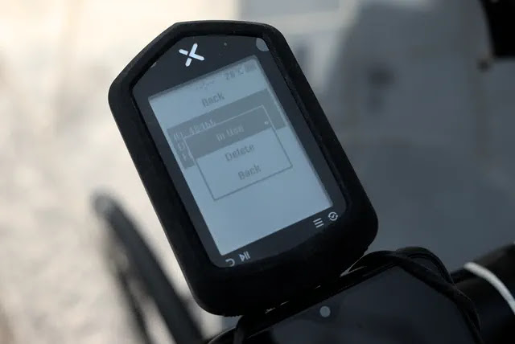

メイン画面に戻るとルートが表示されました！次の曲がり角まで何メートルかしっかり表示してくれます。交差点が近づくと数百メートル手前から「ピッ、ピッ・・・」と音が鳴り知らせてくれるし、ナビは思っていた以上に正確です。正直、使い物になるかなぁと半信半疑でしたが止まってスマホを確認することもほぼ無くなり、かなり快適です。方角が北固定なのがちょっと解りにくいですね。

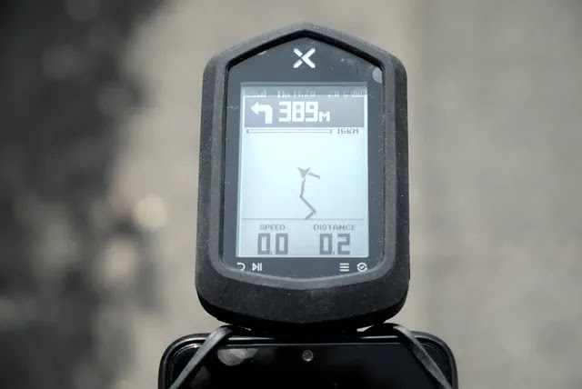

ルートを外れると、Off Cource
と表示されるのですぐに気づいて修正できます。

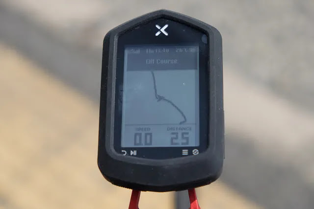

しかし、あえて別のルートを進むと、再検索してくれるわけでもなく、どんどんルートから外れていくだけです。地図が内蔵されているわけではないので仕方無いですね。ちなみに倍率は3段階程度しか変えられず、大きくルートを外れると画面からルートは無くなってしまいます。

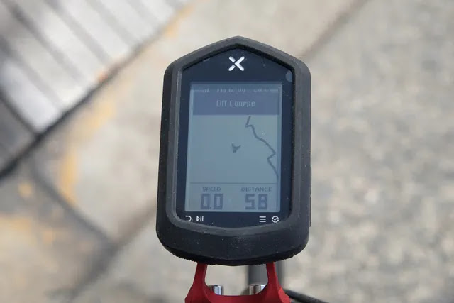

そんなこんなで淀川を越えて、、、

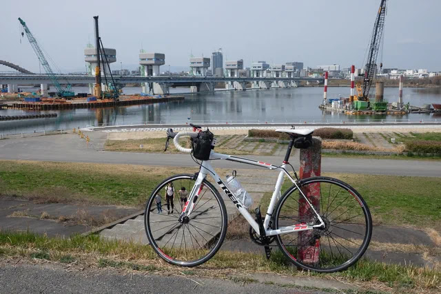

目的地の難波宮に到着しました。

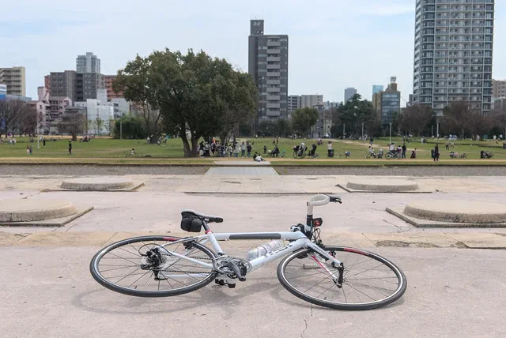

ちなみに帰りですが、「逆ルート」的な機能は無さそうで、逆走している感じになります。ナビの曲がり角までの距離がどんどん大きくなって方向もあさってのナビになってしまいます。

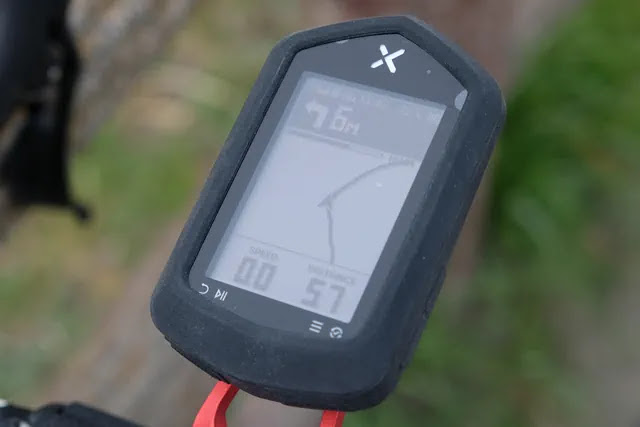

ナビとしては必要最低限の機能で、地図が表示できる機種には敵わないでしょうがスマホの確認をほとんどしなくて良くなりサイクリングに集中できました。思っていたより使える、という印象です。

## GPS ログの取り込み

XOSS アプリのインストールと、GPSログの取り込みについては XOSS G
と同じなので以前に書いた下記の記事をご参照ください。




## まとめ

地図は表示できないがルート表示、ナビのできるリーズナブルな価格の XOSS
Nav はコスパに優れ、スマホを見ずにサイクリングに集中でき、おすすめできる
GPS サイコンでした。

今後は XOSS G に代わる主役として活用していきたいと思います。


