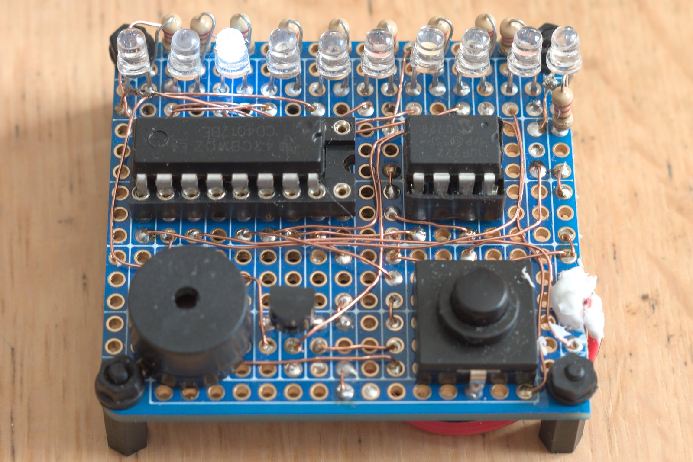
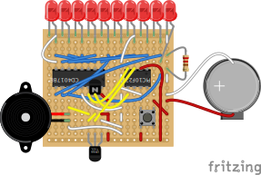
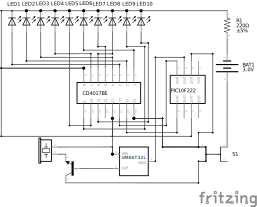
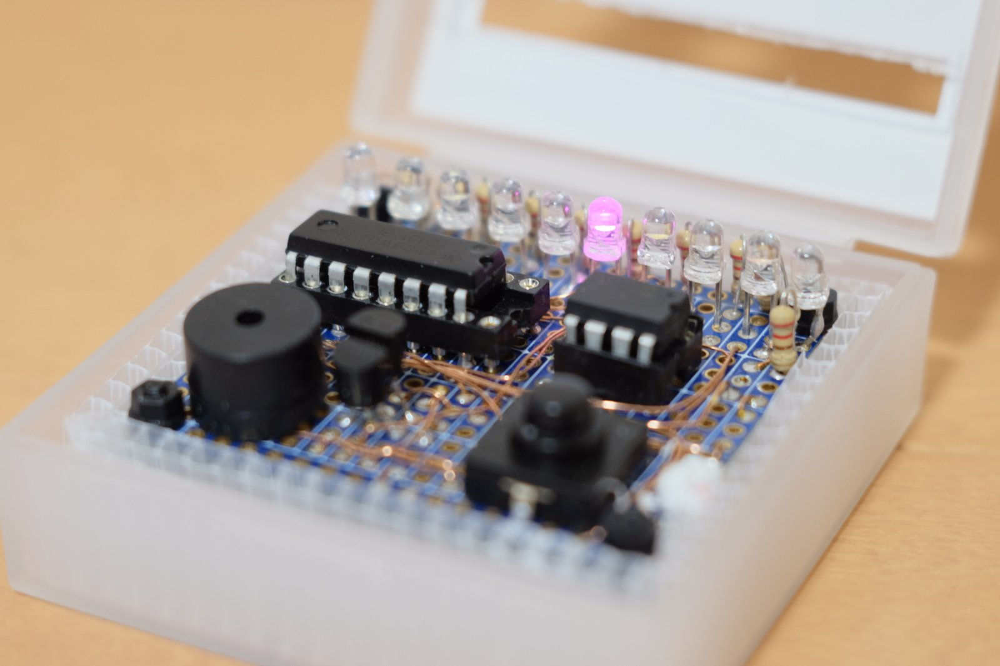
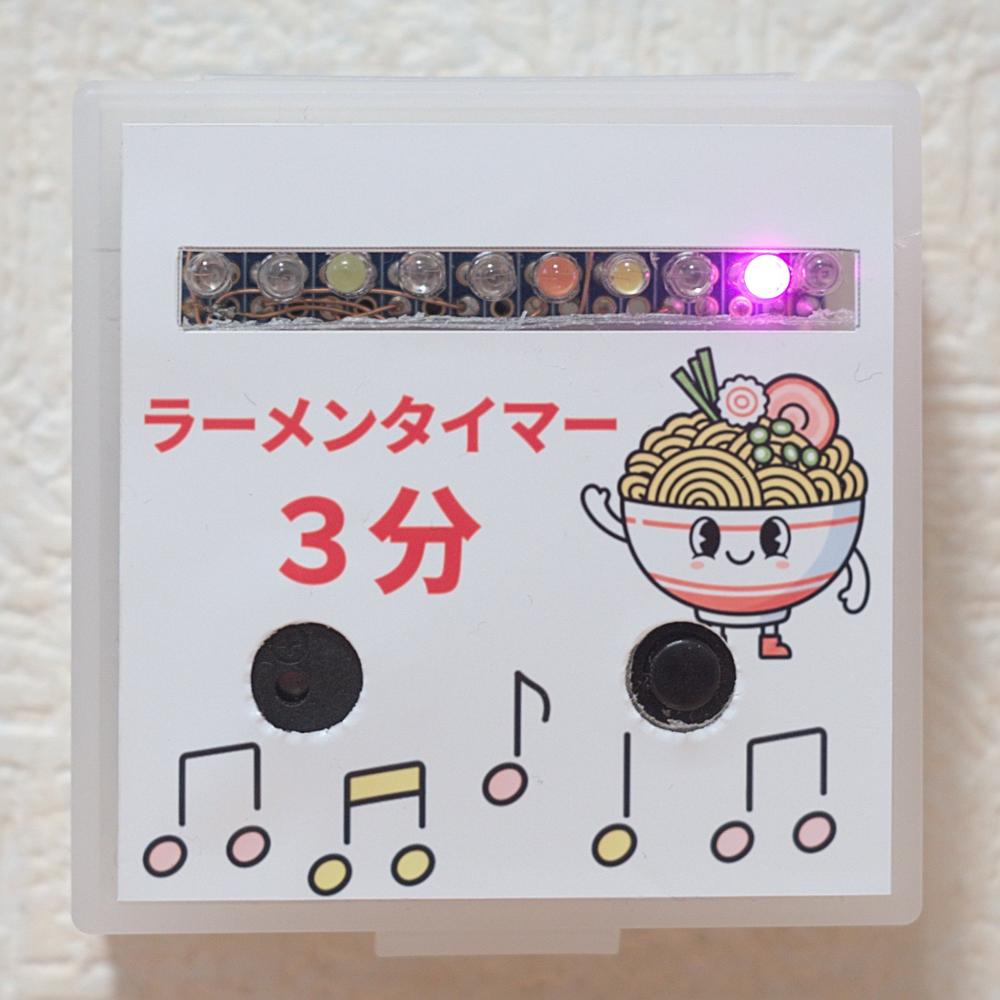

Raspberry piを使いデータロガーを自作し、電子工作の面白さに目覚めました。Raspberry piはLinuxを立ち上げてpythonプログラムを実行するという、小型PCみたいな物でしたが、電源ONしてすぐに使えるマイコンに興味を持ち、電子工作の入門としてPICマイコンを使用したラーメンタイマー製作にチャレンジしました。

## ラーメンタイマーに必要な機能

まず第一に、時間を測るタイマーが必要です。そしてスタートボタンも必要ですね。一定時間が経つとお知らせ機能も必要で、これはやり方はいろいろあると思いますが、やはり音で知らせるのがいいかなと思い、ブザーにします。また、タイマーが動作中の状態も表示したいので、これはLEDを複数並べて次々と光らせることで視覚的に表現します。動力は電池にしたく、PICマイコンを動かせ小型なコイン電池を使うことにしました。

ディスプレイに時間を表示させると、終了までの時間が分かり便利ですが、今回はまず単純なものを作り、ディスプレイは今後チャレンジしたいと思います。時間セットも汎用的に使うタイマーであれば必須ですが、今回はラーメン用、3分固定で割り切ります。

| 機能             | 機器                 |
|------------------|----------------------|
| タイマー         | PICマイコン          |
| スタートボタン   | オルタネイトスイッチ |
| タイマー完了通知 | ブザー+メロディーIC  |
| 動作中通知       | LED+10進カウンタIC   |
| 動力             | コイン電池           |
| 電源スイッチ     | スタートボタン兼用   |
| 時間表示         | なし                 |
| 時間セット       | なし (3分固定)       |

タイマーは、有名な555ICを使うのが電子工作入門としては鉄板ですが、3分測定するだけでなく、一定時間音を鳴らして止めたい、1秒ごとにLEDを次々と光らせるために10進カウンタICへ入力したい、という機能も必要なのでPICマイコンを選定しました。まあ、NE555でLEDチカチカは既にやってみたのでPICマイコンを使ってみたい！という興味が第一です。

## 必要なもの

### 部品

上記機能を実現する機器と配線、基板、箱などのリストです。

| 名称                 | 仕様                                                          | 個数 |
|----------------------|---------------------------------------------------------------|------|
| PICマイコン          | [PIC10F222-I/P](https://akizukidenshi.com/catalog/g/g103107/) | 1    |
| オルタネイトスイッチ | [□12mm](https://amzn.to/44OphEM)                             | 1    |
| パッシブブザー       | [φ12mm](https://amzn.to/4bikLSJ)                             | 1    |
| 三端子メロディーIC   | [UM66T32L](https://akizukidenshi.com/catalog/g/g107055/)      | 1    |
| NPNトランジスタ      | [2SC1815](https://amzn.to/4aE3hQF)                            | 1    |
| LED                  | [φ3mm](https://amzn.to/4jnXAZn)                              | 10   |
| 抵抗                 | [220Ω 1/4W](https://amzn.to/49ahDFO)                         | 1    |
| ICソケット           | [8ピン](https://akizukidenshi.com/catalog/g/g100035/)         | 1    |
| ICソケット           | [16ピン](https://akizukidenshi.com/catalog/g/g100029/)        | 1    |
| ポリウレタン銅線     | [0.32mm, 20m](https://amzn.to/3LcDbKg)                        | 1    |
| 電池ホルダー         | [CR2032](https://amzn.to/4sSlYqz)                             | 1     |
| ユニバーサル基板     | [9.7x8.9cm,4分割](https://amzn.to/3YZbWWw)                    | 1    |
| 支柱セット           | [ナイロン製, M2](https://amzn.to/4qBbz0i)                     | 1    |
| プラスチックケース   | 4.4cm×6.5cm×1.4cm(ダイソー)                                 | 1    |
| プラダンの切れ端     | ホームセンターで以前買ったもの                                | 1    |

NPNトランジスタは、ブザーの音量を大きくするために使用しています。はじめPICマイコンの出力を直接メロディーICに入れましたが音がかなり小さかったので追加しました。

LED用の抵抗は、今回の使い方だと点灯しているLEDは常に1個だけなので、抵抗も1つでよいです。後の写真ではLEDごとに10個抵抗をつけてしまい、あとから気づきました。図は抵抗1個に直しておます。

### PIC書き込みツール

PIC10F222は、秋月電子でお値段なんと40円程度と激安なのですが、書き込みツールが有料です、しかも高い！秋月電子で[Pickit5](https://akizukidenshi.com/catalog/g/g118150/)を購入しました。

### 工具

使用した主な工具は下記です。

1. [ニッパー](https://amzn.to/3YjwZmH)
1. [ピンセット](https://amzn.to/4jjFoQs)
1. [ワイヤーストリッパー](https://amzn.to/4soWBMC)
1. [ハンダごて](https://amzn.to/4aE8zeZ)
1. [4mmスパナ](https://amzn.to/3N46tLx)
1. [カッター](https://amzn.to/49AhTiS)
1. [φ8mmポンチ](https://amzn.to/4qB2G6Y)

カッターとポンチはケースの穴あけ用です。カッターでの穴あけはなかなか難しく、カット面が非常に汚く残念な外観になってしまい、コンビニでプリントしたシールを貼ってごまかしました。DIYではケースが鬼門ですね。3Dプリンタが欲しい。。。

## ユニバーサル基板にはんだ付け

今回、配線はポリウレタン銅線を使ってみました。はんだ付けの際に絶縁被覆を溶かすため、数秒はんだを溶かして待つ必要があるのではじめは導通不良が起きてしまいましたが、慣れると被覆を剥く必要が無く、被覆のない分線も細いので配線しやすかったです。

反面、意図しない部分の被覆を焦がして導通させていまうリスクもあり、その場合のトラブルシューティングがとても大変になるのでは、とも感じましたのでデメリットもあるかと思います。



基板は、上下ラインが横に、中間は縦方向に3穴が導通したブレッドボードに少し近いような[Electric Cookie製の小型基](https://amzn.to/3YZbWWw)板を使いました。少しだけ配線が楽になった気がします。

写真ではごちゃごちゃしすぎてよくわからないため、次に回路図を掲載します。

## 回路図

回路図と言っても、図面を描けるほどの知識は無いため、fritzingで適当に配置したスケッチです。



回路図はこんな感じになりました。



パスコンとか、トランジスタに抵抗付けたほうがいいとか、ツッコミどころはいろいろあるかと思いますが、アマチュアのDIYということでご参考程度にしていただけたらと思います。

## PICプログラム

MPLABのインストールや、ブレッドボードでPickitとPICマイコンの配線をして書き込む方法あたりは省略します。取説やネットの情報で分かるかと思います。

``` c++
// CONFIG
#pragma config IOSCFS = 4MHZ    // Internal Oscillator Frequency Select bit (4 MHz)
#pragma config MCPU = OFF       // Master Clear Pull-up Enable bit (Pull-up disabled)
#pragma config WDTE = OFF        // Watchdog Timer Enable bit (WDT enabled)
#pragma config CP = OFF         // Code protection bit (Code protection off)
#pragma config MCLRE = OFF      // GP3/MCLR Pin Function Select bit (GP3/MCLR pin function is digital I/O, MCLR internally tied to VDD)

#include <xc.h>
#define _XTAL_FREQ 4000000

void setup(void);

void main(void) {
    unsigned char Count = 0; // Timer0用カウンター
    
    OPTION = 0b11000111; //GPWU無効、GPPU無効、プリスケーラー256
    OSCCAL = 0;
    ADCON0bits.ANS0 = 0; // GP0をデジタル
    ADCON0bits.ANS1 = 0; // GP1をデジタル
    TRISGPIO = 0; // 0bxxxxx111 GP0-GP2までOutput

    TMR0 = 0;
    setup();
    
    while(1){
        __delay_ms(818);
        GP1 = 1;
        __delay_ms(100);
        GP1 = 0;
        Count++;
        if(Count >= 180){
            GP2 = 1;
            __delay_ms(19000);
            setup();
            Count = 0;
        }
    }
}

void setup(void){
    GP0 = 1; // RESET
    GP1 = 0; // COUNT UP
    GP2 = 0; // BUZZAR
    __delay_ms(100);
    GP0 = 0;
}
```

プログラムの内容ですが、`__delay_ms()`関数でGPIOピンをON/OFFするというだけの原始的なものです。1周期でGP1ピンON/OFFさせて10進カウンタICに入力。これがLEDを次々と点滅させていきます。180カウント(秒)したらGP2ピンを一定時間出力してメロディーICを鳴らすだけです。

プログラム上でのミリ秒はいい加減なので、実際に時計で3分測定して微調しました。TMR0というライマーレジスタを使うともっと精度が出るのでしょうか。また、より高機能のモデルでは割り込みなどを使ってタイマーカウント中に他の計算をさせるとかもできるようですが、40円で機能の少ないモデルなのであまり深追いはせず、シンプルにしました。

## 100円ショップのケースに収納

さて、プログラムを書き込み動作確認までできたので、最後にケースに入れて完成です。なかなかこれといったいいものが無く、ダイソーで見つけた小さなプラスチックケースに格納することにしました。



シンデレラフィットと言ってもいいくらいなかなかいい感じのサイズ感ですが、それでも若干隙間は空くため、家にあったプラダンを切って隙間に詰めました。

蓋を閉めて完成です！ガタガタな穴の切り口を隠すために貼ったシールがいい感じです。ラーメンのゆるキャラはGeminiに描いてもらいました。



## 使用感

カップラーメンや袋ラーメン、そばを茹でる際に使ったところ、普通に使えています。電源ON/OFFボタンとスタートボタンを兼用しているので、電源切り忘れとかも無いですし、ONしたらすぐにタイマー開始してくれるのがRaspberry piを使うのに比べて楽でいいですね。

ファイルに保存、ネットワークを使い通信、とかなると別途機器を揃え配線、プログラム必要なのでシンプルな用途には向いているけどいろいろやりたくなってくると大変そうな感じです。PICなどのマイコン、ArduinoやESP32などのマイコンボード、PCのようなRaspberry piと用途によって使い分けが正解なのでしょう。

## まとめ

PICマイコンを使ってシンプルなラーメンタイマーを作りました。こういった用途にはPICマイコンの低機能モデルで十分で、初めて使う初心者でもちゃんと完成させることができました。趣味レベルのDIYでもいろいろ作れそうな感触も得たのでこれからも広げていきたいなと思いました。

